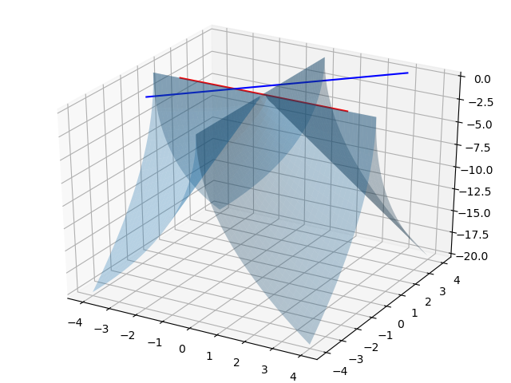
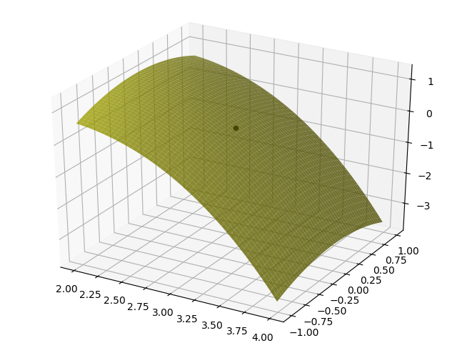
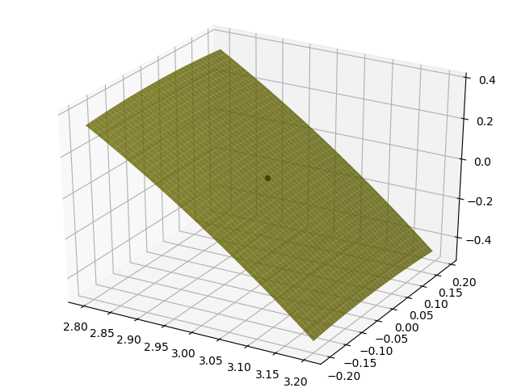
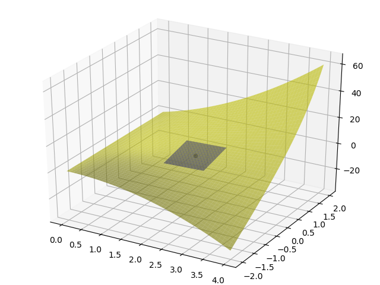
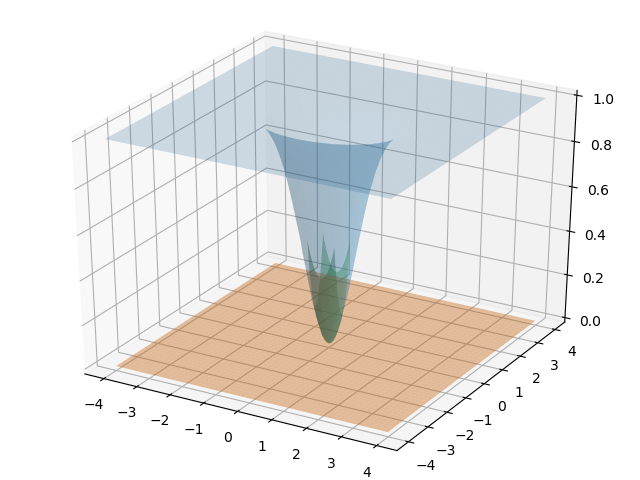

---
tags:
- 数学/微积分
---

# 多元函数微分及泰勒近似

## 1.多元函数的可微性讨论

### 1.1.偏导数存在就可微吗

回顾一下，对于一个一元函数而言，函数 $f$ 在 $x$ 处可微意味着函数的导数 $f'(x)$ 存在。那我们可以说对于二元函数 $f(x,y)$，只要函数的偏导数 $f_x$ 和 $f_y$ 存在，就能够说这个二元函数 $f(x,y)$ 可微吗？能是这样吗？我们看函数 $z=-5\sqrt{|xy|}$ 的图形：

**代码片段：**

```python
from matplotlib import pyplot as plt
import numpy as np
from mpl_toolkits.mplot3d import Axes3D

fig = plt.figure()
ax = Axes3D(fig)

def f(x,y):
    return -5*np.sqrt(abs(x*y))

x = np.arange(-4, 4, 0.01)
y = np.arange(-4, 4, 0.01)
x, y = np.meshgrid(x, y)

ax.plot_surface(x, y, f(x,y), alpha=0.3)

x = np.arange(-3, 3, 0.01)
z = np.array([0]*len(x))
y = np.array([0]*len(x))

ax.plot(x, y, z, color='r')

x = np.arange(-3, 3, 0.01)
y = x + 1
z = np.array([0]*len(x))
ax.plot(x, y, z, color='b')

plt.show()
```

**运行结果：**



我们只看 $(0,0)$ 这一点，在 $x$ 轴和 $y$ 轴方向上，偏导数确实都存在，换句话说在沿着 $x$ 轴和 $y$ 轴的邻域内，都有一条直线能够很好的接近邻域内的 $f(x,y)$ 函数取值，但是如果这条直线换到其它方向，例如这条蓝色的线所在方向，$(0,0)$ 的邻域内，蓝色的线无法做到逼近 $(0,0)$ 两侧的函数值 $f(x,y)$。

因此，光靠两个偏导数的存在就想定义出多元函数的可微性，显然是不可能的，那我们回想一下一元函数可微性背后的几何意义：

如果函数 $f$ 在点 $a,f(a)$ 处可微，在几何上意味着存在一条切线通过点 $(a,f(a))$，并且接近在点 $a$ 周围的 $x$ 点邻域内的函数值，也就是我们之前说过的在点 $a$ 附近满足线性近似性，借用前面的一张图来复习一下：


### 1.2.利用切平面来描述二元函数的可微

那么从这个概念拓展下去，一元函数下某个点可微的条件，就是存在一个切线，来逼近该点邻域内的函数取值。那么拓展到二元函数 $f(x,y)$，在点 $(x_0,y_0,f(x_0,y_0))$ 满足可微的条件，就应该是过该点存在一个切平面，使得在该点各个方向附近的领域内都能很好的逼近函数 $f(x,y)$ 的取值，这也就是所谓的**二元函数的局部线性性**。

### 1.3.可微性的形式化定义

那么从这种描述性的定义，我们过渡到严格的数学形式定义上来：

一元函数在点 $(a,f(a))$ 处的局部线性性是怎么说的？如果存在一个常数 $m$，使得等式 $f(a+h)=f(a)+hm+h\varepsilon(h)$ 成立，并且 $\varepsilon(h)$ 满足 $lim_{h\rightarrow 0}\varepsilon(h)=0$。如果满足上述条件，则说明函数 $f$ 在点 $(a,f(a))$ 处是满足局部线性性的。这里面的道理我们再简单的解释一下：

把上面的式子做简单的变换就有：

$\varepsilon(h)=\frac{f(a+h)-f(a)}{h}-m$

$lim_{h\rightarrow 0}\varepsilon(h)=lim_{h\rightarrow 0}\frac{f(a+h)-f(a)}{h}-m=0$

最终就得到这个熟悉的式子：

$lim_{h\rightarrow 0}\frac{f(a+h)-f(a)}{h}=m$，因此在满足局部线性性的条件下，一元函数在 $a$ 点处可微就得到了证明。

而拓展到二元函数的局部线性性，该如何定义？我们直接拿出定义：

$f(a+h_1,b+h_2)=f(a,b)+h_1f_x(a,b)+h_2f_y(a,b)+h_1\varepsilon_1(h_1,h_2)+h_2\varepsilon_2(h_1,h_2)$，同样的满足：当 $(h_1,h_2)\rightarrow 0$ 时，$\varepsilon_1(h_1,h_2)\rightarrow 0$，$\varepsilon_2(h_1,h_2)\rightarrow 0$。

这里，$h_1$ 和 $h_2$ 分别作为二元变量 $x$ 和 $y$ 的微小增量，因此就囊括了点 $(a,b)$ 附近的各个方向上的邻域。他显示了在指定点邻域内的各个方向上看，函数图像都是“光滑”的，没有"尖峰"的。

最后我们来总结一下结论：如果函数 $f(x,y)$ 在点 $(a,b)$ 处呈现出局部线性性，那么函数在该点处就满足可微。更进一步，如果在一个区域内每一个点都可微，那么就说函数在这个区域内都是可微的。

## 2.可微性的几何意义

### 2.1.函数邻域内的图像

这里我们再写成向量形式，几何意义就会更加明显一些：

我们要讨论的点为：$p_0=(a,b)$，微小增量写成一个向量：$h=(h_1,h_2)$，同时令：$\varepsilon(h)=(\varepsilon_1(h_1,h_2),\varepsilon_2(h_1,h_2))$，因此我们把上面二元函数 $f(x,y)$ 的局部线性性的定义按照向量的形式重写一下即为：

$f(p_0+h)=f(p_0)+(f_x(p_0),f_y(p_0))\cdot h+\varepsilon(h)\cdot h$，这个式子中，我们就可以很清晰的看到，向量 $h=(h_1,h_2)$ 就能体现出从任意方向进行逼近的含义了。

为了更直观的掌握二元函数局部线性性的概念，我们还是来看一下 $z=x-\frac{1}{9}x^3-\frac{1}{2}y^2$ 这个例子。

首先在变量 $x$ 取 $[-4,4]$，变量 $y$ 取 $[-4,4]$ 范围内的函数图像如下，我们重点关注点 $(3,0, f(3,0))$ 的附近邻域：

首先在一个较大的变量范围内来看，变量 $x$ 取 $[2,4]$，变量 $y$ 取 $[-1,1]$ 范围内：



然后我们缩小邻域的范围，变量 $x$ 取 $[2.8,3.2]$，变量 $y$ 取 $[-0.2,0.2]$ 范围内：



这里我们发现，如果函数 $f$ 在某个点可微，那么当邻域范围很小的时候，邻域附近的函数图像近似于一个平面，这个平面可大有讲究了，我们接下来仔细分析：

### 2.2.邻域切平面与梯度向量

在 $f(p_0+h)=f(p_0)+(f_x(p_0),f_y(p_0))\cdot h+\varepsilon(h)\cdot h$ 这个定义式中，我们发现这么一个向量：$(f_x(p_0),f_y(p_0))$，他非常重要，乃至于后面我们经常要围绕他大做文章，这里我们将其称之为函数 $f$ 在 $p_0$ 处的梯度，有专门的记号，我们记作为：**$\nabla f(p_0)$**。

于是此时，表达式 $f(p_0+h)=f(p_0)+(f_x(p_0),f_y(p_0))\cdot h+\varepsilon(h)\cdot h$，就可以另外写作 $f(p_0+h)=f(p_0)+\nabla f(p_0)\cdot h+\varepsilon(h)\cdot h$

那么在邻域附近时，也就是当 $h\rightarrow 0$ 时，由于有 $\varepsilon(h)\rightarrow 0$，那么则有： $f(p_0+h)\approx f(p_0)+\nabla f(p_0)\cdot h$。

这和我们在一元函数中的情形 $f(x+\Delta x)\approx f(x)+f'(x)\Delta x$ 是一样的

也就是说，在一元函数中，我们用 $f(x)+f'(x)\Delta x$ 所表示的切线来对邻域附近的函数值进行近似。而在二元函数中，我们使用 $f(p_0)+\nabla f(p_0)\cdot h$ 来对 $p_0$ 的邻域附近的取值 $f(p_0+h)$ 进行近似。很容易联想到 $f(p_0)+\nabla f(p_0)\cdot h$ 应该是个什么，我们整理一下：

我们令：$p=p_0+h$，那么 $g(p)=f(p_0)+\nabla f(p_0)\cdot (p-p_0)$，这就是过 $p_0$ 点的曲面的切平面，显然我们就是用这个切平面的取值 $g(p)$ 来近似曲面上 $p_0$ 邻域内 $p$ 的实际取值 $f(p)$。

### 2.3.实际求解演练

这里我们来实际操练一下，来求一下二元函数 $f(x,y)=x^2y+xe^y$ 在点 $(2,0)$ 处的切平面：

首先，我们求出函数的梯度向量表达式：$\nabla f(p)=(\frac{\partial f}{\partial x},\frac{\partial f}{\partial y})$ $=(2xy+e^y,x^2+xe^y)$，那么在点 $p_0$ 也就是 $(2,0)$ 处的梯度值为：$\nabla f(p_0)=(2xy+e^y,x^2+xe^y)=(1,6)$

最终，我们来写一下曲面过点 $(2,0)$ 的切平面的方程：

$g(p)=f(p_0)+\nabla f(p_0)\cdot (p-p_0)$，转换一下：

$g(x,y)=f(2,0)+\nabla f(2,0)\cdot (x-2,y)$ $=2+(1,6)\cdot (x-2,y)=2+x-2+6y=x+6y$

即过 $(2,0)$ 点的切平面的方程我们就通过上述方法求得了：$f(x,y)=x+6y$

我们来看一下代码和实际的运行效果：

**代码片段：**

```python
from matplotlib import pyplot as plt
import numpy as np
from mpl_toolkits.mplot3d import Axes3D
from math import e

fig = plt.figure()
ax = Axes3D(fig)

def f(x,y):
    return x**2*y+x*e**y

def g(x,y):
    return x+6*y

ax.scatter(2, 0, f(2, 0), color='k')

x = np.arange(0, 4, 0.01)
y = np.arange(-2, 2, 0.01)
x, y = np.meshgrid(x, y)
ax.plot_surface(x, y, f(x,y), color='y', alpha=0.6)

x = np.arange(1.5, 2.5, 0.01)
y = np.arange(-0.5, 0.5, 0.01)
x, y = np.meshgrid(x, y)
ax.plot_surface(x, y, g(x,y), color='b')

plt.show()
```

**运行结果：**



## 3.多元微分在近似计算上的应用

### 3.1.也谈 $dz$ 和 $\Delta z$

我们依据上面关于切面的表达式：$g(p)=f(p_0)+\nabla f(p_0)\cdot (p-p_0)$，稍作写法上的改变：

我们令 $p_0=(x_0,y_0,z_0)$ 是相应曲面 $f(x,y)$ 上的固定点，过点 $p_0$ 的切平面方程我们写作：$z=g(x,y)$。那么依据切面表达式，整理一下就有：

$z-z_0=f_x(x_0,y_0)(x-x_0)+f_y(x_0,y_0)(y-y_0)$

同理，我们模拟一元函数中的写法，可以把这个等式写成：

$dz=f_x(x_0,y_0)dx+f_y(x_0,y_0)dy$

我们知道，对于自变量而言，$dx=\Delta x$，$dy=\Delta y$，分别表示自变量 $x$ 和自变量 $y$ 上的变化

而对于因变量 $z$，$dz$ 和 $\Delta z$ 的含义却截然不同：

$dz=f_x(x_0,y_0)dx+f_y(x_0,y_0)dy=\nabla f\cdot (dx,dy)$，表示的是在这个切平面上 $z$ 值的变化。

$\Delta z=f(x,y)-f(x_0,y_0)$，表示的是当自变量发生变化时，函数 $f(x,y)$ 实际发生的变化。

因此，这里同一元函数的情况是很类似的，当自变量的变化 $dx$ 和 $dy$ 的变化非常微小的时候，我们就可以拿切平面上的 $dz$ 去近似实际的 $\Delta z$ 了。

### 3.2.提升近似精度：二元函数的泰勒多项式

同样的，用一个切平面去近似一个曲面，误差肯定在所难免，而且是不小的，那该怎么办呢？

回忆我们之前讲过的，用切线去近似一元函数特定点邻域内的函数值的表达式：

$p_1(x)=f(x_0)+f'(x_0)(x-x_0)$，他实际上是一元函数的一阶泰勒展开式，为了提高近似精度，我们使用更高阶的 $n$ 阶泰勒展开式。

那么同样的，在二元函数 $f(x,y)$ 中，使用切平面去近似 $(x_0,y_0)$ 邻域内的函数值，即：$P_1(x,y)=f(x_0,y_0)+[f_x(x_0,y_0)(x-x_0)+f_y(x_0,y_0)(y-y_0)]$，这也是二元函数的一阶泰勒多项式。

为了提高他的精度，我们同样可以使用阶数更高的二元函数泰勒多项式，当然限于篇幅和复杂性，我们这里只举二元函数的二阶泰勒多项式，让大家有一个直观的认识：

$P_2(x,y)=f(x_0,y_0)+[f_x(x_0,y_0)(x-x_0)+f_y(x_0,y_0)(y-y_0)]+\frac{1}{2}[f_{xx}(x_0,y_0)(x-x_0)^2+2f_{xy}(x_0,y_0)(x-x_0)(y-y_0)+f_{yy}(x_0,y_0)(y-y_0)^2]$

我们写成矩阵相乘的形式，会看的更加清晰一些：

$$f(x,y)\approx f(x_0,y_0) +\begin{bmatrix} \frac{\partial f}{\partial x}(a,b) & \frac{\partial f}{\partial y}(x_0,y_0) \end{bmatrix}\begin{bmatrix} x-x_0 \\ y-y_0 \end{bmatrix} +\frac{1}{2}\begin{bmatrix} x-x_0 & y-y_0 \end{bmatrix}\begin{bmatrix} \frac{\partial^2 f}{\partial x^2}(x_0,y_0) & \frac{\partial f^2}{\partial x \partial y}(x_0,y_0)\\ \frac{\partial f^2}{\partial y \partial x}(x_0,y_0) & \frac{\partial^2 f}{\partial y^2}(x_0,y_0)\end{bmatrix}\begin{bmatrix} x-x_0 \\ y-y_0 \end{bmatrix}$$

### 3.3.实际举例

我们来实际举个例子：

$z=f(x,y)=1-e^{-x^2-2y^2}$

$p_1(x,y)=0$

$p_2(x,y)=x^2+2y^2$

**代码片段：**

```python
from matplotlib import pyplot as plt
import numpy as np
from mpl_toolkits.mplot3d import Axes3D
from math import e

fig = plt.figure()
ax = Axes3D(fig)

#多元函数z=f(x,y)
def f(x, y):
    return 1-e**(-x**2-2*y**2)

def p1(x,y):
    return x*y*0

def p2(x,y):
    return x**2+2*y**2

#绘制原函数的图像
x = np.arange(-4, 4, 0.01)
y = np.arange(-4, 4, 0.01)
x, y = np.meshgrid(x, y)
ax.plot_surface(x, y, f(x, y), alpha=0.2)
ax.plot_surface(x, y, p1(x, y), alpha=0.4)

x = np.arange(-0.4, 0.4, 0.01)
y = np.arange(-0.4, 0.4, 0.01)
x, y = np.meshgrid(x, y)
ax.plot_surface(x, y, p2(x,y), alpha=0.4)

plt.show()
```

**运行结果：**



 我们看到，原函数的图像是蓝色的，我们在 $(0,0)$ 点附近对函数的取值进行近似处理，橙色的切平面是原函数的一阶泰勒近似，看上去他的误差非常大。而绿色的曲面是原函数的二阶泰勒近似，近似的精度就提升了很多。

## 4.偏导数的链式法则

在这一讲的最后，我们补充介绍一下多元函数中，偏导数求解的链式法则：

如果 $x$ 和 $y$ 是关于 $s$ 和 $t$ 的函数，也就是说 $x=x(s,t)$，$y=y(s,t)$，并且变量 $x$ 和 $y$ 关于 $s$ 和 $t$ 的一阶偏导数都存在，那么满足可微性的二元函数 $z=f(x,y)$ 关于变量 $s$ 和 $t$ 的偏导数就可以利用如下的链式法则求出：

$$\frac{\partial z}{\partial s}=\frac{\partial z}{\partial x}\frac{\partial x}{\partial s}+\frac{\partial z}{\partial y}\frac{\partial y}{\partial s}$$

$$\frac{\partial z}{\partial t}=\frac{\partial z}{\partial x}\frac{\partial x}{\partial t}+\frac{\partial z}{\partial y}\frac{\partial y}{\partial t}$$

看上去略显复杂，我们举个小例子：

$$\begin{aligned}
&z=4x^2-2y^2\\
&x=s+7t\\
&y=4st
\end{aligned}$$

那么 $\frac{\partial z}{\partial t}$ 的求解过程如下：

$$\begin{aligned}
\frac{\partial z}{\partial t}&=\frac{\partial z}{\partial x}\frac{\partial x}{\partial t}+\frac{\partial z}{\partial y}\frac{\partial y}{\partial t}\\
&=8x\cdot 7+(-4y)(4s)\\
&=56(s+7t)-16s4st\\
&=56s+392t-64s^2t
\end{aligned}$$
