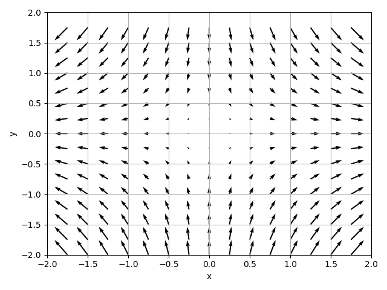
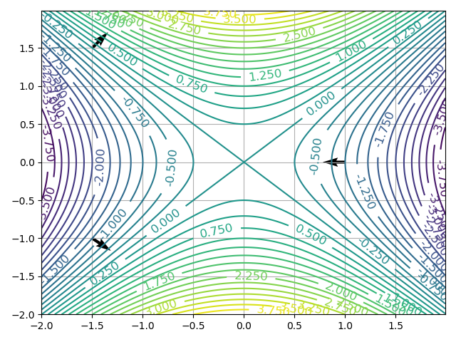
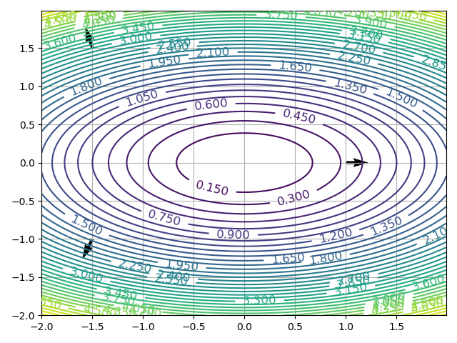

---
tags:
- 数学/微积分
---

# 05 多元函数的梯度及其应用

## 1.多元函数偏导数的数值解

在程序当中，利用数值方法求出各个自变量偏导数的近似解，其方法和步骤同前面讲过的导数的数值解求法并无二致：把其余的自变量固定，就将偏导数的求解方法等价为了导数的数值求解方法，我们以简单的二元函数 $f(x,y)=x^2-y^2$ 为例，分别来看看如何利用 $python$ 求解偏导数 $f_x$ 和 $f_y$，并实际获取点 $(-1,-1)$ 处的数值解：

**代码片段：**

```
def f(x,y):
    return x**2-y**2

def grad_x(f, x, y):
    h = 1e-4
    return (f(x + h/2, y) - f(x - h/2, y)) / h

def grad_y(f, x, y):
    h = 1e-4
    return (f(x, y + h/2) - f(x, y - h/2)) / h

print(grad_x(f, -1, -1))
print(grad_y(f, -1, -1))
```

**运行结果：**

```
-2.000000000002
2.000000000002
```

因此，我们非常轻松的获取了函数 $f(x,y)=x^2-y^2$，在点 $(-1,-1)$ 处的偏导数 $f_x$ 和 $f_x$。

## 2.通过梯度场直观感受梯度

在前一讲的内容中，我们知道了，二元函数中的梯度概念可以说是一元函数中导数概念的一个延伸和拓展。

他们之间的区别是一元函数的导数 $f'(x)$ 是一个数，而梯度 $\nabla f(p)$ 则是一个向量，对于二元函数 $f(x,y)$，梯度对应的向量就是 $(f_x,f_y)$，向量的概念大家都很熟悉，他是一个有方向、有大小的量。

那么很显然的，对于一个二元函数 $f(x,y)$，在他的定义域内，如果我们把每一个点的梯度都求出来，将每个点的梯度向量和各个点的位置联系起来进行集中展示，就形成了一个梯度场，场的概念是一个比较新的概念，我们还是针对二元函数 $f(x,y)=x^2-y^2$ 来实际展示一下：

**代码片段：**

```
import numpy as np
import matplotlib.pyplot as plt

def f(x, y):
    return x**2-y**2

def grad_x(f, x, y):
    h = 1e-4
    return (f(x + h/2, y) - f(x - h/2, y)) / h

def grad_y(f, x, y):
    h = 1e-4
    return (f(x, y + h/2) - f(x, y - h/2)) / h

def numerical_gradient(f,P):
    grad = np.zeros_like(P)
    for i in range(P[0].size):
        grad[0][i] = grad_x(f, P[0][i], P[1][i])
        grad[1][i] = grad_y(f, P[0][i], P[1][i])
    return grad

x = np.arange(-2, 2, 0.25)
y = np.arange(-2, 2, 0.25)

X, Y = np.meshgrid(x, y)
X = X.flatten()
Y = Y.flatten()

grad = numerical_gradient(f, np.array([X, Y]))

plt.quiver(X, Y, grad[0], grad[1])#grad[0]是一个1*X.size的数组
plt.xlim([-2, 2])
plt.ylim([-2, 2])
plt.xlabel('x')
plt.ylabel('y')
plt.grid()
plt.show()
```

**运行结果：**


 上面这段代码我们简要分析一下:

在 $x$ 坐标轴上，从 $-2$ 到 $2$，按照 $0.25$ 的间隔，我们一共生成了 $16$ 个点，$y$ 坐标也是同理，一共也是有 $16$ 个点，这样就对应表示出了平面上的 $256$ 个点。

通过：

```python
X, Y = np.meshgrid(x, y)
```

进行网格化，得到的 $X$ 是一个二维数组，$16$ 行 $16$ 列，对应表示平面上的 $256$ 个点的横坐标，同样 $Y$ 也是一个二维数组，$16$ 行 $16$ 列，依次的对应表示上面那 $256$ 个点的纵坐标。

```python
X = X.flatten()
Y = Y.flatten()
```

上面的这两行代码将这两个二维数组展平成一维数组，$X$ 和 $Y$ 都变成含有 $256$ 个元素的一维数组，其中 $X[i]$ 和 $Y[i]$ 分别对应表示这 $256$ 个点中第 $i$ 个点的横纵坐标。

```python
def numerical_gradient(f,P):
    grad = np.zeros_like(P)
    for i in range(P[0].size):
        grad[0][i] = grad_x(f, P[0][i], P[1][i])
        grad[1][i] = grad_y(f, P[0][i], P[1][i])
    return grad
```

上面 $numerical\_gradient(f,P)$ 这个函数，则用于求取整个定义域上的梯度，传入的 $P$ 是一个 $2\times 256$ 的数组，$P[0]$ 就是所有点的 $x$ 坐标构成的一维数组 $X$，而 $P[1]$ 就是所有点的 $y$ 坐标构成的二维数组 $Y$，我们利用数值求解的方法求取各个点的偏导数 $f_x$ 和 $f_y$，同样存储在一个 $2\times 256$ 的二维数组 $grad$ 当中，其中 $grad[0][i]$ 和 $grad[1][i]$ 分别代表了第 $i$ 个点的 $f_x$ 和 $f_y$，因此向量 $(grad[0][i]，grad[1][i])$ 所表示的就是第 $i$ 个点的梯度。

最后我们利用 $plt.quiver(X, Y, grad[0], grad[1])$ 将所有点的梯度用箭头的形式绘制出来，$X$,$Y$ 表示箭头的起点，$grad[0]$,$grad[1]$ 表示的是箭头的方向。

## 3.任意方向上的方向导数

对于一个二元函数 $f(x,y)$ 而言，偏导数 $f_x$ 的几何意义是表示沿着平行于 $x$ 轴方向上的函数值的变化率，相应的偏导数 $f_y$ 则表示的是沿着平行于 $y$ 轴方向上的函数值的变化率。

我们用向量来表示这个求导的过程，就会更加清晰的展现其几何意义：

我们用向量 $p$ 表示所求偏导的对应点 $(x,y)$，即 $p=(x,y)$，一般我们用 $i$ 和 $j$ 分别表示平行于 $x$ 轴和 $y$ 轴的单位向量，那么我们可以分别重新用向量来表示偏导数 $f_x$ 和 $f_y$：

$f_x(p)=lim_{h\rightarrow 0}\frac{f(p+hi)-f(p)}{h}$，我们将其记作：$D_if(p)$

$f_y(p)=lim_{h\rightarrow 0}\frac{f(p+hj)-f(p)}{h}$，类似的，我们将其记作是：$D_jf(p)$

很显然，我们用向量来表示出了沿着 $x$ 轴方向的偏导数 $f_x$ 以及沿着 $y$ 轴方向的偏导数 $f_y$，但这只是反映了函数沿特殊方向上的变化率。那么我们最终来看一般化的情况，如何表示沿着任意方向的方向导数？

我们设对于任意方向上的单位向量 $u$，依照定义，二元函数 $f(p)$ 在 $p$ 处沿着方向 $u$ 的方向导数为：

$D_{u}f(p)=lim_{h\rightarrow 0}\frac{f(p+hu)-f(p)}{h}$，当然前提条件是这个极限得存在。他反映了函数值沿着方向向量 $u$ 的变化率。

## 4.方向导数和梯度的关系

实际上，根据前面所讲过的内容，二元函数 $f(x,y)$ 如果在点 $p$ 处可微，那么一定满足如下的式子：

$f(p+hu)-f(p)=\nabla f(p)\cdot (hu)+\epsilon(hu)\cdot (hu)$，其中 $u$ 是任意方向上的单位向量。

那么，当 $h\rightarrow 0$ 时，$\epsilon(hu)\rightarrow 0$，那么上式就变成了：

$lim_{h\rightarrow 0}\frac{f(p+hu)-f(p)}{h}=\nabla f(p)\cdot u$

而此时，我们仔细一看，这个表达式的左侧 $lim_{h\rightarrow 0}\frac{f(p+hu)-f(p)}{h}$ 正是函数 $f$ 在 $p$ 点处沿着方向向量 $u$ 的方向导数 $D_uf(p)$，因此我们得到了我们想要看到的一个结论：

$D_uf(p)=\nabla f(p)\cdot u$，他说明了函数 $f$ 在点 $p$ 处沿方向向量 $u$ 的方向导数（也就是函数值的变化率）$D_uf(p)$ 等于该点处的梯度向量与方向向量 $u$ 的点积。

## 5.最大变化率、梯度与等位线

### 5.1.梯度与最大变化率的关系

$D_uf(p)=\nabla f(p)\cdot u$ 这个点积的式子，他里面的内涵非常丰富。我们把点积的式子进一步展开后得到：

$D_uf(p)=\nabla f(p)\cdot u=|\nabla f(p)||u|cos\theta$，其中 $\theta$ 是梯度向量 $\nabla f(p)$ 和方向向量 $u$ 的夹角，那么如果我们想知道在哪个方向上的 $f$ 的函数值变化最快，该怎么去分析？

由于 $-1\le cos\theta \le 1$，显然 $-|\nabla f(p)||u|\le D_uf(p)\le |\nabla f(p)||u|$，也就是说：

当 $\theta=0$，即方向向量 $u$ 和梯度向量 $\nabla f(p)$ 同向时，变化率的取值最大，即增长的最快，为 $|\nabla f(p)||u|$，由于 $u$ 是单位向量，因此变化速率为 $|\nabla f(p)|$。

当 $\theta=\pi$，即方向向量 $u$ 和梯度向量 $\nabla f(p)$ 反向时，变化率的取值最小，即下降的最快，变化率为 $-|\nabla f(p)|$。

总结起来就是在 $p$ 点的函数值沿着梯度的方向增加的最快，逆着梯度的方向函数值减小的最快。大家请记住，这个结论非常的重要，在后面的优化方法里还会用到。

### 5.2.梯度与等位线的关系

那么梯度和等位线之间又有什么样的关系呢？

我们知道，同一等位线上的函数值都是相等的，因此 $p$ 点处等位线切线方向（我们令单位向量 $u$ 沿着等位线的切线方向）上函数值的变化率 $D_uf(p)$ 显然应该为 $0$，那么就有：

$0=D_uf(p)=\nabla f(p)\cdot u$，即：点 $p$ 处的梯度向量和过 $p$ 点的等位线的切线方向向量 $u$ 的点积为 $0$，这就说明函数 $f$ 在点 $p$ 处的梯度和经过该点的等位线是相互垂直的。

我们实际观察一下，我们绘制函数 $f(x,y)=y^2-x^2$ 的等位线，然后随机在定义域内选取三个点 $(-1.5,1.5)$，$(-1.5,-1)$，$(1.0,0)$，并绘制其梯度向量，观察是否满足和对应点处等位线的垂直关系：

**代码片段：**

```
import numpy as np
import matplotlib.pyplot as plt

def f(x, y):
    return y**2-x**2

def grad_x(f, x, y):
    h = 1e-4
    return (f(x + h/2, y) - f(x - h/2, y)) / h

def grad_y(f, x, y):
    h = 1e-4
    return (f(x, y + h/2) - f(x, y - h/2)) / h

x = np.arange(-2, 2, 0.01)
y = np.arange(-2, 2, 0.01)
X, Y = np.meshgrid(x, y)

#添加等高线
C = plt.contour(X, Y, f(X, Y), 36)
#增加各等高线的高度值
plt.clabel(C, inline=True, fontsize=12)

plt.quiver(-1.5, -1, grad_x(f, -1.5, -1), grad_y(f, -1.5, -1))
plt.quiver(1.0, 0, grad_x(f, 1.0, 0), grad_y(f, 1.0, 0))
plt.quiver(-1.5, 1.5, grad_x(f, -1.5, 1.5), grad_y(f, -1.5, 1.5))
plt.grid()
plt.show()
```

**运行结果：**



同样的，我们再来看一个二元函数 $f(x,y)=\frac{x^2}{3}+y^2$ 的等位线和梯度向量的垂直关系：



## 6.小结

这一讲，我们围绕多元函数梯度的概念，对其全面展开了介绍。学习了如何利用程序获取多元函数某一点处的偏导数以及梯度的数值近似解，通过梯度场对梯度有了直观的认识。并从偏导数 $f_x$ 和 $f_y$ 切入，过渡到任意方向上函数变化率的求法，揭示了梯度与函数值变化率的关系。梯度的概念非常重要，他直接服务于最优化的相关内容。