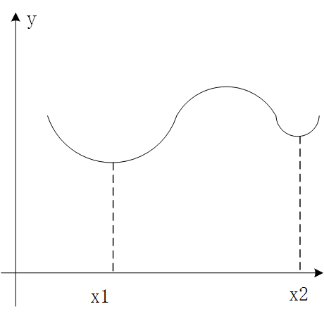
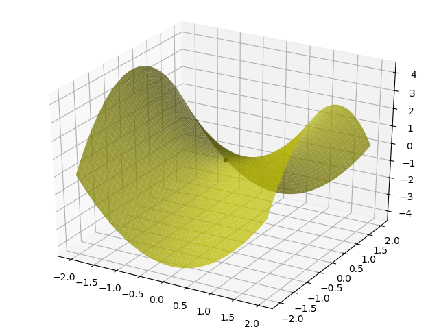
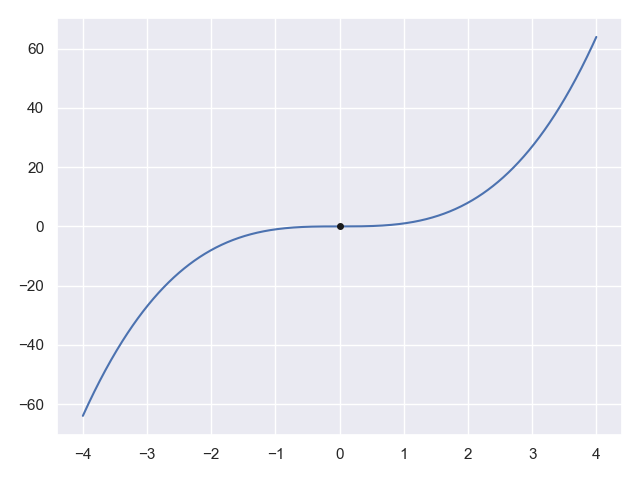

---
tags:
- 数学/微积分
---

# 06 导引：最优化的基本问题和存在条件

## 1.最优化问题的由来和概述

在实际应用中，最优化问题是我们绕不开的话题，最优化问题由两部分组成：

$minimize \,f(x)$ $subject\,to\,x\in \Omega$

他要解决的实际问题就是针对我们上面所写的实值函数 $f$，去寻找一个合适的 $x$，使得函数 $f$ 的取值达到最小，需要注意的是，如果函数 $f$ 是一个一元函数，那么 $x$ 就是一个使得函数取得最小值的数值，而对于一个 $n$ 元函数 $f$ 而言，自然的，$x$ 就是一个 $n$ 维向量：$\begin{bmatrix} x_1&x_2&x_3&...&x_n \end{bmatrix}^T$。

如果你对上面的表述比较陌生，没关系，我们对应回忆一下二元函数 $f(x,y)$ 的情形，实际上我们就是在这里把自变量 $x$ 和 $y$ 统一表述成向量 $\begin{bmatrix} x_1&x_2\end{bmatrix}^T$。

我们知道所有的 $n$ 维向量会构成一个 $R^n$ 空间，而所谓的集合 $\Omega$ 是自变量 $x$ 的约束集，在空间中，也是 $R^n$ 空间中的一个子集，一般我们将约束集表示成：$\Omega=\{ x: h(x)=0,g(x)\le 0\}$。

换句话说，我们所讨论的有约束条件的优化问题，就是指自变量 $x$ 必须取自于约束集 $\Omega$ 范围中的值，在这个范围内寻找使得函数 $f$ 取得极小值的 $x$ 的取值。

当然，如果我们的约束集定义为 $\Omega=R^n$，实际上就对应了另一种情况，也就是无约束的优化问题。

在实际问题中，我们可能还会想到要求取目标函数 $f$ 的极大值，我们对其取负号 $-f$，就将其统一到求极小值的框架中来了。

## 2.关于极小值的一些概念

关于极小值点的概念，我们这里要展开说一下：

对于在约束域 $\Omega$ 内的点 $x^{*}$，如果在约束域内他的邻域 $|x-x^*|<\epsilon$ 当中，对于其余所有的自变量 $x$，都有 $f(x)\ge f(x^*)$，那么我们就说 $x^*$ 是函数约束域中的一个局部极小值点，那么如果在整个约束域 $\Omega$ 中的自变量 $x$ 都满足 $f(x)\ge f(x^*)$，那么此时的 $x^*$ 就由局部极小值点升格成了全局极小值点。

我们以一个最简单的一元函数 $y=f(x)$ 的图像为例，这个概念就非常清晰了。

在这个例子中，图像上所展示的是函数 $f(x)$ 在约束域内的图像，很显然 $x=x_1$ 以及 $x=x_2$ 都是极小值点，而进一步的，$x_1$ 是全局极小值点，$x_2$ 是局部极小值点。

而实际操作中，请大家注意：我们一般会觉得，严格说来只有找到了全局极小值点，才算是最终解决了问题，而在实际的应用当中，全局极小值点是非常难找到的，通常找到局部极小值点一般也就可以了。

## 3.剖析最优化分析的工具

在讲解寻找极小值的具体方法前，大家请务必牢记这几个工具：

我们以二元函数 $f(x_1,x_2)=x_1^2+3x_2^2+2x_1x_2+4x_1+5x_2$ 为例。

函数 $f$ 的一阶导数 $D_f$ 是一个向量，他和梯度向量一致，即：

$$D_f=\begin{bmatrix} \frac{\partial f}{\partial x_1}& \frac{\partial f}{\partial x_2}&...& \frac{\partial f}{\partial x_n} \end{bmatrix}$$

这上面的实际例子中，

$$D_f=\begin{bmatrix}2x_1+2x_2+4&2x_1+6x_2+5 \end{bmatrix}$$

而函数的二阶导数 $D^2f$ 将组成一个矩阵，这就是非常重要的黑塞 $(Hessian)$ 矩阵。

$$D^2f=\begin{bmatrix}\frac{\partial^2f}{\partial x_1^2}&\frac{\partial^2f}{\partial x_1 \partial x_2}&...&\frac{\partial^2f}{\partial x_1 \partial x_n}\ \\...&...&...&...\\\frac{\partial^2f}{\partial x_n \partial x_1}&\frac{\partial^2f}{\partial x_n \partial x_2}&...&\frac{\partial^2f}{\partial x_n^2 }\end{bmatrix}$$

进一步对应的，上面的二元函数 $f(x_1,x_2)$ 的黑塞矩阵为 $\begin{bmatrix}2&2\\2&6 \end{bmatrix}$。

## 4.探索极小值存在的条件

### 4.1.一阶必要条件

首先我们来看满足极小值存在的一阶条件：

我们来看下面这个简单的例子：$f(x_1,x_2)=x_1^2+x_2^2$，我们观察他在极小值点 $(0,0)$ 处的图像：

 很显然，函数 $f$ 在极小值点 $x^*$ 邻域附近的点 $x$ 的取值需要满足 $f(x)\ge f(x^*)$，也就是说在取值点 $x^*$ 处沿着各个方向向量 $u$ 的导数都应该大于等于 $0$：

$lim_{h\rightarrow 0}\frac{f(p+hu)-f(p)}{h}=\nabla f(p)\cdot u \ge 0$

这里运用一个小技巧，由于我们的方向导数在任意方向上都满足大于等于 $0$，因此沿着 $-u$ 方向，这个不等关系依然成立，也就是说我们需要同时满足以下两个不等式：

$\nabla f(p)\cdot u \ge 0$

$\nabla f(p)\cdot (-u) \ge 0 \Rightarrow \nabla f(p)\cdot u \le 0$

那么显然 $\nabla f(p)\cdot u = 0$ 对于任意方向向量 $u$ 都成立，因此只能满足：$\nabla f(p)=0$。

但是请注意，$\nabla f(p)=0$ 只是满足极小值存在的一个必要条件，我们可以看看另外一个例子：$f(x_1,x_2)=x_1^2-x_2^2$ 的图像，他在点 $p=(0,0)$ 处，也满足 $\nabla f(p)=0$，但是从图上看，他显然不是一个极小值点：

### 4.2.二阶必要条件

那我们继续探索，看看为了保证极值点存在，二阶导，也就是黑塞矩阵应该满足的条件：

我们回忆一下多元函数的二阶泰勒近似时曾经讲过的内容：

$$\begin{aligned}
f(x,y)&= f(x_0,y_0) \\
&+\begin{bmatrix} \frac{\partial f}{\partial x}(x_0,y_0) & \frac{\partial f}{\partial y}(x_0,y_0) \end{bmatrix}\begin{bmatrix} x-x_0 \\ y-y_0 \end{bmatrix} \\
&+\frac{1}{2}\begin{bmatrix} x-x_0 & y-y_0 \end{bmatrix}\begin{bmatrix} \frac{\partial^2 f}{\partial x^2}(x_0,y_0) & \frac{\partial f^2}{\partial x \partial y}(x_0,y_0)\\ \frac{\partial f^2}{\partial y \partial x}(x_0,y_0) & \frac{\partial^2 f}{\partial y^2}(x_0,y_0)\end{bmatrix}\begin{bmatrix} x-x_0 \\ y-y_0 \end{bmatrix}\\
&+R_2(x-x_0,y-y_0)
\end{aligned}$$

其中，$R_2$ 表示的余项是一个高阶小量，在 $(x,y)\rightarrow (x_0,y_0)$ 时，$R_2\rightarrow 0$。

我们把上面的式子，按照极小值点 $x^*$ 处的梯度 $\nabla f(x^*)$ 和黑塞矩阵 $\nabla^2 f(x^*)$ 进行符号化表示，并且进行一般化，$x$ 表示一般化的多元自变量 $\begin{bmatrix}x_1&x_2&...&x_n \end{bmatrix}$，$x^*$ 表示的就是极小值点：

$f(x^*+\Delta x)=f(x^*)+(\Delta x)^T\nabla f(x^*)+\frac{1}{2}(\Delta x)^T \nabla^2 f(x^*)(\Delta x)+R_2(\Delta x)$

如果满足 $x^*$ 是函数的极小值，那么依据上面所述的一阶必要条件可知：$\nabla f(x^*)=0$，我们进一步整理：

$f(x^*+\Delta x)-f(x^*)=\frac{1}{2}(\Delta x)^T \nabla^2 f(x^*)(\Delta x)+R_2(\Delta x) \ge 0$

由于当 $\Delta x \rightarrow 0$ 时，余项 $R_2(\Delta x)\rightarrow 0$，因此此时则需要满足：

$f(x^*+\Delta x)-f(x^*)=\frac{1}{2}(\Delta x)^T \nabla^2 f(x^*)(\Delta x) \ge 0$

即：$(\Delta x)^T \nabla^2 f(x^*)(\Delta x) \ge 0$ 对于任意向量 $\Delta x$ 都成立，由于黑塞矩阵是对称矩阵，因此这个结论也可以描述为：

如果 $x^*$ 是函数的极小值点，那么 $x^*$ 处的黑塞矩阵是一个半正定的矩阵。

当然，这个条件也是必要非充分的，举个最简单的一元函数的反例：$y=x^3$，在 $x=0$ 点处，他同时满足一阶导数 $f'(x)$ 为 $0$，二阶导数 $f''(x)$ 非负（一元函数的二阶导数就是黑塞矩阵退化后的情况），但是从下面的图中我们很轻松的看出，$x=0$ 显然不是 $y=x^3$ 的极小值点：

### 4.3.二阶充分条件

那我们最后再稍作变化，探索一下函数极小值点存在的二阶充分条件：

即如果点 $x^*$ 处同时满足一阶和二阶的如下条件：

$\nabla f(x^*)=0$

$(\Delta x)^T \nabla^2 f(x^*)(\Delta x) > 0$

注意，这里的不等关系变成了单纯的大于 $0$，$x^*$ 处的黑塞矩阵由半正定变成了正定。

只要满足上面的条件，就能在 $\Delta x\rightarrow 0$ 的邻域内保证：

$f(x^*+\Delta x)-f(x^*)=(\Delta x)^T\nabla f(x^*)+\frac{1}{2}(\Delta x)^T \nabla^2 f(x^*)(\Delta x)$ $=0+\frac{1}{2}(\Delta x)^T \nabla^2 f(x^*)(\Delta x)>0$

在任意方向上都成立。

因此，函数 $f$ 在 $x^*$ 处同时满足 $\nabla f(x^*)=0$ 且黑塞矩阵正定，是 $x^*$ 严格极小的充分条件。

## 5.实际工程中的一些说明

这里讲的是优化问题的一些理论基础，让大家从理论上对极小值的求法有了一个认识，在实际的求法中，对于一些非常复杂的非线性函数，直接采用上述方式解析的进行极值的寻找，往往非常复杂，甚至有时候根本就无法办到，同时也无法发挥计算机程序的优势。后面，我们将主要基于上面的思路，采用迭代法，工程的进行极值的搜索求解，这样可以避免许多复杂的计算问题。