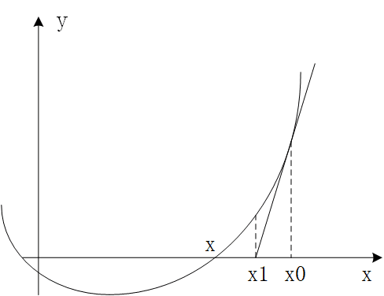
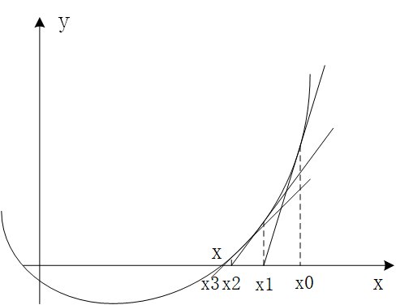
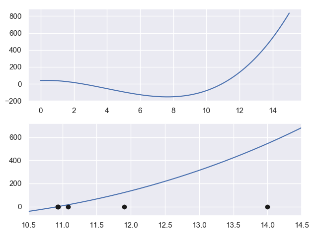
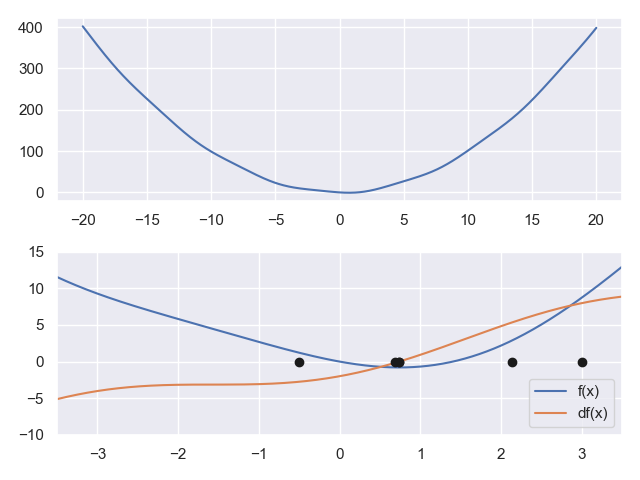
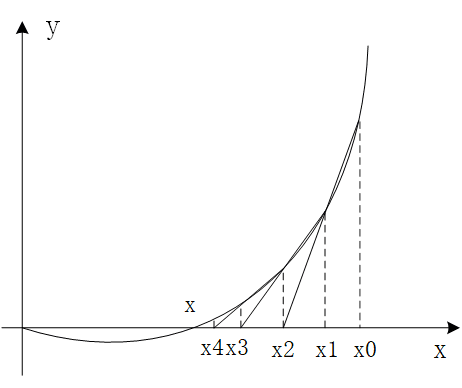
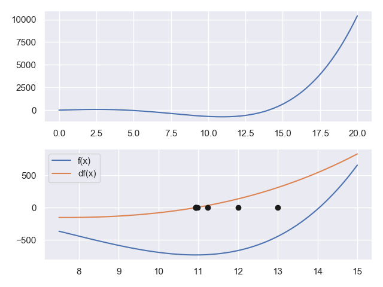

---
tags:
- 数学/微积分
---

# 07 一元函数的极值：运用迭代法

在上一讲的末尾我们谈到，在实际的工程当中我们常常借助计算机程序，利用迭代法进行极值的求取，这里我们首先从一元函数入手，看看如何通过这种方法找到一元函数的极值点。

## 1.起步：用牛顿法解方程

### 1.1.原理分析

在介绍求取函数$f(x)$的极值方法前，我们首先谈一下解方程的问题。

在解一元函数的高阶方程，形如$ax^n+bx^{n-1}+cx^{n-2}+…+1=0$时，大家肯定会想到用因式分解或者是用求根公式来获取方程的解析解，但是事实总不会是那么一帆风顺的，有时候复杂的方程我们没办法通过上述方法求取他的解，那么我们就得用迭代的方法来获取他的近似解，牛顿法就是一种常用的方法。

他的理论基础还是基于函数的泰勒近似：

对于方程式$f(x)=0$，我们先选择一个点$x_0$作为首轮迭代的初始点，在$x_0$处对$f(x)$进行一阶泰勒展开：

$f(x)\approx f(x_0)+(x-x_0)f'(x_0)$

大家知道，$f(x)$在$x=x_0$处的一阶泰勒展开$f(x_0)+(x-x_0)f'(x_0)$是函数$f(x)$在$x=x_0$处的切线，并以这条切线作为函数$f(x)$在$x=x_0$邻域的近似，那我们就通过这个直线方程$f(x_0)+(x-x_0)f'(x_0)=0$的根，来近似的作为$f(x)=0$的根。

具体获得的解如下：

$f(x_0)+(x-x_0)f'(x_0)=0\Rightarrow x=x_0-\frac{f(x_0)}{f'(x_0)}$

作为一条直线，获得这个切线方程的解是一件非常容易的事情，但是就这么求出来的解能够直接用来作为原方程$f(x)=0$的解吗？看看这误差，想想也不太敢直接用吧，下面这幅图显示的就一清二楚： 


 
 显然，利用一阶泰勒展开式求得的近似解$x_1=x_0-\frac{f(x_0)}{f'(x_0)}$，距离原方程$f(x)=0$真正的解距离还很远，但是他的的确确是比初始点$x_0$要更加接近于方程的真实解$x^*$，这也是一个好的趋势。

那么好，我们按照$x_{k+1}=x_k-\frac{f(x_k)}{f'(x_k)}$这个方法继续迭代下去，就会产生一个牛顿法的近似解序列$x_1,x_{2},x_{3},…$，总的来说，他会越来越试图靠近方程的实际解析解，直到最后得到的两个相邻近似解之差小于预设的阈值$\epsilon$时（即此时满足$|x_{k+1}-x_k|<\epsilon$），这个迭代过程才停止，整个迭代的过程如下图所示：


 
 从图中我们可以看到，牛顿法迭代出来的序列$x_0,x_1,x_2,x_3$正在不断的逼近方程实际的解：$x$。

### 1.2.实际举例

我们来实际看一个例子，我们用牛顿法来求方程$x^3-12x^2+8x+40=0$的一个根，我么选择$x_0=14$进行初始迭代：

**代码片段：**

```python
import matplotlib.pyplot as plt
import numpy as np
import seaborn
seaborn.set()

def f(x):
    return x**3-12*x**2+8*x+40

def df(x):
    return 3*x**2-24*x+8

def newton(x):
    return x - f(x)/df(x)

x0 = 14
x_list = []
x_list.append(x0)

while(True):
    x = newton(x_list[-1])
    if abs(x-x_list[-1])<=1e-5:
        break
    x_list.append(x)

fig, ax = plt.subplots(2, 1)

x = np.linspace(0, 15, 1000)
plt.xlim(0, 15)
ax[0].plot(x, f(x))

x = np.linspace(10.5, 14.5, 1000)
plt.xlim(10.5, 14.5)
ax[1].plot(x, f(x))
ax[1].plot(x_list, [0]*len(x_list), 'ko')
print('x={},f(x)={}'.format(x_list[-1], f(x_list[-1])))
print(x_list)
plt.show()
```

**运行结果：**

```
x=10.933723301726161,f(x)=0.0003467730414286052
[14, 11.907692307692308, 11.079933151128879, 10.937805495069655, 10.933723301726161]
```


 
 我们看到，在运行结果的两幅图中，上面的第一幅图是原函数$f(x)=x^3-12x^2+8x+40$的图像，下面的第二幅图是在$[10.5,14.5]$的小区间范围内的$f(x)$图像，$x$轴上的黑色点显示出：通过四轮迭代的解序列为 $[14, 11.9076, 11.0799, 10.9378, 10.9337]$。他们逐步逼近方程的一个根，最终收敛到一个方程的近似根，即：$x=10.9337$。经过验算，此时的函数取值$f(x)$已经相当接近于$0$了。这个过程，恰是计算机程序所擅长的。

不过需要注意的是，在利用牛顿法进行迭代求根的时候，初始值$x_0$的选取很重要，如果选取的不恰当，使得比值$\frac{f(x_0)}{f'(x_0)}$较大，会使得迭代的结果在真实根的附近不断摆动，可能会使得求解的过程失效。

## 2.利用牛顿法求一元函数极值

### 2.1.原理分析

到了这里，大家应该已经明白了如何利用牛顿法去迭代的求取一个方程的根，但是大家可能会有疑惑，我们不是在讨论如何求取函数的极值吗？这和解方程有什么关系？

这里面的关系非常紧密，我们接下来仔细分析一下。

试想，如果我们想要求取一个函数$f(x)$的极小值点，很显然可以利用之前介绍过的极值存在的条件，去寻找满足一阶导数$f'(x)=0$的$x$点，作为极小值的最终备选项，那么思路就很清晰了：

寻找使得$f(x)$取得极小值点$x$的问题，就被转化成了寻找满足一阶导数$f'(x)=0$的解方程的问题，这就又回到了利用牛顿法来解方程的问题了。

我们令$g(x)=f'(x)$，我们要求的就是方程$g(x)=0$的解，方法就完全一样了：也是先寻找一个合适的迭代初始点$x_0$，然后按照$x_{k+1}=x_k-\frac{g(x_k)}{g'(x_k)}$这个方法继续迭代下去，直到迭代出来的相邻两个解$x_k$和$x_{k+1}$之差小于阈值。

这里有一点需要转化一下：由于$g(x)=f'(x)$，因此实际操作中的迭代公式就变成了：$x_{k+1}=x_k-\frac{f'(x_k)}{f''(x_k)}$。

### 2.2.实际举例

我们来实际举一个例子，利用上述方法求取函数$f(x)=x^2-2sinx$的极值：

**代码片段：**

```python
import matplotlib.pyplot as plt
import numpy as np
import seaborn
seaborn.set()

def f(x):
    return x**2-2*np.sin(x)

def df(x):
    return 2*x-2*np.cos(x)

def d2f(x):
    return 2+2*np.sin(x)

def newton(x):
    return x - df(x)/d2f(x)

x0 = 3
x_list = []
x_list.append(x0)

while(True):
    x = newton(x_list[-1])
    if abs(x-x_list[-1])<=1e-5:
        break
    x_list.append(x)

fig, ax = plt.subplots(2, 1)

x = np.linspace(-20, 20, 1000)
plt.xlim(-20, 20)
ax[0].plot(x, f(x))

x = np.linspace(-3.5, 3.5, 1000)
plt.xlim(-3.5, 3.5)
plt.ylim(-10, 15)
ax[1].plot(x, f(x), label='f(x)')
ax[1].plot(x, df(x), label='df(x)')
ax[1].plot(x_list, [0]*len(x_list), 'ko')
ax[1].legend(loc='best')
print('x={},f(x)={}'.format(x_list[-1], f(x_list[-1])))
print(x_list,)
plt.show()
```

**运行结果：** 


 
 同样的，上面的图1是函数$f(x)=x^2-2sinx$的全貌，我们设定迭代的初始点为$x_0=3$，在下面的图2中，我们近距离的观看$[-3,3]$的小区间，并且把原函数$f(x)=x^2-2sinx$和导函数$f'(x)=2x-2cosx$的图像同时展现。从绘制出来的黑色点来看，迭代序列不断的趋近$f'(x)=0$的解，也就是使得$f(x)$取得最小值的$x$点。

我们把$x$的迭代序列打印出来，同时注意一下探索到的函数极小值：

```
x=0.7390852043758361,f(x)=-0.8009772242267496
[3, -0.4965581782973314, 2.131003844480995, 0.6896627207783732, 0.7396529975313338, 0.7390852043758361]
```

从图中我们可以看出，原函数$f(x)$取到极小值的点和一阶导数$f'(x)=0$的根是一致的。当然了，还是要注意初始点的选取，由于我们是收敛到$f'(x)=0$的$x$取值点，因此也有可能收敛到极大值点，这一点请大家注意。

## 3.割线法：牛顿法的一种替代

### 3.1.原理分析

在使用牛顿迭代法搜索函数$f(x)$极小值的取值点时，我们用到了函数的二阶导数$f''(x)$，在几何意义上是反复利用导函数$f'(x)$的切线，迭代出一连串的取值点$x_1,x_2,x_3,…,x_k$，也正是因为利用导函数$f'(x)$的切线，才用到了函数$f(x)$的二阶导数。

但是，如果二阶导数不存在，或者因为计算等原因，在不使用二阶导数的情况下，我们该怎么办呢？

那么我们还是从几何意义的角度去考虑，不使用函数$f(x)$的二阶导数$f''(x)$，意味着不能使用导函数$f'(x)$的切线来进行迭代搜索了。但是，我们可以使用导函数$f'(x)$的割线来替代切线，同样能够不断的构造出序列来逼近$f'(x)=0$的根，如下图所示： 


 
 在这里，导函数$f'(x)$的切线退化成了割线，整体的思路上却还是类似的，但是请注意，导函数$f'(x)$过点$x_k$的切线斜率表示为二阶导$f''(x_k)$。而导函数$f'(x)$中与该切线近似，但是过$x_k$和$x_{k-1}$两点的割线的斜率，显然就用不到二阶导去表示了，他仅仅使用一阶导表示成：$\frac{f'(x_k)-f'(x_{k-1})}{x_k-x_{k-1}}$，因此割线法的实质，就是用割线的斜率来近似切线的斜率，即：$\frac{f'(x_k)-f'(x_{k-1})}{x_k-x_{k-1}}\Rightarrow f''(x_k)$

那么在牛顿法中所用到的迭代公式$x_{k+1}=x_k-\frac{f'(x_k)}{f''(x_k)}$就变成了：

$x_{k+1}=x_k-\frac{x_k-x_{k-1}}{f'(x_k)-f'(x_{k-1})}f'(x_k)$

不过从表达式中我们就可以看出，牛顿法用一个$x_k$就可以迭代出下一个取值点$x_{k+1}$，而割线法需要用两个值$x_{k-1}$和$x_k$来迭代出下一个取值点$x_{k+1}$，因此迭代的初始值，我们就需要指定$x_0$和$x_1$两个值。

### 3.2.实际举例

按照割线法的思路，我们来迭代求取函数$f(x)=\frac{1}{4}x^4-4x^3+4x^2+40x+5$的一个极小值。

我们对应的求取他的一阶导：$f'(x)=x^3-12x^2+8x+40$

然后选取$x_0=13$和$x_1=12$作为他的初始迭代点。

**代码片段：**

```python
import matplotlib.pyplot as plt
import numpy as np
import seaborn
seaborn.set()

def f(x):
    return (1/4)*x**4-4*x**3+4*x**2+40*x+5


def df(x):
    return x**3-12*x**2+8*x+40

def secant(xk,xk_1):
    return xk-df(xk)*(xk-xk_1)/(df(xk)-df(xk_1))

x0 = 13
x1 = 12
x_list = []
x_list.append(x0)
x_list.append(x1)

while(True):
    x = secant(x_list[-1],x_list[-2])
    if abs(x-x_list[-1]) <= 1e-5:
        break
    x_list.append(x)
    

fig, ax = plt.subplots(2, 1)

x = np.linspace(0, 20, 1000)
ax[0].plot(x, f(x))

x = np.linspace(7.5, 15, 1000)
ax[1].plot(x, f(x), label='f(x)')
ax[1].plot(x, df(x), label='df(x)')
ax[1].plot(x_list,[0]*len(x_list),'ko')
ax[1].legend()
plt.show()

print(x_list)
print('x={},f(x)={},df(x)={}'.format(x_list[-1],f(x_list[-1]),df(x_list[-1])))
```

**运行结果：** 


 
 同样的，我们看结果中的上下两幅图，上面的图1是函数$f(x)$的图像，而下面的图2是缩小了自变量范围后，聚焦的函数$f(x)$和一阶导函数$f'(x)$的图像，通过割线法进行迭代，最终收敛到的$x$取值点是$x=10.9337$，我们目测一下，他看上去确实是函数$f(x)$的极小值点以及对应的一阶导函数$f'(x)$与$x$轴的交点。

我们可以对应的观察一下打印出来的迭代序列，以及最终的函数$f(x)$取值与一阶导函数$f'(x)$取值。

```
[13, 12, 11.231638418079097, 10.986207211614417, 10.936682967216196, 10.933750753110669, 10.933719992903262]
x=10.933719992903262,f(x)=-734.9809658149998,df(x)=1.8961261361027937e-06
```

## 4.小结

通过这一讲的内容，我们了解了如何利用迭代搜索的方法，在一元函数中寻找他的极值点，这里面比较常用的就是我们所介绍的牛顿法和割线法，他们的思想基础就是在一阶泰勒展开式所起到的近似效果上，通过多轮迭代逐步接近我们所想要寻找的真实值。

下一讲，我们将同样利用迭代搜索的思想方法，去寻找多元函数的极值。