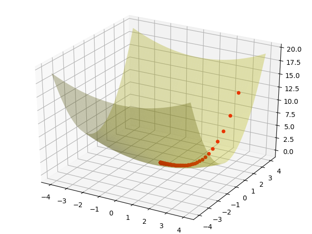

---
tags:
- 数学/微积分
---

# 08 多元函数的极值（上）：梯度法基础

从这一讲开始，我们来讨论如何利用迭代法去寻找多元函数的极值点，我们首先从最基础的 [梯度下降](https://so.csdn.net/so/search?q=%E6%A2%AF%E5%BA%A6%E4%B8%8B%E9%99%8D&spm=1001.2101.3001.7020) 法入手。梯度下降法的思路非常清晰明了，且实现过程也比较简单，是求解无约束最优化问题中的一种最常用、最基础的迭代方法。

## 1.梯度概念回顾

在梯度下降法当中，顾名思义，梯度是其中最为重要的核心工具和武器。因此，我们有必要回顾一下关于梯度的一些重要概念和特性：

首先，多元函数 $f(x_1,x_2,…,x_n)$ 在点 $p_0$ 处的梯度 $\nabla f$ 是一个 $n$ 维向量：

$$\begin{bmatrix} \frac{\partial f}{\partial x_1}&\frac{\partial f}{\partial x_2}&\frac{\partial f}{\partial x_3}&...&\frac{\partial f}{\partial x_n} \end{bmatrix}^T$$

其次，多元函数 $f$ 在点 $p_0$ 处的梯度向量与该函数过点 $p_0$ 处的等位线的切线向量相互正交；

最重要的是，沿着梯度 $\nabla f$ 向量方向，函数 $f$ 的值的增长速度最快，相对应的，沿着负梯度，也就是 $-\nabla f$ 向量的方向，函数 $f$ 的值下降的最快。

## 2.类比盲人下山的例子

为了形象的描述这个算法的思想和过程，我们举一个盲人下山的例子：

利用迭代法，在一个多元函数上去探索极小值的过程，我们可以把他想象成一个盲人下山的过程，盲人看不到整个山的全貌，不清楚全局，拥有的能力只是去感知他所站立位置四周的坡度，而他的目标却是要下到山的最低点。

假设盲人站在山的任意一个位置点，开始下山的过程，首先他感知一下自己四周的山坡，选择坡度最陡峭的一个方向，然后沿着这个方向走一小步，到达一个新的位置点，然后不断重复上面的“感知坡度”-“选择最陡峭的方向”-“走一小步”的过程，不断更新自己的位置点。

最终什么时候停下来呢？那应该是在盲人身处某个点的时候发现四周坡度已经很“平”了，他就判断自己下到了山底，此时就能停下来了。

## 3.梯度下降法的算法思路

那么，有了上面的思维过程打基础，我们再来实际理解梯度下降法就不难了：

我们从随机的初始点 $p_0$ 开始迭代，这就好比那个盲人站在了山上的任意一个位置点上。函数的极小值点在哪，最终该往哪走？我们也不知道，我们就好比那个盲人什么也看不到一样。

但是，我们也可以利用梯度这个工具来找到 $p_0$ 邻域内具体哪个方向上函数的下降速度最快，即 $-\nabla f$ 负梯度向量的方向，我们沿着他来微小的更新我们取值点的位置，就好比盲人沿着最陡峭的方向走了一小步。

我们就不停的重复“计算梯度”-“沿着负梯度的方向”-“更新位置值”的过程，直到突然间我们发现，梯度已经很小了，小于我们预设的阈值，此时的位置点就认定为我们找到的函数的局部极小值点，这就好比盲人发现四周的坡度已经很平了。

梯度下降法的背后，其实还是离不开多元函数的一阶泰勒展开以及函数的线性近似的思想：

就拿简单的二元函数来说，$f(x_1,x_2)$ 在点 $p_0$ 处的一阶泰勒展开式为：$f(p)\approx f(p_0)+\nabla f(p_0)(p-p_0)$，这个泰勒近似是在 $p_0$ 的小的邻域范围内近似效果较好，因此迭代的步子不能迈得过大，太大的话 $p_0$ 处的梯度的精度就失效了。

那么进一步的，从点 $p_0$ 处迭代到下一个点 $p_1$，二者之间的迭代关系具体是怎样的呢？

很显然，按照我们前面所说的，我们是按照负梯度 $-\nabla f$ 的向量方向，从点 $p_0$ 走到了点 $p_1$，那么向量 $p_1-p_0$ 的方向就和 $p_0$ 处的梯度方向正好反向，在表达式上满足下面的关系：

$\frac{p_1-p_0}{|p_1-p_0|}=-\frac{\nabla f(p_0)}{|\nabla f(p_0)|}$

我们对表达式稍作调整，就有：$p_1-p_0=-\frac{\nabla f(p_0)}{|\nabla f(p_0)|}|p_1-p_0|$。

此时，进一步进行整理，迭代的关系初见雏形：$p_1=p_0-\frac{\nabla f(p_0)}{|\nabla f(p_0)|}|p_1-p_0|$。

最后，我们令：$\lambda_0=\frac{|p_1-p_0|}{|\nabla f(p_0)|}$，整个迭代的关系就简化成了如下的形式：

$p_1=p_0-\nabla f(p_0)\lambda_0$。

我们把他一般化，就有了最终的迭代公式：$p_{k+1}=p_k-\nabla f(p_k)\lambda_k$。

此时，距离问题的彻底解决似乎还有一道坎没有跨过，那就是这个 $\lambda_k$，他是什么？他应该确定为多少？这都是一个未知的问题。

这个 $\lambda_k$，我们称之为**学习率**，他是迭代步长与梯度向量模的比值，我们一般把学习率设置为一个比较小的固定常数。

这样，一方面能够满足迭代精度的要求，另一方面还可以动态调整迭代的步长，当坡度陡峭、梯度值较大时，我们的步长相应变大，快速下山，而当我们快要接近山底，坡度变得平缓，梯度变小的时候，步长也相应变小，以免一大步跨过极小值点的情况发生。

## 4.梯度下降法的代码实现

通过上面的理论知识的讲解，我们对梯度下降法的原理应该已经掌握的比较透彻了。那么接下来我们实际动手，用 python 语言来实际操练一下这个极值点迭代求取的常用算法：

我们举一个例子 $f(x_1,x_2)=\frac{1}{5}x_1^2+x_2^5$，下面就来求这个简单的二元函数的极小值点。

在这个实际的例子中，我们令初始的迭代点为 $p_0=[3,4]$，学习率 $\lambda_k=0.1$，如果梯度的模长小于阈值 $\epsilon=0.0001$ 时则停止迭代。我们按照梯度下降法的基本思路来寻找函数的极小值点：

**代码片段：**

```python
from matplotlib import pyplot as plt
import numpy as np
from mpl_toolkits.mplot3d import Axes3D

fig = plt.figure()
ax = Axes3D(fig)

def f(p):
    return 0.2 * p[0] ** 2 + p[1] ** 2

def numerical_gradient(f, P):
    h = 1e-6
    x = P[0]
    y = P[1]
    dx = (f(np.array([x + h / 2, y])) - f(np.array([x - h / 2, y]))) / h
    dy = (f(np.array([x, y + h / 2])) - f(np.array([x, y - h / 2]))) / h
    return np.array([dx, dy])

def gradient_descent(cur_p, lambda_=0.1,
             epsilon=0.0001, max_iters=10000):
    for i in range(max_iters):
        grad_cur = numerical_gradient(f, cur_p)
        if np.linalg.norm(grad_cur, ord=2) < epsilon:
            break
        cur_p = cur_p - grad_cur * lambda_
        ax.scatter(cur_p[0], cur_p[1], f(cur_p), color='r')
    
    print('局部极小值为：{}'.format(cur_p))
    return cur_p

x1 = np.arange(-4, 4, 0.01)
x2 = np.arange(-4, 4, 0.01)
x1, x2 = np.meshgrid(x1, x2)
ax.plot_surface(x1, x2, f(np.array([x1, x2])), color='y', alpha=0.3)
p0 = np.array([3, 4])
gradient_descent(p0)
plt.show()
```

**运行结果：**

```
局部极小值为：[2.40866325e-04 5.16743037e-19]
```



 从结果图中我们发现，在原函数的图像上，一连串的红点表示从初始点开始，不断的向极小值点迭代逼近。

之前我们曾经提到过，函数 $f$ 在具体某个点 $p_0$ 处的等位线的切线向量是和该点处的梯度向量相互正交的，我们利用之前学过的知识，在 $xoy$ 平面上绘制函数的等位线图，并且将各个迭代的取值点也投影到 $xoy$ 平面上，来实际验证一下迭代点的轨迹与等位线的相互关系：

**代码片段：**

```python
from matplotlib import pyplot as plt
import numpy as np

def f(p):
    return 0.2*p[0]**2 + p[1] ** 2

def numerical_gradient(f, P):
    h = 1e-6
    x = P[0]
    y = P[1]
    dx = (f(np.array([x+h/2, y]))-f(np.array([x-h/2, y])))/h
    dy = (f(np.array([x, y+h/2]))-f(np.array([x, y-h/2])))/h
    return np.array([dx, dy])

def gradient_descent(cur_p, lambda_=0.1,
                     epsilon=0.0001, max_iters=10000):
    
    for i in range(max_iters):
        grad_cur = numerical_gradient(f, cur_p)
        if np.linalg.norm(grad_cur, ord=2) < epsilon:
            break
        cur_p = cur_p - grad_cur * lambda_
        plt.plot(cur_p[0],cur_p[1], 'ko', markersize=3)
    
    return cur_p

x1 = np.arange(-5, 5, 0.01)
x2 = np.arange(-5, 5, 0.01)
x1, x2 = np.meshgrid(x1, x2)
C = plt.contour(x1, x2, f(np.array([x1, x2])), 60)
plt.clabel(C, inline=True, fontsize=12)

p0 = np.array([3, 4])
gradient_descent(p0)

plt.show()
```

**运行结果：**


 从等位线图上来看，迭代点的轨迹在各个等位线上满足与等位线的相互正交关系。

## 5.关于算法的补充讨论

梯度下降法整个思路非常易于理解，实现起来比较简单，但是他的性能并不是最优的，最主要的原因是他基于一阶泰勒展开的函数近似，为了保证其梯度的有效性，因此每次迭代的步长都比较小，使得收敛的速度比较慢，要迭代多轮才能收敛到极值点附近。

因此，后续有很多的算法对梯度下降法都进行了一些改良，提升了他的性能，我们后面两讲会介绍一些改进后的实现方法。