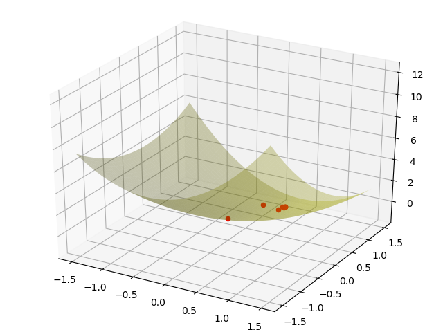
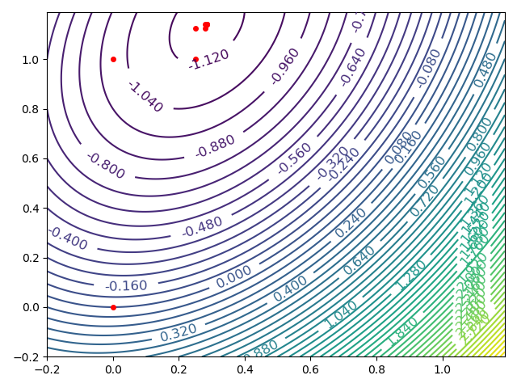

---
tags:
- 数学/微积分
---

# 09 多元函数的极值（中）：最速下降法

我们这一讲将要介绍的最速下降法，是梯度法的一种改进实现。

## 1. SymPy 库的介绍

在具体进行算法介绍之前，我们先花一点时间来专门谈谈 $python$ 的 $SymPy$ 库，$SymPy$ 库是 $Python$ 的数学符号计算库，用它可以进行数学表达式的符号推导和计算，可以很方便的进行公式推导、级数展开、积分、微分以及解方程等重要运算。

可能大家对于符号计算这个名字感觉有些陌生和奇怪，我们下面结合例子来慢慢熟悉他：

### 1.1.符号导入

我们举一个最典型的例子：欧拉公式。

$e^{i\pi}+1=0$，这里面有自然对数 $e$，虚数 $i$，圆周率 $\pi$ 等数学符号，如果我们想用 $python$ 来描述这个等式，运用之前的知识也可以办到，只不过相对而言比较麻烦，这里如果使用 $SymPy$ 库就会非常简单，他可以一次性将这些符号都导入进来，并完成公式的计算：

**代码片段：**

```python
from sympy import *

print("E**(I*pi)+1={}".format(E**(I*pi)+1))
```

**运行结果：**

```
E**(I*pi)+1=0
```

### 1.2.自定义符号

上面的欧拉公式中，我们所用的符号 $e$、$i$、$\pi$ 都是已有的常量，如果我们的目标是实现一个带有自变量 $x$ 的表达式，该如何处理？这里，我们需要自己定义新加入的变量 $x$，我们看一个例子：验证 $e^{ix}$ 这个表达式展开为实部和虚部的形式：$e^{ix}=isinx+cosx$。

**代码片段：**

```python
from sympy import *

x = Symbol('x', real=True)
print(expand(E**(I*x), complex=True))
```

**运行结果：**

```
I*sin(x) + cos(x)
```

在这个例子中，我们利用 $Symbol$ 函数定义了一个实变量符号 $x$，并基于他定义了一个新的表达式 $e^{ix}$，然后我们使用 $expand$ 方法在复数的范围内将 $e^{ix}$ 展开为了实部+虚部的形式：$isin(x) + cos(x)$。

### 1.3.任意阶数的泰勒展开

之前我们学习过函数的泰勒展开的有关知识，实际上利用 $SymPy$ 库对指定函数进行任意阶数的泰勒展开是非常容易的，我们下面分别对 $sin(x)$ 和 $cos(x)$ 进行 $10$ 阶泰勒展开：

**代码片段：**

```python
from sympy import *

x = Symbol('x', real=True)
sin_s = series(sin(x), x, 0, 10)
cos_s = series(cos(x), x, 0, 10)
print('sin(x)={}'.format(sin_s))
print('cos(x)={}'.format(cos_s))
```

**运行结果：**

```
sin(x)=x - x**3/6 + x**5/120 - x**7/5040 + x**9/362880 + O(x**10)
cos(x)=1 - x**2/2 + x**4/24 - x**6/720 + x**8/40320 + O(x**10)
```

可以看出，得到的泰勒展开式的结果是非常准确的，还包含了无穷小量的表达。

### 1.4.自定义符号替换

在实际的程序当中，我们经常需要对表达式中的变量进行名称替换，最简单的，比如把变量名 $x$ 替换成变量名 $y$，至于说用处是什么，我们在后面的例子中会见到，我们先看看如何使用，试着把上面的 $cos(x)$ 的级数展开式中的变量 $x$ 替换成 $y$：

**代码片段：**

```python
from sympy import *

x = Symbol('x', real=True)
y = Symbol('y', real=True)
cos_s = series(cos(x), x, 0, 10)
print('cos(x)={}'.format(cos_s))
cos_s = cos_s.subs(x, y)
print('cos(y)={}'.format(cos_s))
```

**运行结果：**

```
cos(x)=1 - x**2/2 + x**4/24 - x**6/720 + x**8/40320 + O(x**10)
cos(y)=1 - y**2/2 + y**4/24 - y**6/720 + y**8/40320 + O(y**10)
```

这样就完成了变量名称的替换工作。

### 1.5.求导与微分

我们来看看如何利用 $SymPy$ 库里的 $diff$ 函数对函数进行求导运算。

这里，我们分别举三个例子，看看导数 $\frac{d}{dx}sin(2x)$、二阶导 $\frac{d^2}{dx^2}(x^2+2x+1)$、偏导数 $\frac{\partial^2}{\partial x \partial y}(x^2y^2+2x^3+y^2)$ 的符号求解方法：

**代码片段：**

```python
from sympy import *

x = Symbol('x', real=True)
y = Symbol('y', real=True)

print(diff(sin(2*x),x))
print(diff(x**2+2*x+1,x,2))
print(diff(x**2*y**2+2*x**3+y**2,x,1,y,1))
```

**运行结果：**

```
2*cos(2*x)
2
4*x*y
```

从结果中，我们很轻松的得到了三种导数结果的符号表达式：

$\frac{d}{dx}sin(2x)=2cos(2x)$

$\frac{d^2}{dx^2}x^2+2x+1=2$

$\frac{\partial^2}{\partial x \partial y}x^2y^2+2x^3+y^2=4xy$

### 1.6.解方程

$SymPy$ 库当中的 $solve$ 方法可以用来解方程，这个就非常方便了，我们看两个简单的例子：

一次方程：$x+1=0$

二次方程：$x^2+3x+2=0$

**代码片段：**

```python
from sympy import *

x = Symbol('x', real=True)

f1 = x + 1
f2 = x**2+3*x+2

print(solve(f1))
print(solve(f2))
```

**运行结果：**

```
[-1]
[-2, -1]
```

得到的结果是一个列表，里面包含了方程所有的解。

### 1.7.表达式求值

这个用法其实非常关键，前面我们用各种方式生成了表达式，如何对我们自定义的符号变量赋值，并计算出表达式的值，看下面的具体实现：

我们求当 $x=2$ 的时候，函数 $f(x)=x^2+3x+2$ 的取值：

很简单，表达式求值的本质也是符号变量的替换，就是把自定义的符号变量 $x$ 替换成目标取值 $2$。

**代码片段：**

```python
from sympy import *
x = Symbol('x', real=True)
f = x**2+3*x+2

print(f.subs(x,2))
```

**运行结果：**

```
12.0000000000000
```

之所以花了这么多的篇幅来介绍一个新的 $python$ 库用法，目的是在接下来的最速下降法的实现中使用他们，以简化我们的代码实现。

## 2.最速下降法的核心思想

最速下降法是梯度下降法的一种实现形式，每一步都是沿着负梯度的方向迭代前进，但是同上一讲里介绍的方法不同之处在于学习率的选择方式：

在基础的梯度下降法当中，学习率 $\lambda_k$ 是固定的，即 $p_{k+1}=p_k-\nabla f(p_k)\lambda_k$。

但是最速下降法则不然，搜索方向仍然是当前点 $p_k$ 的负梯度方向 $-\nabla f(p_k)$，但是迭代的目标点是需要满足在这个**搜索方向**上使得函数 $f$ 取得该方向上的极小值，即：

$p_{k+1}=p_k-\alpha_k\nabla f(p_k)$，使得函数取值 $f(p_{k+1})$ 在搜索的一维方向上取得极小值。

更进一步的，在 $p_k$ 点进行迭代时，由于此时 $p_k$ 和 $\nabla f(p_k)$ 都是已知的，实际上的工作就是锁定 $\alpha_k$ 的取值，使得函数 $f(p_k-\alpha_k\nabla f(p_k))$ 取得极小值。此时在寻找函数极小值的过程中，仅仅只有一个未知数，那就是 $\alpha_k$，因此我们面对的问题实际上就是一个一元函数极值点的搜索问题，方法有很多，这在我们前面的内容中已经详细讲解过了，相信对大家没有难度。

每次迭代的过程都是在当前迭代点的负梯度方向上寻找使得函数取得极小值点的 $\alpha_k$ 值，然后依次迭代出下一个迭代点，最终直至满足预设阈值条件，迭代停止。

## 3.算法步骤

这里，我们来总结一下最速下降法的步骤：

首先，我们从一个初始的迭代点 $p_0$ 开始；

每一轮迭代，对于当前点 $p_k$，计算当前点的梯度 $\nabla f(p_k)$，如果梯度的模长 $|\nabla f(p_k)|$ 小于预设的阈值 $\epsilon$，则停止迭代，当前点 $p_k$ 即为函数的极小值点；

否则：寻找使得 $f(p_k-\alpha_k\nabla f(p_k))$ 取得极小值的 $\alpha_k$，然后迭代出新的取值点：$p_{k+1}=p_k-\alpha_k\nabla f(p_k)$；

循环往复的进行上述迭代过程。

## 4.代码演示

我们举一个实际的例子 $f(x_1,x_2)=2x_1^2+x_2^2-x_1x_2-2x_2$，来演示最速下降法的代码实现。

**代码片段：**

```python
from sympy import *
from matplotlib import pyplot as plt
import numpy as np
from mpl_toolkits.mplot3d import Axes3D

fig = plt.figure()
ax = Axes3D(fig)

def get_func_val(f, p):
    return f.subs(x1, p[0]).subs(x2, p[1])

def grad_l2(grad_cur, p_cur):
    return sqrt(get_func_val(grad_cur[0], p_cur) ** 2 +
                get_func_val(grad_cur[1], p_cur) ** 2)
            
            
def get_alpha(f):
    alpha_list = np.array(solve(diff(f)))
    return min(alpha_list[alpha_list>0])

def func(x1,x2):
    return 2*x1**2+x2**2-x1*x2-2*x2

x1 = np.arange(-1.5, 1.5, 0.01)
x2 = np.arange(-1.5, 1.5, 0.01)
x1, x2 = np.meshgrid(x1, x2)
ax.plot_surface(x1, x2, func(x1, x2), color='y', alpha=0.3)

x1 = symbols("x1")
x2 = symbols("x2")
f = 2*x1**2+x2**2-x1*x2-2*x2

p0 = np.array([0, 0])
p_cur = p0
grad_cur = np.array([diff(f, x1), diff(f, x2)])

while(True):
    ax.scatter(float(p_cur[0]),float(p_cur[1]),func(float(p_cur[0]),float(p_cur[1])),color='r')
    if (grad_l2(grad_cur, p_cur) < 0.001):
        break
    grad_cur_val = np.array([get_func_val(grad_cur[0], p_cur),get_func_val(grad_cur[1], p_cur)])
    a = symbols('a')
    p_val = p_cur - a * grad_cur_val
    alpha = get_alpha(f.subs(x1, p_val[0]).subs(x2, p_val[1]))
    p_cur = p_cur - alpha * grad_cur_val
    
plt.show()
```

这段代码比较复杂，并且里面用到了大量 $SymPy$ 库中的方法，我们仔细分析一下：

```python
x1 = symbols("x1")
x2 = symbols("x2")
f = 2*x1**2+x2**2-x1*x2-2*x2
```

这里面我们自定义了符号 $x_1$ 和 $x_2$，并用上述符号变量定义了函数符号 $f$。

```python
def get_func_val(f, p):
    return f.subs(x1, p[0]).subs(x2, p[1])
```

上述函数的作用是将点坐标 $p=[x_1,x_2]$ 的值，实际带入到符号函数中，得到函数的最终取值。

```python
def grad_l2(grad_cur, p_cur):
    return sqrt(get_func_val(grad_cur[0], p_cur) ** 2 +
                get_func_val(grad_cur[1], p_cur) ** 2)
```

$grad\_cur$ 是一个用符号表示的梯度表达式，函数的目标是计算出当前点处梯度的模长。

```python
def get_alpha(f):
    alpha_list = np.array(solve(diff(f)))
    return min(alpha_list[alpha_list>0])

a = symbols('a')
p_val = p_cur - a * grad_cur_val
alpha = get_alpha(f.subs(x1, p_val[0]).subs(x2, p_val[1]))
p_cur = p_cur - alpha * grad_cur_val
```

这两部分代码连同起来看，就是找到使得 $f(p_k-\alpha_k\nabla f(p_k))$ 取得极小值的 $\alpha_k$ 的过程，符号变量 $a$ 就是所有 $\alpha_k$ 可能取到的变量集，此时我们发现 $p\_var$ 是当前点的坐标向量，他其中唯一的未知变量就是符号变量 $a$，而恰恰就是这个 $p\_var$ 需要使得函数 $f$ 取得极小值，因此，此时的函数 $f$ 就是一个关于 $a$ 的一元函数。

这里有一个隐含的条件，由于我们是沿着负梯度的方向向前走，即 $p_{k+1}=p_k-\alpha_k\nabla f(p_k)$。因此，$a$ 必须满足大于 $0$，同时，在刚刚开始走的一段时间里，负梯度方向决定了函数值是不断减小的，换句话说开始走的一段一定是下坡路，因此我们碰到的第一个极值点，一定是极小值点。

那么，我们通过让一阶导函数 $f'(a)=0$ 得到的一系列解当中，最小的正数解就是我们要找的步长 $\alpha_k$，他让我们跨到第一个局部极小值点，而函数 $get\_alpha(f)$ 干的就是这个事儿。

当然我们使用前面介绍的牛顿法、割线法去迭代寻找 $\alpha_k$ 也都是可以的，大家可以尝试进行替换。

我们来看看最终迭代出来的取值点序列。

**运行结果：**



## 5.迭代路径的特性分析

实际上，在最速下降法的迭代过程中，迭代序列中的各点还满足一个规律。具体是什么？我们还是在 $xoy$ 投影平面上，将迭代点绘制在等位线图上进行观察：

**代码片段：**

```python
from sympy import *
from matplotlib import pyplot as plt
import numpy as np

def get_func_val(f, p):
    return f.subs(x1, p[0]).subs(x2, p[1])

def grad_l2(grad_cur, p_cur):
    return sqrt(get_func_val(grad_cur[0], p_cur) ** 2 +
        get_func_val(grad_cur[1], p_cur) ** 2)

def get_alpha(f):
    alpha_list = np.array(solve(diff(f)))
    return min(alpha_list[alpha_list > 0])

def func(x1, x2):
    return 2 * x1 ** 2 + x2 ** 2 - x1 * x2 - 2 * x2

x1 = np.arange(-0.2, 1.2, 0.01)
x2 = np.arange(-0.2, 1.2, 0.01)
x1, x2 = np.meshgrid(x1, x2)

C = plt.contour(x1, x2, func(x1, x2), 60)
plt.clabel(C, inline=True, fontsize=12)

x1 = symbols("x1")
x2 = symbols("x2")
f = 2 * x1 ** 2 + x2 ** 2 - x1 * x2 - 2 * x2

p0 = np.array([0, 0])
p_cur = p0
grad_cur = np.array([diff(f, x1), diff(f, x2)])

while (True):
    plt.plot(float(p_cur[0]), float(p_cur[1]),'ro', markersize=4)
    if (grad_l2(grad_cur, p_cur) < 0.001):
        break
    grad_cur_val = np.array([get_func_val(grad_cur[0], p_cur), get_func_val(grad_cur[1], p_cur)])
    a = symbols('a')
    p_val = p_cur - a * grad_cur_val
    alpha = get_alpha(f.subs(x1, p_val[0]).subs(x2, p_val[1]))
    p_cur = p_cur - alpha * grad_cur_val

plt.show()
```

**运行结果：**



 在图中，我们肉眼观察出迭代点 $p_kp_{k+1}$ 的连线与 $p_{k+1}p_{k+2}$ 的连线是垂直的，也就是说相邻两次的迭代搜索方向保持相互间的垂直关系。这是巧合还是必然？

其实这是最速下降法中的必然结果，我们简单证明一下：

首先有 $p_{k+1}=p_k-\alpha_k\nabla f(p_k)$

我们令 $\phi_k=f(p_k-\alpha\nabla f(p_k))$，由于 $\alpha_k$ 的选取，使得 $\phi(\alpha_k)=f(p_k-\alpha_k\nabla f(p_k))$ 取得最小值，因此我们让 $\phi_k$ 对变量 $\alpha$ 进行求导，按照求导的链式法则：

$\frac{d\phi_k}{d\alpha}=\frac{df(p_k-\alpha\nabla f(p_k))}{d(p_k-\alpha\nabla f(p_k)}\frac{d(p_k-\alpha\nabla f(p_k))}{d\alpha}$

且当 $\alpha=\alpha_k$ 时，$\frac{d\phi_k}{d\alpha}(\alpha_k)=0$

这个式子看上去有点麻烦，实际上抓住两个关键点就好了：

第一：在这个求导的表达式中 $p_k$ 和 $\nabla f(p_k)$ 都是常数，变量只有一个，那就是 $\alpha$，因此后面一个表达式化简为：$\frac{d(p_k-\alpha\nabla f(p_k))}{d\alpha}=-\nabla f(p_k)$；

第二：当 $\alpha=\alpha_k$ 时，我们可以将前面一部分中的 $p_k-\alpha_k\nabla f(p_k)$ 整体替换成 $p_{k+1}$，而此时 $\frac{df(p_k-\alpha\nabla f(p_k))}{d(p_k-\alpha\nabla f(p_k)}=\frac{df(p_{k+1})}{d(p_{k+1})}$，这是什么?这不就是迭代点 $p_{k+1}$ 处的梯度 $\nabla f(p_{k+1})$ 吗？

这样一来，我们可以把 $\frac{d\phi_k}{d\alpha}(\alpha_k)$ 进一步化简成为上述两个梯度向量点积的形式：

$\frac{d\phi_k}{d\alpha}(\alpha_k)=\nabla f(p_{k+1})\cdot (-\nabla f(p_k))=0$

最终结果出来了，我们得到了 $\nabla f(p_{k+1})\cdot \nabla f(p_k)=0$ 的关系，由于我们每次搜索的方向都是当前位置的负梯度方向，因此就证明了相邻两次的搜索方向满足相互正交。