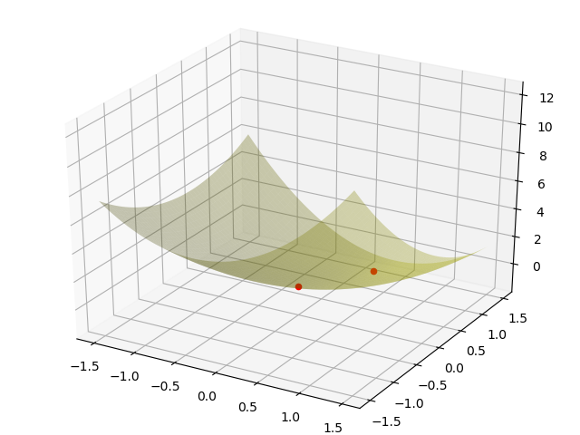

---
tags:
- 数学/微积分
---

# 10 多元函数的极值（下）：牛顿法与向量微分

这一讲里，我们进入到多元函数求极值的最后一部分，即牛顿法的内容中。

在前面的两讲内容里，我们所介绍的 [梯度下降](https://so.csdn.net/so/search?q=%E6%A2%AF%E5%BA%A6%E4%B8%8B%E9%99%8D&spm=1001.2101.3001.7020) 法和最速下降法都只用到了目标函数的一阶导数（也就是梯度）来确定每一次迭代的搜索方向，因此也可以被称作为是一阶方法。

而另一种算法的优化思路是这样的，在迭代方法中引入高阶导数，其迭代效率可能会优于最速下降法，而牛顿法就是其中的典型代表，他的核心是同时使用一阶导（梯度）和二阶导（黑塞矩阵）来确定搜索方向，效率上要优于一阶的方法。

## 1.向量微分基础

### 1.1.函数的分类

在介绍牛顿法的具体算法之前，我们先来介绍一下向量微分的基础知识，这些内容在算法的实现中将会用到。

其实从多元函数的内容开始，我们对于函数的认识就应该深了一层，这里我们趁此机会把函数的种类全部梳理一遍。

我们看看三种函数，标量函数、向量函数和矩阵函数：

对于标量函数 $f$，他的自变量可以是标量**x**，向量 $x$，和矩阵 $X$，然而函数的结果只能是标量，也就是说无论是标量、向量还是矩阵，经过标量函数的映射，得到的最终都是标量。

类似的，对于向量函数 $f$ 和矩阵函数 $F$，他的自变量同样可以是标量**x**，向量 $x$ 或者矩阵 $X$，但是通过向量函数 $f$ 的映射，最终得到的结果都是向量，而通过矩阵函数 $F$ 的映射，最终得到的结果都是矩阵。

而我们这几讲里所重点讨论的一元函数 $f(x)$ 和多元函数 $f(x_1,x_2,...,x_n)$ 属于什么类型？由于他们最终得到的结果值都是一个标量，因此我们所讨论的范畴依然还只是标量函数，而一元函数 $f(x)$ 中的自变量也是标量，而多元函数 $f(x_1,x_2,...,x_n)$ 的自变量是向量。

进一步的，梯度表达式 $\nabla f$ 最终得到的是一个梯度向量，因此他是一个向量函数，而求取黑塞矩阵的函数 $F(p)$ 则是一个矩阵函数。

### 1.2.包含矩阵与向量的函数求导

如果在函数中包含了向量和矩阵，对其进行求导对于我们还比较陌生，这里我们快速的拿出一些对基本式子进行求导的结论，方便我们后面的使用。

第一个常见的例子是 $f(x)=x^TAx$，其中 $x$ 是列向量变量，而 $A$ 是一个常数矩阵，函数的最终结果是一个标量，因此这是一个自变量为向量的标量函数。对这个多元函数 $f(x)$ 进行一阶求导，得到的应该是一个梯度向量，他的表达式是 $\nabla f=\frac{df}{dx}=(A+A^T)x$

第二个常见的例子是 $f(x)=a^Tx$ 或者 $f(x)=x^Ta$，其中 $x$ 是列向量变量，$a$ 是常数列向量，函数的最终结果也是一个标量，因此这同样是一个自变量为向量的标量函数。他的一阶导也是梯度向量，表达式为 $\nabla f=\frac{df}{dx}=a$

## 2.牛顿法的原理

当目标函数，也就是多元函数 $f(p)$ 二阶连续可微时，可以考虑使用牛顿法。我们以二元函数 $f(x_1,x_2)$ 为例，当目前的迭代取值点为 $p_k$ 时，迭代到下一步的过程如下：

首先我们按照前面学习过的内容，将函数 $f$ 在点 $p_{k} = \begin{bmatrix} x_{k} & y_{k} \end{bmatrix}^{T}$ 处进行二阶泰勒近似，略去高阶无穷小量后的展开式如下：

$$
f(x, y) \approx f\left(x_{k}, y_{k}\right)+\left[\begin{array}{ll}
x-x_{k} & y-y_{k}
\end{array}\right]\left[\begin{array}{l}
\frac{\partial f}{\partial x}\left(x_{k}, y_{k}\right) \\
\frac{\partial f}{\partial y}\left(x_{k}, y_{k}\right)
\end{array}\right]+\frac{1}{2}\left[\begin{array}{ll}
x-x_{k} & y-y_{k}
\end{array}\right]\left[\begin{array}{cc}
\frac{\partial^{z} f}{\partial x^{2}}\left(x_{k}, y_{k}\right) & \frac{\partial f^{2}}{\partial x \partial y}\left(x_{k}, y_{k}\right) \\
\frac{\partial f^{2}}{\partial y \partial x}\left(x_{k}, y_{k}\right) & \frac{\partial^{2} f}{\partial y^{2}}\left(x_{k}, y_{k}\right)
\end{array}\right]\left[\begin{array}{l}
x-x_{k} \\
y-y_{k}
\end{array}\right]
$$

为了简化二阶泰勒展开式，我们按照下面的形式将迭代点、梯度和黑塞矩阵分别替换成相对应的符号：

迭代点：$p$ 和 $p_k$；

梯度：$\nabla f\left(p_{k}\right)=\begin{bmatrix}\frac{\partial f}{\partial x}\left(x_{k}, y_{k}\right) \\\frac{\partial f}{\partial y}\left(x_{k}, y_{k}\right)\end{bmatrix}$；

黑塞矩阵：$F\left(p_{k}\right)=\begin{bmatrix}\frac{\partial^{2} f}{\partial x^{2}}\left(x_{k}, y_{k}\right) & \frac{\partial f^{2}}{\partial x \partial y}\left(x_{k}, y_{k}\right) \\\frac{\partial f^{2}}{\partial y \partial x}\left(x_{k}, y_{k}\right) & \frac{\partial^{2} f}{\partial y^{2}}\left(x_{k}, y_{k}\right)\end{bmatrix}$；

由此，二阶展开式最终表示成：$f(p)\approx f(p_k)+(p-p_k)^T\nabla f(p_k)+\frac{1}{2}(p-p_k)^TF(p_k)(p-p_k)$

牛顿法的思想其实很直接，他不像梯度下降法那样一步一步的下山，而是在最速下降法的思维基础上更激进了一步，最速下降法是每次在搜索方向上一步跨到极小值点，而牛顿法则利用二阶泰勒展开式作为目标函数的近似，想的是直接一步跨到当前这个二阶泰勒展开式的极小值点，以近似作为整个目标函数的极小值点。

试想，如果目标函数本身就只能展开为二阶泰勒展开式，那么实际上一步就完成了极小值的寻找。否则的话，这一轮找到的极小值点就作为下一轮迭代的起始点，经过多轮的迭代，最终达到阈值后停止迭代。

## 3.牛顿法的公式推导

那么具体如何找到迭代公式呢？我们接下来仔细说一下：

在点 $p_k$ 处对函数进行二阶泰勒展开后，我们通过寻找使得二阶泰勒展开式 $Q(p)=f(p_k)+(p-p_k)^T\nabla f(p_k)+\frac{1}{2}(p-p_k)^TF(p_k)(p-p_k)$ 取得极小值的 $p$ 值，来作为下一轮的迭代点 $p_{k+1}$。那么按照极小值点存在所需要满足的必要条件，我们有：$\frac{dQ(p)}{dp}=0$

此时，我们发现表达式 $Q(p)$ 当中，有向量、有矩阵，导数该怎么求？这就要用到我们前面刚刚铺垫过的知识点：

$(p-p_k)^T\nabla f(p_k)$ 中，$\nabla f(p_k)$ 是一个常数向量，这就形如 $f(x)=x^Ta$ 的形式，因此 $\frac{d}{dp}(p-p_k)^T\nabla f(p_k)=\nabla f(p_k)$

$\frac{1}{2}(p-p_k)^TF(p_k)(p-p_k)$ 中，黑塞矩阵 $F(p_k)$ 是常数矩阵，这就形如 $x^TAx$ 的形式，因此 $\frac{d}{dp}(\frac{1}{2}(p-p_k)^TF(p_k)(p-p_k))=\frac{1}{2}(F(p_k)+F(p_k)^T)(p-p_k)$，由于黑塞矩阵是一个对称矩阵，因此最终有：$\frac{d}{dp}(\frac{1}{2}(p-p_k)^TF(p_k)(p-p_k))=F(p_k)(p-p_k)$

合并起来就有：

$\frac{dQ(p)}{dp}=\nabla f(p_k)+F(p_k)(p-p_k)=0$，解方程得到 $p_{k+1}$ 的迭代公式：

$p_{k+1}=p_k-F(p_k)^{-1}\nabla f(p_k)$

## 4.算法的代码实现

在实现的代码中，请大家也再次复习一下 $SymPy$ 库的用法。

**代码片段：**

```python
from sympy import *
from matplotlib import pyplot as plt
import numpy as np
from mpl_toolkits.mplot3d import Axes3D

fig = plt.figure()
ax = Axes3D(fig)

def func(x1,x2):
    return 2*x1**2+x2**2-x1*x2-2*x2

x1 = np.arange(-1.5, 1.5, 0.01)
x2 = np.arange(-1.5, 1.5, 0.01)
x1, x2 = np.meshgrid(x1, x2)
ax.plot_surface(x1, x2, func(x1, x2), color='y', alpha=0.3)

x1 = symbols("x1")
x2 = symbols("x2")
f = 2*x1**2+x2**2-x1*x2-2*x2
p0 = np.array([0, 0], dtype=float)
p_cur = p0
max_iter = 10000

for i in range(max_iter):
    grad_cur = np.array([diff(f, x1).subs(x1, p_cur[0]).subs(x2, p_cur[1]),
                         diff(f, x2).subs(x1, p_cur[0]).subs(x2, p_cur[1])], dtype=float)
    
    ax.scatter(float(p_cur[0]), float(p_cur[1]), float(f.subs(x1,p_cur[0]).subs(x2, p_cur[1])), color='r')
    print(p_cur)
    if np.linalg.norm(grad_cur, ord=2) < 0.0001:
        break
    hessian_M = np.array([[diff(f, x1, 2).subs(x1, p_cur[0]).subs(x2, p_cur[1]),
                           diff(f, x1, 1, x2, 1).subs(x1, p_cur[0]).subs(x2, p_cur[1])],
                          [diff(f, x2, 1, x1, 1).subs(x1, p_cur[0]).subs(x2, p_cur[1]),
                           diff(f, x2, 2).subs(x1, p_cur[0]).subs(x2, p_cur[1])]],
                         dtype=float)  # 黑塞矩阵
    
    hessian_inv = np.linalg.inv(hessian_M)  # 黑塞矩阵求逆
    p_cur = p_cur - np.dot(hessian_inv, grad_cur)
   
plt.show()
```

**运行结果：**

```
[0. 0.]
[0.28571429 1.14285714]
```



 从结果中我们发现，牛顿法求极值时迭代速度非常快，特别是在本例中，二次函数的二阶泰勒展开就等于原函数而非近似的情况下，牛顿法可以一步收敛到极小值。

此时，我们回顾一下本身迭代效率就很高的最速下降法，他所用的迭代次数如下：

```
[0. 0.]
[0. 1.]
[0.25 1.  ]
[0.25  1.125]
[0.28125 1.125  ]
[0.28125  1.140625]
[0.28515625 1.140625  ]
[0.28515625 1.14257812]
[0.28564453 1.14257812]
```

对于同一个目标函数和初始迭代点，最速下降法经过了 $8$ 次迭代找到了极小值点。

## 5.关于最优算法的延伸讨论

从上面这个例子看牛顿法似乎非常强大，但是实际上他有诸多限制，从迭代公式 $p_{k+1}=p_k-F(p_k)^{-1}\nabla f(p_k)$ 可知，他必须计算黑塞矩阵的逆矩阵，一方面计算量巨大，另一方面可能矩阵是奇异矩阵，因此就有算法去设计一个黑塞矩阵逆矩阵的近似矩阵来代替他，这就是拟牛顿法的基本思想。

而另一种改进的算法叫共轭梯度法，他也不需要计算黑塞矩阵，同样是最优化工程实践中的一种选择。

由基本的算法框架衍生出的改良算法还有很多，限于篇幅我们就不再一一展开了，微积分的相关内容就到这里，也希望我们能够给大家打下一个继续探索学习的基础。