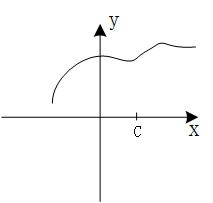

# 函数连续性

**可微必连续，连续不一定可微**

## 1.1.函数在单点处的连续性

函数 $f(x)$ 在具体的取值点 $c$ 点是否连续，我们针对性的来看下面三幅图中的具体情形：

在这幅图中，我们发现在点 $c$ 处，函数的左极限和右极限不相等，即 $lim_{x\rightarrow c^{-}}f(x) \neq lim_{x\rightarrow c^{+}}f(x)$，因此 $lim_{x\rightarrow c}f(x)$ 不存在，$c$ 点处函数的极限不存在，因此函数 $f(x)$ 在点 $c$ 处不连续。

这幅图中情况似乎要稍微好点儿，我们发现 $lim_{x\rightarrow c^{-}}f(x)=lim_{x\rightarrow c^{+}}f(x)$，函数 $f(x)$ 在 $c$ 点处的极限是存在的，但是从图中可以看出，函数的极限值和 $c$ 点处函数的实际取值不相等，即：$lim_{x\rightarrow c}f(x) \neq f(c)$，因此函数 $f(x)$ 在点 $c$ 处仍然不连续。

这幅图中以上出现的两个问题都不存在了，我们看到：一方面函数 $f(x)$ 的极限是存在的，而另一方面 $lim_{x\rightarrow c}f(x)=f(c)$，点 $c$ 处的极限和函数的取值又是相等的，因此在这幅图中，函数 $f(x)$ 在点 $c$ 处是连续的。

那么，依照严格的定义，对于一个定义在包含点 $c$ 的区间上的函数 $f(x)$，如果 $lim_{x\rightarrow c}f(x)=f(c)$ 成立，则称函数 $f$ 在点 $c$ 处连续。

## 1.2.函数在区间上的连续性

进一步扩展到区间上，如果函数 $f(x)$ 在开区间上的任意一点连续，那么这个函数 $f(x)$ 就在整个这个开区间上连续。

如果谈到闭区间 $[a,b]$ 上的连续性问题，那么就需要着重单独讨论区间的左右两个端点：我们首先从右侧逼近左侧端点 $a$，如果 $lim_{x\rightarrow a^{+}}f(x) =f(a)$ 成立，则称函数 $f(x)$ 在端点 $a$ 上右连续，我们再从左侧逼近右侧端点 $b$，即 $lim_{x\rightarrow b^{-}}f(x) =f(b)$ 成立，则称函数 $f(x)$ 在端点 $b$ 上左连续。

那么，如果函数在开区间 $(a,b)$ 上连续，且在左侧端点 $a$ 上右连续，在右侧端点 $b$ 上左连续，此时此刻，我们就能够说函数 $f(x)$ 在闭区间 $[a,b]$ 上是连续的。
