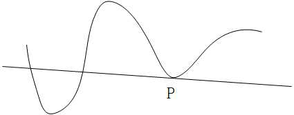
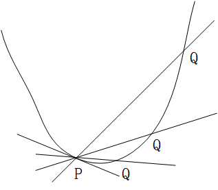

# 切线

切线是一个大家都非常熟悉的概念，什么是切线？有一种说法是一条曲线的切线只与这条曲线有一个交点。这个概念有很大的局限性，他只对圆环类的曲线有效，而对例如下面的这条曲线，描述显然就不适用了：

实际上，在上面这幅图中，直线显然是曲线在 $P$ 点处的切线，但是更明显的是，这条直线与曲线的交点数不止一个。那么我们应该怎样更准确的描述切线呢？这里就要用到极限的概念：

我们还是看曲线上 $P$ 点的切线：我们假定 $Q$ 点为曲线上一个接近 $P$ 点的可动点，经过 $P$ 点和 $Q$ 点的直线叫做割线，在 $P$ 点的切线就是当 $Q$ 点沿曲线向 $P$ 点移动时，割线的极限位置，如下图所示：

因此，结合上面这幅图，我们来总结一下切线的严格定义：

已知的任意一条曲线 $y=f(x)$ 在点 $P(c,f(c))$ 处的切线就是穿过该点 $P$ 的一条直线，且这条直线的斜率为 $lim_{h\rightarrow 0} \frac{f(c+h)-f(c)}{h}$。当然，这里有个前提条件，那就是表示斜率的这个极限存在且不为 $\infty$ 或 $-\infty$。