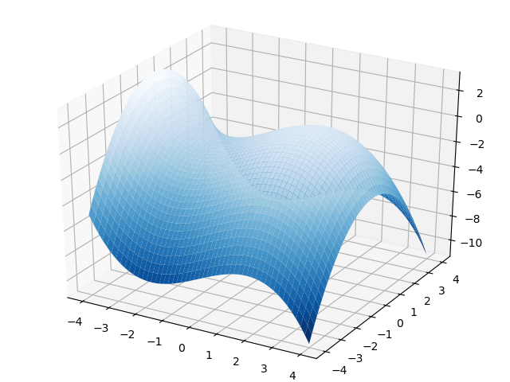
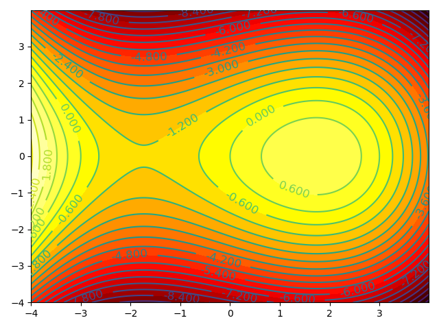

---
tags:
- 数学/微积分
---

# 多元函数

## 1.函数：从一元到多元

在前面的两讲内容中，我们所介绍的函数都只有一个自变量，而从这一讲开始，我们关心和感兴趣的是含多个实数自变量的实值函数。例如，对于二元函数而言，就是在某平面集合 $D$ 内任给有序变量 $(x,y)$，能够确定唯一的实数 $f(x,y)$，例如：

$f(x,y)=\sqrt{x^2+y^2}$

$f(x,y)=y^2-x^2$

一般我们也将其写作：$z=\sqrt{x^2+y^2}$，以及 $z=y^2-x^2$。因此我们称 $x$，$y$ 为函数的自变量，$z$ 为函数的因变量。

## 2.二元函数的可视化

### 2.1.函数图像的绘制

下面，我们来实践一下如何利用 $python$ 来绘制三维曲面：$z=x-\frac{1}{9}x^3-\frac{1}{2}y^2$。

**代码片段：**

```python
from matplotlib import pyplot as plt
import numpy as np
from mpl_toolkits.mplot3d import Axes3D

fig = plt.figure()
ax = Axes3D(fig)

x = np.arange(-4, 4, 0.01)
y = np.arange(-4, 4, 0.01)
x, y = np.meshgrid(x, y)
z = x-(1./9)*x**3-(1./2)*y**2

ax.plot_surface(x, y, z, cmap=plt.cm.Blues_r)
plt.show()
```

**运行结果：**



### 2.2.等高线图的绘制

在三维图形的绘图中，还有一种呈现三维图形性质的表示方法，那就是等高线图。等高线图大家不会陌生，他的定义是，利用每一个水平面 $z=c$ 与函数图形表面相交于一条曲线，然后将所有的这些曲线投影到 $xoy$ 平面上，就得到不同高度（也就是 $z=f(x,y)$）取值的等高线集合，即构成了这个三维图形的等高线图。

我们下面接着来绘制上面这幅三维图像的等高线图：

**代码片段：**

```python
import numpy as np
import matplotlib.pyplot as plt

def f(x, y):
    return x-(1./9)*x**3-(1./2)*y**2

x = np.arange(-4, 4, 0.01)
y = np.arange(-4, 4, 0.01)

#把x,y数据生成mesh网格状的数据
X, Y = np.meshgrid(x, y)

#填充等高线间的颜色
plt.contourf(X, Y, f(X, Y), 24, cmap=plt.cm.hot)
#添加等高线
C = plt.contour(X, Y, f(X, Y), 24)
#增加各等高线的高度值
plt.clabel(C, inline=True, fontsize=12)

plt.show()
```

**运行结果：**



我们这里简单的解释一下这段代码：

在函数 $plt.contour$ 当中，$24$ 表示的是我们使用的等高线的数量，数字越大，等高线越多

通过函数 $plt.contourf$，在等高线之间填充不同的颜色以示区分，其中，$cmap=plt.cm.hot$ 表示我们的等高线集合使用热力图的颜色集，颜色越浅表示函数值越大，就和火焰温度和火焰颜色的关系一样。
