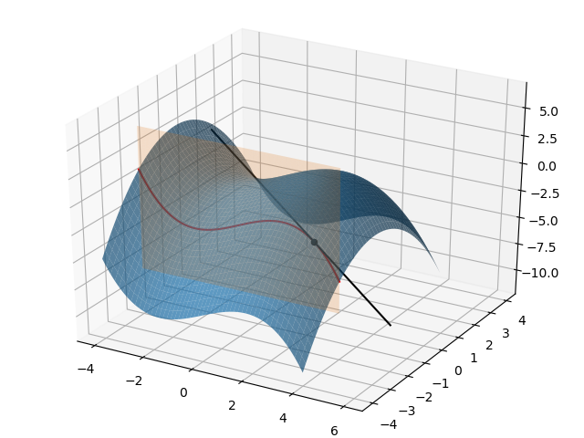

# 多元函数的偏导数

## 1.概念的引入

我们在前面已经介绍过一元函数的导数，那么从一元变量过渡到多元变量之后，导数又该如何定义？

假如函数 $f(x,y)$ 是关于 $x$ 和 $y$ 两个变量的函数，我们在讨论导数概念的时候需要固定一个变量再去讨论另外一个变量。例如，我们需要先将 $y$ 固定为一个常数 $y=y_0$，此时 $f(x,y_0)$ 实际上就变成了一个只有单个变量 $x$ 的函数，那么他在 $x=x_0$ 处的导数称为是 $f$ 关于 $x$ 在 $(x_0,y_0)$ 处的偏导数，被记作是：$f_x(x_0,y_0)$。

那么按照我们之前利用极限来定义导数的式子进行迁移拓展，我们很容易得到偏导数的定义式，即：

$$f_x(x_0,y_0)=lim_{\Delta x\rightarrow 0}\frac{f(x_0+\Delta x,y_0)-f(x_0,y_0)}{\Delta x}$$

那么同样的，函数 $f(x,y)$ 关于 $y$ 在 $(x_0,y_0)$ 处的偏导数，记作是：

$$f_y(x_0,y_0)=lim_{\Delta y\rightarrow 0}\frac{f(x_0,y_0+\Delta y)-f(x_0,y_0)}{\Delta y}$$

和导数中的线性算子 $\frac{d}{dx}$ 类似，偏导数中也有自己的特色符号 $\partial$，那么 $\frac{\partial}{\partial x}$ 和 $\frac{\partial}{\partial y}$ 则分别表示对 $x$ 和 $y$ 求偏导的线性算子。

那么，针对多元函数 $z=f(x,y)$，下面的这一系列描述都是等效的：

$$f_x(x,y)=\frac{\partial z}{\partial x}=\frac{\partial f(x,y)}{\partial x}$$

针对 $(x_0,y_0)$ 的具体取值 $f_x(x_0,y_0)$，则可以记作是 $f_x(x_0,y_0)=\frac{\partial z}{\partial x}|_{(x_0,y_0)}$

关于 $y$ 的偏导数也是同理，这里就不再赘述了。

## 2.偏导数的几何意义

下面我们来探讨一下偏导数的几何意义。我们还是来看 $z=x-\frac{1}{9}x^3-\frac{1}{2}y^2$ 这个二元函数，来研究一下 $\frac{\partial z}{\partial x}$。请大家记住，在求关于变量 $x$ 的偏导数时，$y$ 就是一个与变量 $x$ 无关的常数。

结合下面的代码和示意图来看 $f_x(x_0,y_0)$ 的几何含义。在代码例子中，我们实际举例 $x_0=3,y_0=-2$，首先，我们让 $y=-2$ 这个橙色的垂直平面与整个蓝色曲面相交，形成曲面表面那条红色的相交曲线，也就是说这条红色曲线既在表示原函数的蓝色曲面上，也在平行于 $xoz$ 平面的橙色平面 $y=-2$ 上。

我们过点 $(x_0,y_0,f(x_0,y_0))$，在图中就是那个位于 $(3,-2,-2)$ 的黑色点，做红色曲线的切线。那么最终原函数 $z$ 关于 $x$ 的偏导数的取值：$f_x(3,-2)$ 就是这条切线的斜率，需要注意的是，这条切线同样也在垂直平面 $y=-2$ 中，与 $xoz$ 平面平行。

**代码片段：**

```python
from matplotlib import pyplot as plt
import numpy as np
from mpl_toolkits.mplot3d import Axes3D

fig = plt.figure()
ax = Axes3D(fig)

#多元函数z=f(x,y)
def f(x, y):
    return x-(1./9)*x**3-(1./2)*y**2

#绘制原函数的图像
x = np.arange(-4, 4, 0.01)
y = np.arange(-4, 4, 0.01)
x, y = np.meshgrid(x, y)
ax.plot_surface(x, y, f(x, y), alpha=0.7)

#绘制平面y=-2与
x = np.arange(-4, 4, 0.01)
z = np.arange(-8, 5, 0.01)
x, z = np.meshgrid(x, z)
y = x*z*0-2
ax.plot_surface(x, y, z, alpha=0.2)

#当确定y0=-2时，函数变成了一条平行于xoz平面的曲线
x = np.arange(-4, 4, 0.01)
y = np.array([-2]*len(x))
ax.plot(x, y, f(x, y), color='r')

#过(3,-2,f(3,-2))，做上述曲线的切线
#y=-2时，关于x的偏导数的方程为：z=-2x+4
ax.scatter(3, -2, f(3,-2), color='k')

x = np.arange(-1, 6, 0.01)
y = np.array([-2]*len(x))
z = -2*x+4
ax.plot(x, y, z, color='k')

plt.show()
```

**运行结果：**



## 3.高阶偏导数

我们知道，对于多元函数 $f(x,y)$，无论是关于 $x$ 的偏导数 $f_x$：$\frac{\partial f}{\partial x}$，还是关于 $y$ 的偏导数 $f_y$：$\frac{\partial f}{\partial y}$，实际上仍然也都是函数，是关于变量 $x$ 和 $y$ 的函数。

因此这些偏导函数再对变量 $x$ 和 $y$ 进一步求偏导，就能够得到阶数更高的偏导数，也就是函数 $f$ 的二阶偏导数，显然二元函数 $f(x,y)$ 的二阶偏导数有四个：

$$\begin{aligned}

f_{xx}&=\frac{\partial}{\partial x}(\frac{\partial f}{\partial x})=\frac{\partial^2 f}{\partial x^2}\\

f_{yy}&=\frac{\partial}{\partial y}(\frac{\partial f}{\partial y})=\frac{\partial^2 f}{\partial y^2}\\

f_{xy}&=\frac{\partial}{\partial y}(\frac{\partial f}{\partial x})=\frac{\partial^2 f}{\partial y \partial x}\\

f_{yx}&=\frac{\partial}{\partial x}(\frac{\partial f}{\partial y})=\frac{\partial^2 f}{\partial x \partial y}\\

\end{aligned}$$

因此，也请大家不要畏惧二阶偏导数，觉得他是一个新的概念，其实我们把他拆解开，先求函数 $f(x,y)$ 的偏导数，在此基础上再求一次偏导数就好了，我们看一个实际的例子，大家就能弄明白：

我们对函数 $f(x,y)=xe^y-sin(\frac{x}{y})+x^3y^2$ 求所有的二阶偏导数：

首先，我们先求函数关于变量 $x$ 和变量 $y$ 的偏导数：

$$f_x(x,y)=e^y-\frac{1}{y}cos(\frac{x}{y})+3x^2y^2$$
$$f_y(x,y)=xe^y+\frac{x}{y^2}cos(\frac{x}{y})+2x^3y$$

然后，我们在这两个一阶偏导数的基础上，求得所有四个二阶偏导数：

$$f_{xx}(x,y)=\frac{1}{y^2}sin(\frac{x}{y})+6xy^2$$
$$f_{yy}(x,y)=xe^y+\frac{x^2}{y^4}sin(\frac{x}{y})-\frac{2x}{y^3}cos(\frac{x}{y})+2x^3$$
$$f_{xy}(x,y)=e^y-\frac{x}{y^3}sin(\frac{x}{y})+\frac{1}{y^2}cos(\frac{x}{y})+6x^2y$$
$$f_{yx}(x,y)=e^y-\frac{x}{y^3}sin(\frac{x}{y})+\frac{1}{y^2}cos(\frac{x}{y})+6x^2y$$
