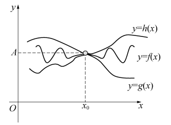

# 夹逼定理

## 数列的夹逼定理

如果数列 $\left\{x_{n}\right\}$ 、$\left\{y_{n}\right\}$ 及 $\left\{z_{n}\right\}$ 满足：

$$\exists N_{0} \in \mathbf{N}\text{ 当 }n>N_{0} \text{ 时 }y_{n} \leqslant x_{n} \leqslant z_{n}$$
$$\lim _{n \rightarrow \infty} y_{n}=a, \quad \lim _{n \rightarrow \infty} z_{n}=a$$

那么数列 $\left\{x_{n}\right\}$ 的极限存在, 且 $\lim _{n \rightarrow \infty} x_{n}=a$

**证明**：

$\forall \varepsilon>0$ ,由 $\lim _{n \rightarrow \infty} y_{n}=a$ 可知,  $\exists N_{1}>0$ , 当 $n>N_{1}$ 时, 恒有 $\left|y_{n}-a\right|<\varepsilon$ , 即：
$$a-\varepsilon<y_{n}<a+\varepsilon$$
又由 $\lim _{n \rightarrow \infty} z_{n}=a$, $\exists N_{2}>0$ , 当 $n>N_{2}$ 时, 恒有 $\left|z_{n}-a\right|<\varepsilon$ , 即：
$$a-\varepsilon<z_{n}<a+\varepsilon$$
因此,  $\forall \varepsilon>0$ , 取 $N=\max \left\{N_{0}, N_{1}, N_{2}\right\}$ , 当 $n>N$ 时, 有：

$$a-\varepsilon<y_{n} \leqslant x_{n} \leqslant z_{n}<a+\varepsilon$$
即：

$$\left|x_{n}-a\right|<\varepsilon$$

故：

$$\lim _{n \rightarrow \infty} x_{n}=a$$

## 函数的夹逼定理

如果函数 $f(x)$, $g(x)$, $h(x)$  满足:
$$\text{ 当 } |x|>X \text{ 时 }  g(x) \leqslant f(x) \leqslant h(x)$$
$$\lim _{\substack{x \rightarrow x_{0} \\x \rightarrow \infty}} g(x)=A, \quad \lim _{\substack{x \rightarrow x_{0} \\x \rightarrow \infty}} h(x)=A$$

则 $\lim _{\substack{x \rightarrow x_{0} \\x \rightarrow \infty}} f(x)$  存在，且  $\lim _{\substack{x \rightarrow x_{0} \\x \rightarrow \infty}} f(x)=A$ 

