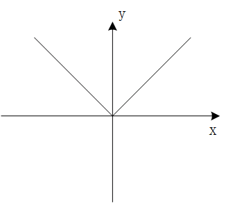
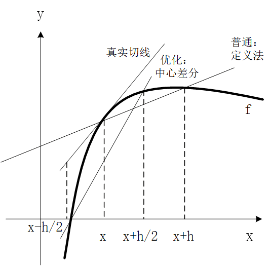

---
tags:
- 数学/微积分
---

# 导数

## 1.从切线到导数

切线的概念很简单，我们也非常熟悉，这里我们不做过多的停留。下面我们进入到导数概念的介绍，导数的定义和斜率其实看上去很像：

函数 $f$ 的导数我们将其记作 $f'$，其实他是另外一个函数，导数对定义域内任意自变量 $x$ 的函数值为：

$$f'(x)=lim_{h\rightarrow 0}\frac{f(x+h)-f(x)}{h}$$

如果这个极限存在，那么我们就说函数 $f$ 在 $x$ 点处可微，而这个求导的过程就叫作微分。

当然，导数的定义式还有另一种等价的形式：

$$f'(c)=lim_{x\rightarrow c}\frac{f(x)-f(c)}{x-c}$$

## 2.可微一定连续

这短短的定义式里，其实有很多坑等着我们，最主要的就是分析可微和连续之间的关系：

首先，可微性一定能够推出连续性，说具体点就是：如果函数的导数 $f'(c)$ 存在，那么函数 $f$ 在点 $c$ 处就是连续的。这个概念我们简单推导一下，大家就能够明白了：

首先对函数 $f(x)$ 做一个简单的基本变形：

$$f(x)=f(c)+f(x)-f(c)=f(c)+\frac{f(x)-f(c)}{x-c}\cdot (x-c)$$

此时，$x\neq c$，对于上面的变形当然是成立的。

那么，当 $x\rightarrow c$ 时，即 $x$ 不断逼近于 $c$ 的时候，等式的左右两侧也是相等的，对应的就是两侧同时取极限：

$$lim_{x\rightarrow c}f(x)=lim_{x\rightarrow c}[f(c)+\frac{f(x)-f(c)}{x-c}\cdot (x-c)]=lim_{x\rightarrow c}f(c)+lim_{x\rightarrow c}\frac{f(x)-f(c)}{x-c}\cdot lim_{x\rightarrow c}(x-c)$$

仔细观察一下这个等式中的三部分，其中：$f(c)$ 是一个与变量 $x$ 取值无关的常数，因此 $lim_{x\rightarrow c}f(c)=f(c)$。

而 $lim_{x\rightarrow c}\frac{f(x)-f(c)}{x-c}$ 就是导数 $f'(c)$ 的定义式，而我们前面说了前提条件是导数 $f'(c)$ 存在，因此 $lim_{x\rightarrow c}\frac{f(x)-f(c)}{x-c} = f'(c)$

而最后一个很明显，$lim_{x\rightarrow c}(x-c)=0$

因此，最终就有：

$$lim_{x\rightarrow c}f(x)=lim_{x\rightarrow c}f(c)+lim_{x\rightarrow c}\frac{f(x)-f(c)}{x-c}\cdot lim_{x\rightarrow c}(x-c)=f(c)+f'(c)\cdot 0=f(c)$$

我们只看一头一尾，即：$lim_{x\rightarrow c}f(x)=f(c)$，函数在 $c$ 点处这不就连续了吗。

## 3.连续不一定可微

那反过来呢？很多地方最爱区分的概念就是连续一定可微吗？也就是说函数 $f(x)$ 在 $c$ 点处连续，那么导数 $f'(c)$ 一定存在吗？答案是不一定，我们看几个简单的例子。

首先，我们用这个函数来证明：$y=|x|$。



在 $x=0$ 点处函数显然是连续的，那么函数在这个点的导数存在吗？我们直接扣定义，写出导数的定义式：

$$f'(0)=lim_{h\rightarrow 0}\frac{|0+h|-|0|}{h}=lim_{h\rightarrow 0} \frac{|h|}{h}$$

这里，当 $h$ 从右侧逼近 $0$ 的时候：即 $lim_{h\rightarrow 0^{+} } \frac{|h|}{h} = \frac{h}{h}=1$

而当 $h$ 从左侧逼近 $0$ 的时候，即 $lim_{h\rightarrow 0^{-} } \frac{|h|}{h} = \frac{-h}{h} = -1$

此时我们发现左极限和右极限不相等，因此极限 $lim_{h\rightarrow 0} \frac{f(0+h)-f(0)}{h}$ 不存在，换句话说，函数在 $0$ 处的导数 $f'(0)$ 不存在。

从中我们受到启发并进行拓展，一个连续函数在它的图形中有任何尖锐拐角的地方都是不可导的。

如果函数不是这种尖峰形状的，而是光滑的，那又是什么情形呢？

我们再看另一个例子：$y=x^{\frac{1}{3}}$，显然他在点 $x=0$ 的地方是光滑且连续的，但是他的导数为 $f'(x)=\frac{1}{3}x^{-\frac{2}{3}}=\frac{1}{3x^{\frac{2}{3}}}$，此时我们发现：$lim_{x\rightarrow 0}=\frac{1}{3x^{\frac{2}{3}}}=\infty$，因此，函数在点 $0$ 处不可导。

连续与可微的概念希望大家能够通过上面的几个小例子加深概念。

## 4.一些导数的基本记号

最后，我们来看看导数的一些记号，方便我们在后续的讨论中使用：

首先如果自变量 $x$ 的值从 $x_1$ 改变到 $x_2$，那么 $x_2-x_1$ 就叫作 $x$ 的增量，我们把他记作是 $\Delta x$。

相应的，函数的取值 $y$ 也从 $f(x_1)$ 变到了 $f(x_2)$，那么相应 $y$ 的增量为：$\Delta y=y_2-y_1=f(x_2)-f(x_1)$

因此，假设自变量从 $x$ 变化到 $x+\Delta x$，相应的增量比为：$\frac{\Delta y}{\Delta x}=\frac{f(x+\Delta x)-f(x)}{\Delta x}$。

当 $\Delta x\rightarrow 0$ 时，我们也可以用下面的符号来记作其导数：

$$\frac{dy}{dx}=lim_{\Delta x\rightarrow 0}\frac{\Delta y}{\Delta x}=lim_{\Delta x\rightarrow 0}\frac{f(x+\Delta x)-f(x)}{\Delta x}=f'(x)$$

而像一些函数的基本求导法则，高阶导数的求导法则等基础知识，我们就不在课程中过多赘述了，大家可以参照手头的微积分教材进行复习巩固。

## 5.基于 python 的数值微分法

那么在实际的程序中，我们如何来求取函数的导数值呢？很显然，紧扣定义就好了。

接下来我们参照定义式 $\frac{dy}{dx} =lim_{h\rightarrow 0}\frac{f(x+h)-f(x)}{h}$，让 $h$ 取一个非常小的值，利用 python 来实现函数导数的求取。

但是实际上，在用数值法求近似的导数值的时候，还可以使用中心差分法，这样求得的导数会更接近于真实值，中心差分法求导的定义式为：

$$\frac{dy}{dx}=lim_{h\rightarrow 0}\frac{f(x+\frac{h}{2})-f(x-\frac{h}{2})}{h}$$

中心差分法本质上还是建立在割线的极限是切线的思想，为什么说实际操作时，中心差分法更接近于真实的导数值呢？我们看一个示意图：



从图中可以看出，用中心差分法所做割线的斜率要比普通定义法更接近于真实切线的斜率。

最后，我们用代码来实际进行导数的数值法求解，我们举一个简单的函数 $f(x)=x^2$，他的导数很简单 $f'(x)=2x$，我们比较在 $x=4$ 时，两种方法求出的导数数值近似解，以及和真实值 $8$ 之间的差距：

**代码片段：**

```python
def function(x):
    return x*x

def numerical_diff(f, x):
    h = 1e-4
    return (f(x+h) - f(x))/h

def numerical_diff_1(f, x):
    h = 1e-4
    return (f(x+h/2) - f(x-h/2))/h

print('theoretical value={}'.format(2*4))
print('value={},error={}'.format(numerical_diff(function, 4),abs(numerical_diff(function, 4)-8)))
print('value={},error={}'.format(numerical_diff_1(function, 4),abs(numerical_diff_1(function, 4)-8)))
```

**运行结果：**

```
theoretical value=8
value=8.00009999998963,error=9.999998962939571e-05
value=7.999999999963592,error=3.6408209780347534e-11
```

从运行结果中我们可以看出，函数 $f(x)=x^2$ 在 $x=4$ 处的导数理论值为 $8$，数值求导过程中，定义法求出的导数近似值为：$8.00009999998963$，中心差分法求得的导数近似值为：$7.999999999963592$，很明显，中心差分法求得的导数近似值更接近于真实的理论值。