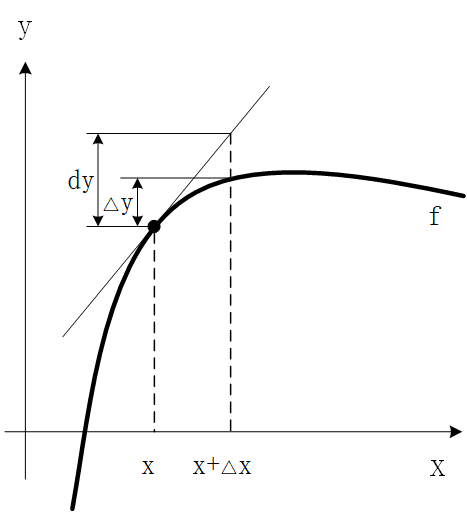

# 微分

在理论研究和实际应用中， 常常会遇到这样的问题: 当自变量 $x$ 有微小变化 $\Delta x$ 时， 求 函数 $y=f(x)$ 的微小改变量 $\Delta y=f(x+\Delta x)-f(x)$。

这个问题初看起来似乎只要做减法运算就可以了， 然而， 对于较复杂的函数 $f(x)$ ， 差 值 $f(x+\Delta x)-f(x)$ 却是一个更复杂的表达式， 不易求出其值。 一个想法是: 我们设法将 $\Delta y$ 表 示成 $\Delta x$ 的线性函数， 即线性化， 从而把复杂问题化为简单问题。 微分就是实现这种线性化的一种数学模型。

**定义**

设函数 $f(x)$ 在某区间 $I$ 内有定义, $x_{0}, x_{0}+\Delta x \in I$ , 如果函数的增量 $\Delta y=   f\left(x_{0}+\Delta x\right)-f\left(x_{0}\right)$ 可表示成

$$\Delta y=A \Delta x+o(\Delta x)$$

其中 $A$ 为不依赖于 $\Delta x$ 的常数, 而 $o(\Delta x)$ 是比 $\Delta x$ 高阶的无穷小, 那么称函数 $y=f(x)$ 在点 $x_{0}$ 处是可微的, 而 $A \Delta x$ 叫作函数 $y=f(x)$ 在点 $x_{0}$ 相应于自变量增量 $\Delta x$ 的微分，记作 $\left.\mathrm{d} y\right|_{x=x_{0}}$，即 $\left.\mathrm{d} y\right|_{x=x_{0}}=A \Delta x$。

## $\Delta y$ 与 $dy$

之前我们提到了利用 $\frac{dy}{dx}$ 来表示因变量 $y$ 关于自变量 $x$ 的导数，而我们到目前为止，都是将其作为一个整体来看待的。在这一讲的开头，我们尝试分别来单独讨论 $dy$ 和 $dx$ 的含义。

首先我们还是来看导数的含义，如果函数 $f(x)$ 在点 $(x_0，y_0)$ 处是可微的，那么依照定义就有：

$$lim_{\Delta x\rightarrow 0}\frac{f(x_0+\Delta x)- f(x_0)}{\Delta x}= f'(x_0)$$

从这个式子中我们发现了什么端倪呢？那就是 $\Delta x$ 的值越小，越趋近于 $0$，那么式子的左边，即：$\frac{f(x_0+\Delta x)- f(x_0)}{\Delta x}$ 就越趋近于 $x_0$ 处导数的真实值 $f'(x_0)$。

我们简单的对式子进行一下变换就有：

$$f(x_0+\Delta x)-f(x_0)\approx \Delta xf'(x_0)$$

这个表达式的左侧部分 $f(x_0+\Delta x)-f(x_0)$ 称作是 $\Delta y$，顾名思义就是当自变量 $x$ 从 $x_0$ 变到 $x_0+\Delta x$ 时，$y$ 的真实改变量，而右侧部分 $\Delta xf'(x_0)$ 我们称之为 $dy$，他充当的是 $\Delta y$ 的近似值，如下图所示：

因此，$dy$ 可以作为 $\Delta y$ 的一个近似值来看待，特别是当 $\Delta x$ 越小的时候，近似效果越好。

我们最后来总结一下 $\Delta x$，$dx$，$\Delta y$，$dy$ 这几个概念：

对于自变量为 $x$ 的可微函数 $y=f(x)$，$\Delta x$，$dx$，$\Delta y$，$dy$ 的含义分别总结如下：

$\Delta x$：表示自变量 $x$ 的任意增量。

$dx$：表示自变量 $x$ 的微分，实际上就等于 $\Delta x$。

$\Delta y$：表示当自变量 $x$ 变化到 $x+\Delta x$ 时，因变量 $y$ 的真实改变量，即：$\Delta y=f(x+\Delta x)-f(x)$。

$dy$：因变量 $y$ 的微分，实际上 $dy=f'(x)dx$，这里请大家注意，微分 $dy$ 可以作为真实值 $\Delta y$ 的一个近似。

因此可以看出，微分的作用非常广，我们这里首要关心的就是他在近似过程中的应用：

$$f(x+\Delta x)=f(x)+\Delta y \approx f(x)+dy=f(x)+f'(x)\Delta x\Rightarrow f(x+\Delta x) \approx f(x)+f'(x)\Delta x$$
