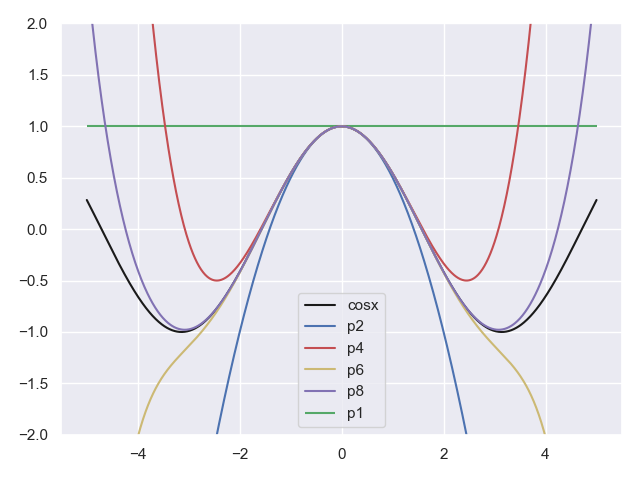

# 泰勒级数

## 无穷级数

### 1.无穷级数的前 $n$ 项和

这里我们引入一个背景知识进行讨论：当我们用计算机来计算正余弦函数或者是自然对数的幂，即 $e^n$ 的时候，通常是基于下面的无穷数列来给出满足较高精度的近似值：

$$sin(x)=x-\frac{x^3}{3!}+\frac{x^5}{5!}-\frac{x^7}{7!}+…$$
$$cos(x)=1-\frac{x^2}{2!}+\frac{x^4}{4!}-\frac{x^6}{6!}+…$$
$$e^x=1+x+\frac{x^2}{2!}+\frac{x^3}{3!}+\frac{x^4}{4!}+…$$

上面的表达式就是无穷级数。无穷级数的概念很多，我们先看最简单的：一组数字的无穷级数：

$$\frac{1}{2}+\frac{1}{4}+\frac{1}{8}+…$$

在这个级数当中，如果只包含第一项，那么和就为 $1/2$，如果包含前两项，那么和为 $1/2+1/4=3/4$，如果只包含前三项，那么和就为 $1/2+1/4+1/8=7/8$。

级数的前有限项的和，我们叫作部分和。我们把前 $n$ 项部分和记为是 $S_n$，很显然对照上面所描述的就有：$S_1=\frac{1}{2}$，$S_2=\frac{3}{4}$，$S_3=\frac{7}{8}$，显然还可以归纳出 $S_n=1-\frac{1}{2^n}$，并且可以看得出，$S_n$ 收敛于 $1$。

而至于说无穷级数的和，我们将其定义为部分和 $S_n$ 的极限：$lim_{n\rightarrow \infty}S_n$

当然，我们脱离上面这些个具体的数字来谈定义，我们给出无穷级数前 $n$ 项和的一般表示方法，即：考虑无穷级数：$a_1+a_2+a_3+a_4+a_5+……$，那么在这种表示方法之下，前 $n$ 项的和我们定义为：$S_n=a_1+a_2+a_3+…+a_n=\sum_{k=1}^{n}a_k$

### 2.级数的收敛性

对于无穷级数，我们最关注的便是级数的收敛性，这里我们给出一个比较严格的定义和说法：

对于一个无穷级数 $\sum_{k=1}^{\infty}a_k$，如果由他的前 $n$ 项和构成的数列 $\{S_1,S_2,S_3,…,S_n\}$ 最终收敛于 $S$，那么我们就称无穷级数 $\sum_{k=1}^{\infty}a_k$ 收敛并且他的和为 $S$。反之，如果数列 $\{S_1,S_2,S_3,…,S_n\}$ 发散，那么无穷级数也是发散的，这个无穷级数是没有和的。

### 3.几何级数

对于无穷级数，我们特别的需要关注以下这种形式：

$\sum_{k=1}^{\infty}ar^{k-1}=a+ar+ar^2+ar^3+…$，其中 $a\neq 0$。这种形式所表示的级数，称之为几何级数，这是一种比较常见的级数。更具体的，我们可以把几何级数划分为两大类：

一类是常数项级数，即不含自变量的，类似于：$\frac{1}{2}+\frac{1}{4}+\frac{1}{8}+\frac{1}{16}+…$，也就是上面写的 $\sum_{n=1}^{\infty} a_n$ 这种形式，非常好理解。

另外一类就是函数项的级数，即 $\sum_{n=1}^{\infty}a_n(x)$。这其中，级数的每一项 $a_n(x)$ 都是一个关于自变量 $x$ 的函数，函数项的级数用处更为广泛，他将是我们后续内容中的重点研究的对象。

最基本、最简单的一种函数项无穷级数：$\sum_{n=0}^{\infty}a_nx^n=a_0+a_1x+a_2x^2+a_3x^3+……$，我们就将其称之为自变量 $x$ 的幂级数。而进一步，我们将这种表达式一般化，写成是：$\sum_{n=1}^{\infty}a_n(x-a)^n=a_0+a_1(x-a)+a_2(x-a)^2+a_3(x-a)^3+…$，这称为关于 $x-a$ 的**幂级数**。

## 用级数表示函数

### 1.利用泰勒级数表示函数

走到这里，你可能还非常困惑，我们为什么铺垫了这么多无穷级数、包括特殊的幂级数的概念，目的到底是想干嘛？

其实很自然，我们是想探究这样一个问题，那就是给定一个已知函数 $f(x)$，我们能否将这个函数以 $x-a$ 的幂级数的形式进行表示，并且探索他的一些重要性质？

那么，更具体的：我们的目标就是找到一组数：$c_0$,$c_1$,$c_2$,…,$c_n$，使得函数 $f(x)$ 表达成如下的形式：$f(x)=c_0+c_1(x-a)+c_2(x-a)^2+c_3(x-a)^3+…$。

如果这个式子想要成立，很显然，我们对上面的级数表达式进行求导，从一阶导数开始，逐步求取他的高阶导数（$n$ 阶导）：

$$\begin{flalign}
f(x)&=c_0+c_1(x-a)+c_2(x-a)^2+c_3(x-a)^3+…\\
f'(x)&=c_1+2c_2(x-a)+3c_3(x-a)^2+4c_4(x-a)^3+…\\
f'’(x)&=2\times 1c_2+3\times 2c_3(x-a)+4\times 3c_4(x-a)^2+…\\
f^{(3)}(x)&=3\times 2\times 1c_3+4\times 3\times 2c_4(x-a)+5\times 4\times 3c_5(x-a)^2…\\
f^{(4)}(x)&=4\times 3\times 2\times 1c_4+5\times 4\times 3\times 2c_5(x-a)…\\
\end{flalign}$$

看上去一大篇的式子，我们又该如何处理呢？其实也很容易，我们将 $x=a$ 代入到上面的所有表达式中，就可以顺利的消去所有的非常数项：

$$\begin{aligned}
f(a)&=c_0\Rightarrow c_0=f(a)\\
f'(a)&=c_1\Rightarrow c_1=f'(a)\\
f'’(a)&=2\times 1c_2\Rightarrow c_2=\frac{f''(a)}{2!}\\
f^{(3)}(a)&=3\times 2\times 1c_3 \Rightarrow c_3=\frac{f^{(3)}}{3!}\\
f^{(4)}(a)&=4\times 3\times 2\times 1c_4 \Rightarrow c_4=\frac{f^{(4)}}{4!}\\
\end{aligned}$$

最后，我们可以得出系数 $c_n$ 的一般表达形式：

$$c_n=\frac{f^{(n)}(a)}{n!}$$

从这个推导过程中，我们知道了函数 $f(x)$ 如果能用关于 $(x-a)$ 的幂级数的形式来进行表示，那么表达的方式不可能多于一种。那么，对于一个给定函数 $f(x)$ 而言，用以 $(x-a)$ 为表达方式的幂级数，我们就将其称之为**泰勒级数**，而一种比较特殊的情况，即当 $a=0$ 时的幂级数，我们可以将其称之为**麦克劳林级数**。

如果我们把泰勒级数的项数固化到 $n$ 项，会更方便于我们在实际过程中的处理，毕竟我们不可能处理无限个级数项。这里我们运用[[微分中值定理]]，就可以把无穷项的泰勒级数转化为有限项的泰勒级数，这里运用到的就是带有余项的泰勒公式，即：

如果函数 $f(x)$ 的 $(n+1)$ 阶导数 $f^{(n+1)}$ 在 $x=a$ 的邻域内存在，那么在这个邻域内函数 $f$ 可以表示成以下的有限项的形式：

$$f(x)=f(a)+f'(a)(x-a)+\frac{f''(a)}{2!}(x-a)^2+…+\frac{f^{(n)}(a)}{n!}(x-a)^n+R_n(x)$$

最后一项 $R_n(x)$ 我们称之为余项，换句话说他代表了函数真实值 $f(x)$ 与前 $n$ 项和之间的误差，利用[[微分中值定理]]，我们可以将其表示为：

$$R_n(x)=\frac{f^{(n+1)}(c)}{(n+1)!}(x-a)^{n+1}$$

在这其中，$c$ 是 $x$ 和 $a$ 之间的一点。

### 2.函数的泰勒近似

那么谈到这里，我们就会受到启发，我们似乎可以利用函数 $f$ 的泰勒级数的前 $n$ 项和来对函数在 $x=a$ 邻域内的实际取值进行近似。

再回过头来看看前面对于函数的线性近似的内容，我们讲过函数 $f$ 在 $a$ 点邻域内的值，可以用经过函数 $f$ 点 $(a,f(a))$ 的切线去近似：$p_1(x)=f(a)+f'(a)(x-a)$

看看这是什么？我们发现 $p_1(x)$ 由两项组成，即包含泰勒级数关于 $x=a$ 点展开的 $0$ 阶项和 $1$ 阶项，因此，我们把线性近似称之为是一阶泰勒多项式。

但是我们不难发现，毕竟切线是一条直线，用它去近似函数 $f$ 所代表的曲线，只要随着自变量 $x$ 稍微远离 $a$ 点，近似值和实际的函数取值的差距就会显著增大。

于是我们就在想，线性近似只使用了泰勒级数的第 $0$ 项和第 $1$ 项，似乎丢失了太多后面的信息，那么我们把级数中后续更高阶的项也利用起来，例如用 $2$ 阶泰勒多项式：$p_2(x)=f(a)+f'(a)(x-a)+\frac{f''(a)}{2!}(x-a)^2$，这个相比于一阶泰勒多项式（也就是线性近似），他的近似效果会显得更好。

如果我们追求更高的近似精度，我们可以使用更高阶数的 $n$ 阶泰勒多项式进行函数的近似：

$$p_n(x)=f(a)+f'(a)(x-a)+\frac{f''(a)}{2!}(x-a)^2+…+\frac{f^{(n)}(a)}{n!}(x-a)^n$$

并且相应的，如果此时 $a=0$，那么 $n$ 阶泰勒多项式就转化为了 $n$ 阶麦克劳林多项式，用于对 $0$ 附近邻域内的函数取值进行近似。

$$f(x) \approx p_n(x)=f(0)+f'(0)x+\frac{1}{2!}f''(x)x^2+…+\frac{1}{n!}f^{(n)}(0)x^n$$

很显然，按照这个公式我们可以很轻松的得到例如 $e^x$，$cosx$ 的麦克劳林级数：

$$e^x \approx 1+x+\frac{1}{2!}x^2+\frac{1}{3!}x^3+\frac{1}{4!}x^4+…+\frac{1}{n!}x^n$$

$$cos x\approx 1-\frac{1}{2!}x^2+\frac{1}{4!}x^4-…+(-1)^{n/2}\frac{1}{n!}x^n$$

### 3.实际的近似试验

为了展示高阶麦克劳林级数（泰勒级数）在指定点附近邻域的良好近似特性，我们在 $x=0$ 处利用不同阶数的麦克劳林级数对原函数 $y=cosx$ 进行近似，并利用函数图像观察近似效果：

**代码片段：**

```python
import matplotlib.pyplot as plt
import numpy as np
import seaborn
seaborn.set()

##计算n的阶乘
def factorial(n):
    result = n
    for i in range(1,n):
        result *= i
    return result

##原函数
def f(x):
    return np.cos(x)

##1阶麦克劳林级数
def p1(x):
    return 1

##2阶麦克劳林级数
def p2(x):
    return 1-1./factorial(2)*(x**2)

##4阶麦克劳林级数
def p4(x):
    return 1-1./factorial(2)*(x**2)+1./factorial(4)*(x**4)

##6阶麦克劳林级数
def p6(x):
    return 1-1./factorial(2)*(x**2)+1./factorial(4)*(x**4)-1./factorial(6)*(x**6)

##8阶麦克劳林级数
def p8(x):
    return 1-1./factorial(2)*(x**2)+1./factorial(4)*(x**4)-1./factorial(6)*(x**6)+1./factorial(8)*(x**8)

x = np.linspace(-5, 5, 1000)
plt.plot(x, f(x), color='k', label='cosx')
plt.hlines(1, -5, 5, colors='g', label='p1')
plt.plot(x, p2(x), color='b', label='p2')
plt.plot(x, p4(x), color='r', label='p4')
plt.plot(x, p6(x), color='y', label='p6')
plt.plot(x, p8(x), color='m', label='p8')

plt.ylim(-2, 2)
plt.legend()
plt.show()
```

**运行结果：**


从图中我们可以看出，$y=cosx$ 的 $8$ 阶麦克劳林级数在 $x=0$ 的附近邻域对原函数 $cosx$ 的近似程度已经是相当高了。