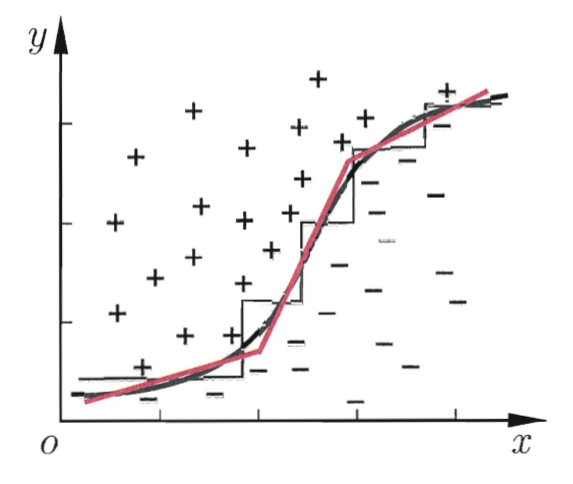

# 决策树

## 1 构建决策树

**决策树(Decision Tree)** 是一种非参数的[有监督学习](../../概率统计/有监督学习)方法，它能够从一系列有特征和标签的数据中总结出决策规则，并用树状图的结构来呈现这些规则，以解决[分类](../../概率统计/分类)和[回归](../../概率统计/回归)问题。决策树算法的本质是一种图结构，我们只需要问一系列问题就可以对数据进行分类。

在决策过程中，我们一直在对特征进行提问。最初的问题所在的地方叫做**根节点**，在得到结论前的每一个问题都是**中间节点**而得到的每一个结论都叫做**叶节点**。

| 节点           | 介绍                                                                 |
| -------------- | -------------------------------------------------------------------- |
| 根节点         | 没有进边，有出边；包含样本全集                                       | 
| 中间节点       | 既有进边也有出边，进边只有一条，出边可以有很多条；都是针对特征的提问 |
| 叶节点         | 有进边，没有出边；每个叶子节点都是一个类别标签（决策结果）           |
| 子节点和父节点 | 在两个相连的节点中，更接近根节点的是父节点，另一个是子节点           |

### 决策树的构建过程

决策树学习的算法通常是一个[递归](../../概率统计/递归)地选择最优特征，并根据该特征对训练数据进行分割，使得对各个子数据集有一个最好的分类的过程。这一过程对应着对特征空间的划分，也对应着决策树的构建。

首先，构建根结点，将所有训练数据都放在根结点。

之后，选择一个最优特征，按照这一特征将训练数据集分割成子集，使得各个子集在当前条件下的分类最优。

如果这些子集已经能够被基本正确分类，那么构建叶结点，并将这些子集分到所对应的叶结点中去。

如果还有子集不能被基本正确分类，那么就对这些子集重新选择新的最优特征，继续对其进行分割，构建相应的结点。

如此递归地进行下去，直至所有训练数据子集被基本正确分类，或者没有合适的特征为止。

最后每个子集都被分到叶结点上，即都有了明确的类，这就生成了一棵决策树。

### 伪代码

``` python
def 决策树函数(训练集D, 属性集A):

    # 第一次调用时node即根节点
    生成节点node

    # 递归返回，情形1
    # 此时, 不纯度为0, 无需继续分枝
    if D中的样本全属于同一类别C:
        将node标记为C类叶节点
        return

    # 递归返回，情形2
    # A为空集表示决策树已经将问题问完，或者已达到最大递归深度
    # 或者此时节点上的所有数据的所有特征都相同，决策树无法继续向下分枝
    # 此时, 不纯度大于1；有被错误分类的数据
    if (A为空集 or D中的样本在A上取值相同):
        将node标记为叶节点，其类别标记为D中所含样本数最多的类
        return

    # 不同的决策树有不同的划分标准：信息增益，信息增益率，尼基系数
    # 对A中的每一个元素求值
    从A中选择最优划分属性a

    # a有n个不同值则循环n次
    for a的每一个值a_i:

        为node生成一个分枝  # a有n个值则将生成n个子节点
        令D_i表示D在a上取值为a_i的样本子集  # D_i等于属性值为a_i的样本集合

        # 递归返回，情形3
        # 特征a的某一值a_i在之前的分类中已经被划分完毕，决策树无法再继续向下分枝
        # 在拟合过程中这一节点并不能对模型的准确度产生帮助，应该被舍弃，但是在用模型进行预测时可能会用到此叶节点
        if D_i为空集:
            将分枝节点标记为叶节点，其类别标记为D中所含样本数最多的类
            return

        else:
            # 进行递归
            决策树函数(D_i, 去掉属性a之后的属性集A*)

    return 以node为根节点的一颗决策树
```

## 2 选择最优划分

从伪代码中可以看出，决策树模型的核心是如何找到当前节点上的最优划分。

一般而言，随着划分过程的不断进行，我们希望决策树的分支节点包含的样本尽可能属于同一类别，即节点的**纯度**越来越高。

常见的决策树划分标准都是基于 [信息熵(Information Entropy)](../基础知识/熵) 和 [基尼指数(Gini Index)](../../概率统计/基尼指数(Gini%20Index)) 这两个指标得来的。

### 2.1 信息增益 (ID3 算法)

决策树最终的优化目标是使得叶节点的总纯度最高，即对应衡量纯度的指标最高。

而 ID3 最优条件是*叶节点的总信息熵最小（信息熵越小即信息量越小也就是纯度越高）* ，因此 ID3 决策树在决定是否对某节点进行切分的时候，会尽可能选取使得该节点对应的子节点信息熵最小的特征进行分枝。

换而言之，就是要求父节点信息熵和子节点总信息熵之差要最大。对于 ID3 而言，二者之差就是**信息增益(Information Gain)**。

需要注意，一个父节点下可能有多个子节点，且每个子节点又有自己的信息熵，所以*信息增益是父节点的信息熵 - 所有子节点信息熵的加权平均*。

其中，权重为单个叶子节点上的样本量比父节点上的总样本量。

$$I(c h i l d)=\sum_{j=1}^{k} \frac{N\left(v_{j}\right)}{N} I\left(v_{j}\right)$$

$$\text {Gain} = I(\text {parent})-I(\text {child})$$

$I$  为信息熵，$N$  是父结点上的样本数，$k$ 是子节点的个数， $N(v_{j})$ 是与子结点 $v_{j}$ 相关联的样本个数。

### 2.3 信息增益率 (C4.5 算法)

以信息增益作为划分训练集的标准，存在偏向于选择**取值较多的特征**的问题。*数据集的不充足，以及客观存在的大数定律，导致取值多的特征在计算条件熵时容易估计出偏小的条件熵*。

如果将样本编号也纳入了训练集中，那么根据信息增益做出的样本划分就会将编号作为最优划分，每个样本都被分到一个节点上，但这样的划分没有任何意义。

为解决这一问题，在 C4.5 算法中，采用**信息增益率(Gain Ratio)** 来决定节点的分枝：

$$\text {Gain Ratio}=\frac{\text {Information Gain}}{\text {Intrinsic Value}}$$

其中 $\text{Intrinsic Value}$（固有值）的计算公式为：

$$\text {Intrinsic Value}=-\sum_{i=1}^{k} P\left(v_{i}\right) \log_{2} P\left(v_{i}\right)$$

*$i$ 表示父节点的第 $i$ 个子节点， $P(v_{i})$ 表示第 $i$ 个子节点样本数占父节点总样本数的比例。*

可以看出，$\text{IV}$  是一个惩罚项，计算公式与信息熵的计算公式相同。$\text{IV}$ 值会随着叶子节点上样本量的变小而逐渐变大，这就是说一个特征的可能取值越多，每个叶子上的 $\text{IV}$ 值就越大，惩罚力度也就越大。

这让我们在分类时，避免那些取值太多，信息熵减小过快的特征影响模型，减少过拟合情况。因此信息增益率的本质是选取信息增益大且取值少的特征（即纯度提升很快，分类不多的特征）。

由于信息增益率偏好于**取值较少的特征**，可能出现 $\text{IV}$ 值极小且信息增益不大的情况下信息增益率过高的情况。因此，C4.5 算法中对节点的分枝并不是直接选取信息增益率最大的特征，而是*先从所有特征中找出信息增益高于平均值的特征，再从中选择信息增益率最高的特征*。

### 2.4 基尼指数 (CART 算法)

$$
\operatorname{Gini}=\sum_{k=1}^{K}p_k(1-p_k)=1-\sum_{k=1}^{K}p_{k}^{2}
$$
其中，*$p_k$ 表示样本属于第 $k$ 个类别的概率*

直观来说，基尼指数反映的是从数据集中随机抽取两个样本且二者特征不相同的概率。

现在被大量使用的是 C4.5 的改进 CART，sklearn 使用的也是 CART。CART 的本质其实和 C4.5 区别不大，只不过 CART 所有的层都是二叉树，也就是每层只有两个分枝。此外，CART 用**基尼指数**最小的特征来对节点进行分枝。

## 3 决策树的剪枝

**剪枝(pruning)** 是决策树学习算法对付**过拟合**的主要手段。

在决策树学习中，为了尽可能正确分类训练样本，结点划分过程将不断重复，有时会造成决策树分支过多。这时就可能因训练样本学得“太好”了，以致于把训练集自身的一些噪声当作所有数据都具有的一般性质而导致过拟合。

因此，可通过主动去掉一些分支来降低过拟合的风险。

决策树剪枝的基本策略有**预剪枝(prepruning)** 和 **后剪枝(postpruning)**。

**预剪枝**是指在决策树生成过程中，对每个结点在划分前先进行估计，若当前结点的划分不能带来决策树泛化性能提升，则停止划分并将当前结点标记为叶结点。

- *正*：预剪枝会使得决策树的很多分支都没有展开，这不仅降低了过拟合的风险，还显著减少了决策树的训练时间开销和测 0 试时间开销。
- *反*：但另一方面，有些分支的当前划分虽不能提升泛化性能、甚至可能导致泛化性能暂时下降，但在其基础上进行的后续划分却有可能导致性能显著提高。
- *正*：预剪枝基于“贪心”本质禁止这些分支展开，给预剪枝决策树带来了欠拟合的风险。

**后剪枝**则是先从训练集生成一棵完整的决策树，然后自底向上地对非叶结点进行考察，若将该结点对应的子树替换为叶结点能带来决策树泛化性能提升，则将该子树替换为叶节点。

- *正*：后剪枝决策树通常比预剪枝决策树保留了更多的分支。
- *正*：一般情形下，后剪枝决策树的欠拟合风险很小，泛化性能往往优于预剪枝决策树。
- *反*：但后剪枝过程是在生成完全决策树之后进行的，并且要自底向上地对树中的所有非叶结点进行逐一考察，因此其训练时间开销比未剪枝决策树和预剪枝决策树都要大得多。

## 4 连续值的处理

在 C4.5 算法中，同样还增加了针对连续变量的处理手段。如果特征的取值是连续型变量，则有下列步骤：

1.  首先对特征的取值进行从小到大的排序
2.  选取相邻的两个取值的中间数作为切分数据集的备选点（若一个连续变量有 N 个值，则会产生 N-1 个备选切分点，并且每个切分点都代表着一种的切分方案）
3.  通过比较每一个切分点的信息增益率，增益率最大的切分点就是该特征的最佳切分点
4.  将连续型特征按照是否大于最佳切分点转化成离散型特征
5.  按照普通决策树的方法进行建模

需要注意的是，对连续型特征的处理并非是将其转化为一个拥有*N-1 个取值的离散型特征*，而是将其转化成了*N-1 个二元特征*，即连续型特征可以不断地参与决策树的构建。

因此，在对于包含连续变量的数据集进行树模型构建的过程中要消耗更多的运算资源。

我们会发现，当连续变量的某中间点参与到决策树的二分过程中，往往代表该点对于最终分类结果有较大影响，这为连续变量的[分箱算法](../../概率统计/分箱算法)提供了指导性意见。

CART 算法中则采用**平方误差最小化**准则来选择最佳切分点。

## 5 缺失值的处理

处理缺失值需要解决三个问题：

1.  如何在特征值缺失的情况下进行划分特征的选择？
2.  给定划分特征，若样本在该特征上的值是缺失的，那么该如何对这个样本进行划分？
3.  决策树构造完成后，如果测试集样本的特征值不完整，该如何确定该样本的类别？

针对问题 1，有缺失值的特征，其信息增益就是 *无缺失值样本所占比例 $\rho$* 乘以 *无缺失值样本子集的信息增益*：

$$
\text {Gain}_{\text{全集}} = \rho \times \text {Gain}_{\text{无缺失子集}}
$$

针对问题 2，若样本在给定特征上的取值已知，则样本按照权重 1 划分到*相应子节点*，若样本在给定特征上的取值未知，则按照特征取值占比权重同时划分到*所有子节点*，此时特征划分的信息增益为：

$$
\text {Gain} = \rho \times\left(\text { Ent }(\tilde{D})-\sum_{v=1}^{V} \tilde{r}_{v} \operatorname{Ent}\left(\tilde{D}^{v}\right)\right)
$$

*$\tilde{D}$ 为训练集 $D$ 在特征上没有缺失值的样本子集， $\tilde{D}^{v}$ 为 $\tilde{D}$ 中特征的某一取值的样本子集，$\rho$ 为无缺失值样本所占比例 ，$\tilde{r}_{v}$ 表示无缺失值样本中特征的某一取值的样本子集比例，$\tilde{p}_{k}$ 表示无缺失值样本中第 $k$ 类特征所占的比例*

针对问题 3，当测试集样本的特征值缺失时，探索该样本所有可能的分类结果并把所有结果结合起来考虑。

这样，会存在多个路径，分类结果将是类别的分布而不是某一类别，从而选择概率最高的类别作为预测类别。

## 6 多变量决策树

多变量决策树即决策树分枝的判断条件由多个特征决定，这在实际问题的解决中有一定的意义。

实际问题的决策边界往往比较复杂，单变量决策树的*分类边界都是平行于坐标轴的*，因此需要通过多次判断才能近似的模拟出边界，而多变量决策树的*分类边界可以是斜线*，能有效减少判断次数。

多变量决策树在中间节点的判断不是取决于单个特征，而是多个特征的组合，相较于单变量决策树，多变量决策树的每个非叶节点是一个形如 $\sum_{i=1}^{d} w_i a_i = t$ 的线性分类器（当然也可以是非线性的），其中 $w_i$ 是属性 $a_i$ 的权重，$t$ 是分类阈值。


*单变量决策树边界(黑线)与多变量决策树边界(红线)*
