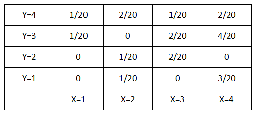
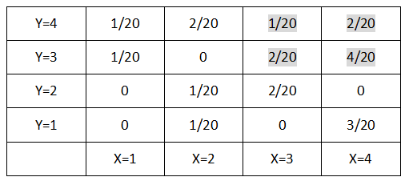

---
tags:
- 数学/概率统计
---

# 06 多元随机变量（下）：独立与相关

这一小节，我们开始讨论多元随机变量之间的关系，重点围绕独立性和相关性的概念展开。

## 1.关于独立性的讨论

### 1.1.随机变量与事件的独立性

在概率统计的最开始部分，我们探讨过事件独立性的概念，同时我们知道：随机变量的取值，本质上同样也是一个事件，因此不难理解其独立性的概念。

首先我们讨论随机变量与事件之间的相互独立性。那么回到定义中去，我们可以说他的本质就是事件的发生与否，不会对随机变量的取值提供额外的新信息，这其实就是照搬了事件独立性的概念。如果用条件概率的式子来表示的话，就有：

如果随机变量 $X$ 独立于事件 $A$，那么满足：

$$P(\{X=x\} 且 A)=P(\{X=x\})P(A)=P_X(x)P(A)$$

对随机变量 $X$ 的一切取值 $X=x$ 都成立。

同时我们再拿出一个联合概率和条件概念的关系式：

$$P(\{X=x\}且 A)=P_{X|A}(x)P(A)$$

我们把上下这两个式子结合起来看，就有了：

$$P_X(x)P(A)=P_{X|A}(x)P(A) \Rightarrow P_X(x)=P_{X|A}(x)$$

因此，$P_X(x)=P_{X|A}(x)$ 对于随机变量 $X$ 的一切取值恒成立，就是随机变量 $X$ 和事件 $A$ 满足独立性的等价条件，即无条件分布列和条件分布列完全相等。

### 1.2.随机变量之间的独立性

这个时候，如果我们把上面的事件 $A$ 看成是另一个随机变量 $Y$ 的取值，就能顺手得到了随机变量 $X$ 和随机变量 $Y$ 之间相互独立需要满足的条件：

即：$P_{X,Y}(x,y)=p_X(x)p_Y(y)$，对于任意的取值 $x$ 和取值 $y$ 都成立，换言之，也就是事件 $\{X=x\}$ 和 $\{Y=y\}$ 相互独立。

然后再通过条件概率和联合概率的式子 $p_{X,Y}(x,y)=p_{X|Y}(x|y)p_Y(y)$ 进行转换，最终我们就得到了：

$p_{X|Y}(x|y)=p_X(x)$ 对于一切取值 $x$ 和满足 $p_Y(y)>0$ 的取值 $y$ 都成立。

其实道理也是一样的，独立性意味着随机变量 $Y$ 的取值，不会给随机变量 $X$ 的取值提供任何额外的信息。

### 1.3.独立性的实际举例

我们来实际举个例子看一看，下面这个表格就是随机变量 $X$ 和 $Y$ 的联合分布列。

我们来检验一下，首先我们计算：

$p_X(2)=1/20+1/20+0+2/20=4/20$

然后，我们引入 $\{Y=3\}$ 这个随机变量取值的事件条件，很显然我们发现：

$p_{X|Y}(2|3)=P(X=2|Y=3)=0$

显然，$p_X(2) \neq p_{X|Y}(2|3)$，不满足随机变量之间相互独立的条件。

## 2.条件独立的概念

同条件概率一样，很多情况下我们需要在一些特定事件发生的条件下来讨论随机变量之间的独立性，这个在实际的应用当中很有意义。

如果说随机变量 $X$ 和 $Y$ 满足事件 $A$ 成立下的条件独立，定义实际上很简单，就是在之前的定义式的每一个部分都添加一个事件条件 $A$，即对于一切取值 $x$ 和 $y$，都满足 $P(X=x,Y=y|A)=P(X=x|A)P(Y=y|A)$ 的等式成立。

同样的，最终我们还是可以转换成类似之前条件概率和无条件概率的等价形式：

$p_{X|Y,A}(x|y)=p_{X|A}(x)$，对于一切 $x$ 和满足 $p_{Y}(y)>0$ 的 $y$ 成立。

我们还是用上面的那个联合分布列来举例，只不过这次我们设定一个条件事件，即事件 $A$ 为 $\{X\ge 3 且 Y\ge 3\}$，对应到上面那幅图上，就是我们只探讨阴影范围内的随机变量的独立性：

显然此处，$p_{3|Y,A}(3|y)=p_{3|A}(3)$，$p_{4|Y,A}(4|y)=p_{4|A}(4)$ 对于随机变量 $Y$ 的取值 $Y=3$ 或 $Y=4$ 都成立。

因此，原本并不满足相互独立的随机变量 $X$ 和随机变量 $Y$，在事件 $A$ 的条件下，随机变量 $X$ 和随机变量 $Y$ 满足条件独立。看来**条件独立和独立不是等价的概念**，这个大家一定要注意。

## 3.独立随机变量的期望和方差

### 3.1.从两个随机变量谈起

接着，我们在这里看一个很重要的结论，如果随机变量 $X$ 和随机变量 $Y$ 之间相互独立，他们之间的期望就应该满足这么一个关系：

$$E[XY]=E[X]E[Y]$$

这个结论乍一看上去比较直观，但怎么具体证明一下，把里面的道理说清楚呢？那我们还得回到定义中去：

$$E[XY]=\sum_x\sum_yxyp_{X,Y}(x,y)$$

关键就在这里，由于随机变量之间满足独立性，则他们的联合分布列和边缘分布列之间满足：

$$p_{X,Y}(x,y)=p_X(x)p_Y(y)$$

因此，我们替换一下，就有

$$
\begin{aligned}
E[XY]&=\sum_x\sum_yxyp_{X,Y}(x,y) \\
&=\sum_x\sum_yxyp_X(x)p_Y(y) \\
&=\sum_xxp_X(x)\sum_yyp_Y(y) \\
&=E[X]E[Y]
\end{aligned}
$$

我们只看头尾，得到结论为：$E[XY]=E[X]E[Y]$。

那么方差这个指标呢？我们主要观察相互独立的随机变量 $X$ 和随机变量 $Y$ 的和，即：$X+Y$ 的方差。为了操作方便，我们这里对随机变量 $X$ 和 $Y$ 进行一下预处理，将他们进行平移、去中心化，使得随机变量的期望变为 $0$，但是方差仍然能保持不变：

$\tilde{X}=X-E[X]$，则此时满足 $E[\tilde X]=0$。

同理我们也对随机变量 $Y$ 进行类似处理：
 
$\tilde{Y}=Y-E[Y]$，满足 $E[\tilde Y]=0$

$var(X+Y)=var(\tilde{X}+\tilde{Y})$，我们按照方差的定义进行展开：

$var(\tilde{X}+\tilde{Y})=E[(\tilde{X}+\tilde{Y}-E[\tilde{X}+\tilde{Y}])^2]$

由于 $E[\tilde{X}+\tilde{Y}]=E[\tilde{X}]+E[\tilde{Y}]=0$

因此我们有：

$$\begin{aligned}

E[(\tilde{X}+\tilde{Y}-E[\tilde{X}+\tilde{Y}])^2]&=E[(\tilde{X}+\tilde{Y})^2] \\

&=E[\tilde{X}^2+\tilde{Y}^2+2\tilde{X}\tilde{Y}] \\
&=E[\tilde{X}^2]+E[\tilde{Y}^2]+2E[\tilde{X}\tilde{Y}]
\end{aligned}
$$

由于随机变量 $X$ 和随机变量 $Y$ 之间满足独立性，则：

$E[\tilde{X}\tilde{Y}]=E[\tilde{X}]E[\tilde{Y}]=0$

因此有：

$$
\begin{aligned}

E[\tilde{X}^2]+E[\tilde{Y}^2]+2E[\tilde{X}\tilde{Y}]&=E[\tilde{X}^2]+E[\tilde{Y}^2] \\

&=E[(\tilde{X}-E[\tilde{X}])^2]+E[(\tilde{Y}-E[\tilde{Y}])^2] \\
&=var[\tilde{X}]+var[\tilde{Y}] \\
&=var[X]+var[Y] \\
\end{aligned}
$$

最终就顺利的推理出了独立的随机变量 $X$ 和 $Y$ 满足：

$var[X+Y]=var[X]+var[Y]$

最后我们再总结一下：

随机变量 $X$ 和随机变量 $Y$ 之间满足：$E[XY]=E[X]E[Y]$ 以及 $var[X+Y]=var[X]+var[Y]$ 的前提条件是随机变量之间满足独立性。而 $E[X+Y]=E[X]+E[Y]$ 成立，则不需要任何前提条件。

### 3.2.扩展到两个以上随机变量

我们假设有三个随机变量 $X$,$Y$,$Z$，如果他们之间满足：

$p_{X,Y,Z}(x,y,z)=p_X(x)p_Y(y)p_Z(z)$，对于一切的随机变量的取值 $x$,$y$,$z$ 都成立，则我们称这三个随机变量 $X$,$Y$,$Z$ 是相互独立的。

同理，多个相互独立的随机变量的和的方差满足：

$var[X+Y+Z]=var[X]+var[Y]+var[Z]$

请大家注意，这个式子非常有用，独立随机变量的和会出现在许多实际的应用场合，这个我们先按下不表，后面的相关章节中会仔细分析。

## 4.随机变量的相关性分析

### 4.1.如何量化相关程度

上面讲的独立性，我们仅讨论随机变量之间是否独立，但是并不关心或者说并没有深入探究随机变量之间的具体关系。而现在我们具体通过量化来衡量多元随机变量之间的相关程度，即当某一个变量改变时，其他变量将发生多大的变化。

强调一下多元随机变量之间的关系，我们讨论随机变量 $X$ 和随机变量 $Y$ 之间的关系，是严格的配对关系，例如随机变量 $X=x_k$ 时，必然有固定的随机变量 $Y=y_k$ 取值与之配对，因此二元随机变量的分布可以以二维坐标的形式，在平面上进行散点图的可视化表示，这个我们在后面的内容中将会看到。

下面我们进一步探讨随机变量 $X$ 和随机变量 $Y$ 之间的关系，如果他们之间存在着某种关系，我们一般比较关心他们之间的关系的“紧密”程度，或者说是相互间变化的“趋势”，所谓趋势，我们说直白通俗点，就是随着 $X$ 取值的变大，随机变量 $Y$ 的取值是趋于变大还是变小。

### 4.2.运用协方差的概念

那么具体对随机变量 $X$ 和随机变量 $Y$ 进行上述关系定量分析的指标就是我们下面要介绍的协方差，随机变量 $X$ 和 $Y$ 的协方差我们定义为：

$$cov(X,Y)=E[(X-E[X])(Y-E[Y])]$$

这是从数据分布的总体上进行分析，如果计算出来的协方差结果为正，则随机变量 $X$ 和 $Y$ 有相同的变化趋势，简单点说就是随着随机变量 $X$ 增大，随机变量 $Y$ 整体上也随之变大。

这里我们再啰嗦一点，就是不一定当随机变量 $X$ 的每一个取值变大时，随机变量 $Y$ 的对应取值都变大，但是我们看的是期望，是整体，因此只要大部分取值保持正相关，就能保证协方差公式整体计算结果为正，整体上随机变量 $X$ 和 $Y$ 就保持正相关，因此我们这么说可能更好理解，当随机变量 $X$ 的取值大于期望值时，随机变量 $Y$ 的取值大于期望值的概率也将增大。

反之，如果协方差的结果为负，则恰好相反，表示当一方增大时，另一方反而倾向于减小，随机变量 $X$ 和 $Y$ 呈现负相关。

协方差结果如果为 $0$，则表示随机变量 $X$ 和 $Y$ 不相关，即当一方增大时，另一方并不会因此表现出增大或减小的趋势，随机变量 $X$ 和 $Y$ 不具有相关性。

### 4.3.为多元变量引入协方差矩阵

假设此时我们将随机变量的个数由两个拓展到 $n$ 个：$X_1,X_2,X_3,…,X_n$，那我们如何来分析随机变量之间的相关性呢？答案很简单，两两计算所有随机变量对 $X_i$ 和 $X_j$ 之间的协方差。

方差公式也可以统一到协方差公式中来，换句话说随机变量与自身的“协方差”，在公式中反映的就是方差。

因此，我们可以将上述结果放在一个矩阵中，也就是我们标题中所说的协方差矩阵。第 $i$ 行、第 $j$ 列表示的就是随机变量 $X_i$ 和随机变量 $X_j$ 的协方差，对角线上的元素，表示的就是随机变量 $X_i$ 的方差：

$$\left[\begin{array}{ccc}

V\left[X_{1}\right] & \operatorname{Cov}\left[X_{1}, X_{2}\right] & \operatorname{Cov}\left[X_{1}, X_{3}\right] \\

\operatorname{Cov}\left[X_{2}, X_{1}\right] & V\left[X_{2}\right] & \operatorname{Cov}\left[X_{2}, X_{3}\right] \\
\operatorname{Cov}\left[X_{3}, X_{1}\right] & \operatorname{Cov}\left[X_{3}, X_{2}\right] & V\left[X_{3}\right]
\end{array}\right]$$

由 $Cov[X_i,X_j]=Cov[X_j,X_i]$ 可知，协方差矩阵是一个对称矩阵。

### 4.4.相关系数的概念

说到这里，我们拿两组随机变量做对比，$X$ 和 $Y$，以及 $Z$ 和 $W$，我们通过计算得到两个协方差的计算结果：$cov[X,Y]$ 以及 $cov[Z,W]$。

如果两个协方差的计算结果都为正，我们可以说随机变量 $X$ 和 $Y$ 呈正相关，$Z$ 和 $W$ 也呈正相关，这个没有问题，我们前面已经讲过。但是倘若满足 $cov[Z,W]>cov[X,Y]$，我们能够直接说随机变量 $Z$ 和 $W$ 的相关性大于 $X$ 和 $Y$ 吗？

我们不忙着拿结论，先看下面这套推理：

假如说随机变量 $Z$ 和 $W$ 满足和 $X$ 和 $Y$ 之间的倍数关系，即：$Z=aX$，$W=aY$，同时随机变量 $X$ 和 $Y$ 的期望有：$E[X]=\mu$，$E[Y]=v$。

于是按照协方差的定义，就有下面的一系列展开：

$$cov[Z,W]=cov[aX,aY]=E[(aX-a\mu)(aY-av)]=a^2E[(X-\mu)(Y-v)]=a^2cov[X,Y]$$

可以看到，经过严格的推导，我们发现了随机变量 $Z$ 和 $W$ 之间的协方差是 $X$ 和 $Y$ 协方差的 $a^2$ 倍，但是，随机变量 $Z$ 和 $W$ 之间的相关性较之 $X$ 和 $Y$ 有变化吗？显然是没有的。

## 5.小结

这一节，我们基本上是快速的罗列了多元随机变量独立与相关的理论概念，有些同学可能会觉得不太直观，甚至有些枯燥，那么为了进一步深刻的揭示这些概念的内涵，便于大家理解，我们在下一节里会以多元正态分布为例进行更多的案例分析。