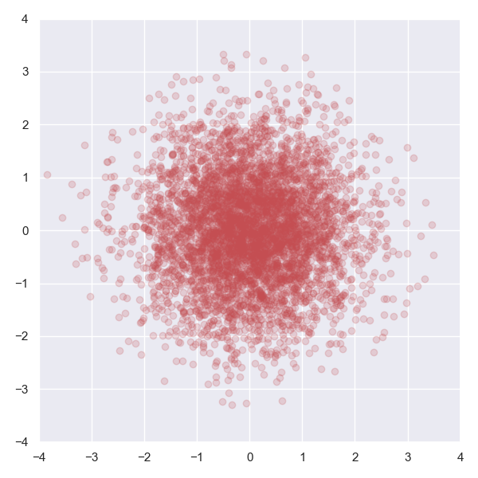
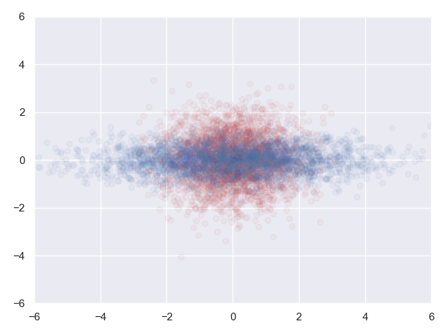
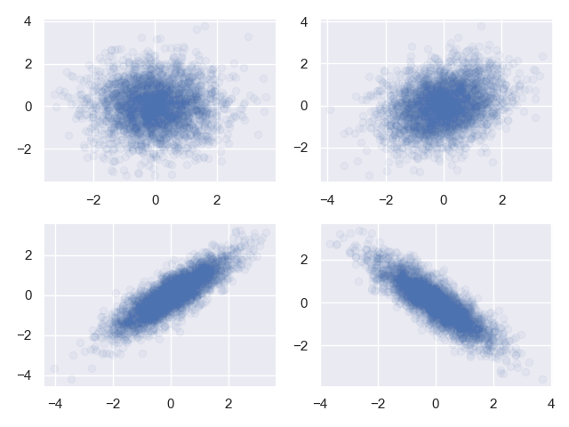
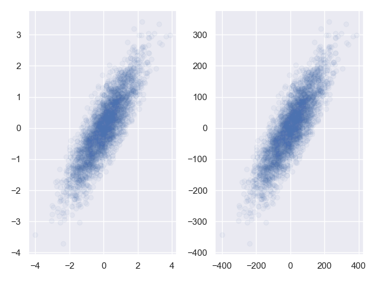
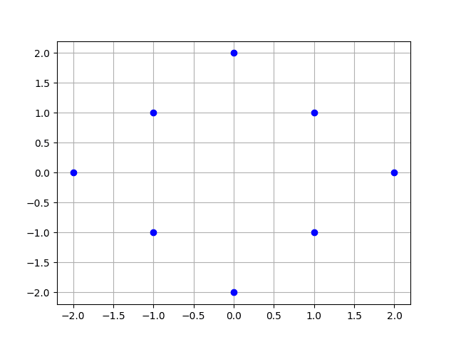

---
tags:
- 数学/概率统计
---

# 07 多元随机变量实践：聚焦多元正态分布

在前面两节中，我们介绍了多元随机变量的有关概念，重点围绕着多元随机变量的联合概率、条件与边缘概率分布以及独立性和相关性，阐述了多元随机变量之间的关系，这些都是多元随机变量重点需要关注和研究的问题。

在上两节理论知识的基础之上，我们在这一小节里以多元正态分布作为实际例子，让大家能够更直观的理解和强化这些概念和方法。

## 1.再谈相关性：基于多元正态分布

很简单，我们举一个例子，之前我们介绍过随机变量的正态分布，这里我们引入多元随机变量的正态分布：

如果向量 $Z$ 由若干个遵从标准正态分布的独立同分布随机变量 $Z_1,Z_2,…,Z_n$ 组成，那么我们就说向量 $Z$ 遵从 $n$ 元标准正态分布。

### 1.1.二元标准正态分布

为了便于讨论，我们这里主要讨论二元随机变量的情况。由随机变量 $X$ 和 $Y$ 组成的二元标准正态分布中，随机变量 $X$ 和 $Y$ 都服从均值为 $0$，方差为 $1$ 的标准正态分布，并且随机变量 $X$ 和 $Y$ 之间的协方差为 $0$。其协方差矩阵为：$\begin{bmatrix} 1&0\\0&1\end{bmatrix}$。

我们利用 $python$ 来生成服从二元标准正态分布的随机变量 $X$ 和 $Y$，并且通过可视化的方式进行观察。

**代码片段：**

```python
import numpy as np
import matplotlib.pyplot as plt
import seaborn
seaborn.set()

mean = np.array([0, 0])
conv = np.array([[1, 0],
                 [0, 1]])

x, y = np.random.multivariate_normal(mean=mean, cov=conv, size=5000).T
plt.figure(figsize=(6, 6))
plt.plot(x, y, 'ro', alpha=0.2)
plt.gca().axes.set_xlim(-4, 4)
plt.gca().axes.set_ylim(-4, 4)
plt.show()
```

在代码中，我们生成了各自均值为 $0$，方差为 $1$，随机变量间的协方差为 $0$ 的二元标准正态分布随机变量 $X$ 和 $Y$，一共生成 $3000$ 组样本，我们实际观察一下可视化的结果。

**运行结果：**



从图中我们发现，在均值点（这里对应的是原点）附近，样本出现的概率较高（我们设置的样本点的透明度为 $0.2$，因此颜色越深意味着样本点的个数越多），远离均值点的地方样本出现的概率较低，并且无论向任何方向，总体上概率没有表现出太大区别。

### 1.2.二元一般正态分布

我们通过调整参数，可以逐渐将二元标准正态分布变换为二元一般正态分布。我们可以调整的参数主要有以下三个方面：

**第一：调整多个随机变量自身的均值**，这样是让样本整体在二维平面上进行平移，这个很简单，我们就不多说了。

**第二：调整随机变量 $X$，$Y$ 自身的方差**，当然此时我们还是保留他们互相之间彼此独立的关系，我们来观察一下样本图像的特点。

与标准二元正态分布对照，我们设定随机变量 $X_2$ 的方差为 $4$，$Y_2$ 的方差为 $0.25$，对比观察一下：

**代码片段：**

```python
import numpy as np
import matplotlib.pyplot as plt
import seaborn
seaborn.set()

mean = np.array([0, 0])
conv_1 = np.array([[1, 0],
                 [0, 1]])

conv_2 = np.array([[4, 0],
                 [0, 0.25]])

x_1, y_1 = np.random.multivariate_normal(mean=mean, cov=conv_1, size=3000).T
x_2, y_2 = np.random.multivariate_normal(mean=mean, cov=conv_2, size=3000).T
plt.plot(x_1, y_1, 'ro', alpha=0.05)
plt.plot(x_2, y_2, 'bo', alpha=0.05)

plt.gca().axes.set_xlim(-6, 6)
plt.gca().axes.set_ylim(-6, 6)
plt.show()
```

**运行结果：**



从图中对比可以看出，蓝色的样本点就是调整了随机变量各自的方差，但保持随机变量 $X$ 和 $Y$ 之间协方差为 $0$ 的样本分布。

**第三：就是调整协方差。** 我们保持随机变量各自的方差不变，通过改变协方差的值，来观察协方差的变换给随机变量间的相关特性带来的影响以及在图像上的反映。

**代码片段：**

```python
import numpy as np
import matplotlib.pyplot as plt
import seaborn
seaborn.set()

fig, ax = plt.subplots(2, 2)
mean = np.array([0,0])

conv_1 = np.array([[1, 0],
                 [0, 1]])

conv_2 = np.array([[1, 0.3],
                 [0.3, 1]])

conv_3 = np.array([[1, 0.85],
                 [0.85, 1]])

conv_4 = np.array([[1, -0.85],
                 [-0.85, 1]])

x_1, y_1 = np.random.multivariate_normal(mean=mean, cov=conv_1, size=3000).T
x_2, y_2 = np.random.multivariate_normal(mean=mean, cov=conv_2, size=3000).T
x_3, y_3 = np.random.multivariate_normal(mean=mean, cov=conv_3, size=3000).T
x_4, y_4 = np.random.multivariate_normal(mean=mean, cov=conv_4, size=3000).T

ax[0][0].plot(x_1, y_1, 'bo', alpha=0.05)
ax[0][1].plot(x_2, y_2, 'bo', alpha=0.05)
ax[1][0].plot(x_3, y_3, 'bo', alpha=0.05)
ax[1][1].plot(x_4, y_4, 'bo', alpha=0.05)

plt.show()
```

在代码中，我们生成了四组二元正态分布，其中第一组是作为对照用的二元标准正态分布。第二组的协方差为 $0.3$，第三组的协方差为 $0.85$，第四组的协方差为 $-0.85$。

**运行结果：**



从运行结果中我们发现，与二元标准正态分布的样本图像呈现为圆形相比，协方差不为 $0$ 的二元正态分布呈现为一定斜率的椭圆图像，并且协方差越大，椭圆越窄。

同时协方差为正和为负，椭圆的方向是相反的，这个很容易理解，分别对应体现了正相关和负相关的关系。

## 2.聚焦相关系数

有了生成多元正态分布随机变量的方法和可视化手段之后，我们再来从量化的角度回答前面一个小节中提到过的问题：协方差大的两个随机变量，他们之间的相关性一定就大于协方差小的随机变量吗？

我们来看下面这段代码：

**代码片段：**

```python
import numpy as np
import matplotlib.pyplot as plt
import seaborn
seaborn.set()

fig, ax = plt.subplots(1, 2)
mean = np.array([0,0])

conv = np.array([[1, 0.85],
                 [0.85, 1]])

x_1, y_1 = np.random.multivariate_normal(mean=mean, cov=conv, size=3000).T
x_2 = x_1*100
y_2 = y_1*100

ax[0].plot(x_1, y_1, 'bo', alpha=0.05)
ax[1].plot(x_2, y_2, 'bo', alpha=0.05)

S_1 = np.vstack((x_1, y_1))
S_2 = np.vstack((x_2, y_2))
print(np.cov(S_1))
print(np.cov(S_2))

plt.show()
```

**运行结果：**

```python
[[1.03533866 0.879386  ]
 [0.879386   1.02916918]]
 
[[10353.38658014  8793.8599675 ]
 [ 8793.8599675  10291.69181821]]
```

从代码中，我们首先按照协方差矩阵 $\begin{bmatrix} 1&0.85\\0.85&1\end{bmatrix}$ 生成了二元正态分布随机变量 $X_1$ 和 $Y_1$，然后将其各自扩大 $100$ 倍，得到新的二元正态分布随机变量 $X_2$ 和 $Y_2$。

通过对各自生成的 $3000$ 个样本点进行计算，发现随机变量 $X_2$ 和 $Y_2$ 之间的协方差（包括各自的方差）是随机变量 $X_1$ 和 $Y_1$ 的 $10000$ 倍，满足之前推导过的协方差的数量关系

$cov[X_2,Y_2]$ $=cov[100X_1,100Y_1]$ $=E[(100X_1-100\mu)(100Y_1-100v)]$ $=100^2E[(X_1-\mu)(Y-v)]=100^2cov[X_1,Y_1]$

然而，让我们再看两组随机变量的样本图像：



那么，随机变量 $X_2$ 和 $Y_2$ 的相关性提升了吗？显然没有。

那好，一方面说协方差越大，相关性越大；一方面又说，协方差即使大了 $10000$ 倍，相关性也不一定大了。到底听谁的？

实际上，这并不矛盾，这里主要是要告诉大家，随机变量的量纲选取的不同，会对方差和协方差的结果值带来数值上的影响，这在我们的公式推导中已经反复说明了。

因此我们需要对随机变量完成标准化，进行缩放处理，具体的方法就是将随机变量除以其标准差即可，其实本质上就是让各个随机变量的方差都回到 $1$，通过这种方法得到的新指标为：

$\rho_{XY}=Cov[\frac{X}{\sigma_X},\frac{Y}{\sigma_Y}]=\frac{Cov[X,Y]}{\sigma_X\sigma_Y}=\frac{Cov[X,Y]}{\sqrt{V[X]} \sqrt{V[Y]}}$

进行标准化处理之后得到了**相关系数**，我们就可以放心的使用他来进行随机变量相关性的分析。

有几个重要的结论希望大家能够牢记：

第一：经过标准化处理之后的相关系数，他的取值介于 $[-1,1]$ 之间，相关系数为 $0$，说明随机变量之间相互独立。

第二：相关系数的绝对值越接近 $1$，随机变量之间的相关性越强，样本分布图像呈现的椭圆就越窄，如果取到 $1$，图像收缩为一条直线。

第三：相关系数为正，随机变量正相关，呈现为右上方倾斜，为负则随机变量负相关，呈现左下方倾斜。

那我们回到上面的例子中来，计算两组随机变量的相关系数：

**代码片段：**

```python
import numpy as np

mean = np.array([0,0])
conv = np.array([[1, 0.85],
                 [0.85, 1]])

x_1, y_1 = np.random.multivariate_normal(mean=mean, cov=conv, size=3000).T
x_2 = x_1*100
y_2 = y_1*100

S_1 = np.vstack((x_1, y_1))
S_2 = np.vstack((x_2, y_2))

print(np.corrcoef(S_1))
print(np.corrcoef(S_2))
```

**运行结果：**

```python
[[ 1.          0.85250365]
 [ 0.85250365  1.        ]]

[[ 1.          0.85250365]
 [ 0.85250365  1.        ]]
```

程序运行的结果生成的是相关系数矩阵，两组随机变量的协方差虽然相差万倍，但经过标准化处理后，我们得到的相关系数却完全一样，这也从量化的角度证明了他们的相关程度完全一致。

因此，请大家记住，比较随机变量之间的相关性，只看一个指标：那就是相关系数（而不是盯着协方差的取值），相关系数去除了不同量纲所带来的影响，相关系数的绝对值越大，相关性越强，就这一条就够了。

## 3.独立和相关性的关系

最后我们来说说独立和相关这两个概念。就是说：两组随机变量独立性和不相关是不是等价的概念？

首先我们看看，如果随机变量 $X$ 和 $Y$ 独立，那么他们是否一定不相关？

是否相关，就扣协方差是否为 $0$ 这个判断标准。如果随机变量 $X$ 和 $Y$ 独立，则有 $E[XY]=E[X]E[Y]$，那么我们接着计算协方差:

$$
\begin{aligned}

cov(X,Y)&=E[(X-E[X])(Y-E[Y])] \\

&=E[XY-XE[Y]-E[X]Y+E[X]E[Y]] \\
&=E[XY]-E[X]E[Y]-E[X]E[Y]+E[X]E[Y] \\
&=E[XY]-E[X]E[Y] \\
&=0
\end{aligned}
$$

协方差为 $0$，满足不相关。

但反过来，如果随机变量相互之间满足协方差为 0，即不相关，那么一定能保证他们之间是独立的么？

独立性意味着什么，意味着随机变量 $X$ 的出现与否，不提供给随机变量 $Y$ 取值概率额外的信息。

例如，我们观察下图中分布的八个点：



我们计算一下随机变量 $X$ 和 $Y$ 的协方差：

**代码片段：**

```python
import numpy as np

X = [-2,-1,-1,0,0,1,1,2]
Y = [0,1,-1,2,-2,1,-1,0]

S = np.vstack((X, Y))
print(np.cov(S))
```

**运行结果：**

```python
[[ 1.71428571  0.        ]
 [ 0.          1.71428571]]
```

我们计算了随机变量 $X$ 和随机变量 $Y$ 的协方差，发现结果为 $0$，按照定义，他们不相关。

但是独立性呢？很简单，我们就扣条件概率。随机变量 $Y=0$ 的取值概率为 $p_Y(0)=1/4$，而当附加了随机变量 $X=2$ 这个条件之后呢？

我们发现 $p_{Y|X}(0|2)=1 \ne p_Y(0)$，随机变量 $X$ 的出现，给随机变量 $Y$ 的取值概率带来了新的信息，因此随机变量 $X$ 和 $Y$ 显然不独立。

仔细琢磨一下，协方差的定义是从数字的表示特征和现象进行概况的，而随机变量独立性的定义更触及本质一些：即 $X$ 的取值不会影响 $Y$ 的条件分布，因此独立性的描述意义要更强。