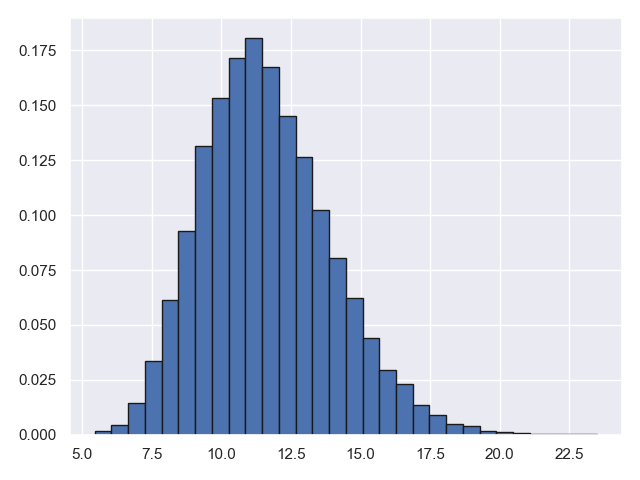
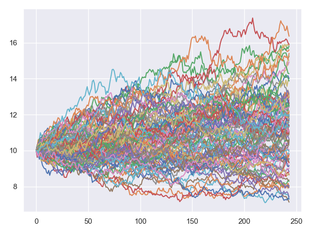

---
tags:
- 数学/概率统计
---

# 12 由静向动：随机过程导引

## 1.随机变量与随机过程

在详细介绍完随机变量的内容之后，这一部分我们开始进入到随机过程的部分中来。简单点说，随机过程就是一串随机变量的序列，在这个序列当中，每一个数据都可以被看作是一个随机变量，因此我们在随机过程的概率模型处理过程中，重点关注的就是时间和数据这两方面内容。所以简单地说，随机过程就是一串（有限或无限）随机变量序列，

常见的随机过程建模场景数不胜数，比如：

世界杯足球赛中每场比赛进球数构成的序列； 沪深 300 指数每日收盘价构成的数据序列； 某十字路口每分钟通过的车辆数量构成的序列；

等等等等，可以说这种例子涵盖了生活中的方方面面。

在讨论随机变量的时候，我们关注的是他的分布、数字特征等等，而此时，对于随机过程，将他们连成一个序列之后，我们的关注点更多的聚焦在序列之间的相关关系、序列整体的长期统计特征以及一些我们所包含的特定事件的发生概率。

## 2.随机过程实际场景举例

当然说了这么多，大家肯定感觉很抽象，我们来看几个实际的场景，并用随机过程对其进行建模，同时运用蒙特卡罗方法对其过程进行模拟。

### 2.1.赌博中的随机过程

赌博的例子非常普遍，这里我们举一个大家非常熟悉的例子，我们尽量挖掘的更深入一些。

赌徒和庄家对赌抛硬币，如果为正面，本轮赌徒赢，庄家付给赌徒 $1$ 元，结果为反面，本轮赌徒输，赌徒付给庄家 $1$ 元。赌徒有初始赌本 $10$ 元，手上的钱一旦输光则退出赌局，如何来模拟这个赌博过程？

我们首先来分析一下这个过程，赌徒的赌博结果本质上依托于每次抛掷硬币的结果，每一轮赌博就是一个伯努利试验，赢的概率是 $p=0.5$，赌博的过程就是由这一串伯努利试验构成的伯努利随机过程，每轮赌局中，如果赢则赌本增加 $1$ 元，输则赌本减少 $1$ 元。

当然了，如果对某一个特定的赌徒，一旦开始进入赌局，则最终由每轮赌局结果构成的序列就是唯一的。那么如果我们想观察整个赌博过程的整体特征，我们该怎么办？好办，还是使用之前讲过的蒙特卡罗方法，采用大量的样本，最终观察样本结果的整体特征。

这里，我们为了说明问题，先采用的样本数也就是赌徒数为 $10$ 个，轮数为 $100$ 轮，也就是每个赌徒最多和庄家对赌 100 轮，如果在这个过程中输光了赌本，则提前退出，如果到 $100$ 轮还有赌本，赌局也停止。

我们来看一下模拟的代码：

**代码片段：**

```python
import pandas as pd
import random

sample_list = []
round_num = 100
person_num = 10
for person in range(1, person_num + 1):
    money = 10
    for round in range(1, round_num + 1):
        result = random.randint(0, 1)
        if result == 1:
            money = money + 1
        elif result == 0:
            money = money - 1
        if money == 0:
            break
    sample_list.append([person, round, money])

sample_df = pd.DataFrame(sample_list, columns=['person', 'round', 'money'])
sample_df.set_index('person',inplace=True)

print(sample_df)
```

**运行结果：**

```
        round  money
person              
1          64      0
2         100     14
3          90      0
4         100     16
5          88      0
6         100     14
7         100      6
8          78      0
9          52      0
10         18      0
```

我们简单的分析一些代码和运行结果，其实这段代码中最核心的部分就是：

```
result = random.randint(0, 1)
```

在每轮赌局中，我们首先生成了一个随机变量，他在 $0$ 和 $1$ 当中等概论选取，模拟的就是抛掷硬币的过程，当结果为 $1$ 时表示硬币为正面，本轮赢庄家 $1$ 元，结果为 $0$ 时表示硬币为反面，本轮输庄家 $1$ 元。这里设定的是每个赌徒最多赌 $100$ 轮，如果不到 $100$ 轮就输光了，则退场，这样就模拟了整个赌博的随机过程。

从运行结果来看，$10$ 个赌徒中有 $6$ 个提前输光退场，剩下的 $4$ 个打满全场的人中，有 $3$ 个是挣钱的，有 $1$ 个是亏钱的。

当然，我们这里是为了打印出所有的结果，所以样本数选择的比较少。蒙特卡洛方法讲求大的样本量，我们把样本数和轮数都修改一下，并且统计一些指标。我们把赌徒的总人数设置为 $1000000$ 人，轮数设置为 $100$（我们依次修改了轮数为 $100$,$1000$,$10000$），来观察样本总体的表现：

**代码片段：**

```python
import pandas as pd
import random

sample_list = []
person_num = 100000
round_num = 10000
for person in range(1, person_num + 1):
    money = 10
    for round in range(1, round_num + 1):
        result = random.randint(0, 1)
        if result == 1:
            money = money + 1
        elif result == 0:
            money = money - 1
        if money == 0:
            break
    sample_list.append([person, round, money])
sample_df = pd.DataFrame(sample_list, columns=['person', 'round', 'money'])
sample_df.set_index('person',inplace=True)

print("总轮数:{},总人数:{}".format(round_num,person_num))
print("输光赌本提前出局的人数:{}".format(person_num-len(sample_df[sample_df['round']==round_num])))
print("赌满全场且盈利的人数:{}".format(len(sample_df[sample_df['money']>10])))
print("赌满全场且亏损的人数:{}".format(len(sample_df[sample_df['money']<=10][sample_df['money']>0])))
```

**运行结果：**

```
总轮数:100,总人数:100000
输光赌本提前出局的人数:31148
赌满全场且盈利的人数:44458
赌满全场且亏损的人数:23923
```

```
总轮数:1000,总人数:100000
输光赌本提前出局的人数:75154
赌满全场且盈利的人数:23441
赌满全场且亏损的人数:1386
```

```
总轮数:10000,总人数:100000
输光赌本提前出局的人数:91902
赌满全场且盈利的人数:8060
赌满全场且亏损的人数:38
```

从结果中不难发现，这种和庄家 $1:1$ 的对赌，随着轮数的增加，基本上都破产被收割了。换句话说，哪怕庄家不出千，输赢概率各半，赌的越久，基本上都是输光破产走人，原因是什么？原因是庄家的资金量是无穷的。

### 2.2.模拟股价的变化

赌博的例子结束了，我们再举一个股票的例子，这个让人感觉都很心跳啊，在金融工程中，有下面这样一个公式，他利用目前的股价 $S_t$ 去预测 $\Delta t$ 时间之后的股价 $S_{t+1}$：

$S_{t+1}=S_t+\hat{\mu}S_t\Delta t+\sigma S_t \epsilon\sqrt{\Delta t}$

这其中的参数我来解释一下：

$\hat{\mu}$ 表示股票收益率的期望值，这里我们设定为 $15\%$，即 $\hat{\mu}=0.15$

$\sigma$ 表示股票的波动率，这里设定为 $\sigma=0.2$

$\Delta t = \frac{T}{n}$，其中 $T$ 表示整数年份，$n$ 表示在整个估算周期内，取的具体步数，就好比说 $T$ 为一年，$n$ 如果取 $244$，那么 $\Delta t$ 的粒度就是每个交易日了（一年有 $244$ 个交易日）。

这里面似乎所有的参数都是确定的，唯独除了 $\epsilon$ 之外，$\epsilon$ 是一个服从标准正态分布的随机变量，这是这个 $\epsilon$，决定了每日的股价 $S_i$ 是一个随机变量，而由股价构成的序列是一个随机过程。

我们同样的用蒙特卡罗方法，利用大样本来估计一下在目前股价为 $S_0=10$ 的情况下，$1$ 年之后股价的概率分布情况。

**代码片段：**

```python
import scipy
import matplotlib.pyplot as plt
import seaborn
from math import sqrt
seaborn.set()

s0 = 10.0
T = 1.0
n = 244 * T
mu = 0.15
sigma = 0.2
n_simulation = 10000

dt = T/n
s_array = []

for i in range(n_simulation):
    s = s0
    for j in range(int(n)):
        e = scipy.random.normal()
        s = s+mu*s*dt+sigma*s*e*sqrt(dt)
    s_array.append(s)

plt.hist(s_array, bins=30, normed=True, edgecolor='k')
plt.show()
```

**运行结果：**

 这是我们模拟了 $10000$ 个样本经过上述随机过程，在一年之后股价的分布情况。

这里的核心就是：

```python
 e = scipy.random.normal()
 s = s+mu*s*dt+sigma*s*e*sqrt(dt)
```

每一轮 $\Delta t$，我们都生成一个服从标准正态分布的随机变量 $\epsilon$，不断通过递推公式 $S_{t+1}=S_t+\hat{\mu}S_t\Delta t+\sigma S_t \epsilon\sqrt{\Delta t}$，迭代出下一个时间点的股价，循环往复直到生成一年后的最终结果，这样就模拟出了一年过程中股价随机变量序列构成的随机过程。

我们采用蒙特卡罗方法，设置大样本量（这里设置 $10000$ 个），最终迭代出 $10000$ 个对应的一年后股价，然后用柱状图就能看出其总体分布特征。

### 2.3.股价变化曲线的过程展现

上面我们分析的是这 $10000$ 个样本在一年之后最终股价的整体分布情况，实际上我们还有一个同样重要的过程可以进行监测和展现，那就是从 $T_0$ 时刻起到 $1$ 年后的这一段时间内，每隔 $\Delta t$ 时间间隔点由实时价格随机变量构成的序列，换句话说就是随机过程的整体展现。

这个在上面的基础上进一步完成，其实不难，就是我们不光要计算出股票最终的价格，还有记录下每个 $\Delta t$ 时间点的价格，并把他记录下来。

**代码片段：**

```python
import scipy
import matplotlib.pyplot as plt
import seaborn
from math import sqrt
import numpy as np
seaborn.set()

s0 = 10.0
T = 1.0
n = 244 * T
mu = 0.15
sigma = 0.2
n_simulation = 100

dt = T/n
random_series = np.zeros(int(n), dtype=float)
x = range(0, int(n))

for i in range(n_simulation):
    random_series[0] = s0
    for j in range(1,int(n)):
        e = scipy.random.normal()
        random_series[j] = random_series[j-1]+mu*random_series[j-1]*dt+sigma*random_series[j-1]*e*sqrt(dt)
    plt.plot(x, random_series)

plt.show()
```

**运行结果：**

 这里我们清晰的展现出了由 $244$ 个 $\Delta t$ 时间点的股价数据所构成的序列，这是随着时间变化的随机过程。我们为了从整体把握他的分布特征，设定了 $100$ 个样本，因此模拟出了 $100$ 条价格曲线。

这种结果图表面上看起来比较凌乱，实际上可以从整体上发现许多端倪，例如股价在运行过程中的整体分布区间，上下界，集中程度等等，都可以有一个整体的把握。

因此我们不仅可以得到最终股价的分布，也可以知道股价运行变化的完整价格路径，这个价格路径代表了蒙特卡罗方法的精髓，通过这个价格路径的可视化呈现，让我们更加直观的从宏观上把握了随机过程。

## 3.两类重要的随机过程概述

随机过程的种类非常多，应用也非常的广，上面的例子中，我们通过赌博、炒股的例子进行了直观的随机过程模拟和展示，那么下面，我们回归到经典的模型中来。

有两类重要且常用的随机过程：**到达过程**和**马尔科夫过程**。

**第一类：到达过程。** 即关注的是某种“到达”的事件是否发生，比如在一个服务窗口前，顾客的到达时刻；十字路口车辆依次通过的时刻，这里面我们重点关注的就是相邻两次到达时刻之间的时间（我们称之为相邻间隔时间）为相互独立的随机变量的模型。

这里面又细分为了两类情况：在到达时间为离散的情况下，随机过程为伯努利过程，相邻间隔时间服从几何分布。另一类是相对应的，到达时间为连续的情况下，随机过程为泊松过程，相邻间隔时间服从指数分布。

这一类过程最明显的特征就是相邻间隔时间相互独立，且随机过程无记忆性，比如该窗口上一时刻来没来一个顾客，都不对下一个时刻是否来顾客提供信息，包括之前举的赌博的例子也是这样，这一轮赌徒是赢还是输，并不对下一轮赌局的输赢带来任何影响。

而与之相对的，就是未来的数据与历史数据有关联、有联系，比如前面举的另一个股价变化的例子。未来的股价是和历史股价有关联关系的。在这一类随机过程里，有一种模型最为重要：即我们要介绍的**第二类：马尔科夫过程：** 未来的数据只依赖于当前的数据，而与过去的历史数据无关。马尔科夫过程非常重要，我们将重点花篇幅详细讨论。