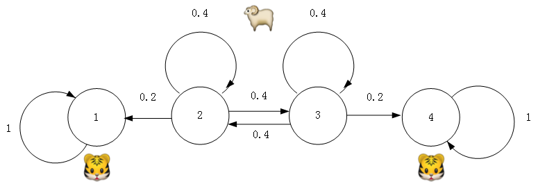
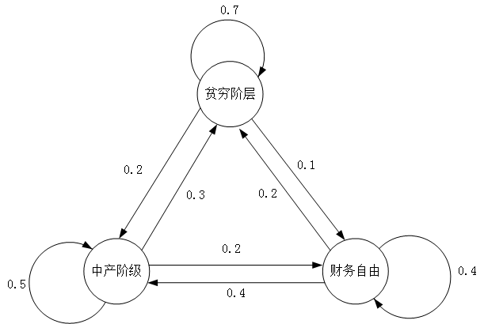
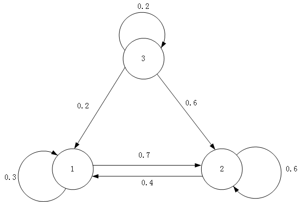
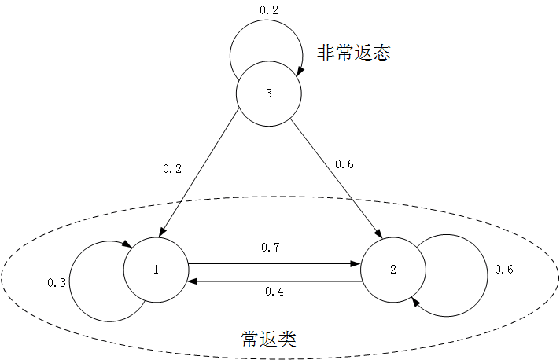
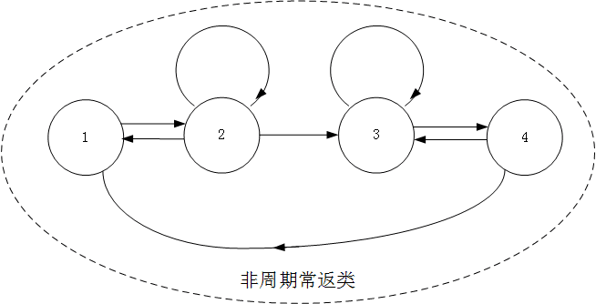
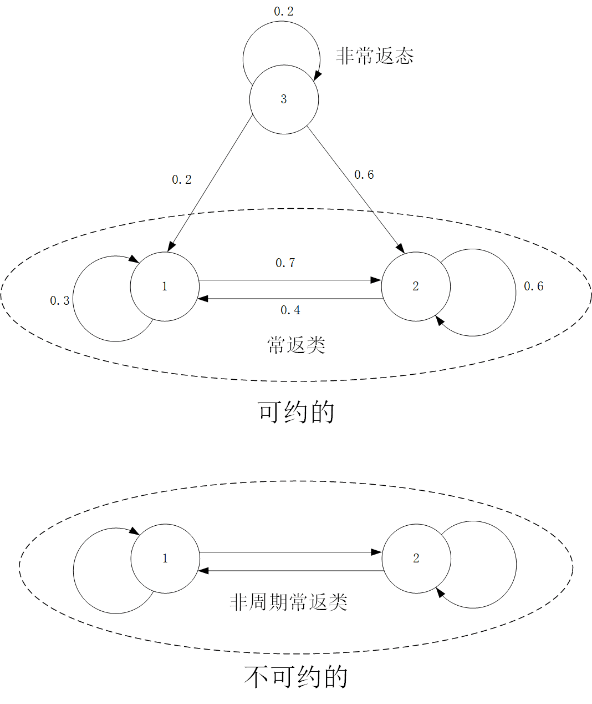

---
tags:
- 数学/概率统计
---

# 14 变与不变：马尔科夫链的极限与稳态

## 1.马尔科夫链的极限行为

### 1.1.极限与初始状态无关的情况

这里我们接着上一节的社会阶层流动概率转移矩阵来引入极限行为的话题。

对于转移概率矩阵 $\begin{bmatrix}0.7 & 0.2 & 0.1 \\ 0.3 & 0.5 & 0.2 \\ 0.2 & 0.4 & 0.4 \end{bmatrix}$，我们在上一小节已经计算过随着转移步数 $n$ 的逐步增大，$n$ 步转移概率矩阵收敛于：

$$\begin{bmatrix}0.46808511 & 0.34042553 & 0.19148936 \\ 0.46808511 & 0.34042553 & 0.19148936 \\ 0.46808511 & 0.34042553 & 0.19148936 \end{bmatrix}$$

我们观察一下这个收敛矩阵，他最重要的特点就是当 $n\rightarrow \infty$ 时，矩阵中的每一个值都会收敛于一个极限值，这个极限值不依赖于初始状态 $i$。换句话说，你的老祖宗无论是处于贫穷阶层、中产阶级还是财富自由，过来很多代之后，你处于任何一个阶层的概率都是一定的，跟你祖先的状态已经没有关系了。

因此当时间 $n$ 比较小的时候，$n$ 步转移概率矩阵中的值还会比较依赖于他的初始状态 $i$，而当 $n$ 不断增大时，这种依赖性将会逐渐消失，贫穷阶层、中产阶级和财富自由都趋近于一个正的稳态概率，而位于哪个初始状态已经可以忽略不计了。

### 1.2.极限依赖于初始状态的情况

许许多多随时间变化的概率模型都有上面提到的性质，但这并不是全部。还有一种极限的情况是，随着 $n\rightarrow \infty$ 时，矩阵中的每一个值依然会收敛于一个极限值，但不同的是，这些极限值会依赖于最初位于哪一个初始状态（在矩阵中的具体表现形式就是：矩阵不是每一行都相等）。

我们举一个例子：这是一个老虎和羊的故事。


有一只羊，在图中的四个区域内移动，每次只能移动一个位置，这只羊如果在区域 $2$ 和区域 $3$ 之间移动，则平安无事，如果一旦移动到区域 $1$ 或者是区域 $4$，则立马就会被老虎吃掉，他的尸骨也就永远的停留在了那里，一切也就结束了。

各个区域之间的转移概率，我们都已经标注在了上面的这幅转移概率图当中了，转移概率矩阵如下：$\begin{bmatrix}1 & 0 & 0 & 0 \\ 0.2 & 0.4 & 0.4 & 0 \\ 0 & 0.4 & 0.4 & 0.2 \\ 0 & 0 & 0 & 1\end{bmatrix}$。

那么我们接下来还是来观察一下他的 $n$ 步转移概率矩阵：

**代码片段：**

```python
import numpy as np

A = np.array([[1, 0, 0, 0],
              [0.2, 0.4, 0.4, 0],
              [0, 0.4, 0.4, 0.2],
              [0, 0, 0, 1]])

def get_matrix_pow(matrix, n):
    ret = matrix
    for i in range(n):
        ret = np.dot(ret,A)
    print(ret)

get_matrix_pow(A,5)
get_matrix_pow(A,10)
get_matrix_pow(A,50)
get_matrix_pow(A,100)
```

**运行结果：**

```
[[ 1.        0.        0.        0.      ]
 [ 0.468928  0.131072  0.131072  0.268928]
 [ 0.268928  0.131072  0.131072  0.468928]
 [ 0.        0.        0.        1.      ]]

[[ 1.          0.          0.          0.        ]
 [ 0.55705033  0.04294967  0.04294967  0.35705033]
 [ 0.35705033  0.04294967  0.04294967  0.55705033]
 [ 0.          0.          0.          1.        ]]

[[  1.00000000e+00   0.00000000e+00   0.00000000e+00   0.00000000e+00]
 [  5.99994291e-01   5.70899077e-06   5.70899077e-06   3.99994291e-01]
 [  3.99994291e-01   5.70899077e-06   5.70899077e-06   5.99994291e-01]
 [  0.00000000e+00   0.00000000e+00   0.00000000e+00   1.00000000e+00]]

[[  1.00000000e+00   0.00000000e+00   0.00000000e+00   0.00000000e+00]
 [  6.00000000e-01   8.14814391e-11   8.14814391e-11   4.00000000e-01]
 [  4.00000000e-01   8.14814391e-11   8.14814391e-11   6.00000000e-01]
 [  0.00000000e+00   0.00000000e+00   0.00000000e+00   1.00000000e+00]]
```

很明显，我们发现随着 $n\rightarrow \infty$，$n$ 步转移概率矩阵收敛于 $\begin{bmatrix}1 & 0 & 0 & 0 \\0.6 & 0 & 0 & 0.4 \\0.4 & 0 & 0 & 0.6 \\0 & 0 & 0 & 1\end{bmatrix}$。

### 1.3.吸收态与收敛分析

$\begin{bmatrix}1 & 0 & 0 & 0 \\0.6 & 0 & 0 & 0.4 \\0.4 & 0 & 0 & 0.6 \\0 & 0 & 0 & 1\end{bmatrix}$ 这个矩阵看上去很简单，实际上内涵却非常深刻：

首先，在这四个状态中，有两个状态可以被称作是“**吸收**”状态，也就是说一旦到达了这个状态，就不再有任何机会转移到其他状态，而是将永远处于这个状态，我们这个例子中的吸收态就是状态 $1$ 和状态 $4$，用图中的故事来打比方，就是羊一旦走到了区域 $1$ 和区域 $4$，就羊入虎口，再也回不来了。

其次，虽然 $n$ 步转移概率矩阵在数值上也会收敛，但是收敛的极限值会依赖于初始状态。这个很容易理解，最开始羊位于区域 $2$，他死于区域 $1$ 的老虎的概率是 $0.6$，而如果羊最开始位于区域 $3$，则它死于区域 $1$ 的老虎的概率是 $0.4$，他更大可能是落入区域 4 的虎口。

最后，我们发现随着 $n\rightarrow \infty$, $n$ 步转移概率矩阵中，状态 $2$ 和状态 $3$ 两列都收敛为 $0$，换句话说就是无论羊初始位于哪个状态，只要时间给的够长，最终他们都只有两个归宿：落入区域 $1$ 的虎口或者落入区域 $4$ 的虎口，没有活下来的希望。

## 2.可达、常返与常返类

### 2.1.可达性

从我们举的阶级流动和羊入虎口两个例子可以看出，二者所表现出来的状态是有很大区别的。一方面是两个例子中马尔科夫链的状态性质不同，另一方面也决定了随着 $n\rightarrow \infty$ 时，二者的极限表现不同。

我们还是把阶级流动的那个图再拿出来对比看看：



在这幅转移概率图中，我们可以发现，任取两个状态，状态 $i$ 和状态 $j$，从状态 $i$ 出发可以到达状态 $j$。而羊入虎口那幅图就不是这么个情况了，如果我们选择从状态 $2$ 出发，可以到达其他任意的状态，但是如果我们从状态 $1$ 出发，除了自身以外，到达不了任何其他的状态。

### 2.2.常返

从上述的可达性，我们就能引出常返和非常返的新概念了：

对于一个状态 $i$，如果对于**每个**从状态 $i$ 出发可达的状态 $j$，相应的从状态 $j$ 出发，反过来也可到达状态 $i$，那么状态 $i$ 就是常返的。这是通俗的说法，我们如果用数学的形式化语言来描述就是：

我们令状态 $i$ 的可达状态集合为 $A(i)$，对于集合 $A(i)$ 中的每一个状态 $j$，如果 $i \in A(j)$，那么状态 $i$ 就是可达的。

那么在阶级流动概率转移图中，中产阶级的可达状态集是 $\{贫穷阶层，中产阶级，财务自由\}$，那么这个可达状态集中任意一个状态也都可以到达“中产阶级”，因此中产阶级状态是常返的。同理其余两个状态也都是常返的。

而在羊入虎口这个例子中则不然，对于状态 $2$ 和状态 $3$ 而言，他们都可以到达状态 $1$ 和状态 $4$，但是反过来，从状态 $1$ 和状态 $4$ 都无法到达状态 $2$ 和状态 $3$，因此状态 $2$ 和状态 $3$ 是非常返的。而状态 $1$ 和状态 $4$ 的可达状态集都只包含自身，因此他们是常返的。

我们结合这两个例子中概率转移矩阵的极限来直观的讨论常返和非常返的本质内涵：

在羊入虎口的例子中，随着 $n\rightarrow \infty$, $n$ 步转移概率矩阵为 $\begin{bmatrix}1 & 0 & 0 & 0 \\0.6 & 0 & 0 & 0.4 \\0.4 & 0 & 0 & 0.6 \\0 & 0 & 0 & 1\end{bmatrix}$，也就是随着 $n$ 的增大，在某个时刻之后，马尔科夫链将永远不会再返回该状态。从矩阵的数值来看，确实也是如此。

### 2.3.常返类

有了常返状态和非常返状态的概念之后，我们再引出常返类的概念就很好理解了。如果状态 $i$ 是一个常返状态，那么状态 $i$ 的可达状态集就构成了一个常返类，我们把之前的概率转移图修改一下，对着图来说：



我们可以看到，状态 $1$ 和状态 $2$ 是常返状态，状态 $3$ 是非常返状态，同时状态 $1$ 的可达状态集是 $\{状态 1，状态 2 \}$，因此状态 $1$ 和状态 $2$ 构成了一个常返类，于是这个马尔科夫链就被分解成为了一个常返类和一个非常返状态。



从这个图中，我们很容易概况出一些非常直观且重要的结论：

第一就是**常返类只进不出**：

一旦一个状态进入到了一个常返类当中，他将永远的停留在这个类里面，因为依据常返类的定义，常返类当中的状态都是相互可达的，而常返类外的状态是不可达的，就像这幅图中，一旦从状态 $3$ 进入到了常返类（状态 $1$ 或者状态 $2$）中，就只会在里面转移，不会再离开常返类返回状态 $3$ 了。

第二就是**不管开局如何，终将进入常返类**：

这个怎么讲呢，即使状态开始位于一个非常返状态，但是随着 $n$ 的不断增大，前期的状态序列还会包含非常返状态，但在后期，特别是当 $n$ 很大的时候，状态序列的后面一定由来自同一个类的常返状态组成。这里我们如果把常返类看做一个大号的吸收态（这种描述不一定很准确），相信大家就能理解了。一样的，在这幅图中，如果开局从状态 $3$ 起步，早期可能会在状态 $3$ 那兜兜圈子，到了最后一定落入状态 $1$ 和状态 $2$ 的常返类中。

### 2.4.常返类与唯一稳态

因此结合前后的知识我们发现：很显然，有多个常返类的马尔科夫链，一定不会收敛于一个唯一的稳态分布。

## 3.周期性问题

光有单个常返类这一个条件，显然是不够的，如果这个常返类是周期性的，就如同下面这个最简单的图所示，假设他从状态 $1$ 出发，即使 $n\rightarrow \infty$，如果 $n$ 为奇数，则状态转移到状态 $2$，如果 $n$ 为偶数，则状态转移到状态 $1$，显然是不收敛的。


具体来说，要判断一个常返类 $R$ 是不是周期的，这里有一个简单的判定方法，只要存在一个特定的 $n \ge 1$,和 $R$ 中某一个特定的状态 $i$，使得经过 $n$ 步之后可以到达常返态 $R$ 中的任意状态，那么这个常返态就是非周期的。这个判定方法很简单。

上面的这幅图，不存在这样的 $n$ 值，因此验证了其是周期的，而在下面这幅图中，我们发现当 $n=3$ 的时候，从状态 $1$ 出发，可以到达常返类中的四个状态 $\{1,2,3,4\}$，因此他是非周期的。



再看阶级流动图，那就更简单了，当 $n=1$ 时，可以到达其余全部状态。

而对于上面这幅周期性的常返图，我们扣定义，简单的做一点小的修改，就能将其改成非周期的：


## 4.马尔科夫链的稳态分析

### 4.1.稳态的定义

那么到底什么是稳态？稳态这个概念从何而来，就从我们之前反复提及的当 $n\rightarrow \infty$ 时，$n$ 步转移概率矩阵中每个数值的收敛情况而来。

对于马尔科夫链中的每一个状态 $j$，$n$ 步转移概率值 $r_{ij}(n)$ 会趋近于一个独立于初始状态 $i$ 的极限值，我们通常把这个极限值记作是 $\pi_{j}$。

更重要的是，独立于初始状态 $i$，就意味着无论从哪个初始状态开始，经过 $n$ 步转移（$n\rightarrow \infty$）到状态 $j$ 的概率都是 $\pi_{j}$，因此在稳态下，处于状态 $j$ 的概率也同样趋近于极限值 $\pi_j$，即 $P(X_n=j)\rightarrow \pi_j (当 n\rightarrow \infty)$。

### 4.2.讨论唯一稳态分布的条件

那么此时，我们综合一下：随着 $n\rightarrow \infty$，马尔科夫链要收敛于一个稳态分布，首先他得是非周期的，其次如果要求这个稳态分布是唯一的，则这个马尔科夫链必须只含有一个常返类。

在此基础上，我们进一步讨论两个更强的约束条件：

### 4.3.不可约条件

较之单个常返类而言，马尔科夫链的不可约条件则更强，从概念上来说，一个不可约的马尔科夫链指的是，从任意一个状态出发，当经过充分长时间之后，可以到达任意状态。否则就叫作可约的。很显然，含有多个常返类的肯定是可约的，即使只有一个常返类，也不一定就是不可约的，看看下面这幅图，对比一下就明白了：



满足不可约条件意味着马尔科夫链的各个状态之间是全联通的，这个条件是为了确保随着 $n\rightarrow \infty$，马尔科夫链收敛的唯一稳态分布中的每个状态的概率都大于 $0$。

### 4.4.正常返

正常返也是在常返的概念上更进了一层，指的是对于任意一个状态，从其他任意一个状态出发，当时间趋近于无穷时，首次转移到这个状态的概率不为 $0$。正常返是常返的一个子类，表示在常返的概念基础上，还附加一个转移步数有限的条件。

这个条件主要针对无限状态的马尔科夫链，他也是为了保证在这种情况下，马尔科夫链收敛的唯一稳态分布中的每一个状态的概率都大于 $0$。

### 4.5.唯一平稳分布存在性的判定

最终，我们得到：在不可约、非周期、正常返的条件下，马尔科夫链拥有唯一稳态分布，且每个状态的概率都大于 $0$。

## 5.稳态的求法

解决了关于存在性的问题之后，我们其实最关心的还是稳态的求法，这个就要回归到马尔科夫链的定义中去理解了。

我们还是对照阶级流动的马尔科夫链的状态转移图来观察：


我们令贫穷阶层为状态 $1$，中产阶级为状态 $2$，财务自由为状态 $3$，当马尔科夫链到达稳态之后，三个概率趋近于极限值：$\pi_1$，$\pi_2$，$\pi_3$。

那么首先依据分布概率的归一性原则，有：$\pi_1+\pi_2+\pi_3=1$

然后，我们思索一下稳态的本质含义，就是到达稳态后，经过下一个时间的状态转移，马尔科夫链的概率分布保持不变，这就叫平稳。即状态一旦进入稳态分布，那么未来任何时候的状态都保持这个稳态分布不变。

依据这个平稳的概念，我们又可以拿出几个方程：

针对状态 $1$ 贫穷阶层，我们有：$0.7\pi_1+0.3\pi_2+0.2\pi_3=\pi_1$
针对状态 $2$ 中产阶级，我们有：$0.2\pi_1+0.5\pi_2+0.4\pi_3=\pi_2$
针对状态 $3$ 财务自由，我们有：$0.1\pi_1+0.2\pi_2+0.4\pi_3=\pi_3$

核心意思就是，经过状态转移后，下一个时间点的各状态概率依然和本时刻相等。

当然我们可以不写成这么臃肿的形式，写成一个初始状态向量乘以一步转移概率矩阵的形式，意思就更加简洁明了：

$$\begin{bmatrix}\pi_{1}&\pi_{2}&\pi_{3}\end{bmatrix}\begin{bmatrix}0.7 & 0.2 & 0.1 \\ 0.3 & 0.5 & 0.2 \\ 0.2 & 0.4 & 0.4 \end{bmatrix}=\begin{bmatrix}\pi_{1}&\pi_{2}&\pi_{3}\end{bmatrix}$$

同时满足归一性 $\pi_1+\pi_2+\pi_3=1$ 的约束条件。

我们通过解方程组可以得到：

$\pi_1=0.46808511$ $\pi_2=0.34042553$ $\pi_3=0.19148936$

我们发现其实这和 $n\rightarrow \infty$ 时的 $n$ 步转移概率矩阵 $\begin{bmatrix}0.46808511 & 0.34042553 & 0.19148936 \\ 0.46808511 & 0.34042553 & 0.19148936 \\ 0.46808511 & 0.34042553 & 0.19148936 \end{bmatrix}$，中各行的值是一样的，的确应该一样，这正契合了我们前面讲过的原理。