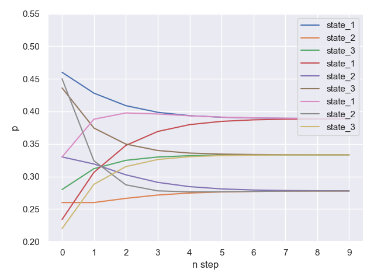
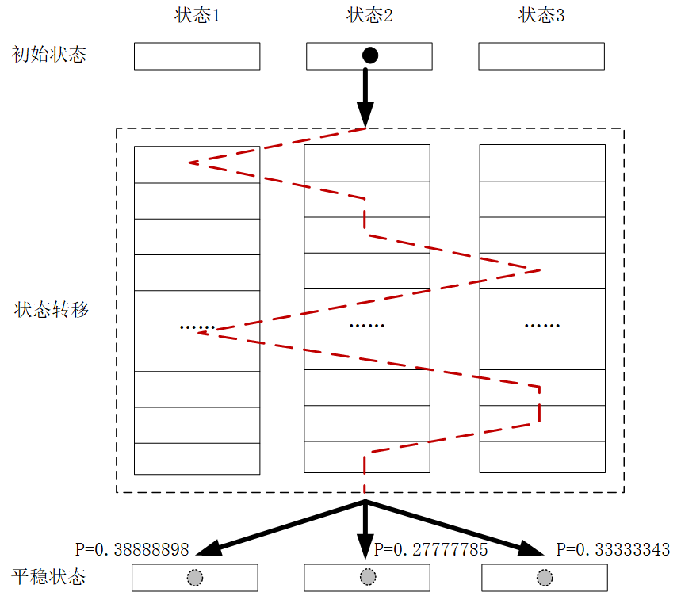
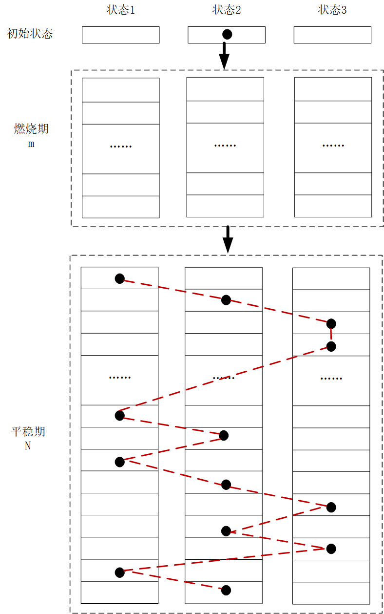
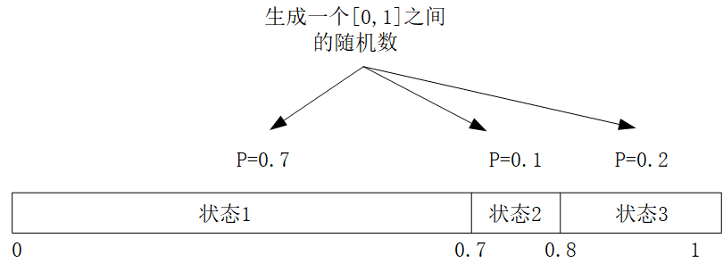

---
tags:
- 数学/概率统计
---

# 15 基于马尔科夫链的近似采样

从这一小节开始，我们主要来介绍基于马尔科夫链的近似采样过程。具体如何采样，以及整个采样过程中的思维过程，我们随着这节的内容讲解而逐步展开。

## 1.再看马尔科夫链的稳态

在基于马尔科夫链的采样过程中，发挥核心关键作用的是马尔科夫链的稳态以及稳态分布。稳态的概念，我们在之前的内容中已经详细的讲解过了，为了充分理解他，用好它，我们在这里动态的演示一下一个指定的马尔科夫链的状态转移以及最终到达稳态的过程。

通过下面这段代码运行出来的实际效果，大家会非常直观的理解马尔科夫链的稳态。

**代码片段：**

```python
import numpy as np
import matplotlib.pyplot as plt
import seaborn
seaborn.set()

transfer_matrix = np.array([[0.7, 0.1, 0.2],
                [0.3, 0.5, 0.2],
                [0.1, 0.3, 0.6]], dtype='float32')

start_state_array = np.array([[0.50, 0.30, 0.20],
                  [0.13, 0.28, 0.59],
                  [0.10, 0.85, 0.05]], dtype='float32')

trans_step = 10

for i in range(3):
    state_1_value = []
    state_2_value = []
    state_3_value = []
    for _ in range(trans_step):
        start_state_array[i] = np.dot(start_state_array[i], transfer_matrix)
        state_1_value.append(start_state_array[i][0])
        state_2_value.append(start_state_array[i][1])
        state_3_value.append(start_state_array[i][2])
    
    x = np.arange(trans_step)
    plt.plot(x, state_1_value, label='state_1')
    plt.plot(x, state_2_value, label='state_2')
    plt.plot(x, state_3_value, label='state_3')
    plt.legend()
    
    print(start_state_array[i])

plt.gca().axes.set_xticks(np.arange(0, trans_step))
plt.gca().axes.set_yticks(np.arange(0.2, 0.6, 0.05))
plt.gca().axes.set_xlabel('n step')
plt.gca().axes.set_ylabel('p')

plt.show()
```

**运行结果：**

```
[0.3889705  0.27771026 0.33331943]
[0.38872722 0.27791262 0.3333603 ]
[0.3890072  0.27768928 0.33330372]
```



从运行的结果中我们发现，这个马尔科夫模型拥有三个状态：状态 $1$，状态 $2$ 和状态 $3$，不论初始分布是 $[0.50,0.30,0.20]$、$[0.13,0.28,0.59]$ 还是 $[0.10,0.85,0.05]$，经过多轮的状态转移之后都会收敛到了同一个分布 $[0.3888,0.2777,0.3333]$，也就是我们所说的稳态分布。

## 2.马尔科夫链的稳态与采样的关系

可以说，马尔科夫链的平稳分布是一个意义非凡的重要特性，我们换个角度说明一下大家就能明白他的重要意义：也就是说无论我们的起始状态是位于状态 $1$、状态 $2$ 还是状态 $3$，在状态转移矩阵 $P$ 的作用下，经过足够大的 $n$ 步转移之后，他位于状态 $1$ 的概率是 $0.3888$，位于状态 $2$ 的概率是 $0.2777$，位于状态 $3$ 的概率是 $0.3333$。

利用下面这幅图，我们可以把这个状态转移和到达稳态的过程表达的更加直白一些：



好比说我们有一颗小石头，在最开始的时候，他可以位于任意一个初始状态，这里为了方便画图，假设他处于状态 $2$。那么从初始状态开始，在状态转移矩阵中的转移概率的作用下，这颗小石头不停的在状态 $1$、状态 $2$ 和状态 $3$ 之间随机游走，图中的红色虚线示意了其中具体的某一条转移路径。

当然转移的路径可不止这一条，在状态转移的过程中，状态之间的转移概率等于该马尔科夫链的状态转移矩阵对应位置上的元素 $P_{ij}$ ,那么经过足够多的 $n$ 步转移之后，这个小石头将最终依概率落入到三个状态中的某一个当中，具体就是：落入到状态 $1$ 的概率是 $0.3888$，落入到状态 $2$ 的概率是 $0.2777$，落入到状态 $3$ 的概率是 $0.3333$。

当然如果只有一个小石头，最终他还是只会落入到具体的某一个状态当中，但是如果小石头的数量足够多，那么这不就是一个大数定理的实际应用了吗，我们拿足够多的小石头，从任意的初始状态出发，最终落入到各个状态中的小石头的数量所占的比例就等于各个状态的平稳分布概率。

## 3.基于马尔科夫链进行采样的思路

### 3.1.背后的大数定理

那么，我们重新提炼一下这里面的核心思路。

我们这里提到的马尔科夫链，他的状态转移矩阵 $\begin{bmatrix}0.7 & 0.1 & 0.2 \\ 0.3 & 0.5 & 0.2 \\ 0.1 & 0.3 & 0.6 \end{bmatrix}$ 对应的稳态分布是 $[0.3888,0.2777,0.3333]$。如果我们利用大的数据样本，从任意的初始状态出发，经过足够长的步数转移之后，我们去统计和计算落入到三个状态中的小石头各自所占的比例，就可以近似为平稳分布。

由此我们就实现了利用数值模拟的方法对这个目标平稳分布的采样，这就是**基于马尔科夫链的采样方法的思维雏形**。

### 3.2.时间分布与空间分布的一致性

在基于马尔科夫链的采样过程中，我们如何来具体进行方法的实施呢？怎样来实现对大样本的模拟？

比如我们采样的样本数定为 $100000$ 个，我们最简单粗暴的方法是对每一个样本都执行一次 $n$ 步转移（这个 $n$ 相对较大，要保证进入到马尔科夫链的稳态当中），但是这样一来计算量相当大，每次只利用了采样过程中的最后一个状态，且要运行 $100000$ 次进入平稳状态的转移过程，数据的利用率很低，浪费也很大。

实际上在基于马尔科夫链的具体采样过程中，我们往往只需要进行一次转移过程，就能够实现了整个采样过程。

这里，我们依托的是之前讲过的稳态分布的基本定义，即对于一个马尔科夫链，如果他的状态转移矩阵是 $P$，稳态分布是 $\pi$，那么他们满足 $\pi=P\pi$ 的相等关系。

这里的意思就是说，我们只需要对一个小石头进行状态转移就可以实现采样的目标。即：在他进入到稳态的那一刻（我们记作时刻 $t_0$）开始，他依照稳态分布中的概率进入到状态 $1$、状态 $2$ 或者状态 $3$ 当中的任意一个，那么当小石头从 $t_0$ 时刻的状态向下一个时刻（也就是 $t_1$ 时刻）转移时，依照 $\pi=P\pi$ 的相等关系，这个小石头仍然是依照稳态的概率分布进入到状态 $1$、状态 $2$ 或者状态 $3$ 中的任意一个，那么此时在 $t_1$ 时刻，小石头和之前经过千辛万苦在 $t_0$ 时刻进入稳态时的状态本质上是一回事儿。

以此类推，对于后面的所有转移时刻：$t_2$，$t_3$，…,$t_N$，小石头在每时每刻都依概率进入到三个状态中的一个，这个概率同样也是稳态分布的概率。

那么好，这么说来我们确实只用对一个小石头的一次转移过程进行跟踪就可以了。我们巧妙的**用时间的平稳分布等价替代了空间的平稳分布**，省时省力。我们具体定义和描述一下这里面涉及到的变量和过程：

### 3.3.具体实施过程

假如我们需要采样的样本数是 $N$ 个，而进入到稳态所需要的转移次数是 $m$ 次（我们把 $m$ 次的转移过程称作是燃烧期），那么我们就记录这一个小球从 $m$ 到 $m+N$ 这 $N$ 次转移的过程中（我们把进入稳态后的转移过程称作是平稳期）的每个时间点所处的状态，那么我们记录下的这 $N$ 个状态就一定服从稳态分布中各个状态的概率。于是我们仅仅通过跟踪一次状态转移的过程，就能够对目标分布实现基于马尔科夫链的样本采样。

我们通过下面这幅图，来示意整个采样的全过程：



这幅图说的很明白了，我们只跟踪这一个小石头，当小石头经过 $m$ 次转移的燃烧期进入到平稳期之后，每一次转移我们都记录下他所处的状态，我们的采样样本数是 $N$，那么我们就在平稳期内让小石头按照状态转移矩阵进行 $N$ 次转移，从而得到 $N$ 个采样结果，这 $N$ 个采样结果的状态分布就和稳态分布一致。

## 4.采样过程实践与分析

### 4.1.代码实现与仿真结果

前面讲了这么多的方法和原理，我们下面用 $python$ 工具实际进行采样操作。我们需要采样的目标分布是 $[0.3888,0.2777,0.3333]$，他是转移概率矩阵为 $\begin{bmatrix}0.7 & 0.1 & 0.2 \\ 0.3 & 0.5 & 0.2 \\ 0.1 & 0.3 & 0.6 \end{bmatrix}$ 的马尔科夫链的稳态分布。

我们运用基于马尔科夫链的采样方法对目标分布进行采样，统计最终各个状态中样本的实际比例：

**代码片段：**

```python
import numpy as np
from scipy.stats import uniform
import random

def randomstate_gen(cur_state, transfer_matrix):
    uniform_rvs = uniform().rvs(1)
    i = cur_state-1
    if uniform_rvs[0] <= transfer_matrix[i][0]:
        return 1
    elif uniform_rvs[0] <= transfer_matrix[i][0]+transfer_matrix[i][1]:
        return 2
    else:
        return 3
    
    
transfer_matrix = np.array([[0.7, 0.1, 0.2],
                            [0.3, 0.5, 0.2],
                            [0.1, 0.3, 0.6]], dtype='float32')
m = 10000
N = 100000

cur_state = random.choice([1, 2, 3])
state_list = []
for i in range(m+N):
    state_list.append(cur_state)
    cur_state = randomstate_gen(cur_state, transfer_matrix)
    
state_list = state_list[m:]

print(state_list.count(1)/float(len(state_list)))
print(state_list.count(2)/float(len(state_list)))
print(state_list.count(3)/float(len(state_list)))
```

**运行结果**

```
0.38726
0.27636
0.33638
```

我们将运行的结果和实际上的平稳分布 $[0.3888,0.2777,0.3333]$ 进行一番对比，发现采样的结果是服从目标分布的。

### 4.2.依概率进行随机游走的模拟实现

这里面的代码是值得好好分析一番的：

首先的一个问题是：在代码当中，当我们此时位于状态 $i$，即 $cur \_state=i$ 时，我如何决定下一个生成的状态 $j$ 到底是状态 $1$，状态 $2$ 还是状态 $3$ 呢？

很简单，这需要依赖于我们写的一个功能函数 $randomstate\_gen$，他的参数是马尔科夫链当前所处的状态和他的状态转移矩阵。我们举例说明他的具体工作原理，假如此时马尔科夫链处于状态 $1$，那么依照状态转移矩阵 $\begin{bmatrix}0.7 & 0.1 & 0.2 \\ 0.3 & 0.5 & 0.2 \\ 0.1 & 0.3 & 0.6 \end{bmatrix}$ 的第一行，他有 $0.7$ 的概率继续留在状态 $1$，有 $0.1$ 的概率转移到状态 $2$，有 $0.2$ 的概率转移到状态 $3$。

我们该怎么办？我们就生成一个 $[0,1]$ 之间，满足均匀分布的随机数，如果他落在 $[0,0.7]$（区间的长度是 $0.7$）之间，我们就决定下一个转移状态是状态 $1$，如果落在 $[0.7,0.8]$（区间的长度是 $0.1$）之间，就转移到状态 $2$，如果落在 $[0.8,1]$ 范围内（区间的长度是 $0.2$），我们就转移到状态 $3$。

实际上，我们就是用区间的不同长度来等效了各自的不同概率，原理如下图所示：


那么，首先我们从三个状态中任选一个，将其作为采样过程的初始状态，然后进入到状态转移的过程中。

我们设置燃烧期为 $m=10000$（当然实际上不需要这么久才进入稳定期，不过多一点倒无所谓，保险一些，可以确保肯定已经进入到了平稳期），平稳期我们设置为 $N=100000$，然后我们让这个小石头按照状态转移矩阵的要求，随机游走 $m+N$ 次，并且依次记录下每次游走的状态，随机游走过程结束后，我们去掉燃烧期收集的状态样本，只统计平稳期内各个状态的数量以及所占比例，即完成了对目标分布的采样和模拟全过程。

### 4.3.采样过程的流程总结

现在我们来实际总结一下基于马尔科夫链对目标分布进行采样的全过程：

1.我们首先要寻找以目标分布 $\pi$ 为平稳分布的马尔科夫链，而且这个马尔科夫链的平稳分布是唯一的，找到他的各个状态的转移概率矩阵 $P$。

2.针对这个马尔科夫链，我们设定燃烧期 $m$ 和稳定期 $N$，随机初始一个状态，在转移概率矩阵的框架下，在状态间进行 $m+N$ 次的随机游走，并记录下每次转移的状态。

3.抛弃掉前面 $m$ 次燃烧期采样得到的状态，只保留后面平稳期的 $N$ 次采样结果，这 $N$ 次采样结果就近似于目标分布 $\pi$ 的采样。

## 5.实际采样过程中的难点

上述采样过程揭示了基于马尔科夫链采样的基本原理，但是他只能作为一般性的原理理解，还远远不能支撑我们进行实际的采样工作。为什么？这里面有一个最大的实际难题，我们这一节其实绕过去了：

一般而言，在实际采样过程中，你需要采样的目标分布 $\pi$，他的表达式往往非常复杂，可能是一个复杂的概率密度函数，甚至都没有解析形式的表达式，那么你如何找到一个马尔科夫链，使得这个马尔科夫链具有唯一稳态分布，并且这个稳态分布就是 $\pi$ 呢？

可以说，找到了这个马尔科夫链，就能够实现近似采样，找不到这样的一个马尔科夫链，后续的采样工作就无法进行。

对于一个通用的、强大的近似采样方法而言，我们应该做到对于任意一个给定的目标分布 $\pi$ 都能找到这样的一个马尔科夫链，保证目标分布是他的唯一平稳分布，并且按照这个马尔科夫链的转移概率矩阵进行状态转移和样本采样。

听上去，这挺难的。

幸运的是，实际上这个目标是可以实现的，具体如何做？我们会在下一小节中介绍马尔科夫链-蒙特卡洛方法以及其中具体的 metrapolis-hastings 实现，到时候一切的谜底就都揭开了。