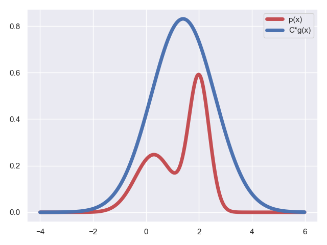
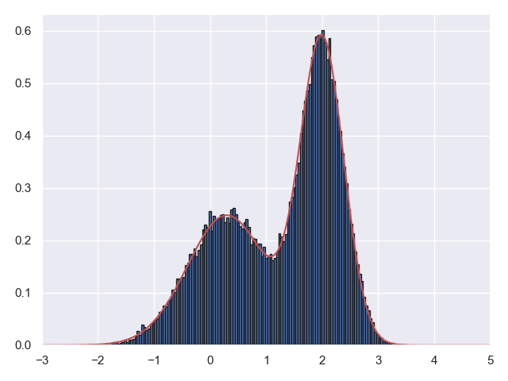

---
tags:
- 数学/概率统计
---

# 16 蒙特卡洛思想与接受-拒绝采样

上一小节的末尾，我们留下了一个看上去非常复杂的问题，感觉无从下手，我们该如何去找到平稳分布恰好唯一就是目标采样分布的马尔科夫链呢？后续这两节内容，我们就重点带领大家以一种通用的方法，去寻找这个马尔科夫链。

## 1.应用蒙特卡洛方法进行样本采样

### 1.1.蒙特卡洛方法理论支撑

在最开始，我们先不急着去寻找马尔科夫链，把有关马尔科夫的事儿先统统放在一旁不管。首先介绍这个过程中所运用到的 **“拒绝-接受”** 操作技巧和他背后的思想方法。

在前面介绍的贝叶斯统计推断方法中我们是基于纯解析的方法，通过手动计算后验概率分布的方法得到了随机变量的分布。但是问题来了，实际中计算出来的随机变量分布模型一般都非常复杂，想直接通过分布来得到采样样本进而去计算和分析他的统计数字特征（均值、方差、偏度、分位数等）基本上是不可能的。

然而我们思考一下，在前面介绍蒙特卡罗方法的时候，我们曾经尝试用近似计算的方法去计算任何一个不规则二维图形的面积，换句话说就是，精确解析的方法不行的时候，我们就采用大量样本近似的方法去对问题进行近似求解，在大数定理的支撑下，这种大样本近似方法最终的期望是和精确解是一致的，这就是蒙特卡洛方法的理论支撑。

### 1.2.利用蒙特卡洛方法采样的想法

那么把这个思想迁移到这里，我们会想，我们能否从复杂的、无法通过解析方法求得的后验分布中随机抽取出数据，让这些样本数据总体上服从后验的分布，然后在此前提基础上，通过大量的随机采样，对这些样本进行均值、方差的计算，然后以此估计出分布的数字特征。

其实回顾之前的章节，我们曾经通过 $python$ 函数库提供的接口，生成了服从正态分布、几何分布、均匀分布等的随机变量，这本质上就是一种随机采样的过程，但是关键是，这里面提到的都是标准分布，如果是任意形式的分布，想通过调用 $python$ 方法来一步解决，恐怕是不现实的。

还是回到了最本源的问题：如何采样？

说的更具体点：如何从任意给定的非标准分布中进行采样，使得获得的大量样本值服从给定的分布。我们研究的就是这种采样的方法，不巧的是，这一类方法就是蒙特卡罗采样方法。这也是之前在介绍蒙特卡罗方法时，提到的最后一类应用。

## 2.接受-拒绝采样的基本方法和步骤

### 2.1.问题背景

这里我们就来重点介绍接受-拒绝采样方法，虽然在最终实际使用过程中，因为效率、维度等原因，不会实际采用他进行采样，但是他所折射出来的思想方法将直接指导马尔科夫链-蒙特卡洛方法的理解和应用，因此很有必要对其进行深入学习。

接下来看一个具体的例子，我们需要采样的目标分布就是下面这个复杂的概率密度函数：

$$p(x)=(0.3e^{(-(x-0.3)^2)}+0.7e^{(-(x-2)^2/0.3)})/1.2113$$

当然，写的更简洁、专业一点就是：

$$p(x)=\frac{1}{1.2113}(0.3exp(-(z-0.3)^2)+0.7exp(-(z-2)^2/0.3)$$

其中，$1.2113$ 是归一化参数，目的是为了让概率密度函数 $p(x)$ 在整个取值域上的积分为 $1$，以满足归一化的概率基本定义。

### 2.2.采样方法和步骤

看上去这个概率密度函数非常复杂，那么针对这个概率密度函数的分布，我们如何进行采样，才能使得样本能够满足这个分布要求，从而支撑我们的后续的统计分析呢？这里，我们介绍最为基本、也最为经典的接受-拒绝采样方法，他的根本目标就是根据给定的概率密度函数 $p(x)$，产生服从目标分布的样本集 $X$。

在开始采样之前，我们需要做一些准备工作。首先需要找到一个辅助的建议分布，我们将其记作是 $G$，他的概率密度函数为 $g(y)$，这个 $G$ 分布在原理上可以是任意分布，既然是可以任意选择，那么我们就应该去选择一个易于处理、易于通过计算机程序去采样的分布类型，可以说是越简单越好。显然在这里，均匀分布、正态分布是最为合适的。

同时我们还需获取一个常数值 $C$，使得对于任意变量 $x$，都能够保证 $C*g(x)\ge f(x)$ 成立，当然为了提高采样的效率，选取的常数 $C$ 在满足条件的前提下，当然是越小越好了。

接下来就是真正采样的过程：

第一步：从建议分布 $G$ 中进行采样，获取一个采样样本 $Y$；

第二步：从 $[0,1]$ 的均匀分布中进行采样，获取一个采样样本 $U$；

第三步：判断，如果 $\frac{f(Y)}{C*g(Y)}\ge U$，那么我们就**接受**这个采样值 $Y$，作为我们记录下来的采样值，如果不满足这个不等关系，我们就**拒绝**这个采样值，舍弃他，重新采样。这就是所谓的**接受-拒绝**的关键一步。

## 3.接受-拒绝采样的实践

我们在这个例子中，选择均值为 $1.4$，方差为 $1.2$ 的正态分布作为我们的建议分布：$G$ 分布，取常数 $C$ 值为 $2.5$。

我们先把目标分布的概率密度函数 $p(x)$、建议分布 $G$ 的概率密度函数的 $C$ 倍：$g(x)*C$ 绘制在一张图上进行比较：

**代码片段：**

```python
import numpy as np
import matplotlib.pyplot as plt
from scipy.stats import norm
import seaborn
seaborn.set()

# 目标采样分布的概率密度函数
def p(x):
    return (0.3 * np.exp(-(x - 0.3) ** 2) + 0.7 * np.exp(-(x - 2.) ** 2 / 0.3)) / 1.2113

# 建议分布G
norm_rv = norm(loc=1.4, scale=1.2)
# C值
C = 2.5

x = np.arange(-4., 6., 0.01)
plt.plot(x, p(x), color='r', lw=5, label='p(x)')
plt.plot(x, C*norm_rv.pdf(x), color='b', lw=5, label='C*g(x)')
plt.legend()
plt.show()
```

**运行结果：**



从图中可以看出，我们所选取的建议分布 $G$ 的概率密度函数的 $C$ 倍，确实是恒大于目标分布的概率密度函数 $p(x)$，因此满足我们接受-拒绝采样的前提条件。

那么接下来，我们就在此基础上，利用上文中所介绍的接受-拒绝采样算法的具体步骤，来进行实际的样本采样。

**代码片段：**

```python
import numpy as np
import matplotlib.pyplot as plt
from scipy.stats import uniform, norm
import seaborn
seaborn.set()

# 目标采样分布的概率密度函数
def p(x):
    return (0.3 * np.exp(-(x - 0.3) ** 2) + 0.7 * np.exp(-(x - 2.) ** 2 / 0.3)) / 1.2113

# 建议分布
norm_rv = norm(loc=1.4, scale=1.2)
# C值
C = 2.5

uniform_rv = uniform(loc=0, scale=1)
sample = []

for i in range(100000):
    Y = norm_rv.rvs(1)[0]
    U = uniform_rv.rvs(1)[0]
    if p(Y) >= U * C * norm_rv.pdf(Y):
        sample.append(Y)

x = np.arange(-3., 5., 0.01)
plt.gca().axes.set_xlim(-3, 5)
plt.plot(x, p(x), color='r')
plt.hist(sample, color='b', bins=150, normed=True, edgecolor='k')
plt.show()
```

**运行结果：**



我们通过接受-拒绝采样方法，进行了 $10$ 万次的数据采样，最后把采样结果绘制成柱状图。通过运行结果我们发现，柱状图的形状几乎和原始目标分布的概率密度函数曲线完全拟合。由此通过实践证明了这个采样的方法确实是有效的，他高度近似的拟合了原始样本的分布特性。

有了高度近似于实际分布的采样值之后，我们就能够很容易的利用这组样本来对原始的分布进行统计特征的分析，比如均值、方差等数字特征的计算。

## 4.接受-拒绝采样方法背后的内涵挖掘

有了直观的感受之后，我们接下来仔细介绍一下这背后的内涵：

接受-拒绝采样方法的核心思想是什么？任意给定的一个目标分布的概率密度函数有可能非常复杂，无法直接基于这个复杂分布来生成样本，此时该怎么办？解决这个问题的核心思想是借力打力，巧妙过渡：

我们绕开这个复杂的目标分布，转而去寻找一个方便计算机程序直接进行样本采样的标准分布，这个分布也就是算法中的建议分布 $G$（这里我们选择的是正态分布），通过利用 $\frac{f(Y)}{C*g(Y)}\ge U$ 这个接受-拒绝判断条件，将建议分布 $G$ 和目标分布 $P$ 衔接了起来，使得**仅仅在建议分布上进行简单的采样，而后同样简单的进行一下接受-拒绝操作，就实现了等价于在复杂的目标分布上进行采样的效果。**

再简单重复一遍：计算机程序通过在建议分布上进行采样，只不过对采样结果进行接受-拒绝的判断处理，就等价于在复杂的目标分布上进行采样了。而在建议分布（标准分布）上进行采样，恰是计算机程序最为擅长的基本操作，这个思想和做法真的是太完美了。

而且这个采样算法几乎没有什么限定范围，只要满足 $C*g(x)\ge f(x)$ 这个条件即可，并且最关键的是，建议分布没有限制，任意标准分布都可以，所以我们当然是选取越简单的分布越好了。

我们重点要吸收的就是这里面化繁为简、等价转换的思想。严格意义上的数学证明比较复杂，这里我们仅仅介绍一下思路，大篇幅的证明细节就不花时间展开了：

我们通过建议分布 $G(Y)$ 产生样本：$Y\sim G(Y)$，以及满足均匀分布的样本 $U\sim Uniform[0,1]$。

把接受-拒绝条件 $\frac{f(Y)}{C*g(Y)}\ge U$ 稍作整理变成 $f (Y) \ge Cg(Y)U$。

那我们的证明目标就是，基于采样条件接受-拒绝后的建议分布概率密度函数和目标分布的概率密度函数相等，换句话说也就是需要证明累积分布函数完全相等即可：

$P(Y\le y|U\le \frac{f(Y)}{C*g(Y)})=F(y)$

事实上，这个等式的确是成立的。

## 5.接受-拒绝采样的问题以及后续展望

### 5.1.采样方法的问题

接受-拒绝采样的方法，是我们在近似采样的这块领域里开的一个头，经过介绍我们知道，这种近似采样的方法的确能够帮助我们解决一些非标准分布的采样问题。但是他并不能包打天下，因为他包含有很多的局限性和问题：

比方说最简单的，接受-拒绝采样有一个前提，就是我们必须首先拿出一个建议分布 $G$，以及常数 $C$，并且保证 $\frac{f(Y)}{C*g(Y)}\ge U$ 的条件成立，这在很多复杂的非标准分布面前，并不是一件容易的事儿。

不过这并不妨碍我们认真的吸收这种方法的精髓，即：在接受-拒绝的框架下，将一个标准分布上的采样等效为目标分布上的采样这种核心思想。

### 5.2.对于马尔科夫链采样的思想启示

还记得在上一节基于马尔科夫链的采样里我们遗留的问题吗？对于一个目标采样分布，我们如何找到将这个目标分布作为唯一稳态分布的马尔科夫链，然后对其进行采样？直接去找非常复杂，我们能不能也借鉴这个思想呢？

即：先寻找另一个容易得到的马尔科夫链，在这个马尔科夫链上进行随机游走和采样，对采样结果也进行类似的接受-拒绝操作，从而等效实现基于目标分布的采样？

我提前告诉你，这个思路是有效的也是通用的，这就是我们下一节里要讲的马尔科夫链-蒙特卡洛方法的思维框架。