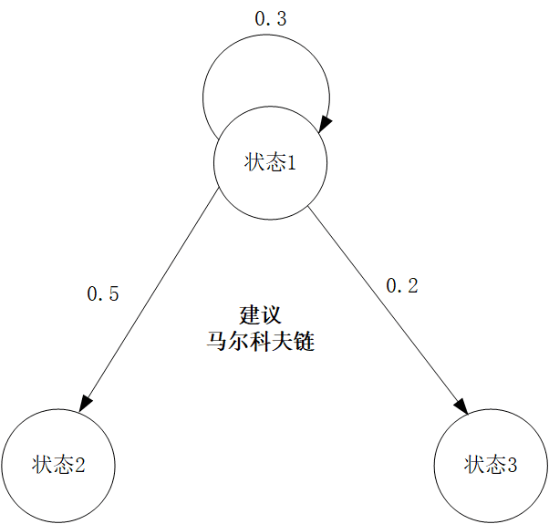
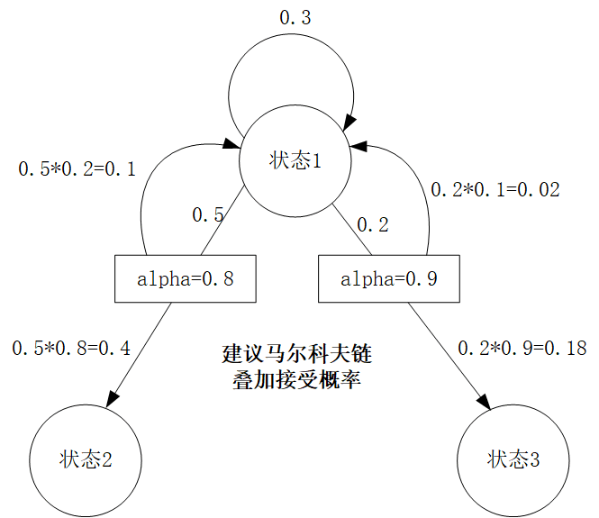
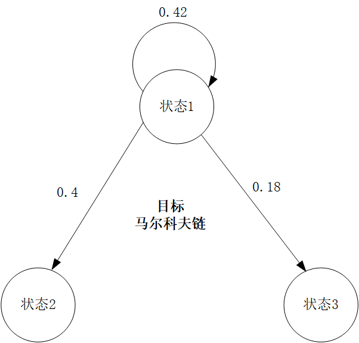
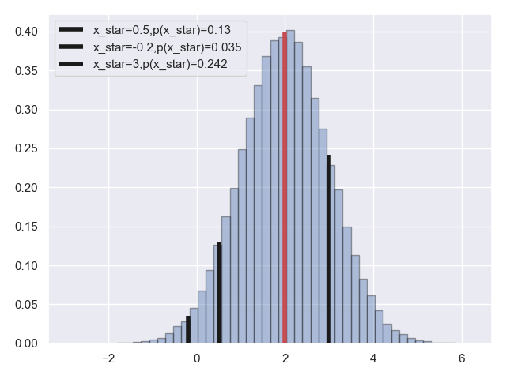
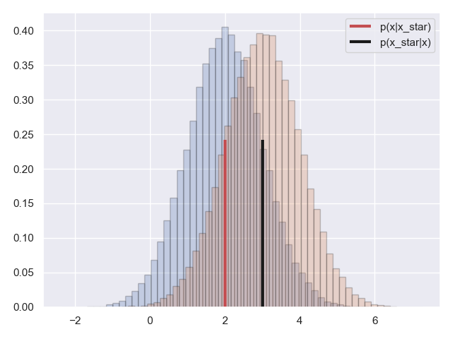
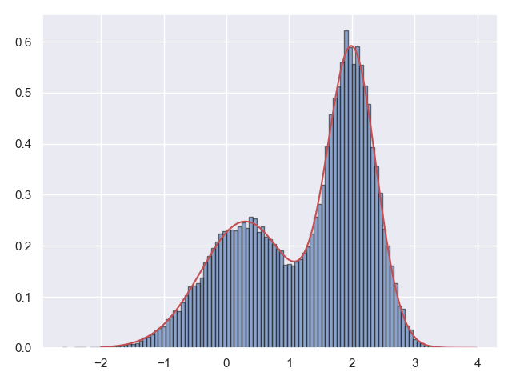

---
tags:
- 数学/概率统计
---

# 17 马尔科夫链蒙特卡洛方法：通用采样引擎

## 1.问题的目标

这一节，我们走到了近似采样的最后，也是最关键的一部分，可以说是黎明前的最后一夜了，这里我们要一举解决最核心的关键问题：对于任意给定的目标分布 $\pi(x)$，我们如何找到以他为唯一平稳分布的马尔科夫链，并且基于马尔科夫链采样的方法，实现对其的近似采样。

找这么一个马尔科夫链，本质上就是要找到他的转移概率矩阵 $P$，那么首先先确立一个思考路径：有没有什么条件，使得只要我们的转移矩阵 $P$ 满足了，就意味着目标分布 $\pi(x)$ 就是转移矩阵 $P$ 对应的马尔科夫链的平稳分布呢？

还真有这么一个条件，这个条件就是马尔科夫链的细致平稳条件。

## 2.平稳分布判定：细致平稳条件

设有马尔科夫链 $X$，状态空间为 $S$，转移概率矩阵为 $P$，以及我们关注的状态分布 $\pi=(\pi_1,\pi_2,\pi_3,…)$，对于任意状态 $i,j\in S$，任意时刻 $t$ 都满足：$\pi_ip_{ij}=\pi_jp_{ji}$，则称状态分布 $\pi$ 满足马尔科夫链的细致平衡条件，该状态分布 $\pi$ 就是马尔科夫链 $X$ 的平稳分布。

我们提前说一下，在这个过程中我们可以把马尔科夫链状态转移概率 $P(X_t=j|X_{t-1}=i)$ 按照需要简写成 $p_{ij}$ 或 $P(i,j)$，表达的都是同一个意思。

看得出，细致平稳条件是一个充分条件，这个条件很强，只要满足了他，就相当于找到了我们要的马尔科夫链。我们来证明一下，很简单：

如果 $\pi_ip_{ij}=\pi_jp_{ji}$，我们同时对两边的等式求和：$\sum_i \pi_ip_{ij}=\sum_i \pi_jp_{ji}$，显然也是成立的。

观察等式的右边，$\pi_j$ 的取值是独立于参数 $i$ 的，可以提出来：$\sum_i \pi_jp_{ji}=\pi_j\sum_i p_{ji}$，同时依据马尔科夫状态转移矩阵的归一性，可知：$\sum_i p_{ji}=1$，因此归结起来就有：
 
$$\sum_i \pi_ip_{ij}=\sum_i \pi_jp_{ji}=\pi_j\sum_i p_{ji}=\pi_j$$

到了这一步，其实已经证明结束了，不过可能还有同学没有明白，那我就最后画一张图来彻底点破：


 从图中可以知道，对于每一个 $j$ 的具体取值：

$\sum_i \pi_ip_{ij}=\pi_j$ 的计算过程实际上就是一次状态分布（行向量）与状态转移矩阵第 $j$ 列（列向量）点乘的过程，得到的是一个数值，值恰好是状态分布（行向量）的第 $j$ 个元素，那么如果让 $j$ 取遍每一个索引值，那么最终得到的就是

$\sum_i \pi_ip_{i1}=\pi_1$，$\sum_i \pi_ip_{i2}=\pi_2$，$\sum_i \pi_ip_{i3}=\pi_3$，…，$\sum_i \pi_ip_{iN}=\pi_N$

用一个式子综合起来就是：

$$\pi P=\pi$$

这不正是平稳分布的定义式嘛，这正说明了，满足细致平稳条件的目标分布 $\pi$ 就是以矩阵 $P$ 为状态转移矩阵的马尔科夫链的平稳分布。

并且如果此时这个转移概率矩阵对应的马尔科夫链满足不可约、非周期和正常返，那么进一步说明该状态分布 $\pi$ 是马尔科夫链的唯一平稳分布。当然如果找到了这个转移矩阵 $P$，一般而言都是满足这个条件的。

因此，一旦找到了状态转移矩阵，就确定了马尔科夫链。

可是问题来了，感觉还是很难找到这个矩阵啊，例如，我们随便找一个状态转移矩阵 $Q$，一般是无法满足细致平稳条件的，即：$\pi(i)Q(i,j) \neq \pi(j)Q(j,i)$，注意这里我们把 $Q_{ij}$ 写作 $Q(i,j)$，是一个意思，这是为了我们后面公式中的写法统一。

同时也把离散型和连续型的马尔科夫链都统一了起来。对于 $Q(i,j)$，离散型马尔科夫链时，我们称之为转移概率，连续型马尔科夫链我们称之为转移概率密度，或称转移核，本质上是一回事儿，可以类比 $pmf$ 和 $pdf$ 的区别和联系。

为了让这个等式能够相等，满足细致平稳条件，我们给他加点料，不是 $\pi(i)Q(i,j) \neq \pi(j)Q(j,i)$ 不相等吗？下面我们让他两边相等，我们来介绍 $Metropolis-Hastings$ 采样方法具体是怎么做的。

## 3.Metropolis-Hastings 采样方法

在这个采样方法中，针对每一个转移概率 $Q(i,j)$，我们再定义一个接受概率 $\alpha(i,j)$，使得每一个我们最终要构造的状态转移矩阵中的每一项 $P(i,j)$ 都是 $Q(i,j)$ 和 $\alpha(i,j)$ 相乘的结果：

即目标马尔科夫矩阵的状态转移矩阵中的每一项都满足：$P(i,j)=Q(i,j)\alpha(i,j)$

在建议马尔科夫链中，从状态 $i$ 转移到状态 $j$ 的概率是 $Q(i,j)$，而在目标马尔科夫链中，从状态 $i$ 到状态 $j$ 的转移概率是 $Q(i,j)\alpha(i,j)$，很显然，$\alpha(i,j)$ 表示一个接受概率，他满足 $\alpha(i,j)\le1$，那么相比于建议马尔科夫链，在目标马尔科夫链中，从状态 $i$ 到状态 $j$ 的转移概率都减小了，但是同时我们知道，马尔科夫链的概率转移矩阵要满足 $\sum_j P(i,j)=1$，所有的 $P(i,j)$ 都减小了，那总有一个要增大？谁增大呢，显然是 $P(i,i)$ 增大了。

我们的目标也是借力打力，试想我们要找的目标是状态转移概率矩阵 $P$，他的唯一稳态是目标分布 $\pi(x)$，我们参考上一节接受-拒绝采样方法的思想精髓：既然这个 $P$ 矩阵难找，我们能不能也找一个所谓的“建议矩阵”$Q$，这个 $Q$ 满足任意性，这样我们就能够利用一个明确的、便于随机游走的另一个马尔科夫链，基于转移概率的建议矩阵 $Q$ 中的每一个具体项 $Q(i,j)$ 和接受概率 $\alpha(i,j)$ 来共同决定最终从状态 $i$ 到状态 $j$ 的状态转移概率，以达到如下效果：

第一：最终的状态转移概率 $Q(i,j)\alpha(i,j)$ 就是我们目标马尔科夫链上状态 $i$ 到状态 $j$ 的状态转移概率？也就是说 $P(i,j)=Q(i,j)\alpha(i,j)$？

第二：通过上述方式得到的 $P(i,j)=Q(i,j)\alpha(i,j)$ 满足细致平稳条件，使得目标分布 $\pi$ 恰是矩阵 $P(i,j)=Q(i,j)\alpha(i,j)$ 对应的唯一平稳分布？

换句话说，原本要找一个状态转移概率 $P$，满足细致平稳条件：

$$\pi(i)P(i,j)=\pi(j)P(j,i)$$

而现在则是在建议转移概率矩阵 $Q$ 可以任选的前提下，找到一个接受概率 $\alpha(i,j)$，替换掉 $P(i,j)=Q(i,j)\alpha(i,j)$，满足下面的等式成立：

$$\pi(i)Q(i,j)\alpha(i,j)=\pi(j)Q(j,i)\alpha(j,i)$$

对于任意给定的建议转移概率矩阵 $Q$，这个接受概率 $\alpha$ 都一定存在吗？问题最终就卡在了这。然后幸运的是，这个答案是：一定存在。马尔科夫链蒙特卡洛方法中的 $Metropolis-Hastings$ 采样中明确了接受概率 $\alpha$ 的表达式：

$$\alpha(i,j)=min\{\frac{\pi(j)Q(j,i)}{\pi(i)Q(i,j)},1\}$$

也就是说我们任选一个建议矩阵 $Q$，那么由这个矩阵的每一项和对应的接受概率相乘：

$Q(i,j)\alpha(i,j)=Q(i,j)min\{\frac{\pi(j)Q(j,i)}{\pi(i)Q(i,j)},1\}$，用这所有相乘得到的结果所对应构成的新矩阵，就是以目标分布 $\pi$ 为唯一稳态分布的马尔科夫链的转移概率矩阵 $P$。

## 4.M-H 采样方法的严格证明

这听起来有点神乎其神啊，是这么回事儿吗？我们怎么证明这一点？很简单，只要证明细致平稳条件 $\pi(i)Q(i,j)\alpha(i,j)=\pi(j)Q(j,i)\alpha(j,i)$ 成立即可

那么在实际采样操作中，这个如何体现？

$$P(i,j)=Q(i,j)\alpha(i,j)=Q(i,j)min\{\frac{\pi(j)Q(j,i)}{\pi(i)Q(i,j)},1\}$$

显然，分两种情况：

当 $\frac{\pi(j)Q(j,i)}{\pi(i)Q(i,j)} \ge 1$，即 $\pi(j)Q(j,i) \ge \pi(i)Q(i,j)$ 时，有：

$\alpha(i,j)=1$，$P(i,j)=Q(i,j)$

当 $\frac{\pi(j)Q(j,i)}{\pi(i)Q(i,j)} < 1$，即 $\pi(j)Q(j,i) \lt \pi(i)Q(i,j)$ 时，有：

$\alpha(i,j)=\frac{\pi(j)Q(j,i)}{\pi(i)Q(i,j)}$，$P(i,j)=Q(j,i)\frac{\pi(j)}{\pi(i)}$

归结起来就是：

当 $\pi(j)Q(j,i) \ge \pi(i)Q(i,j)$ 时，$P(i,j)=Q(i,j)$ 当 $\pi(j)Q(j,i) \lt \pi(i)Q(i,j)$ 时，$P(i,j)=Q(j,i)\frac{\pi(j)}{\pi(i)}$

有了这个等式，我们再来推导 $Q(i,j)\alpha(i,j)$ 是否满足细致平稳条件：

$$\begin{aligned}
\pi(i)P(i,j)&=\pi(i)Q(i,j)\alpha(i,j)\\
&=\pi(i)Q(i,j)min\{\frac{\pi(j)Q(j,i)}{\pi(i)Q(i,j)},1\}\\
&=min\{\pi(j)Q(j,i),\pi(i)Q(i,j)\}\\
&=\pi(j)Q(j,i)min\{1,\frac{\pi(i)Q(i,j)}{\pi(j)Q(j,i)} \}
\end{aligned}$$

到了这里，回顾一下我们的初心，我们的目标是证明细致平稳条件 $\pi(i)P(i,j)=\pi(j)P(j,i)$，而此时，我们已经推导出了：

$$\pi(i)P(i,j)=\pi(j)Q(j,i)min\{1,\frac{\pi(i)Q(i,j)}{\pi(j)Q(j,i)} \}$$

那么接下来，我们只要说明：

$$\pi(j)P(j,i)=\pi(j)Q(j,i)min\{1,\frac{\pi(i)Q(i,j)}{\pi(j)Q(j,i)}\}$$

再化简一点，就是证明：

$$P(j,i)=Q(j,i)min\{1,\frac{\pi(i)Q(i,j)}{\pi(j)Q(j,i)}\}$$

这个等式成立。

我们把之前的等式关系摆在这里，方便我们推导：

当 $\pi(j)Q(j,i) \ge \pi(i)Q(i,j)$ 时，$P(i,j)=Q(i,j)$ 当 $\pi(j)Q(j,i) \lt \pi(i)Q(i,j)$ 时，$P(i,j)=Q(j,i)\frac{\pi(j)}{\pi(i)}$

由于 $i$ 和 $j$ 是任意的参数，把 $i$ 写作 $j$，把 $j$ 写作 $i$ 就有：

当 $\pi(i)Q(i,j) \ge \pi(j)Q(j,i)$ 时，$P(j,i)=Q(j,i)$ 当 $\pi(i)Q(i,j) \lt \pi(j)Q(j,i)$ 时，$P(j,i)=Q(i,j)\frac{\pi(i)}{\pi(j)}$

对于 $P(j,i)=Q(j,i)min\{1,\frac{\pi(i)Q(i,j)}{\pi(j)Q(j,i)}\}$ 这个待证明的等式，我们还是分情况讨论：

当 $\pi(i)Q(i,j)\gt \pi(j)Q(j,i)$ 时，我们则需要证明 $P(j,i)=Q(j,i)$，此时对上了第一种情况，即 $P(j,i)=Q(j,i)$ 成立。

当 $\pi(i)Q(i,j)\lt \pi(j)Q(j,i)$ 时，我们则需要证明 $P(j,i)=Q(i,j)\frac{\pi(i)}{\pi(j)}$，此时对上了第二种情况，$P(j,i)=Q(i,j)\frac{\pi(i)}{\pi(j)}$ 也是成立的。

那么，这就说明了任选一个建议马尔科夫链概率转移矩阵 $Q$，配合接受概率 $\alpha$，$P(i,j)=Q(i,j)\alpha(i,j)$ 和目标分布 $\pi$ 是满足细致平稳条件的。

## 5.如何理解随机游走叠加接受概率

那么接下来就是具体操作了，怎么理解，或者说怎么实现基于 $Q$ 矩阵的马尔科夫链随机游走同时再叠加一个接受概率 $\alpha$ 呢？

再说细致一点，我们就讨论从任意状态 $i$ 向任意状态 $j$ 进行状态转移的过程及状态转移概率，单纯基于 $Q$ 矩阵，状态 $i$ 向每一个其他状态 $j$ 的概率是 $Q(i,j)$，其中 $(i\neq j)$，如何叠加新的接受概率 $\alpha(i,j)$？

打个比方，比如有 $3$ 个状态，$i=1$，$Q(1,1)=0.3$，$Q(1,2)=0.5$，$Q(1,3)=0.2$，$\alpha(1,2)=0.8$，$\alpha(1,3)=0.9$，依照随机游走的过程，当以 $0.5$ 的概率选择往状态 $2$ 转移时，还要最后面临一道考验：在此基础上，此时以 $0.8$ 的概率真正选择转移到状态 $2$，以 $1-0.8=0.2$ 的概率选择“半途而废”回到原状态 $1$，这两个动作叠加起来，就是在我们 $P(i,j)=Q(i,j)\alpha(i,j)$ 进行随机游走的过程。如图所示，我们在途中只看状态 $1$ 到状态 $2$ 和状态 $3$ 转移的局部过程：







在目标马尔科夫链的转移概率矩阵 $P$ 中：

$P(1,2)=Q(1,2)\alpha(1,2)=0.5*0.8=0.4$ $P(1,3)=Q(1,3)\alpha(1,3)=0.2*0.9=0.18$ $P(1,1)=Q(1,1)+Q(1,2)(1-\alpha(1,2))+Q(1,3)(1-\alpha(1,3))=0.3+0.1+0.02=0.42$

同时验证：$P(1,1)+P(1,2)+P(1,3)=1$，满足归一性。

## 6.接受-拒绝过程的设计

那么在随机游走的过程中，怎么模拟这个接受-拒绝的过程呢？假设我们目前处于状态 $i$，那就当我们已经按照转移概率矩阵 $Q$，依概率决定要转移到状态 $j$ 时，增加最后一步：生成一个满足 $[0,1]$ 之间均匀分布的随机数 $U$，如果 $U\lt \alpha(i,j)$，则决定随机游走的下一个状态是 $j$，否则下一个状态仍然是 $i$。

还记得我们上一讲当中模拟概率的技巧吗？我们先生成一个 $[0,1]$ 之间满足均匀分布的随机数 $U$，如果 $U<\alpha 值$，则决定接受，否则就拒绝。

## 7.建议转移概率矩阵 $Q$ 的设计

最后一个问题就是我们应该构建一个怎么样的建议转移概率矩阵 $Q$？其实这个矩阵 $Q$ 选取的原则很简单：

第一是：必须要满足马尔科夫概率转移矩阵的归一性，即 $\sum_jQ_{ij}=1$。

第二是：获取 $t$ 时刻的采样点 $x$ 后，依概率选取 $t+1$ 时刻的采样点 $x^{*}$ 的过程简单易行，方便用计算机模拟。

下面我们来解决这个问题：或者说当前处在某个特定的采样点 $x$，我们如何决定下一个随机游走的采样点 $x^{*}$?我们可以看做，状态空间 $S$ 中的采样值 $x$ 和 $x^{*}$ 分别对应了状态 $i$ 和状态 $j$，那么从 $t$ 时刻的采样点 $x$ 转移到 $t+1$ 时刻的采样点 $x^{*}$ 的概率值就是存放在矩阵 $Q_{ij}$ 位置上，以此类推构造出整个矩阵 $Q$。

其中一种比较好的定义方法是：

$$Q(i,j)=P(x^{*}|x)=N(\mu=x,\sigma=1).pmf(x^{*})$$

这是什么意思？他指的是从 $t$ 时刻的某个指定采样点 $x$ 转移到 $t+1$ 时刻的指定采样点 $x^*$ 的概率等于在**均值为 $x$，方差为 $1$ 的整体分布中取得 $x^*$ 的概率值**，感觉其实应该写成 $pdf$ 的，因为正态分布是一个连续型的分布，但是这里因为是计算机采样，实际上我们已经把包括目标分布以及这里的正态分布都给离散化了，所以写成 $pmf$ 更符合实际操作的需要。

那么这么构造的转移概率矩阵 $Q$ 行不行，好不好呢？

**首先：行不行？**

$\sum_jQ_{ij}=\sum_{x^* \in S}P(x^{*}|x)=\sum_{x^* \in S}N(\mu=x,\sigma=1).pmf(x^{*})$，也就是整个正态分布概率密度曲线上（这里严格说是离散化后的分布列）所有的取值点的概率求和，显然等于 $1$，满足归一化的要求，因此可行性满足了。如下图所示：



这幅图就是离散化的以 $x$ 为均值，$1$ 为方差的正态分布图，红色的竖线就是 $x$ 的取值，而黑色的竖线就是示意的几个 $x^{*}$ 的概率取值，我们将建议转移概率矩阵 $Q$ 的 $Q_{ij}$，也就是 $P(x^*|x)$ 定义为了这个离散化的以 $x$ 为均值，$1$ 为方差的正态分布中 $x^{*}$ 的取值概率，那么由于所有的 $x^*$ 的取值概率之和为 $1$，因此就有了：$\sum_jQ_{ij}=\sum_{x^* \in S}P(x^{*}|x)=\sum_{x^* \in S}N(\mu=x,\sigma=1).pmf(x^{*})=1$，这样就彻底说明了上面的观点。

**第二：好不好？**

如果当前处于采样点 $x$，依概率 $P(x^{*}|x)=N(\mu=x,\sigma=1).pmf(x^{*})$ 决定下一个采样点 $x^{*}$，难不难？太容易了，这不就是基于 $\mu=x,\sigma=1$ 的正态分布模型进行一次采样吗？这样采出的点就是依概率 $P(x^{*}|x)$ 的新采样点。利用程序在一个正态分布中采样，想想我们都做过多少遍了？

**第三：意外之喜。**

如下图所示，我们发现，依据正态分布曲线关于均值 $\mu$ 对称，因此对于任意两个 $x$ 和 $x^*$，均值为 $x$，方差为 $1$ 的正态分布在 $x^*$ 处的概率值和均值为 $x^*$，方差为 $1$ 的正态分布在 $x$ 处的概率值显然是相等的，即：

$$N(\mu=x,\sigma=1).pmf(x^{*})=N(\mu=x^*,\sigma=1).pmf(x)$$

即相当于 $Q(i,j)=Q(j,i)$，那么接受概率的表达式 $\alpha(i,j)=min\{\frac{\pi(j)Q(j,i)}{\pi(i)Q(i,j)},1\}$ 就可以化简为 $\alpha(i,j)=min\{\frac{\pi(j)}{\pi(i)},1\}$。



## 8.步骤和演示

好的，最后我们来归纳一下马尔科夫链蒙特卡洛方法中 $metropolis-Hastings$ 采样的步骤，并实际用 $python$ 进行演示:

对于目标采样分布 $\pi(x)$：

第一步：随机选定一个起始点 $x$，指定燃烧期 $m$ 和稳定期 $N$。

第二步：开始采样，每一轮采样都以上一轮的采样值 $x$ 为均值，方差为 $1$，生成一个正态分布，然后在这个正态分布中依概率随机选取一个值 $x^{*}$。

第三步：在 $[0,1]$ 的均匀分布中随机生成一个数 $U$，并指定接收概率 $\alpha=min\{1, \frac{\pi(x^{*})}{\pi(x)}\}$，如果 $U<\alpha$，则本轮新的采样值为 $x=x^{*}$，否则本轮新的采样值仍为上一轮的 $x$。

重复第二步~第三步采样过程 $m+N$ 次，结束后，保留后 $N$ 次采样结果作为目标分布的近似采样。

我们还是对之前使用过的目标分布：$\pi(x)=\frac{1}{1.2113}(0.3exp(-(z-0.3)^2)+0.7exp(-(z-2)^2/0.3)$ 进行采样，燃烧期采样个数设定为 $m$，最终实际保留的有效采样点的个数为 $N$。

**代码片段：**

```python
import random
from scipy.stats import norm
import matplotlib.pyplot as plt
import numpy as np
import seaborn
seaborn.set()

# 目标采样分布pi
def pi(x):
    return (0.3 * np.exp(-(x - 0.3) ** 2) + 0.7 * np.exp(-(x - 2.) ** 2 / 0.3)) / 1.2113

m = 10000  # 燃烧期样本数
N = 100000  # 实际保留的有效样本数
sample = [0 for i in range(m + N)]  # 采样数组

sample[0] = 2  # 任选一个起始点，选择默认的0也可以，效果一样
# 基于接受概率，在建议马尔科夫链上随机游走采样
for t in range(1, m + N):
    x = sample[t - 1]
    x_star = norm.rvs(loc=x, scale=1, size=1)[0]  # 生成下一时刻随机游走的点x*
    alpha = min(1, (pi(x_star) / pi(x)))  # 接受概率
    
    u = random.uniform(0, 1)  # 生成满足0~1之间均匀分布的随机数
    if u < alpha:  # 接受-拒绝的过程
        sample[t] = x_star
    else:
        sample[t] = x

x = np.arange(-2, 4, 0.01)
plt.plot(x, pi(x), color='r')  # 实际目标分布
plt.hist(sample[m:], bins=100, normed=True, color='b', edgecolor='k', alpha=0.6)  # 实际分布的近似采样
plt.show()
```

**运行结果：**

