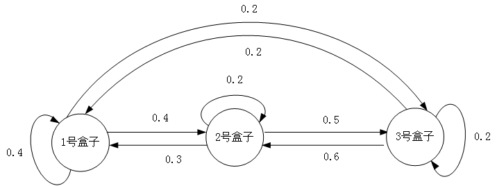
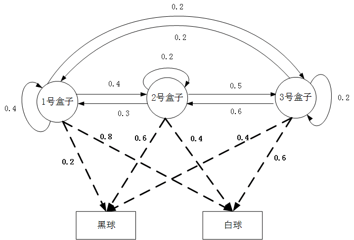
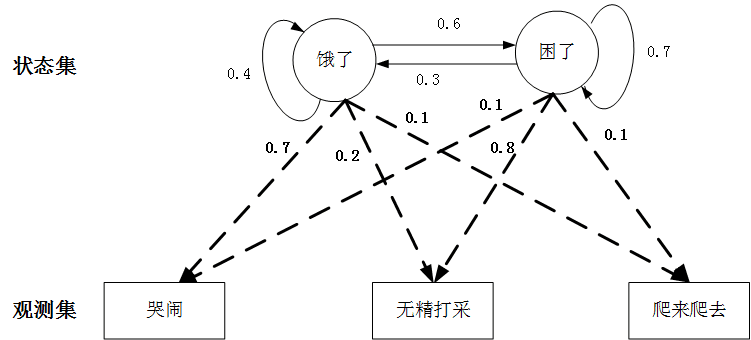

---
tags:
- 数学/概率统计
---

# 18 隐马尔科夫模型：明暗两条线

## 1.从马尔科夫链到隐马尔科夫模型

在前面几节的内容里，我们详细介绍了马尔科夫链，下面我们接着来说说隐马尔科夫模型，他的英文全称是 Hidden Markov Model ，也就是我们经常看到的HMM模型。隐马尔科夫模型是一种统计模型，他广泛的应用在语音识别、词性自动标注、概率文法等自然语言处理的各个应用领域。

经过前面的学习，我们对马尔科夫链已经相当熟悉了，这里谈到的隐马尔科夫模型与他在名称上可以说是非常接近。其关键差异就在于一个“隐”字，在这个模型中，他首先由一个隐藏的马尔科夫链随机生成一个状态随机序列，再由状态随机序列中的每一个状态对应生成各自的观测，由这些观测组成一个观测随机序列。因此，隐马尔科夫模型中其实伴随着两条“线”，一个是观测随机序列这条“明线”，另一个是隐藏着的状态随机序列这条“暗线”。

## 2.典型实例：盒子摸球实验

当然，为了更清晰的说明问题，我们举几个生活中实际的例子，作为我们介绍隐马尔科夫模型的引子，让大家更为直观的了解隐马尔科夫模型的组成和要点。

第一个例子是一个耳熟能详的例子：盒子摸球实验。

我们有 $3$ 个盒子，编号分别为 $1$ 号盒子，$2$ 号盒子，$3$ 号盒子，每个盒子里都装着个数不等的黑球和白球，具体情况如下面描述所示：

$1$ 号盒子：黑球 $2$ 个，白球 $8$ 个 $2$ 号盒子：黑球 $6$ 个，白球 $4$ 个 $3$ 号盒子：黑球 $4$ 个，白球 $6$ 个

在这个例子中，整个实验的过程是这样的：

每次先随机出现一个盒子，然后我们从随机出现的盒子中随机摸出一个球，并且记录下球的颜色，最后把球放回盒子。下一次再随机出现一个盒子，我们同样的去摸球并记录球的颜色，我们一边梳理这个过程，一边来系统介绍隐马尔科夫模型中的专业术语。

在试验过程中，我们只能在每次摸出球之后看到被摸出的球的颜色，但无法知道每次随机出现的盒子的编号，这是我们要明确的一个大的前提背景。

因此，随着试验的进行，会依次出现不同编号的盒子，这个盒子的序列就是我们的状态序列，由于我们始终无法观测到盒子的编号，因此也就是一条隐藏的暗线，也称**隐含状态序列**。而由于我们最终能够观察到的是球的颜色，因此球的颜色序列就是我们的**观测序列**，也就是我们的明线。例如，试验重复进行 $7$ 次，其中一种可能的观测序列为：$O=\{黑，黑，白，白，白，黑，黑\}$。

而在整个过程中，我们假定每次盒子随机出现的过程是一个马尔科夫过程，状态集合为 $Q=\{盒子 1，盒子 2，盒子 3 \}，N=3$。同时，第一次各个盒子出现所满足的概率分布如下：

$1$ 号盒子出现的概率：$0.3$， $2$ 号盒子出现的概率：$0.5$， $3$ 号盒子出现的概率：$0.2$

我们用 $\pi$ 表示初始状态的概率向量：$\pi=(0.3,0.5,0.2)^T$，这样我们就拿到了状态的初始概率分布。

同时各个盒子之间相互转换的概率转移图如下图所示：

从上面这幅图中，我们可以提炼出三个盒子随机出现的马尔科夫过程状态转移概率矩阵，将其记作是：$A = \begin{bmatrix}0.4 & 0.4 & 0.2 \\ 0.3 & 0.2 & 0.5 \\ 0.2 & 0.6 & 0.2 \end{bmatrix}$。

结合我们之前介绍过的马尔科夫链的基本知识，对上述矩阵进行解释是一件非常简单的事：如果某一次随机出现的盒子是 $2$ 号盒子，那么下一次随机出现的盒子是 $1$ 号盒子的概率是 $0.3$，是 $2$ 号盒子的概率是 $0.2$，是 $3$ 号盒子的概率是 $0.5$。

那么实验中隐藏的状态序列，也就是三个盒子随机出现的过程我们就讲清楚了，紧接着是从盒子中摸球的过程，比如在 $1$ 号盒子当中：黑球 $2$ 个，白球 $8$ 个，采用的是放回式的摸球试验，这就是最简单的古典概型，因此从 $1$ 号盒子中摸出黑球的概率：$0.2$，摸出白球的概率是 $0.8$，也就是所谓的观测概率，也叫输出概率，他是从特定的隐含状态当中生成指定观测的概率。

同样的，我们还可以一起把 $2$ 号盒子和 $3$ 号盒子的观测概率都集中在一起，放在同一个矩阵当中，就得到了另一个重要的矩阵：观测概率矩阵$B = \begin{bmatrix}0.2 & 0.8 \\ 0.6 & 0.4 \\ 0.4 & 0.6\end{bmatrix}$ 。在这其中，观测集合 $V=\{黑球，白球 \} $，$M=2$。

继续通过这个例子来看，我们重复 $7$ 次上述过程，得到两个序列：

一个是长度为 $7$ 的隐藏状态序列：

$I=\{2 号盒，2 号盒，1 号盒，3 号盒，1 号盒，2 号盒，3 号盒\}$，再次强调这个序列是实际存在的，但我们无法直接观测到他。

另一个就是对应的长度为 $7$ 的观测序列：

$O=\{黑球，黑球，白球，黑球，白球，白球，黑球\}$，这个是我们可以直接通过观测得到的。

在这个盒子摸球的实验中，一明一暗两条线的关系如下图所示：

 
 这幅图能够很好的说明隐马尔科夫模型当中的两个核心关键词：一个关键词是**隐**，指的就是状态序列，也就是盒子序列，他是我们无法观测得知的，是隐含的；另一个关键词是**马尔科夫**，指的是整个隐含状态序列，隐含状态之间的转换是一个马尔科夫过程，隐含状态之间是有特定的转换概率的。

我们把这个信息也反映到上面的转移概率图中，就反映了隐马尔科夫模型在这个实例中的全部信息：

 
 可能大家会觉得，这个例子还不够生活，不够直观。那好，我们再来一个例子：

## 3.典型实例：婴儿的日常生活

这个是小宝宝的例子，可能会比上面盒子摸球实验这个人造的例子场景更直观真实。

比方说，一个小宝宝有两个典型的状态：饿了和困了，这就是他的状态集，但是小宝宝不会说话表达，因此这个状态就是隐藏的。父母只能从他所表现出来的行为去推测，我们假设他有三种典型的行为：$\{哭闹，无精打采，爬来爬去\}$，这也就是他的观测集。

隐含状态之间的转移也是一个马尔科夫过程，而从各个状态所表现出的特定行为也符合一定的概率分布：

那么这其中的状态集合 $Q$，观测集合 $V$，状态转移概率矩阵 $A$，观测概率矩阵 $B$，就很容易通过上面的这幅图得到了。

其实从这个小宝宝的例子中，我们更容易理解隐马尔科夫模型中“隐”字的确切含义：小宝宝他不会说话，他到底是处于饿了还是困了的状态，我们无法知道，只能通过观测他的行为：哭闹、无精打采、爬来爬去来推断他的状态，这个隐字就是这么个含义，希望能够帮助大家理解。

## 4.隐马尔科夫模型的要素提炼

### 4.1.模型的外在表征

看完了这两个例子，让我们回过头来，回到形式化的语言中来总结归纳一下隐马尔科夫模型中的关键要素：

隐马尔科夫模型是一个时序模型，首先他由一个隐藏的马尔科夫链按照其设定的状态转移概率，随机生成一个状态随机序列，但是这个随机序列是无法观测到的，然后再由每个状态按照观测概率（或称输出概率）生成各自对应的一个观测，由此构成可观测的观测随机序列。

隐马尔科夫模型中所有的隐含状态构成状态集合：$Q=\{q_1,q_2,…,q_N\}$ ，状态个数为 $N$。

所有可能的观测构成的集合为：$V=\{v_1,v_2,…,v_M\}$，观测的个数为 $M$。

经过一段时间 $T$ 之后，生成长度为 $T$ 的状态序列：$I=(i_1,i_2,…,i_T)$，以及对应的观测序列：$O=(o_1,o_2,…,o_T)$。

### 4.2.推动模型运行的内核三要素

上面这些都是隐马尔科夫模型的外在表征，而推动隐马尔科夫模型 $\lambda$ 随着时间不断运行的内核是他的三要素：状态转移矩阵 $A$，观测概率矩阵（也叫输出概率矩阵）$B$，以及初始隐含状态概率向量 $\pi$，简写成三元组的形式就是：$\lambda=(A,B,\pi)$。

其中，初始概率向量 $\pi=(\pi_1,\pi_2,\pi_3,…,\pi_N)$，其中 $\pi_i$ 表示的就是隐含状态序列中第 $1$ 个状态为 $q_i$ 的概率，即 $\pi_i=P(i_1=q_i)$。

状态转移概率矩阵 $A$ 本质上就是一个马尔科夫链的转移概率矩阵，所有的可能的隐含状态个数为 $N$，因此矩阵 $A$ 是一个 $N\times N$ 的方阵：$A = \begin{bmatrix}a_{11} & a_{12} & \ldots & a_{1 N} \\a_{21} & a_{22} & \ldots & a_{2 N} \\\ldots & \ldots & \ldots & \ldots \\a_{N 1} & a_{N 2} & \ldots & a_{N N} \end{bmatrix}$，并且按照马尔科夫状态转移概率的定义：$a_{ij}$ 表示从隐含状态 $i$ 转移到隐含状态 $j$ 的概率，即 $a_{ij}=P(i_{t+1}=q_j|i_t=q_i)$，其中，$i=1,2,…,N$，$j=1,2,…,N$。

而显然的，观测概率矩阵（或称输出概率矩阵）$B$ 是一个 $N \times M$ 的矩阵：$B = \begin{bmatrix}b_{11} & b_{12} & \ldots & b_{1 M} \\ b_{21} & b_{22} & \ldots & b_{2 M} \\ \ldots & \ldots & \ldots & \ldots \\ b_{N 1} & b_{N 2} & \ldots & b_{N M} \end{bmatrix}$。

其中 $b_{ij}$ 指的是在某时刻 $t$，隐含状态为 $q_i$ 的情况下，对应生成观测 $v_j$ 的概率，即：$b_{ij}=P(o_t=v_j|i_t=q_i)$，其中，$i=1,2,…,N$，$j=1,2,…,M$。

## 5.模型的关键性质

### 5.1.$t$ 时刻隐状态只与前一时刻隐状态相关

在隐马尔科夫模型的三要素中，状态转移概率矩阵 $A$ 和初始状态概率向量 $\pi$ 就完全确定了隐藏的马尔科夫链，并且显然的，这个隐含状态的马尔科夫链是满足马尔可夫性的，这个在我们前面的内容中已经讲过，隐藏状态的马尔科夫链在任意 $t$ 时刻的隐含状态仅仅只依赖于前一时刻的隐含状态，而与更早的隐含状态无关，当然更与观测无关。

这个性质用条件概率的表达式表述如下：

$P(i_t|i_{t-1},o_{t-1},i_{t-2},o_{t-2},…,i_1,o_1)=P(i_t|i_{t-1})$，其中，$t=1,2,…,T$

### 5.2.$t$ 时刻的观测只与该时刻的隐状态相关

隐马尔科夫模型在确定了隐藏的状态序列之后，隐藏状态序列将和观测概率矩阵（或称输出概率矩阵）$B$ 一起共同确定观测序列的生成，并且我们需要牢记的一点是，任意时刻的观测只依赖于该时刻隐马尔科夫链的隐藏状态，与其他时刻的隐藏状态和观测无关。

同样的，这个性质也可以用条件概率的表达式进行描述：

$P(o_t|i_t,i_{t-1},o_{t-1},i_{t-2},o_{t-2},…,i_1,o_1)=P(o_t|i_t)$，其中，$t=1,2,…,T$