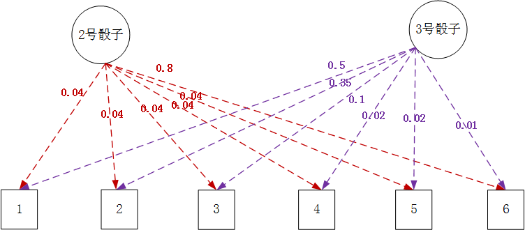

---
tags:
- 数学/概率统计
---

# 19 概率估计：隐马尔科夫模型观测序列描述

## 1.隐马尔科夫模型要研究什么

### 1.1.一个赌场的故事背景

在上一小节里，我们基本上把隐马尔科夫模型的运行机制和基本要素讲清楚了，那么他的关键研究要点是什么？或者说一般而言我们关注的研究问题聚焦在哪些方面呢？

我们不妨来看一个例子，这个例子可以更好的讲清楚我们为什么要研究这个模型，以及问题的关键点在哪。

这里我们举一个赌博的例子，大家应该都听说过用骰子猜大小的赌博游戏，掷出骰子，如果点数为 $1,2,3$，则为小，如果点数为 $4,5,6$，则为大。对于一个正常的骰子而言，掷出 $1,2,3,4,5,6$ 的点数的概率都是相等的，即都为 $\frac{1}{6}$，因此大小的概率各半，可以说是听天由命了，这个结果对于赌客而言是公平的，纯凭运气。

但是如果掷骰子的人是一个老千呢？也就是说他手上的骰子是特制的，各个点数投掷出来的概率不再均等，那赌客的钱包可得遭殃了。

怎么讲？举个例子，老千手上有三个骰子，$1$ 号骰子是正常的，$2$ 号骰子和 $3$ 号骰子都是特制的，他每次使用其中一个骰子进行投掷，并且不停的偷偷对这三个骰子进行切换使用，也就是说你不知道他使用的是哪个骰子，因此这对应的就是隐藏状态，而由骰子掷出的点数就是观测，这个很好理解。

那么由两个作弊的骰子掷出各个点数的概率，也就是输出概率如下图所示：



同时，老千每次随机使用其中一个骰子，在三个骰子之间互相转换的过程符合马尔科夫性，因此这里还会包含有一个三个骰子之间相互切换的概率转移矩阵。

### 1.2.研究问题描述

基于上述背景，我们就来谈谈我们到底会去研究些什么。

**第一个研究的内容是观测序列概率估计：** 当我们知道老千切换三个骰子的转移概率矩阵以及各个骰子输出各个点数的概率的基础上，我们可以计算出任意一个观测序列出现的概率，比如老千连续掷出诡异的 $8$ 个 $6$，我们可以看看这种情况发生的概率有多大。

用隐马尔科夫模型的形式化语言概况就是：在给定隐马尔科夫模型三要素 $\lambda=(A,B,\pi)$ 的基础上，针对一个具体的观测序列 $O=(o_1,o_2,…,o_T)$，求他出现的概率。

**第二个研究的内容是隐含状态序列解码：** 当我们知道老千切换三个骰子的转移概率以及各个骰子输出各个点数的概率时，我们可以通过已知的观测序列，也就是骰子的点数序列，来解码出老千所使用的骰子的序列，也就是隐状态序列。换句话说，就是可以推测出每一个掷出的点数背后，老千到底用的是哪一个骰子，可以判断他什么时候出千。

用隐马尔科夫模型的形式化语言概况就是：在给定隐马尔可夫模型三要素 $\lambda=(A,B,\pi)$ 和观测序列 $O=(o_1,o_2,…,o_T)$ 的基础上，求最有可能对应的隐藏状态序列 $I=(i_1,i_2,…i_T)$。

那么具体该怎么做，我们接下来开始详细讲解，这一小节里我们首先介绍指定观测序列的概率估计问题：

即在已知隐马尔科夫模型 $\lambda=(A,B,\pi)$ 的基础上，求指定观测序列 $O=(o_1,o_2,…,o_T)$ 出现的概率，也就是我们上面一个例子中所说的，求扔出一串指定点数骰子的概率，那么用条件概率来表示我们的计算目标就是：求 $P(O|\lambda)$ 的概率。

## 2.一个直观的思路

首先来梳理一下这里面的思路，我们知道，对于同一个观测序列 $O$ 而言，可以对应不同的隐含状态序列 $I$，实际上所有的隐含状态序列 $I$ 都能够以一定的概率生成这个观测序列 $O$。

那么按这个思路，$P(O|\lambda)$ 的求解过程就可以看作是通过对一系列不同 $I$ 和指定对应 $O$ 的联合概率进行求和，最终得到边缘概率的过程：$P(O|\lambda)=\sum_{I}P(O,I|\lambda)$。

然后联合概率 $P(O,I|\lambda)$ 按照贝叶斯公式进行展开有：$P(O,I|\lambda)=P(O|I,\lambda)P(I|\lambda)$，我们代入到原始公式中，就将目标式子转化成了：

$$P(O|\lambda)=\sum_{I}P(O|I,\lambda)P(I|\lambda)$$

这个概率怎么计算呢？对于任意一个隐含状态序列，我们设他的序列为：$I=(i_1,i_2,i_3,…,i_T)$，同时转移概率矩阵为 $A$。那么首先利用马尔科夫链生成这个隐含状态：

$$P(I|\lambda)=\pi_{i_1}a_{i_1i_2}a_{i_2i_3}a_{i_3i_4}…a_{i_{T-1}i_T}$$

然后我们再接着求解概率 $P(O|I,\lambda)$，$P(O|I,\lambda)$ 的本质就是利用这个已知的隐含状态序列 $I=(i_1,i_2,i_3,…,i_T)$ 去生成指定的观测序列 $O=(o_1,o_2,o_3,…,o_T)$，这里要运用一下输出概率矩阵 $B$：

$$P(O|I,\lambda)=b_{i_1o_1}b_{i_2o_2}…b_{i_To_T}$$

那么我们把他合并起来就有：

$$P(O,I|\lambda)=P(O|I,\lambda)P(I|\lambda)=\pi_{i_1}b_{i_1o_1}a_{i_1i_2}b_{i_2o_2}a_{i_2i_3}b_{i_3o_3}…a_{i_{T-1}i_T}b_{i_To_T}$$

这里补充一句，大家从 $P(O,I|\lambda)$ 和 $P(O|I,\lambda)$ 的表达式的不同，就能体会到这两个概率式子的不同含义。

## 3.直接计算的问题

看上去 $P(O,I|\lambda)=P(O|I,\lambda)P(I|\lambda)$ 的计算并不难，就是 $2T$ 次乘法运算，但是请你注意，他的外面还有一个求和的 $\sum$ 运算，恐怖的地方在这，相当于要对每一个可能出现的隐含状态序列都进行 $2T$ 次乘法运算，所有的隐含状态序列有多少个？序列长度为 $T$，隐含状态集中有 $N$ 个状态，那么所有的隐含状态序列的个数就是 $N^T$，整个运算复杂度就是 $O(TN^T)$，这恐怕是不能接受的。

## 4.更优的方法：前向概率算法

### 4.1.算法推导证明

这里我们一般采取的是基于递推的前向概率算法，这个算法有一定的推导过程，在这个过程中我们本质上就是不断的在条件概率、联合概率和边缘概率之间做着转换，这也是一个很好的复习的过程。

我们先定义一个变量：$\alpha_t(i)=P(o_1,o_2,…,o_t,i_t=q_i|\lambda)$

那么，我们来看看这个和我们的目标计算概率 $P(O|\lambda)$ 也就是 $P(o_1,o_2,…,o_T|\lambda)$ 有什么联系？还是那个思路：利用联合概率求解边缘概率：

$P(o_1,o_2,…,o_T|\lambda)=\sum_{i=1}^{N}P(o_1,o_2,…,o_T,i_T=q_i|\lambda)$，看看同学们啊，$P(o_1,o_2,…,o_T,i_T=q_i|\lambda)$ 这个是什么？这个不就是 $\alpha_T(i)$ 吗？

于是整个目标概率就变成了：$P(o_1,o_2,…,o_T|\lambda)=\sum_{i=1}^{N}\alpha_T(i)$，问题就来了，如何求 $\alpha_T(i)$?

这里我先抛出一个递推公式：$\alpha_{t+1}(i)=[\sum_{j=1}^{N}\alpha_t(j)a_{ji}]b_{io_{t+1}}$。

这个公式是一个神器，他的物理意义很直观，$\alpha_t(j)=P(o_1,o_2,…,o_t,i_t=q_j|\lambda)$ 所表达的是在时刻 $t$，一方面已经形成观测序列 $(o_1,o_2,…,o_t)$ ，另一方面此时隐状态是 $i_t=q_j$，很明显的是，当 $j$ 取 $1$ 到 $N$ 任意一个值的时候，都可以通过转移概率在 $t+1$ 时刻转移到 $i_{t+1}=q_i$，因此合并所有 $\alpha_{t}(j)a_{ji}$ 之后，再在 $i_{t+1}=q_i$ 的隐状态上输出 $o_{t+1}$，就得到了 $\alpha_{t+1}(i)$。

这是从内涵意义层面进行的推导，如果我们下面来证明一下这个式子的成立，我们就能放心大胆的从 $\alpha_1(i)$ 一步一步的递推到 $\alpha_T(i)$。

那么怎么证明这个递推关系成立呢？按道理来说，其实大家都不喜欢看大篇幅的公式证明，但是这里确实是不可避免的，必须要真刀真枪的把问题说清楚，不过呢我来个庖丁解牛，一定要大家轻轻松松搞明白。

在推导之前，我还是要再强调一下：抓住两个关键点，所有的推导都是建立在其上的：

一个是联合概率到边缘概率的转换关系； 一个是条件概率到联合概率的转换关系，也就是贝叶斯公式；

让我们开始，首先拿出定义：$\alpha_t(i)=P(o_1,o_2,o_3,…,o_t,i_t=q_i|\lambda)$

然后看 $a_{ji}$，这个再熟悉不过了，隐含状态从 $t$ 时刻的状态 $j$ 转移到 $t+1$ 时刻的状态 $i$ 的概率，写成条件概率就是：$a_{ji}=P(i_{t+1}=q_i|i_t=q_j,\lambda)$。

好的，关键的地方来了，我们按照递推公式把他们写在一起：

$$\sum_{j=1}^{N}\alpha_t(j)a_{ji}=\sum_{j=1}^{N}P(o_1,o_2,o_3,…,o_t,i_t=q_i|\lambda)P(i_{t+1}=q_i|i_t=q_j,\lambda)$$

下一步就是利用贝叶斯公式，将条件概率转换为联合概率，类似这样：$P(A,B)=P(A)P(B|A)$，那么，很显然：

$$\begin{aligned}
\sum_{j=1}^{N}\alpha_t(j)a_{ji}&=\sum_{j=1}^{N}P(o_1,o_2,o_3,…,o_t,i_t=q_j|\lambda)P(i_{t+1}\\
&=q_i|i_t=q_j,\lambda)\\
&=\sum_{j=1}^{N}P(o_1,o_2,o_3,…,o_t,i_t=q_j,i_{t+1}=q_i|\lambda)
\end{aligned}$$

接下来怎么办，显然是一个联合概率到边缘概率的转换过程，说明白点就是经过 $1$ 到 $N$ 的求和之后，$i_t=q_j$ 这一块就被“边缘”了，就变成了：

$$\sum_{j=1}^{N}P(o_1,o_2,o_3,…,o_t,i_t=q_j,i_{t+1}=q_i|\lambda)=P(o_1,o_2,o_3,…,o_t,i_{t+1}=q_i|\lambda)$$

还遥遥无期吗？说实话快了，最后一把，把 $b_{io_{t+1}}$ 给结合上，$b_{io_{t+1}}$ 是观测输出概率，表示在时刻 $i_{t+1}$，隐含状态为 $q_i$ 时输出观测为 $o_{t+1}$ 的概率，即：$b_{io_{t+1}}=P(o_{t+1}|i_{t+1}=q_i,\lambda)$

最后我们把他加上，写成递推公式的完整形式：

$$[\sum_{j=1}^{N}\alpha_t(j)a_{ji}]b_{io_{t+1}}=P(o_1,o_2,o_3,…,o_t,i_{t+1}=q_i|\lambda)P(o_{t+1}|i_{t+1}=q_i,\lambda)$$

这又是一个条件概率到联合概率的转换过程：

$$P(o_1,o_2,o_3,…,o_t,i_{t+1}=q_i|\lambda)P(o_{t+1}|i_{t+1}=q_i,\lambda)=P(o_1,o_2,o_3,…,o_{t+1},i_{t+1}=q_i|\lambda)$$

看看这是什么吧！$P(o_1,o_2,o_3,…,o_{t+1},i_{t+1}=q_i|\lambda)$，不就是 $\alpha_{t+1}(i)$ 吗？这样一来，$[\sum_{j=1}^{N}\alpha_t(j)a_{ji}]b_{io_{t+1}}=\alpha_{t+1}(i)$ 就推导出来了。说实话，推出来挺激动的。

那么有了递推公式 $[\sum_{j=1}^{N}\alpha_t(j)a_{ji}]b_{io_{t+1}}=\alpha_{t+1}(i)$，我们需要再明确一下初始值 $\alpha_{1}(i)$ 的求法，就可以一路从头推到尾，也就是推到 $\alpha_{T}(i)$。

很显然 $\alpha_1(i)=P(o_1,i_1=q_i|\lambda)=\pi_i b_{io_1}$

为了无死角的说明问题，我们把 $\pi_i b_{io_1}$ 展开：

$$\pi_ib_{io_1}=P(i_1=q_i|\lambda)P(o_1|i_1=q_i,\lambda)=P(o_1,i_1=q_i|\lambda)$$

最终，证明了 $\alpha_1(i)=\pi_i b_{io_1}$ 的等式是成立的。

此时就全部证明完了，看似过程很长，但我认为思路异常清晰，就是不断的利用贝叶斯公式、联合概率与边缘概率转换的公式进行推导。

### 4.2.算法流程总结

最后我们总结一下整个算法的过程：

我们令：$\alpha_t(i)=P(o_1,o_2,o_3,…,o_t,i_t=q_i|\lambda)$

初始值：$\alpha_1(i)=\pi_i b_{io_1}$

递推关系：$[\sum_{j=1}^{N}\alpha_t(j)a_{ji}]b_{io_{t+1}}=\alpha_{t+1}(i)$，一直推到 $\alpha_{T}(i)$

最后再把他们一相加就得到了结果：$P(O|\lambda)=\sum_{i=1}^N\alpha_T(i)$

## 5.概率估计实践

### 5.1.手工计算

我们来看个实际的例子，具体来实践一下观测序列的概率估计问题。我们回到上一节最初的那个盒子与球的模型。

模型中，隐状态集合 $Q=\{盒子 1，盒子 2，盒子 3\}，N=3$，初始概率 $\pi=(0.3,0.5,0.2)^T$。状态概率矩阵为：

$$A=\begin{bmatrix}0.4&0.4&0.2\\0.3&0.2&0.5\\0.2&0.6&0.2\end{bmatrix}$$

观测集合 $V=\{黑球，白球\} ，M=2$。观测概率矩阵：

$$B=\begin{bmatrix}0.2&0.8\\0.6&0.4\\0.4&0.6\end{bmatrix}$$

我们首先来计算一下指定观测序列 $O=(黑，白，黑)$ 的概率：

显然，我们首先计算初始值：

$\alpha_1(1)=\pi_1b_{1o_1}=0.3*0.2=0.06$ $\alpha_1(2)=\pi_2b_{2o_1}=0.5*0.6=0.3$ $\alpha_1(3)=\pi_3b_{3o_1}=0.2*0.4=0.08$

然后我们开始递推：

$t=2:$

$\alpha_2(1)=[\sum^{3}_{i=1}\alpha_1(i)a_{i1}]b_{1o_2}$ $=(0.06*0.4+0.3*0.3+0.08*0.2)*0.8=0.104$

$\alpha_2(2)=[\sum^{3}_{i=1}\alpha_1(i)a_{i2}]b_{2o_2}$ $=(0.06*0.4+0.3*0.2+0.08*0.6)*0.4=0.0528$

$\alpha_2(3)=[\sum^{3}_{i=1}\alpha_1(i)a_{i3}]b_{3o_2}$ $=(0.06*0.2+0.3*0.5+0.08*0.2)*0.6=0.1068$

$t=3:$

$\alpha_3(1)=[\sum^{3}_{i=1}\alpha_2(i)a_{i1}]b_{1o_3}$ $=(0.104*0.4+0.0528*0.3+0.1068*0.2)*0.2=0.01576‬$

$\alpha_3(2)=[\sum^{3}_{i=1}\alpha_2(i)a_{i2}]b_{2o_3}$ $=(0.104*0.4+0.0528*0.2+0.1068*0.6)*0.6=0.069744$

$\alpha_3(3)=[\sum^{3}_{i=1}\alpha_2(i)a_{i3}]b_{3o_3}$ $=(0.104*0.2+0.0528*0.5+0.1068*0.2)*0.4=0.027424$

最终：

$P(O|\lambda)=\sum_{i=1}^3\alpha_3(i)=0.01576+0.069744+0.027424=0.112928$

也就是说观测序列 $O=(黑，白，黑)$ 的概率为 $0.112928$。

### 5.2.代码实践

最后，我们用程序来演示上述计算过程，在 $python$ 中有一个第三方的库，$hmmlearn$，利用它可以进行隐马尔科夫模型的相关计算，我们在上面的大篇幅的概率计算，如果用 $hmmlearn$ 这个库来实现，就是几行代码的事儿。

不过需要说明一点的是，如果用 pip3 install hmmlearn 的命令进行库的安装，会出问题，所以建议大家先从 https://www.lfd.uci.edu/~gohlke/pythonlibs 里直接下载二进制的文件 hmmlearn-0.2.2-cp37-cp37m-win_amd64.whl，将其放在你的 python 安装路径的 Lib 目录下（我的是放在 D: \python37\Lib 下），然后再利用 pip3 install hmmlearn-0.2.2-cp37-cp37m-win_amd64.whl 命令行安装即可。

**代码片段：**

```python
import numpy as np
from hmmlearn import hmm

# 隐状态集合Q
states = ['box1', 'box2', 'box3']
# 观测集合V
observations = ['black', 'white']
# 初始概率pi
start_probability = np.array([0.3, 0.5, 0.2])
# 状态转移矩阵A
transition_probability = np.array([
  [0.4, 0.4, 0.2],
  [0.3, 0.2, 0.5],
  [0.2, 0.6, 0.2]
])

# 观测概率矩阵B
emission_probability = np.array([
  [0.2, 0.8],
  [0.6, 0.4],
  [0.4, 0.6]
])

# 选用MultinomialHMM对离散观测状态建模
model = hmm.MultinomialHMM(n_components=len(states))
model.startprob_ = start_probability
model.transmat_ = transition_probability
model.emissionprob_ = emission_probability

# 观测序列
obervation_list = np.array([0, 1, 0])
# 计算观测序列的概率，计算出来的是概率值的自然对数值
print(model.score(obervation_list.reshape(-1, 1)))
```

**运行结果：**

```
-2.1810048314892776
```

请大家注意，这里计算出来的结果值不是一个概率值，而是取的概率值的自然对数，因此我们还需要进行还原，$e^{-2.1810048314892776}=0.112927999$，发现计算后的结果和我们手算的结果完全一致。