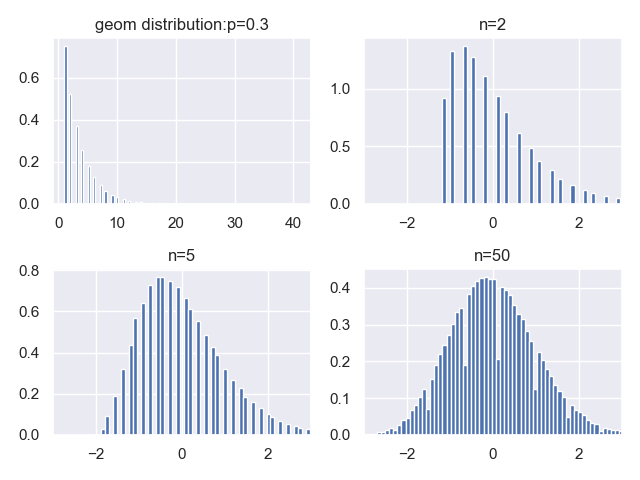

# 中心极限定理

[[大数定律]]研究的是一系列随机变量 $\{X_n\}$ 的均值 $\overline X_n=\frac1n\sum_{i=1}^n X_i$ 是否会[[依概率收敛]]于其期望 $E(\overline X_n)$ 这个数值，而中心极限定理进一步研究 $\overline X_n$ 服从什么分布。若 $\{X_n\}$ 满足一定的条件，当 $n$ 足够大时， $\overline X_n$ 近似服从[[正态分布]]，这就是中心极限定理的主要思想，这也体现了[[正态分布]]的重要性与普遍性。

这里再强调一遍，[[大数定律]]研究的的是 $\{X_n\}$ 的均值 $\overline X_n$ 的取值，中心极限定理研究的的是 $\overline X_n$ 的分布。

## 原理介绍

取随机变量序列： $X_1,X_2,…,X_n$，这 $n$ 个随机变量满足独立同分布，均值为 $\mu$，方差为 $\sigma^2$。

我们在这组随机变量序列的基础之上得到一个新的随机变量：

$$Z_n=\frac{X_1+X_2+…+X_n-n\mu}{\sqrt{n}\sigma}$$

针对随机变量 $Z_n$，我们很容易计算出：

$$E[Z_n]=E[\frac{X_1+X_2+…+X_n-n\mu}{\sqrt{n}\sigma}]=\frac{E[X_1+X_2+…+X_n]-n\mu}{\sqrt{n}\sigma}=0$$

$$var[Z_n]=var[\frac{X_1+X_2+…+X_n-n\mu}{\sqrt{n}\sigma}]=\frac{var[X_1]+var[X_2]+…+var[X_n]}{n\sigma^2}=1$$

即，随机变量 $Z_n$ 的期望为 $0$，方差为 $1$。

关键的一点是，随着样本个数 $n$ 的增大，随机变量 $Z_n$ 的分布逐渐趋向于一个标准正态分布，当 $n \rightarrow \infty$ 时，随机变量的分布收敛于一个标准正态分布。

由于随机变量 $Z_n=\frac{X_1+X_2+…+X_n-n\mu}{\sqrt{n}\sigma}$ 是经过标准化处理的，如果单单只考虑 $n$ 个随机变量的和，我们很容易得到：

$S_n=X_1+X_2+…+X_n$ 的分布趋近于一个均值为 $n\mu$，方差为 $n\sigma ^2$ 的正态分布。

中心极限定理的意义在于，大量样本的独立随机因素的叠加是趋近于一个正态分布的，这一点在很多工程领域很常见也很关键。

更重要的一点是，他不需要我们去搞明白随机变量 $X$ 的分布列或者概率密度函数，这往往是非常复杂的，甚至根本就无从得知，我们只需要知道他的均值和方差就可以进行后续的处理和分析了。

## 中心极限定理的模拟

下面，我们还是来举个例子，模拟验证一下中心极限定理。我们从一个服从参数 $p=0.3$ 的几何分布中进行采样，共分三组试验，分别每次采样 $2$ 个、$5$ 个、$50$ 个样本，每组试验各重复 $100000$ 次，然后按照 $Z_n=\frac{X_1+X_2+…+X_n-n\mu}{\sqrt{n}\sigma}$ 进行标准化，得到三组试验对应的结果，最后对试验结果进行可视化观察：

**代码片段：**

```python
import numpy as np
from scipy.stats import geom
import matplotlib.pyplot as plt
import seaborn
seaborn.set()

fig, ax = plt.subplots(2, 2)

geom_rv = geom(p=0.3)
geom_rvs = geom_rv.rvs(size=1000000)
mean, var, skew, kurt = geom_rv.stats(moments='mvsk')
ax[0, 0].hist(geom_rvs, bins=100, normed=True)
ax[0, 0].set_title('geom distribution:p=0.3')
n_array = [0, 2, 5, 50]

for i in range(1, 4):
    Z_array = []
    n = n_array[i]
    for j in range(100000):
        sample = np.random.choice(geom_rvs, n)
        Z_array.append((sum(sample) - n * mean) / np.sqrt(n * var))
    ax[i//2, i%2].hist(Z_array, bins=100, normed=True)
    ax[i//2, i%2].set_title('n={}'.format(n))
    ax[i//2, i%2].set_xlim(-3, 3)
    
plt.show()
```

**运行结果：**


左上第一幅图是几何分布的原始图像，我们发现，随着单次采样个数的逐渐增加，随机变量 $Z_n=\frac{X_1+X_2+…+X_n-n\mu}{\sqrt{n}\sigma}$ 的分布图像越来越趋近于一个标准正态分布。


## 二项分布中心极限定理

[[二项分布]]中心极限定理又叫*棣莫弗-拉普拉斯(De Moivre-Laplace)中心极限定理*是[[中心极限定理#独立同分布中心极限定理|独立同分布中心极限定理]]的特殊情况，它是最先被发现的中心极限定理。

**定义**

设随机变量 $\xi_n$ 服从[[二项分布]] $B(n,p)$ ，其中 $n$ 指 $n$ 重伯努利试验，$p$ 指概率。 $\xi_n$ 可视为 $n$ 个[[独立同分布]]的 0-1 分布随机变量的和，满足[[独立同分布]]中心极限定理的条件。因为 $E\xi_n=np,\quad  D\xi_n=np(1-p)$ ，当 $n$ 足够大时 $\xi_n$ 近似服从[[正态分布]] $N(np,np(1-p))$ ，即：

$$\lim_{n\to\infty}P\left(\frac{\xi_n-np}{\sqrt{np(1-p)}}<a\right)=\Phi(a)$$

该定理表明：当试验次数 $n$ 足够大时，[[二项分布]]近似于[[正态分布]]。

## 独立同分布中心极限定理

[[独立同分布]]中心极限定理又叫*林德伯格-勒维(Lindeberg-Levy)中心极限定理*

**定义**

如果 $\{X_n\}$ [[独立同分布]]，且 $EX=\mu,\quad D X=\sigma^2>0$ ，则 $n$ 足够大时 $\overline X_n$ 近似服从[[正态分布]] $N\left(\mu,\frac{\sigma^2}n\right)$ ，即

$$\lim_{n\to\infty}P\left(\frac{\overline X_n-\mu}{\sigma/\sqrt n}<a\right)=\Phi(a)=\int_{-\infty}^a\frac1{\sqrt{2\pi}}e^{-t^2/2}dt$$

这个定理是容易理解、记忆的。首先记住 $\{X_n\}$ 的均值 $\overline X_n$ 近似服从[[正态分布]]，接下来只需要解出这个[[正态分布]]的期望和方差。期望有：

$$E\overline X_n=\frac1n\sum_{i=1}^n E X_i=\frac{n\mu}n=\mu$$

方差有：

$$D\overline X_n=\frac1{n^2}\sum_{i=1}^{n}D X_i=\frac{n\sigma^2}{n^2}=\frac{\sigma^2}n$$

那么 $\overline X_n$ 近似服从的[[正态分布]]就是 $N\left(\mu,\frac{\sigma^2}n\right)$ ，归一化后的随机变量 $\frac{\overline X_n-\mu}{\sigma/\sqrt n}$ 近似服从标准[[正态分布]] $N(0,1)$ 。


## 独立不同分布下的中心极限定理

长度、重量、时间等等实际测量量一般符合[[正态分布]]，因为它们受各种微小的随机因素的扰动。这些随机因素的独立性是很普遍的，但很难说它们一定同分布。

实际上，一系列独立不同分布的随机变量也可能满足中心极限定理，只是这些不同分布的随机变量要有所限制。

### 林德伯格中心极限定理

林德伯格(Lindeberg)中心极限定理对 $\{X_n\}$ 的约束基本上是最弱的，也就是最强的中心极限定理。然而该定理的条件较难运用与验证，以下的定理是它的特例：

**定义**

设 $\{X_n\}$ 是一系列相互独立的连续随机变量，它们具有有限的期望 $\mathbb E X_i=\mu_i$ 和方差 $\mathbb D X_i=\sigma_i^2$ ，记 $Y_n=\sum_{i=1}^nX_i,\quad \mathbb D Y_n=\sum_{i=1}^n\sigma_i^2=B_n^2$ ，记 $X_i$ 的密度函数是 $p_i(x)$ ，若

$$\forall \tau>0: \lim_{n\to\infty}\frac1{\tau^2B^2_n}\sum_{i=1}^n\int_{|x-\mu_i|>\tau B_n}(x-\mu_i)^2p_i(x)dx=0$$

则：

$$\lim_{n\to\infty}P\left(\frac1{B_n}\sum_{i=1}^n(X_i-\mu_i)<a\right)=\Phi(a)$$


### 李雅普诺夫中心极限定理

李雅普诺夫(Lyapunov)中心极限定理的条件在很多情况下是满足的，因此适用性也很广。

**定义**

设 $\{X_n\}$ 是一系列相互独立的随机变量，若：

$$\exists\delta>0: \lim_{n\to\infty}\frac1{B_n^{2+\delta}}\sum_{i=1}^n\mathbb E\left(|X_i-\mu_i|^{2+\delta}\right)=0$$

则：

$$\lim_{n\to\infty}P\left(\frac1{B_n}\sum_{i=1}^n(X_i-\mu_i)<a\right)=\Phi(a)$$


