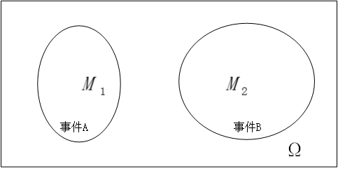

---
tags:
- 数学/概率统计
---

# 事件独立性

## 两个事件的独立性

事件 $A$ 的无条件概率 $P(A)$ 与其在给定事件 $B$ 发生下的条件概率 $P(A|B)$ 有可能是不同的，即：$P(A|B)\neq P(A)$ ，而这也是非常普遍的一种情况，这两个概率值一般都存在着差异。

其实，这反映了两个事件之间存在着一些关联，假如满足 $P(A|B)>P(A)$，则我们可以说事件 $B$ 的发生使得事件 $A$ 的发生可能性增大了，即事件 $B$ 促进了事件 $A$ 的发生。

但是如果 $P(A)=P(A|B)$ 呢，这种情况也是存在的，而且这是一种非常重要的情况，他意味着事件 $B$ 的发生与否对事件 $A$ 发生的可能性毫无影响。这时，我们就称 $A$ , $B$ 这两个事件独立，并由条件概率的定义式进行转换可以得到：

$$P(A|B)=\frac{P(AB)}{P(B) } \Rightarrow P(AB)=P(A|B)P(B)=P(A)P(B)$$

实际上，我们拿这个式子来刻画独立性，比单纯使用表达式 $P(A)=P(A|B)$ 要更好一些，因为 $P(AB)=P(A)P(B)$ 这个表达式不受概率 $P(B)$ 是否为 $0$ 的因素制约。

由此我们说，如果 $A$ 和 $B$ 两个事件满足 $P(AB)=P(A)P(B)$，则称事件 $A$ 和事件 $B$ 独立。

## 不相容与独立性

我们首先看看下面这幅图中所描述的情况：

在图中，表示事件 $A$ 和事件 $B$ 的两个圆圈互不相交，即意味着两个事件不相容，你会不会直观的感觉到，事件 $A$ 和事件 $B$ 二者看上去没啥关系，二者就是相互独立的？

这个说法看似很有道理，然而事实上却恰巧相反，若事件 $A$ 和事件 $B$ 互不相容，并且像图中所描述的，能够保证两个事件发生的概率：$P(A)>0$ 且 $P(B)>0$ 成立，则他们永远不会相互独立。

这是为什么呢？我们直接抠定义就好了，这是因为：首先有 $A\cap B=\phi$，那么显然有联合概率 $P(A\cap B)=0$，而由于 $P(A)$ 和 $P(B)$ 均大于 $0$，则有 $P(A)P(B)\neq0$ 。因此，从 $P(A\cap B) \neq P(A)P(B)$ 的结果来看，并不满足事件 $A$ 和事件 $B$ 相互独立的基本条件。

其实，这个结果从常理上来说我们也很好理解，由于事件 $A$ 和事件 $B$ 不相容，从图中可以看出，如果事件 $B$ 发生，则意味着事件 $A$ 一定不会发生，那么这就实际上说明了：事件 $B$ 的发生就给事件 $A$ 的发生引入了额外的信息，那么，二者显然就不是互相独立的了。

## 条件独立

### 1.条件独立的直观感受

我们在前面讨论了条件概率的内容，自然的直觉告诉我们，我们也应该在条件概率的框架之下来讨论事件之间的独立性，即探讨**条件独立**的概念。

条件独立的概念其实和独立的概念在本质上并没有太大的区别，无非是在进行事件 $A$ 和事件 $B$ 讨论的基础上，引入了另外一个前提条件：事件 $C$。即在给定事件 $C$ 发生的前提条件之下，若事件 $A$ 和事件 $B$ 满足等式：$P(A\cap B|C)=P(A|C)P(B|C)$ 成立，我们就说事件 $A$ 和事件 $B$ 在给定事件 $C$ 的前提之下条件独立。大家发现这是不是和独立性的定义基本上差不多呢？

### 2.条件独立的表达式

同样的，我们先对 $P(A\cap B|C)$ 这个式子进行简单的变形处理：

$$P(A\cap B|C)=\frac{P(A\cap B\cap C)}{P(C)}=\frac{P(C)P(B|C)P(A|B\cap C)}{P(C)}=P(B|C)P(A|B\cap C)$$

其实，在短短这几步的推导里面，涉及到了不少的知识内涵，我们下面来一一解析：

首先，我们依照条件概率的定义，可以得到第一步推导结果：

$$P(A\cap B|C)=\frac{P(A\cap B\cap C)}{P(C)}$$

而第二个推导的等式，则是在条件概率应用领域当中使用非常广泛的链式法则：

$$P(A\cap B\cap C)=P(B\cap C)P(A|B\cap C)=P(C)P(B|C)P(A|B\cap C)$$

最后，我们结合 $P(A\cap B|C)=P(B|C)P(A|B\cap C)$ 这个等式和条件独立的定义式 $P(A\cap B|C)=P(A|C)P(B|C)$，会发现他们拥有相同的等式左侧，因此将两个等式的右侧划上等号，就可以得到：$P(B|C)P(A|B\cap C)=P(A|C)P(B|C)$

最终我们就获得了这么一个等式：

$$P(A|B\cap C)=P(A|C)$$

这个等式是条件独立的另一个等价定义，也是非常直观的一个等式，这个等式说明了在给定事件 $C$ 发生的前提条件下，进一步假定此时如果事件 $B$ 也发生，并不会影响事件 $A$ 的发生概率（当然这里是指在事件 $C$ 发生前提下，事件 $A$ 发生的条件概率）。

简单点说，就是在事件 $C$ 发生的总的前提条件下，事件 $B$ 是否发生，不影响事件 $A$ 发生的概率。其实这就又回到了条件概率定义的源头上去了。

### 3.独立与条件独立

这里，我们停下来仔细思考一个重要的概念问题，就是事件 $A$ 和事件 $B$ 相互独立和在事件 $C$ 发生的基础上条件独立是不是等价的呢？直观上看觉得似乎应该能，但是事实上呢？我们看看下面这个例子：

我们举一个非常简单的例子：

假设依次抛掷两枚均匀的硬币，事件 $A$ 表示第一枚硬币正面向上，事件 $B$ 表示第二枚硬币正面向上。

首先，事件 $A$ 和事件 $B$ 肯定是相互独立的。那我们此时引入一个条件事件 $C$，事件 $C$ 表示两次试验的结果不同。那么显然，概率 $P(A\cap B|C)=0$，因为在两次试验结果不同的前提条件下，压根不可能发生两次都是正面的情况。

而另一方面呢？显然两个单独的条件概率 $P(A|C) \neq0$，$P(B|C)\neq0$，因此 $P(A\cap B|C)\neq P(A|C)P(B|C)$，也就是说事件 $A$ 和事件 $B$ 不满足事件 $C$ 发生下的条件独立的要求。

这个例子非常明确的说明了，**独立和条件独立并不等价**。

## 一组事件的独立性

最后，我们将两个事件相互独立的概念进一步推广到多个事件之间的相互独立性。为了方便我们直观理解，这里我们先将多个事件约定为 $3$ 个，讨论清楚了 $3$ 个事件独立的情况之后，其他的情况自然而然就迎刃而解了。

关于事件 $A_1$ , $A_2$ , $A_3$，这 $3$ 个事件满足相互独立的条件归结为以下 $4$ 条：

$$P(A_1\cap A_2)=P(A_1)P(A_2)$$
$$P(A_1\cap A_3)=P(A_1)P(A_3)$$
$$P(A_2\cap A_3)=P(A_2)P(A_3)$$
$$P(A_1\cap A_2\cap A_3)=P(A_1)P(A_2)P(A_3)$$

首先我们看到，前面的三个等式说明了任意两个事件之间是相互独立的，这种性质称之为两两独立，但是这并没有结束，第四个条件也是必要的，他并不是前面三个等式的推论，他无法仅仅通过前面三个条件成立就能得到。反过来，第四个条件成立也不能推导出前面三个条件的成立。

简单点说吧，就是上面这四个条件必须全部检验、全部满足，才能够说这三个事件之间满足独立性。

还是用上面那个抛硬币的那个例子，事件 $A$ 表示第一枚硬币正面向上，事件 $B$ 表示第二枚硬币正面向上，事件 $C$ 表示两次试验的结果不同。

首先事件 $A$ 和事件 $C$ 显然满足：$P(C)=P(C|A)=\frac{1}{2}$，即事件 $A$ 和事件 $C$ 独立，同理可知事件 $B$ 和事件 $C$ 独立，同时我们知道事件 $A$ 和事件 $B$ 也满足独立性。

但是到目前为止，即便前三个条件都满足了，此时第四个等式仍然不能满足：即 $P(A\cap B \cap C)=0$，$P(A)P(B)P(C)=\frac{1}{8}$，这两个等式并不相等。

最后由特殊到一般，我们来概况一下任意个数的一组事件之间相互独立应该满足的条件：

$P(\bigcap_{i\in S}A_i)=\prod_{i\in S}P(A_i)$ 对 $\{1,2,…,n\}$ 的任意子集 $S$ 都成立，则称 $A_1,…,A_n$ 为相互独立的事件。

脱离开上面形式化的公式，实际上，我们可以更加直观的来理解一组事件的独立性，通过对比，其实不难发现他的背景与两个事件的独立性是一样的。一组事件满足独立性意味着下面一个事实：我们把一组事件*任意的*分成两个小组，一个小组中的*任意个数*事件的出现与不出现，都不会给另一个小组中事件的发生与否带来任何额外的信息。

