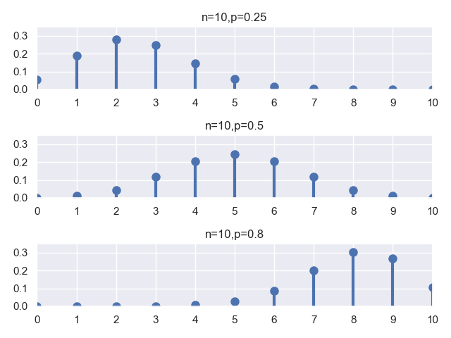
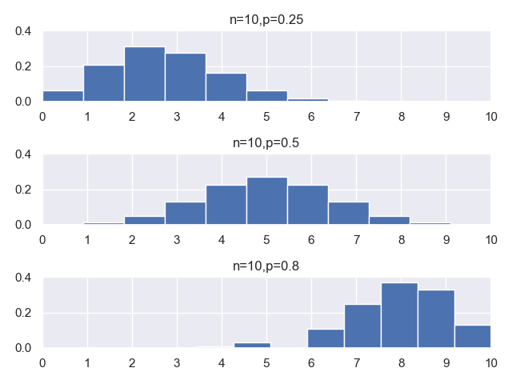

## 5.二项分布及二项随机变量

### 5.1.分布列及 PMF

举一个抛硬币的例子：将一个硬币抛掷 $n$ 次，每次抛掷出现正面的概率为 $p$，每次抛掷彼此之间都是相互独立的，随机变量 $X$ 对应 $n$ 次抛掷得到的是正面的次数。

这里，随机变量 $X$ 服从二项分布，二项分布中的核心参数就是上面提到的 $n$ 和 $p$，随机变量的分布列可以通过下面这个公式计算得到：

$$p_X(k) = P(X=k) = \begin{pmatrix} n\\ k \end{pmatrix}p^k(1-p)^{n-k}$$

下面我们通过依次指定不同的 $(n,p)$ 参数：$(10,0.25)$,$(10,0.5)$,$(10,0.8)$，来绘制 $PMF$ 图，来观察一下二项随机变量的分布情况：

**代码片段：**

```python
from scipy.stats import binom
import matplotlib.pyplot as plt
import seaborn
seaborn.set()

fig, ax = plt.subplots(3, 1)
params = [(10, 0.25), (10, 0.5), (10, 0.8)]
x = range(0, 11)

for i in range(len(params)):
    binom_rv = binom(n=params[i][0], p=params[i][1])
    ax[i].set_title('n={},p={}'.format(params[i][0], params[i][1]))
    ax[i].plot(x, binom_rv.pmf(x), 'bo', ms=8)
    ax[i].vlines(x, 0, binom_rv.pmf(x), colors='b', lw=3)
    ax[i].set_xlim(0, 10)
    ax[i].set_ylim(0, 0.35)
    ax[i].set_xticks(x)
    ax[i].set_yticks([0, 0.1, 0.2, 0.3])
    
plt.show()
```

**运行结果：**



挺好看的一张图，我们来简要解释一下代码：

**第 11 行：** 生成服从指定参数 $n$, $p$ 的二项分布随机变量。
**第 12 行~第 18 行：** 分别对其进行**PMF **图绘制，因为是离散型随机变量，因此不建议画成折线图，这种形态更为合适一些。

在这个例子中，我们直接通过 $scipy$ 中的 $stats$ 模块得到的二项分布的概率质量函数，也就是反映了不同参数条件下，随机变量 $X$ 各取值点所对应的取值概率。

### 5.2.随机变量的采样

我们可以使用 $binom$ 模块中的 $rvs$ 方法进行二项随机变量的采样模拟，我们可以指定所要采样的随机变量个数，这里指定重复采样 $10$ 万次。我们使用三组参数 $(n,p)$：分别是 $(10,0.25)$，$(10,0.5)$ 和 $(10,0.8)$。

通过上述模拟采样试验可以得到每种实验结果所对应的次数，然后我们通过归一化，可以计算出随机变量每一种取值所对应的频数，并将其作为概率的近似进行绘图观察。

**代码片段：**

```python
from scipy.stats import binom
import matplotlib.pyplot as plt
import seaborn
seaborn.set()

fig, ax = plt.subplots(3, 1)
params = [(10, 0.25), (10, 0.5), (10, 0.8)]
x = range(0, 11)
for i in range(len(params)):
    binom_rv = binom(n=params[i][0], p=params[i][1])
    rvs = binom_rv.rvs(size=100000)
    ax[i].hist(rvs, bins=11, normed=True)
    ax[i].set_title('n={},p={}'.format(params[i][0], params[i][1]))
    ax[i].set_xlim(0, 10)
    ax[i].set_ylim(0, 0.4)
    ax[i].set_xticks(x)
    print('rvs{}:{}'.format(i, rvs))

plt.show()
```

**运行结果：**

```python
rvs0:[0 4 2 ... 3 2 3]
rvs1:[6 6 5 ... 5 7 8]
rvs2:[7 8 9 ... 9 7 8]
```



程序打印的结果是三个数组，这就是我们在不同参数下分别做 $10$ 万次采样试验的结果数组。

### 5.3.随机变量的数字特征

服从二项分布的随机变量，他的期望和方差的表示很简单，服从参数为 $(n,p)$ 的二项分布的随机变量 $X$，他的期望和方差的公式我们直接给出来：

期望：$E[X]=np$

方差：$V[X]=np(1-p)$

我们可以结合上面的试验，用几种方法来验证一下上述结论：

**代码片段：**

```python
import numpy as np
from scipy.stats import binom

binom_rv = binom(n=10, p=0.25)
mean, var, skew, kurt = binom_rv.stats(moments='mvsk')

binom_rvs = binom_rv.rvs(size=100000)
E_sim = np.mean(binom_rvs)
S_sim = np.std(binom_rvs)
V_sim = S_sim * S_sim

print('mean={},var={}'.format(mean,var))
print('E_sim={},V_sim={}'.format(E_sim,V_sim))
print('E=np={},V=np(1-p)={}'.format(10 * 0.25,10 * 0.25 * 0.75))
```

**运行结果：**

```python
mean=2.5,var=1.875
E_sim=2.50569,V_sim=1.8735076238999997
E=np=2.5,V=np(1-p)=1.875
```

我们用三种方法计算了服从参数为 $(n=10,p=0.25)$ 的二项分布随机变量的均值和方差，其中：

**第 04 行~第 05 行：** 是用函数包中的方法计算的分布的各个理论统计值；
**第 07 行~第 10 行：** 从采样试验中得到的样本数据计算出来的均值和方差；
**第 14 行：** 通过公式直接计算出来的理论值。

看的出，利用采样样本数据计算出来的值和理论值基本上是相等的。