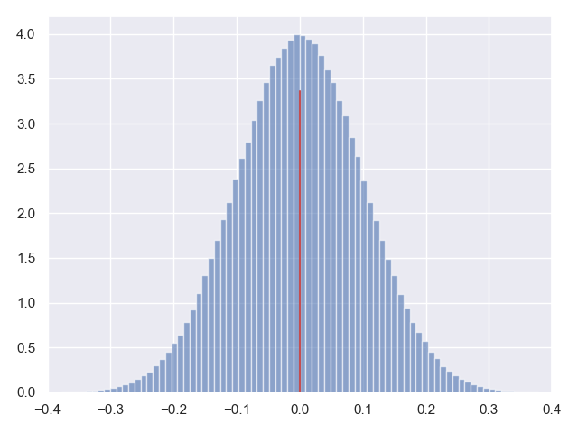
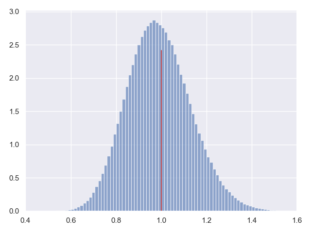
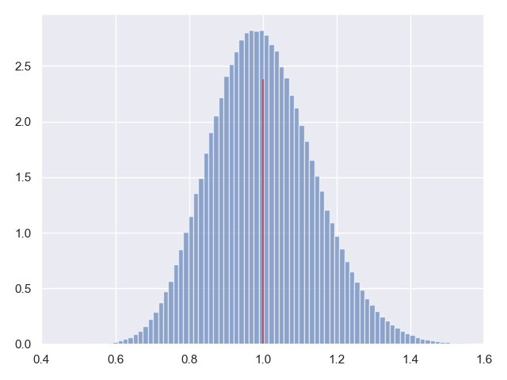

# 估计量的偏差与无偏估计

大家一定会有这样一个疑问，那就是为什么作为总体均值估计量的样本均值是 $\bar{X}=\frac{X_1+X_2+…+X_n}{n}$，而作为总体方差估计量的样本方差一般使用的是 $S^2=\frac{1}{n-1}\sum_{i=1}^{n}{(X_i-\bar{X})^2}$，为什么是除以 $n-1$，而不是除以 $n$。

这就涉及到估计的无偏性的问题了，这里我们先不一上来就解释无偏性的定义和概念，先来实际看一个例子吧。

## 1.总体均值的估计

我们做一个小实验，我们从均值为 $0$，标准差为 $1$ 的标准正态分布中获取样本，每次获取 $100$ 个样本值，然后按照 $\bar{X}=\frac{X_1+X_2+…+X_n}{n}$ 来计算统计量，我们重复实验 $100$ 万次，把 $100$ 万次得到的统计量绘制成直方图，看看他们的分布。同时计算出这 $100$ 万个估计量的均值（按照[[大数定律]]可以认为他就是期望了），并与待估计量，也就是真实的总体均值进行比较。

**代码片段：**

```python
from scipy.stats import norm
import matplotlib.pyplot as plt
import numpy as np
import seaborn

seaborn.set()

norm_rv = norm(loc=0, scale=1)
x = np.linspace(-1, 1, 1000)

sample_n = 100
x_array = []
for i in range(1000000):
    norm_rvs = norm_rv.rvs(size=sample_n)
    x_bar = sum(norm_rvs) / float(sample_n)
    x_array.append(x_bar)

print(np.mean(x_array))
plt.hist(x_array, bins=100, normed=True, alpha=0.6)
plt.axvline(0, ymax=0.8, color='r')
plt.gca().axes.set_xlim(-0.4, 0.4)
plt.show()
```

**运行结果：**

```
8.422755440900372e-06
```



很显然，作为估计值的随机样本统计量（在这个例子中就是 $100$ 个个体的样本均值）肯定不可能和未知参数（总体的均值 $\mu$）完全相等，他们之间一定存在着非零的**估计误差**。

但是一个好的估计量应该具备这样的性质，那就是这个估计误差的期望为 $0$。换句话说，也就是估计值的期望应该等于被估计的未知参数的真值。这个性质叫作**无偏性**，这样的估计值称作是**无偏**的。

可以看出 $\bar{X}=\frac{X_1+X_2+…+X_n}{n}$ 是对总体均值的一个很好的估计，因为他均匀的分布在待估计参数真实值的周围，并且最为关键的是，他的期望(近似计算出的均值 $8.422755440900372e-06 \approx 0$)就是总体的均值，因此样本均值 $\bar{X}=\frac{X_1+X_2+…+X_n}{n}$ 就是总体均值的无偏估计。

证明过程也很简单：
$$E(\bar{X})=E(\frac{X_1+X_2+…+X_n}{n})=\frac{1}{n}(E(X_1)+E(X_2)+…+E(X_n))=\frac{1}{n}(n\mu)=\mu$$

## 2.总体方差的估计

同样我们再看看，如果把 $\frac{1}{n}\sum_{i=1}^{n}{(X_i-\bar{X})^2}$ 作为总体方差的估计，到底合不合适。

同样的，我们还是从均值为 $0$，标准差为 $1$ 的标准正态分布中获取样本，每次获取 $100$ 个样本值，然后按照 $\frac{1}{n}\sum_{i=1}^{n}{(X_i-\bar{X})^2}$ 来计算统计量，我们重复实验 $100$ 万次，把 $100$ 万次得到的统计量绘制成直方图，看看他们的分布，并与真实的总体方差进行比较。

**代码片段：**

```python
from scipy.stats import norm
import matplotlib.pyplot as plt
import numpy as np
import seaborn

seaborn.set()

norm_rv = norm(loc=0, scale=1)
x = np.linspace(0, 2, 1000)

sample_n = 100
s_array = []
for i in range(1000000):
    norm_rvs = norm_rv.rvs(size=sample_n)
    x_bar = sum(norm_rvs) / float(sample_n)
    s = sum(np.square((norm_rvs - x_bar))) / float(sample_n)
    s_array.append(s)

print(np.mean(s_array))
plt.hist(s_array, bins=100, normed=True, alpha=0.6)
plt.axvline(1, ymax=0.8, color='r')
plt.gca().axes.set_xlim(0.4, 1.6)
plt.show()
```

**运行结果：**

```
0.989923522772342
```



总体方差的真实值是 $1$，而这里我们发现样本统计量的期望为 $0.9899$，是要明显小于实际的方差真实值的。并且更重要，也更直接的是，我们从图上可以看出整个 $100$ 万个统计结果的分布是整体偏左的，也就是整体偏小的。

这意味着 $\frac{1}{n}\sum_{i=1}^{n}{(X_i-\bar{X})^2}$ 作为总体方差的估计是带有系统误差的，他并不是一个无偏估计，而是有偏的。

那么这个系统偏差是多大？我们应该如何调整，从而得到总体方差的无偏估计呢？我们下面来进行严密的推理证明：

对于一个一般性的总体，我们假设他的总体均值的真值是 $\mu$，总体方差的真值是 $\sigma^2$，样本均值是 $\bar{X}$，我们来计算估计量 $\frac{1}{n}\sum_{i=1}^{n}{(X_i-\bar{X})^2}$ 的期望：

$$\begin{aligned}

E[\frac{1}{n}\sum_{i=1}^{n}(X_i-\bar{X})^2]&=E[\frac{1}{n}\sum_{i=1}^{n}((X_i-\mu)-(\bar{X}-\mu))^2]\\

&=E[\frac{1}{n}\sum_{i=1}^{n}((X_i-\mu)^2-2(\bar{X}-\mu)(X_i-\mu)+(\bar{X}-\mu)^2)]\\
&=E[\frac{1}{n}\sum_{i=1}^{n}(X_i-\mu)^2-\frac{2}{n}(\bar{X}-\mu)\sum_{i=1}^{n}(X_i-\mu)+\frac{1}{n}\sum_{i=1}^{n}(\bar{X}-\mu)^2]\\
&=E[\frac{1}{n}\sum_{i=1}^{n}(X_i-\mu)^2-\frac{2}{n}(\bar{X}-\mu)\sum_{i=1}^{n}(X_i-\mu)+(\bar{X}-\mu)^2]
\end{aligned}$$

我们进一步进行推导：

$$\begin{aligned}
\bar{X}-\mu&=\frac{1}{n}\sum_{i=1}^{n}X_i-\mu\\
&=\frac{1}{n}\sum_{i=1}^{n}X_i-\frac{1}{n}\sum_{i=1}^{n}\mu\\
&=\frac{1}{n}\sum_{i=1}^{n}(X_i-\mu)
\end{aligned}$$

因此，我们有：

$$\sum_{i=1}^{n}(X_i-\mu)=n(\bar{X}-\mu)$$

我们把这个关系式带回到等式当中：

$$\begin{aligned}

E[\frac{1}{n}\sum_{i=1}^{n}(X_i-\mu)^2-\frac{2}{n}(\bar{X}-\mu)\sum_{i=1}^{n}(X_i-\mu)+(\bar{X}-\mu)^2]&=E[\frac{1}{n}\sum_{i=1}^{n}(X_i-\mu)^2-\frac{2}{n}(\bar{X}-\mu)n(\bar{X}-\mu)+(\bar{X}-\mu)^2]\\

&=E[\frac{1}{n}\sum_{i=1}^{n}(X_i-\mu)^2-2(\bar{X}-\mu)^2+(\bar{X}-\mu)^2]\\
&=E[\frac{1}{n}\sum_{i=1}^{n}(X_i-\mu)^2-(\bar{X}-\mu)^2]\\
&=E[\frac{1}{n}\sum_{i=1}^{n}(X_i-\mu)^2]-E[(\bar{X}-\mu)^2]
\end{aligned}$$

之前我们学过，方差 $\sigma^2$ 的定义是随机变量到总体均值之差的平方的期望：

$$\sigma^2=E[(X-\mu)^2]$$

并且，我们说过，样本服从总体的分布，因此 $E[X_i]=E[X]$

$$\begin{aligned}

E[\frac{1}{n}\sum_{i=1}^{n}(X_i-\mu)^2]&=E[\frac{1}{n}n(X-\mu)^2]\\

&=E[(X-\mu)^2]\\
&=\sigma^2
\end{aligned}$$

显然：

$$\begin{aligned}

E[(\bar{X}-\mu)^2]&=E[(\frac{X_1+X_2+X_3+…+X_n}{n}-\mu)^2]\\

&=E[(\frac{1}{n}(X_1+X_2+X_3+…+X_n-n\mu))^2]\\
&=E[\frac{1}{n^2}((X_1-\mu)^2)+(X_2-\mu)^2)+…(X_n-\mu)^2)]\\
&=\frac{1}{n}E[\frac{1}{n}\sum_{i=1}^{n}(X_i-\mu)^2]
\end{aligned}$$

曙光已经初现，我们把他合并回等式中去：

$$\begin{aligned}

E[\frac{1}{n}\sum_{i=1}^{n}(X_i-\mu)^2]-E[(\bar{X}-\mu)^2]&=E[\frac{1}{n}\sum_{i=1}^{n}(X_i-\mu)^2]-\frac{1}{n}E[\frac{1}{n}\sum_{i=1}^{n}(X_i-\mu)^2]\\

&=\frac{n-1}{n}E[\frac{1}{n}\sum_{i=1}^{n}(X_i-\mu)^2]\\
&=\frac{n-1}{n}\sigma^2
\end{aligned}$$

看到了吗？我们的估计值的期望：

$$E[\frac{1}{n}\sum_{i=1}^{n}(X_i-\bar{X})^2]=\frac{n-1}{n}\sigma^2$$

这就是他为什么整体偏小的原因，原来他的期望并不是总体的方差，而是方差的 $\frac{n-1}{n}$。回想一下吧，我们总体方差的真实值是 $1$，我们的样本容量是 $100$，那么我们这个估计值的期望就是 $\frac{99}{100}=0.99$，是不是正好和我们上面的试验结果一样呢？

那么如果想要得到总体方差的无偏估计，就得修正我们统计量的表达式，很简单，由于：

$$E[\frac{1}{n}\sum_{i=1}^{n}(X_i-\bar{X})^2]=\frac{n-1}{n}\sigma^2$$

那么：

$$\frac{n}{n-1}E[\frac{1}{n}\sum_{i=1}^{n}(X_i-\bar{X})^2]=\sigma^2$$

最后稍作整理：

$$E[\frac{1}{n-1}\sum_{i=1}^{n}(X_i-\bar{X})^2]=\sigma^2$$

因此这就是为什么总体方差的无偏估计是 $\frac{1}{n-1}\sum_{i=1}^{n}(X_i-\bar{X})^2$，而不是 $\frac{1}{n}\sum_{i=1}^{n}(X_i-\bar{X})^2$ 的原因了。

最后我们把上面的代码中，方差估计的表达式调整成 $\frac{1}{n-1}\sum_{i=1}^{n}(X_i-\bar{X})^2$：

```python
s = sum(np.square((norm_rvs - x_bar))) / float(sample_n-1)
```

观察一下试验结果：

**运行结果：**

```
1.0000016490508186
```



从结果中我们可以看出：方差估计值的期望和总体方差一致，结果是无偏的，正是我们想要的。