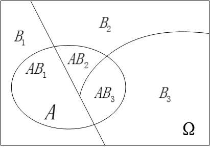

# 全概率公式

首先我们假设 $B_1,B_2,B_3,…,B_n$ 为有限个或无限可数个事件，他们之间两两互斥且在每次试验中至少发生其中一个，我们用图直观的表示如下：

我们用表达式描述上面这幅图的含义就是：

$$\begin{aligned}
B_iB_j=\phi\\
B_1+B_2+B_3…+B_n=\Omega
\end{aligned}$$

现在我们接着引入另一个事件 $A$，如下图所示：

很明显，因为 $\Omega$ 是一个必然事件（换句话说就是事件全集），因此有 $P(A)=P(A \Omega )$ ，进一步进行推导有：$P(A)=P(A\Omega)=P(AB_1+AB_2+AB_3+…+AB_n)$，因为事件 $B_i,B_j$ 两两互斥，显然 $AB_1,AB_2,AB_3,…,AB_n$ 也两两互斥，因此就有：

$$P(A)=P(AB_1)+P(AB_2)+P(AB_3)+…+P(AB_n)$$

再由条件概率公式 $P(AB_i)=P(B_i)P(A|B_i)$ 进行代入，将上式转换得到：

$$P(A)=P(B_1)P(A|B_1)+P(B_2)P(A|B_2)+…+P(B_n)P(A|B_n)$$

这就是我们最终得到的**全概率公式**，“全”字的意义在于：全部的概率 $P(A)$ 被分解成了许多的部分概率之和。

我们再次回过头来看看全概率公式的表达式，我们从式子里可以非常直观的发现：事件 $A$ 的概率 $P(A)$ 应该处于最小的 $P(A|B_i)$ 和最大的 $P(A|B_j)$ 之间，它不是所有条件概率 $P(A|B_k)$ 的算术平均，因为他们各自被使用的机会( 即 $P(B_i)$)各不相同。因此**全概率 $P(A)$ 就是各 $P(A|B_k)$ 以 $P(B_k)$ 为权的加权平均值**。

全概率公式的实际价值在于，很多时候，我们直接去计算事件 $A$ 的概率是比较困难的，但是如果条件概率 $P(A|B_k)$ 是已知的，或很容易被我们推导计算时，全概率公式就成了计算概率 $P(A)$ 的很好的途径。
