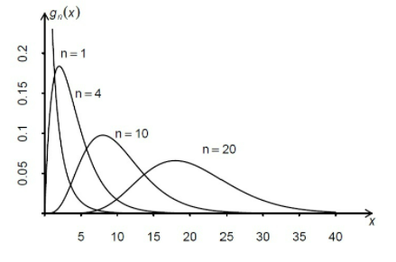
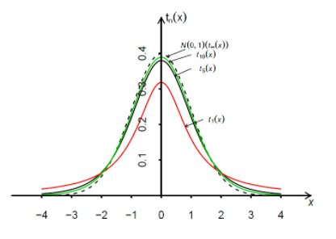
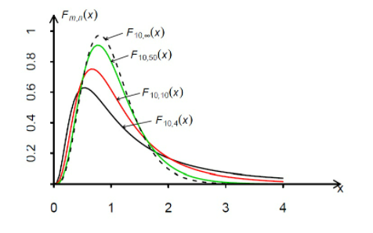

# 概率论与数理统计公式总结

## 一、概率论的基本概念

### 1. 加法公式

- $$P\left(A_{1} \cup A_{2}\right)=P\left(A_{1}\right)+P\left(A_{2}\right)-P\left(A_{1} A_{2}\right)$$
- $$P\left(A_{1} \cup A_{2} \cup A_{3}\right)=P\left(A_{1}\right)+P\left(A_{2}\right)+P\left(A_{3}\right)-P\left(A_{1} A_{2}\right)-P\left(A_{1} A_{3}\right)-P\left(A_{2} A_{3}\right)+P\left(A_{1} A_{2} A_{3}\right)$$
- $$P\left(\bigcup_{i=1}^{n} A_{i}\right)=\sum_{i=1}^{n} P\left(A_{i}\right)-\sum_{1 \leq i<j \leq n} P\left(A_{i} A_{j}\right)+\sum_{1 \leq i<j<k \leq n} P\left(A_{i} A_{j} A_{k}\right)+\ldots+(-1)^{n-1} P\left(A_{1} A_{2} \ldots A_{n}\right)$$

### 2. 条件概率

- $$P(B \mid A)=\frac{P(A B)}{P(A)}$$
- $$P(A B)=P(B) P(A \mid B)=P(A) P(B \mid A)$$
- $$P\left(A_{1} A_{2} \cdots A_{n}\right)=P\left(A_{1}\right) P\left(A_{1} \mid A_{2}\right) P\left(A_{3} \mid A_{1} A_{2}\right) \ldots P\left(A_{n} \mid A_{1} A_{2} \cdots A_{n-1}\right)$$

### 3. 全概率公式

- $$P(A)=P(A B)+P(A \bar{B})=P(B) P(A \mid B)+P(\bar{B}) P(A \mid \bar{B})$$
- $$P(A)=\sum_{j=1}^{n} P\left(B_{j}\right) P\left(A \mid B_{j}\right)$$

### 4. 贝叶斯公式

- $$\frac{P(B) P(A \mid B)}{P(B) P(A \mid B)+P(\bar{B}) P(A \mid \bar{B})}$$
- $$P\left(B_{i} \mid A\right)=\frac{P\left(A B_{i}\right)}{P(A)}=\frac{P\left(B_{i}\right) P\left(A B_{i}\right)}{\sum_{j=1}^{n} P\left(B_{j}\right) P\left(A \mid B_{j}\right)}$$

### 5. 事件运算

- $$A(B \cup C)=A B \cup A C $$
- $$A \cup B C=(A \cup B)(A \cup C)$$
- $$\overline{A \cup B}=\bar{A} \cap \bar{B}$$
- $$\overline{A \cap B}=\bar{A} \cup \bar{B}$$
- $$A-B=A \bar{B}$$

## 二、随机变量及其概率分布

### 1. 概率密度

- $$F(x)=\int_{-\infty}^{z} f(t) d t$$
- $$\int_{-\infty}^{+\infty} f(x) \mathrm{d} x=1$$
- $$对数集 A, P(x \in A)=\int_{A} f(x) \mathrm{d} x$$

### 2.常见分布及期理与方差

#### 2.1 离散随机变量

##### 0-1 分布

- $$X \sim 0-1(p)$$
- $$P(X=k)=p^{k}(1-p)^{n-k}$$
- $$E(X)=p, D(X)=p(1-p)$$

##### 二项分布

- $$X \sim B(n, p)$$
- $$P(X=k)=C_{n}^{k} \cdot p^{k} \cdot(1-p)^{n-k}$$
- $$E(X)=n p, D(X)=n p(1-p)$$

##### 泊松分布

- $$X \sim P(\lambda)$$
- $$P(X=k)=\frac{\lambda^{k} e^{-\lambda}}{k !}(k=0,1,2, \ldots)$$
- $$E(X)=\lambda, D(X)=\lambda$$

##### 超几何分布

- $$X \sim H(N, M, n)$$
- $$P(X=k)=\frac{C_{\mathbb{W}}^{+} C_{N-\underline{R}}^{-\not}}{C_{N}^{*}}$$
- $$E(X)=n \frac{M}{N}, D(X)=n \frac{M(N-M)(N-n)}{N^{2}(N-1)}$$

##### 几何分布

- $$X \sim G(p)$$
- $$P(X=k)=(1-p)^{k-1} p$$
- $$E(X)=\frac{1}{p}, D(X)=\frac{1-p}{p^{2}}$$

#### 2.2 连续随机变皇

##### 正态分布

- $$X \sim N\left(\mu, \sigma^{2}\right)$$
- $$f(x)=\frac{1}{\sqrt{2 \pi \sigma}} e^{-\frac{(x-\mu)^{2}}{2 \sigma^{2}}}$$
- $$E(X)=\mu, D(X)=\sigma^{2}$$
- $$\text{化为标准正态分布:} Y=\frac{X-\mu}{\sigma} \sim N(0,1)$$

##### 指数分布

- $$X \sim E(\lambda)$$
- $$f(x)=\lambda e^{-\lambda x}(x \geq 0)$$
- $$F(x)=1-e^{-\lambda x}(x \geq 0)$$
- $$E(X)=\frac{1}{\mu}, D(X)=\frac{1}{\lambda^{2}}$$

##### 威布尔分布

- $$X \sim W(X)$$
- $$f(x)=\lambda \alpha x^{\alpha-1} e^{-\lambda x^{\alpha}}(x>0)$$
- $$F(x)=1-e^{-\lambda x^{a}}(x>0)$$

##### 均匀分布

- $$X \sim U(a, b)$$
- $$f(x)=\frac{1}{b-a}(a \leq x<b)$$
- $$F(x)=\left\{\begin{array}{ll}0, & x \leq a \\ \frac{(x-a)}{(b-a)}, & a<x<b \\ 1, & x \geq b\end{array}\right.$$
- $$E(X)=\frac{a+b}{2}, D(X)=\frac{(b-a)^{2}}{12}$$

##### 伽马分布

- $$\Gamma(\alpha)=\int_{0}^{\infty} x^{\alpha-1} e^{-x} \mathrm{~d} x, \alpha>0$$
- $$X \sim \Gamma(\alpha, \beta)$$
- $$f(x)=\frac{\beta^{\alpha}}{\Gamma(\alpha)} x^{\alpha-1} e^{-\beta x},(x \geq 0)$$
- $$E(X)=\frac{\alpha}{\beta}, D(X)=\frac{\alpha}{\beta^{2}}$$

##### 对数正态分布

- $$\ln X \sim N(\mu, \sigma)$$
- $$f(x)=\frac{1}{x \sigma \sqrt{2 \pi}} \exp \left\{-\frac{(\ln x-\mu)^{2}}{2 \sigma^{2}}\right\}$$
- $$E(X)=\mathrm{e}^{\mu+\frac{\sigma^{2}}{2}}, D(X)=\left(\mathrm{e}^{\sigma^{2}}-1\right) \mathrm{e}^{2 \mu+\sigma^{2}}$$

### 3. 随机变量函数的概率密度

$$
\begin{array}{l}
\text { 若 } Y=g(x), \quad g^{\prime}(x)>0 \text{ 或 } g^{\prime}(x)<0\\
\text { 则有 } f_{Y}(y)=f_{X}(h(y)) \cdot\left|h^{\prime}(y)\right|(\alpha<y<\beta)\\
\text { 其中 }h(y) \text { 是 } g(x) \text { 的反函数, 即 } h(y)=g^{-1}(x)
\end{array}
$$

## 三、随机向量及其概率分布

### 1.分布函数

#### 1.1 联合分布函数

对于随机向量 $(X, Y)$ ，称 $F(x, y)=P(X \leq x, Y \leq y)$ ，为 $(X, Y)$ 的联合分布函数。

联合分布函数是 $x$, $y$ 的单调不减函数。

#### 1.2 边缘分布函数

当 $F(x, y)$ 是 $(X, Y)$ 的联合分布函数时，由于 $\{Y \leq \infty\},\{X \leq \infty\}$ 是必然事件，所以对于 $X$, $Y$ 来说， 有概率分布：

$$
\begin{array}{c}
F_{X}(x)=P(X \leq x, Y \leq \infty)=F(x, \infty) \\
F_{Y}(y)=P(X \leq \infty, Y \leq y)=F(\infty, y)
\end{array}
$$

这时称 $F_{X}(x)$, $F_{Y}(y)$ 为 $(X, Y)$ 的边缘分布函数。

#### 1.3 独立性

 $X$, $Y$ 相互独立的充要条件是对任何 $x$, $y$ 都有 $F(x, y)=F_{X}(x) F_{Y}(y)$ ，该定理可推广至任意多个臨机变量。

当 $X_{1}, X_{2}, \cdots, X_{n}$ 相互独立时，有以下定理成立：

1. $Y_{1}=g_{1}\left(X_{1}\right), Y_{2}=g_{2}\left(X_{2}\right), \cdots, Y_{n}=g_{n}\left(X_{n}\right)$ 相互独立
2. 对于 $k$ 元函数 $g\left(x_{1}, x_{2}, \cdots, x_{k}\right)$ , 定义 $Z_{k}=g\left(X_{1}, X_{2}, \cdots, X_{k}\right)$ ，则 $Z_{k}, X_{k+1}, \cdots, X_{n}$ 相互独立

### 2. 密度函数

#### 2.1 联合必度函数

设 $(X, Y)$ 是随机向量, 如果有 $\mathbb{R}^{2}$ 上的非负函数 $f(x, y)$ 使得对 $\mathbb{R}^{2}$ 的任何长方形子集

$$D=\{(x, y) \mid a<x \leq b, c<y\}$$

有

$$P((X, Y) \in D)=\iint_{D} f(x, y) \mathrm{d} x \mathrm{~d} y$$

则称， $(X, Y)$ 是连续型随机向量，井称 $f(x, y)$ 是 $(X, Y)$ 的联合概率密度或联合密度(jjoint density)。

#### 2.2 边缘密度函数

如果 $f(x, y)$ 是随机向正 $(X, Y)$ 的联合密度，则称 $X$, $Y$ 各自的概率密度为 $f(x, y)$ 或 $(X, Y)$ 的边缘密度 (marginal density)。

由定义与随机向量中变量关系可得：

$$
\begin{array}{l}
f_{X}(x)=\int_{-\infty}^{\infty} f(x, y) \mathrm{d} y \\
f_{Y}(y)=\int_{-\infty}^{\infty} f(x, y) \mathrm{d} x
\end{array}
$$

#### 2.3 独立性

设 $X$, $Y$ 分别有概率密度 $f_{X}(x)$, $f_{Y}(y)$ ，则 $X$, $Y$ 独立的充分必要条件是随机向量 $(X, Y)$ 有联合密度：

$$f(x, y)=f_{X}(x) f_{Y}(y)$$

- 若已知 $X$, $Y$ 独立, 则已知 $X=x$ 时， $Y$ 的取值范围与 $x$ 无关
- 若连续型随机向量 $\left(X_{1}, X_{2}, \cdots, X_{n}\right)$ 的概率密度函数 $f\left(x_{1}, \cdots, x_{n}\right)$ 可表示为 $n$ 个函数 $g_{1}, \cdots, g_{n}$ 之 积，其中 $g_{i}$ 只依赖于 $x_{i}$ ， 即：

$$f\left(x_{1}, \cdots, x_{n}\right)=g_{1}\left(x_{1}\right) \cdots g_{n}\left(x_{n}\right)$$

则 $X_{1}, \cdots, X_{n}$ 相互独立, 且 $X_{i}$ 的边绿密度函数 $f_{i}\left(x_{i}\right)$ 与 $g_{i}\left(x_{i}\right)$ 只相差个常数因子。

### 3. 随机向量函数的分布函数与概率密度函数

#### 3.1 离散型随机向量的函数

- 泊松分布具有可加性: 如果 $X_{1}, X_{2}, \cdots, X_{n}$ 相互独立, $X_{i} \sim P\left(\lambda_{i}\right)$ ， 则：

$$Z_{n}=X_{1}+X_{2}+\cdots+X_{n} \sim P\left(\lambda_{1}+\lambda_{2}+\cdots+\lambda_{n}\right)$$

- 二项分布具有可加性: 如果 $X_{1}, X_{2}, \cdots, X_{n}$ 相互独立, $X_{i} \sim B\left(m_{i}, p\right)$ , 则：

$$Z_{n}=X_{1}+X_{2}+\cdots+X_{n} \sim P\left(m_{1}+m_{2}+\cdots+m_{n}, p\right)$$

- 正态分布具有可加性: 如果 $X_{1}, X_{2}, \cdots, X_{n}$ 相互独立, $X_{i} \sim N\left(\mu_{i}, \sigma_{i}\right)$ , 则：

$$Z_{n}=c_{0} \pm c_{1} X_{1} \pm c_{2} X_{2} \pm \cdots \pm c_{n} X_{n} \sim N\left(c_{0} \pm c_{1} \mu_{1} \pm \cdots \pm c_{n} \mu_{n}, c_{1}^{2} \sigma_{1}^{2}+c_{2}^{2} \sigma_{2}^{2}+\cdots+c_{n}^{2} \sigma_{n}^{2}\right)$$

#### 3.2 连续型随机向量的函数

##### 3.2.1 加法

设 $(X, Y)$ 有联合密度 $f(x, y)$ , 则 $U=X+Y$ 有概率密度：

$$f_{U}(u)=\int_{-\infty}^{\infty} f(x, u-x) \mathrm{d} x=\int_{-\infty}^{\infty} f(u-y, y) \mathrm{d} y$$

当 $X$, $Y$ 独立时：

$$f_{U}(u)=\int_{-\infty}^{\infty} f_{X}(x) f_{Y}(u-x) \mathrm{d} x=\int_{-\infty}^{\infty} f_{X}(u-y) f_{Y}(y) \mathrm{d} y$$

##### 3.2.2 减法

设 $(X, Y)$ 有联合密度 $f(x, y)$ ，则 $V=X-Y$ 有概率密度：

$$f_{V}(v)=\int_{-\infty}^{\infty} f(x, x-v) \mathrm{d} x=\int_{-\infty}^{\infty} f(v+y, y) \mathrm{d} y$$

当 $X$, $Y$ 独立时：

$$f_{V}(v)=\int_{-\infty}^{\infty} f_{X}(x) f_{Y}(x-v) \mathrm{d} x=\int_{-\infty}^{\infty} f_{X}(v+y) f_{Y}(y) \mathrm{d} y$$

##### 3.2.3 最值

- 最大值

设 $(X, Y)$ 有联合密度 $f(x, y)$ ，则 $Z=\max (X, Y)$ 有概率密度：

$$f_{\max }(z)=f_{X}(z) f_{Y}(z)$$

- 最小值

设 $(X, Y)$ 有联合密度 $f(x, y)$ ，则 $Z=\min (X, Y)$ 有概率密度：

$$f_{\min }(z)=1-\left(1-f_{X}(z)\right)\left(1-f_{Y}(z)\right)$$

#### 3.3 随机向量函数的联合概率密度

如果 $x=x(u, v)$, $y=y(u, v)$ , 在平面的开集 $D$ 中有连续的偏导数，且雅克比行列式为：

$$
J=\frac{\partial(x, y)}{\partial(u, v)}=\left|\begin{array}{ll}
\frac{\partial x}{\partial u} & \frac{\partial x}{\partial v} \\
\frac{\partial_{y}}{\partial_{u}} & \frac{\partial_{y}}{\partial_{v}}
\end{array}\right| \neq 0
$$

则有：

$$\mathrm{d} x \mathrm{~d} y=\left|\frac{\partial(x, y)}{\partial(u, v)}\right| d u \mathrm{~d} v=|J| \mathrm{d} u \mathrm{~d} v,(u, v) \in D$$

其中 $|J|$ 是 $J$ 的绝对值，然后利用：

$$g(u, v)=f(x(u, v), y(u, v))|J|$$

得到陏机向量 $(U, V)$ 的联合密度。

#### 3.4 条件概率密度

$$f_{X \mid Y}(x \mid y)=\frac{f(x, y)}{f_{Y}(y)}$$

因此 $X$, $Y$ 独立的充要条件为 $f_{X \mid Y}(x \mid y)=f_{X}(x)$。

## 四、随机变量的数字特佂

### 1. 期望

#### 1.1 定义

##### 1.1.1 离散型

$$E(X)=\sum_{k=1}^{+\infty} x_{k} \cdot p_{k}$$

##### 1.1.2 连续型

$$E(X)=\int_{-\infty}^{+\infty} x \cdot f(x) \mathrm{d} x$$

#### 1.2 Y=g(X)

##### 1.2.1 离敝型

$$E(Y)=E[g(X)]=\sum_{k=1}^{\infty} g\left(x_{k}\right) \cdot p_{k}$$

##### 1.2.2 连续型

$$E(Y)=E[g(X)]=\int_{-\infty}^{+\infty} g(x) f(x) \mathrm{d} x$$

#### 1.3 Z=h(X, Y)

##### 1.3.1 离散型

$$E(Z)=E[h(X, Y)]=\sum_{i=1}^{\infty} \sum_{j=1}^{\infty} h\left(x_{i}, y_{j}\right) \cdot p_{i j}$$

##### 1.3.2 连续型

$$E(Z)=E[h(X, Y)]=\int_{-\infty}^{+\infty} \int_{-\infty}^{+\infty} h(x, y) f(x, y) \mathrm{d} x \mathrm{~d} y$$

#### 1.4 性质

- 线性组合 $Y=c_{0}+c_{1} X_{1}+c_{2} X_{2}+\cdots+c_{n} X_{n}$ 的期望存在，且：

$$E\left(c_{0}+c_{1} X_{1}+c_{2} X_{2}+\cdots+c_{n} X_{n}\right)=c_{0}+c_{1} E\left(X_{1}\right)+c_{2} E\left(X_{2}\right)+\cdots+c_{n} E\left(X_{n}\right)$$

- 若 $X_{1}, X_{2}, \cdots, X_{n}$ 相互独立，那么乘积 $Z=X_{1} X_{2} \cdots X_{n}$ 的期望存在，且：

$$E\left(X_{1} X_{2} \cdots X_{n}\right)=E\left(X_{1}\right) E\left(X_{2}\right) \cdots E\left(X_{n}\right)$$

- $E(\bar{X})=\mu$

### 2.方差

#### 2.1 定义

##### 2.1.1 基本

$$D(X)=E\left((X-\mu)^{2}\right)=E\left(X^{2}\right)-\mu^{2}=E\left(X^{2}\right)-(E(X))^{2}$$

##### 2.1.2 离散型

$$D(X)=\sum_{i=1}^{+\infty}\left[x_{i}-E(X)\right]^{2} p_{i}$$

##### 2.1.3 连续型

$$D(X)=\int_{-\infty}^{+\infty}[x-E(X)]^{2} f(x) d x$$

#### 2.2 性质

1. $0 \leq \operatorname{Var}(X)=E X^{2}-(E X)^{2} \Rightarrow \operatorname{Var}(X) \leq E X^{2}$
2. $\operatorname{Var}(c X)=c^{2} \operatorname{Var}(X)$
3. $\operatorname{Var}(X) \leq E(X-c)^{2}$ ，其中等号成立当且仅当 $c=E X$
4. $\operatorname{Var}(X+Y)=\operatorname{Var}(X)+\operatorname{Var}(Y)+2 \cdot \operatorname{Cov}(X, Y)$
5. $\operatorname{Var}(X-Y)=\operatorname{Var}(X)+\operatorname{Var}(Y)-2 \cdot \operatorname{Cov}(X, Y)$
6. 若 $X$, $Y$ 相互独立， $a$, $b$ 为常数，那么有 $\operatorname{Var}(a X+b Y)=a^{2} \operatorname{Var}(X)+b^{2} \operatorname{Var}(Y)$
7. $\operatorname{Var}(\bar{X})=\frac{\sigma^{2}}{n}$
8. $\operatorname{Var}(X Y)=\operatorname{Var}(X) \operatorname{Var}(Y)+\operatorname{Var}(X)(E Y)^{2}+\operatorname{Var}(Y)(E X)^{2}$

#### 2.3 标准化

我们称：

$$X^{*}=\frac{X-E X}{\sqrt{\operatorname{Var}(X)}}$$

为 $X$ 的标准化随机变量，易得 $E X^{*}=0, \operatorname{Var}\left(X^{*}\right)=1$

### 3. 矩

#### 3.1 定义

设 $X$ 为随机变量， $c$ 为常数， $r$ 为正整数，则 $E\left[(X-c)^{r}\right]$ 称为 $X$ 关于 $c$ 点的 $r$ 阶矩。

#### 3.2 原点矩与中心矩

- $c=0$ ，这时 $\alpha_{k}=E X^{r}$ 称为 $X$ 的 $r$ 阶原点矩
- $c=E X$ ，这时 $\mu_{k}=E\left[(X-E X)^{r}\right]$ 称为 $X$ 的 $r$ 阶中心矩

### 4. 协方差与相关系数

#### 4.1 协方差定义

$$\operatorname{Cov}(X, Y)=E\{[X-E(X)][Y-E(Y)]\}$$

称为 $X$, $Y$ 的协方差，其中 $\mathrm{Cov}$ 是英文单词 Covariance 的缩写。

#### 4.2 协方差性质

1. $\operatorname{Cov}(X, Y)=\operatorname{Cov}(Y, X)$
2. $\operatorname{Cov}(X, X)=\operatorname{Var}(X)$
3. $\operatorname{Cov}(X, Y)=E(X Y)-E(X) E(Y)$ , 所以当 $X$, $Y$ 相互独立时，协方差为 0
4. $\operatorname{Cov}\left(X_{1}+X_{2}, Y\right)=\operatorname{Cov}\left(X_{1}, Y\right)+\operatorname{Cov}\left(X_{2}, Y\right)$
5. $\operatorname{Cov}(a X, b Y)=a b \cdot \operatorname{Cov}(X, Y)$

#### 4.3 相关系数定义

设 $X$, $Y$ 是随机变量，则称：

$$\rho_{X Y}=\frac{\operatorname{Cov}(X, Y)}{\sqrt{\operatorname{Var}(X) \operatorname{Var}(Y)}}$$

为 $X$, $Y$ 的相关系数。

#### 4.4 相关系数性质

1. 当 $\rho_{X Y}=0$ 时，称 $X$, $Y$ 不(线性)相关
2. $\rho_{X Y}=\operatorname{Cov}\left(X^{*}, Y^{*}\right)$ , 因此可以将相关系数视为标准尺度下的协方差
3. $\left|\rho_{X Y}\right| \leq 1$ , 等号成立当且仅当 $X$, $Y$ 之间存在严格的线性关系，即：
    - $\rho_{X Y}=1$ ，则存在 $a>0, b \in \mathbb{R}$ 使得 $X=a Y+b$ (正相关)
    - $\rho_{X Y}=-1$ ，则存在 $a<0, b \in \mathbb{R}$ 使得 $X=a Y+b$ (负相关)

#### 4.5 不相关与独立

- 不相关: $\rho_{X Y}=0$

- 独立: $P\left(X=x_{i}, Y=y_{j}\right)=P\left(X=x_{i}\right) P\left(Y=y_{j}\right), \quad f(x, y)=f_{X}(x) f_{Y}(y)$

因此对随机变量 $X$, $Y$ ，如果 $X$, $Y$ 相互独立，那么它们一定不相关，但如果它们不相关却末必相互独立。

### 5. 大数定律与中心极限定理

#### 5.1 切比雪夫不等式

$$P\{|X-\mu| \geq \varepsilon\}<\frac{\sigma^{2}}{\varepsilon^{2}}, \forall \varepsilon>0$$

#### 5.2 伯努利大数定律

$$\lim _{n \rightarrow+\infty} P\left\{\left|\frac{n_{A}}{n}-p\right| \geq \varepsilon\right\}=0$$

#### 5.3 独立同分布的中心极限定理

设 $X_{1}, X_{2}, \ldots, X_{n}, \ldots$ 相互独立且同分布, $E\left(X_{i}\right)=\mu, D\left(X_{i}\right)=\sigma^{2}, i=1,2, \ldots$ , 则对于充分大的 $n$ 有：

$$\sum_{i=1}^{n} X_{i} \rightarrow^{d} N\left(n \mu, n \sigma^{2}\right)$$

即：

$$\frac{X_{1}+\cdots+X_{n}-n \mu}{\sqrt{n} \sigma} \rightarrow^{d} N(0,1)$$

即：

$$\lim _{n \rightarrow \infty} P\left(\frac{X_{1}+\cdots+X_{n}-n \mu}{\sqrt{n} \sigma} \leq x\right)=\Phi(x)$$

#### 5.4  德莫弗拉普拉斯定理

即二项分布可以用正态分布逼近：

$$n_{A} \rightarrow^{d} N(n p, n p(1-p))$$

即：

$$\frac{X_{1}+\cdots+X_{n}-n p}{\sqrt{n p(1-p)}} \rightarrow^{d} N(0,1)$$

即：

$$\lim _{n \rightarrow \infty} P\left(\frac{X_{1}+\cdots+X_{n}-n p}{\sqrt{n p(1-p)}} \leq x\right)=\Phi(x)$$

## 五、统计三大分布与序分布

### 1. 卡方分布

#### 1.1 定义

设 $X_{1}, X_{2}, \cdots, X_{n}$ 是来自标准正态总体 $N(0,1)$ 的一个样本，令：

$$X=\sum_{i=1}^{n} X_{i}^{2}$$

则称 $X$ 是自由度为 $n$ 的 $\chi^{2}$ 变量，其分布称为自由度为 $n$ 的 $\chi^{2}$ 分布，记为 $X \sim \chi_{n}^{2}$。

#### 1.2 概率密度

$$
f_{n}(x)=\left\{\begin{array}{ll}
\frac{1}{2^{\frac{n}{2}} \Gamma\left(\frac{n}{2}\right)} y^{\frac{n}{2}-1} \mathrm{e}^{-\frac{\pi}{2}}, & x>0 \\
0 . & x \leq 0
\end{array}\right.
$$

可以观察到自由度为 $n$ 的 $\chi^{2}$ 分布与 Gamma 分布的关系为:

$$X=\sum_{i=1}^{n} X_{i}^{2} \sim \Gamma\left(\frac{n}{2}, \frac{1}{2}\right)$$

密度函数图像：

#### 1.3 性质

1. 期望: $E\left(\chi_{n}^{2}\right)=n$
2. 方差: $\operatorname{Var}\left(\chi_{n}^{2}\right)=2 n$
3. 可加性: 若 $X \sim \chi_{n_{1}}^{2}$, $Y \sim \chi_{n_{2}}^{2}$ ，且 $X$, $Y$ 相互独立，那么有 $X+Y \sim \chi^{2}\left(n_{1}+n_{2}\right)$

#### 1.4 上侧 $\alpha$ 分位数

若 $X \sim \chi_{n}^{2}$ ，记 $P(X>c)=\alpha$ ，则 $c=\chi_{n}^{2}(\alpha)$ 称为 $\chi_{n}^{2}$ 分布的上侧 $\alpha$ 分位数。

### 2. t 分布

#### 2.1 定义

设随机变量 $X \sim N(0,1)$, $Y \sim \chi_{n}^{2}$ ，且 $X$, $Y$ 独立，则称：

$$T=\frac{X}{\sqrt{\frac{y}{n}}}$$

为自由度为 $n$ 的 $t$ 变量，其分布称为自由度为 $n$ 的 $t$ 分布，记作 $T \sim t_{n}$

#### 2.2 概率密度

$$t_{n}(x)=\frac{\Gamma\left(\frac{n+1}{2}\right)}{\Gamma\left(\frac{n}{2}\right) \sqrt{n \pi}}\left(1+\frac{x^{2}}{n}\right)^{-\frac{\text {-n+1 }}{2}},(x \in \mathbb{R})$$

易得 t 分布与正态分布的关系：

$$\lim _{n \rightarrow \infty} t_{n}(x)=\varphi(x)$$

概率密度图形：

#### 2.3 性质

1. 期望: 当 $n \geq 2$ 时， $E(T)=0$
2. 方差: 当 $n \geq 3$ 时， $\operatorname{Var}(T)=\frac{n}{n-2}$

#### 2.4 双侧 $\alpha$ 分位数

若 $T \sim t_{n}$ ，记 $P(|T|>c)=\alpha$ ，则 $c=t_{n}\left(\frac{\alpha}{2}\right)$ 为自由度为 $n$ 的 $t$ 分布的双侧 $\alpha$ 分位数。

### 3. F分布

#### 3.1 定义

设随机变量 $X \sim \chi^{2}(m)$, $Y \sim \chi^{2}(n)$ , 且 $X$, $Y$ 独立，则称：

$$F=\frac{\frac{x}{m}}{\frac{y}{n}}$$

为自由度分别是 $m$, $n$ 的 $F$ 变量，其分布称为自由度为 $m$, $n$ 的 $F$ 分布，记作 $F \sim F(m, n)$

#### 3.2 概率密度

$$f_{m, n}(x)=\frac{\Gamma\left(\frac{m+n}{2}\right)}{\Gamma\left(\frac{n}{2}\right) \Gamma\left(\frac{m}{2}\right)} m^{\frac{m}{2}} n^{\frac{n}{2}} x^{\frac{m}{2}-1}(n+m x)^{-\frac{m+n}{2}},(x>0)$$

概率密度图形：

 

#### 3.3 性质

1. 若 $Z \sim F(m, n)$ , 则 $\frac{1}{Z} \sim F(n, m)$
2. 若 $T \sim t_{n}$ ，则 $T^{2} \sim F(1, n)$
3. $F_{1-\alpha}(m, n)=\frac{1}{P_{\alpha}(n, m)}$ , 注意自由度对换

#### 4.上侧 $\alpha$ 分位数

若 $F \sim F(m, n)$ , 记 $P(F>c)=\alpha$ , 则 $c=F_{\alpha}(m, n)$ 为 $F$ 分布的上侧 $\alpha$ 分位数。

### 4. 序分布

#### 4.1 定义

设 $X 1, X 2, \ldots, X n$ 是取自总体 $X$ 的样本， $X_{(i)}$ 称为该样本的第 $i$ 个次序统计量，它的取值是将样本观测 值由小到大排列后得到的第 $i$ 个观测值。从小到大排序为 $x_{(1)}, x_{(2)}, \ldots, x_{(n)}$ , 则称 $X_{(1)}, X_{(2)}, \ldots, X_{(n)}$ 为顺序统计量。

#### 4.2 密度函数

设总体 $X$ 的密度函数为 $f(x)$ ，分布函数为 $F(x), X_{1}, X_{2}, \ldots, X_{n}$ 为样本，则第 $k$ 个次序统计量 $X_{(k)}$ 的密度函数为

$$f_{k}(x)=\frac{n !}{(k-1) !(n-k) !} F(x)^{(k-1)}(1-F(x))^{(n-k)} f(x)$$

#### 4.3 分布函数

当 $k=1, n$ 时可得：

$$\begin{array}{c}
F_{1}(x)=1-(1-F(x))^{n} \\
F_{n}(x)=F(x)^{n}
\end{array}$$

### 5. 正态总体的样本均值与样本方差的分布

#### 5.1 一般总体的样本均值与样本方差

设总体 $X$ 分布末知，但已知 $E(X)=\mu, D(X)=\sigma^{2}, X_{1}, X_{2}, \cdots, X_{n}$ 是来自总体 $X$ 的样本：

$$
\begin{array}{l}
X=\frac{1}{n} \sum_{i=1}^{n} X_{i} \\
S^{2}=\frac{1}{n-1} \sum_{i=1}^{n}\left(X_{i}-X\right)^{2}
\end{array}
$$

分别为样本均值与样本方差，则有：

$$
\begin{array}{l}
E(\bar{X})=\mu, D(\bar{X})=\frac{\sigma^{2}}{n} \\
E\left(S^{2}\right)=D(X)=\sigma^{2}
\end{array}
$$

#### 5.2 正态变量样本均值与样本方差的性质

设 $X_{1}, X_{2}, \cdots, X_{n} \sim N\left(\mu, \sigma^{2}\right)$, $\bar{X}$, $S^{2}$ 分别为样本均值与样本方差，则有：

1. $\bar{X} \sim N\left(\mu, \frac{\sigma^{2}}{n}\right)$
2. $\frac{(n-1) S^{2}}{\sigma^{2}} \sim \chi_{n-1}^{2}$
3. $\bar{X}$, $S^{2}$ 相互独立

#### 5.3 几个重要推论

1. 设 $X_{1}, X_{2}, \cdots, X_{n}$ 相互独立相同分布 $(i . i . d) \sim N\left(\mu, \sigma^{2}\right)$ ，则有：

$$T=\frac{\sqrt{n}(\bar{X}-\mu)}{S} \sim t(n-1)$$

2. 设 $X_{1}, X_{2}, \cdots, X_{m} i.i. d \sim N\left(\mu_{1}, \sigma_{1}^{2}\right), Y_{1}, Y_{2}, \cdots, Y_{n} i.i. d \sim N\left(\mu_{2}, \sigma_{2}^{2}\right)$ ，且假定 $\sigma_{1}^{2}=\sigma_{2}^{2}=\sigma^{2}$ ，样本 $X_{1}, X_{2}, \cdots, X_{m}, Y_{1}, Y_{2}, \cdots, Y_{n}$ 独立，则有：

$$\frac{(\bar{X}-\bar{Y})-\left(\mu_{1}-\mu_{2}\right)}{\sqrt{\frac{\sigma_{i}^{2}}{n_{1}}+\frac{\sigma_{2}^{2}}{n_{2}}}} \sim N(0,1)$$

因此：

$$T=\frac{(\bar{X}-\bar{Y})-\left(\mu_{1}-\mu_{2}\right)}{S_{w}} \cdot \sqrt{\frac{m n}{n+m}} \sim t(n+m-2)$$

这里：

$$S_{w}=\frac{(m-1) S_{1}^{2}+(n-1) S_{2}^{2}}{n+m-2}$$

3. 设 $X_{1}, X_{2}, \cdots, X_{m} i.i. d \sim N\left(\mu_{1}, \sigma_{1}^{2}\right), Y_{1}, Y_{2}, \cdots, Y_{n} i.i. d \sim N\left(\mu_{2}, \sigma_{2}^{2}\right)$ ，样本 $X_{1}, X_{2}, \cdots, X_{m}, Y_{1}, Y_{2}, \cdots, Y_{n}$ 独立，则有：

$$F=\frac{S_{1}^{2}}{S_{2}^{2}} \cdot \frac{\sigma_{2}^{2}}{\sigma_{1}^{2}}=\frac{\frac{S_{1}^{2}}{\sigma_{1}^{2}}}{\frac{S_{2}^{2}}{\sigma_{2}^{2}}} \sim F(m-1, n-1)$$

## 六、参数估计

### 1. 估计

#### 1.1 估计的分类

假设 $\hat{\theta} 是 \theta$ 的估计，那么有：

1. 若 $E \hat{\theta}=\theta$ ，则称 $\hat{\theta}$ 是 $\theta$ 的无偏估计
2. 当样本量 $n \rightarrow \infty$ ， $\hat{\theta}$ 依概率收敛到 $\theta$ ，则称 $\hat{\theta}$ 是 $\theta$ 的相合估计
3. 当样本量 $n \rightarrow \infty$ ， $\hat{\theta}$ 依概率 1 收敛到 $\theta$ ，则称 $\hat{\theta}$ 是 $\theta$ 的强相合估计

#### 1.2 样本均值与样本方差的估计

1. 样本均值 $\bar{X}_{n}$ 是总体均值 $\mu$ 的强相合无偏估计
2. 样本方差 $S^{2}$ 是总体方差 $\sigma^{2}$ 的强相合无偏估计
3. 样本标准差 $S$$ 的强相合估计，但是 $E S<\sigma$

### 2. 点估计

#### 2.1 矩估计

##### 2.1.1 定义

矩估计是基于一种简单的替换的思想建立起来的一种估计方法，其基本思想是用样本矩估计总体矩。由大数定律，如果末知参数和总体的某个或某些矩有关系，那么自然地构造这种样本矩去估计末知参数。

##### 2.1.2 样本矩

样本阶原点矩:

$$a_{k}=\frac{1}{n} \sum_{i=1}^{n} X_{i}^{k}$$

样本 $k$ 阶中心矩:

$$m_{k}=\frac{1}{n} \sum_{i=1}^{n}\left(X_{i}-\bar{X}\right)^{k}$$

由大数定律保证了：

$$
\begin{array}{l}
a_{k} \rightarrow^{p} \alpha_{k} \\
m_{k} \rightarrow^{p} \mu_{k}
\end{array}
$$

##### 2.1.3 常用矩估计

1. 在泊松分布 $P(\lambda)$ 中：

$$\lambda=E X=\alpha_{1}$$

且 $\alpha_{1}$ 的矩估计是 $a_{1}$ ，因此：

$$\hat{\lambda}=a_{1}=\frac{1}{n} \sum_{i=1}^{n} X_{i}$$

2. 在指数分布 $E(\lambda)$ 中：

$$\mu=E X=\frac{1}{\lambda} \Rightarrow \lambda=\frac{1}{E X}=\frac{1}{\alpha_{1}}$$

且 $\alpha_{1}$ 的矩估计是 $a_{1}$ ，因此：

$$\lambda=\frac{1}{a_{1}}=\frac{1}{\frac{1}{n} \sum_{i=1}^{n} X_{i}}$$

3. 在正态总体 $N\left(\mu, \sigma^{2}\right)$ 中：

$$
\begin{array}{l}
\mu=E X=\alpha_{1} \\
\sigma^{2}=E X^{2}-(E X)^{2}=\alpha_{2}-\alpha_{1}^{2}
\end{array}
$$

且 $\alpha_{1}$ 的矩估计是 $a_{1}$ , 且 $\alpha_{2}$ 的矩估计是 $a_{2}$ , 因此分别用：

$$
\begin{array}{l}
\hat{\mu}=a_{1}=\frac{1}{n} \sum_{i=1}^{n} X_{i} \\
\hat{\partial}^{2}=a_{2}-a_{1}^{2}=\frac{1}{n} \sum_{i=1}^{n} X_{i}^{2}-\left(\frac{1}{n} \sum_{i=1}^{n} X_{i}\right)^{2}
\end{array}
$$

来估计参数 $\mu$ 和 $\sigma^{2}$。

4. 在均匀总体 $U(a, b)$ 中：

$$
\begin{array}{l}
\alpha_{1}=E X=\frac{a+b}{2} \\
\alpha_{2}-\alpha_{1}^{2}=D(X)=\frac{(b-a)^{2}}{12}
\end{array}
$$

因此解出方程组：

$$
\begin{array}{l}
a=\alpha_{1}-\sqrt{3\left(\alpha_{2}-\alpha_{1}^{2}\right)} \\
b=\alpha_{1}+\sqrt{3\left(\alpha_{2}-\alpha_{1}^{2}\right)}
\end{array}
$$

所以分别用：

$$
\begin{array}{l}
\hat{a}=a_{1}-\sqrt{3\left(a_{2}-a_{1}^{2}\right)} \\
\hat{b}=a_{1}+\sqrt{3\left(a_{2}-a_{1}^{2}\right)}
\end{array}
$$

来估计参数 $a$, $b$ 。

#### 2.2 极大似然估计

##### 2.2.1 定义

设 $X=\left(X_{1}, \cdots, X_{n}\right)$ 为从具有概率函数 $f$ 的总体抽出的样本， $\theta$ 为末知参数或者末知参数向量。 $x=\left(x_{1}, \cdots, x_{n}\right)$ 为样本的观察值。若在给定 $x$ 时，值 $\hat{\theta}=\hat{\theta}(x)$ 满足下式：

$$L(\hat{\theta})=\max _{\theta \in \Theta} L(x ; \theta)$$

则称 $\hat{\theta}$ 为参数 $\theta$ 的极大似然估计，而 $\hat{\theta}(X)$ 称为参数 $\theta$ 的极大似然估计量， $L(x ; \theta)$ 称为极大似然函数。若待估参数是 $\theta$ 的函数 $g(\theta)$ ，那么它的极大似然估计就是 $g(\hat{\theta})$ ，由于 $\ln L(\theta)$ 与 $L(\theta)$ 有着相同的最大值点，因 此也可以用 $l(\theta)=\ln L(\theta)$ 进行极大似然估计，通常称 $l(\theta)$ 为对数似然函数。

##### 2.2.2 具体操作方法

求极大似然估计相当于求似然函数的最大值，在简单样本的情况下：

$$L(x ; \theta)=\prod_{i=1}^{n} f\left(x_{i} ; \theta\right)$$

当似然函数对变量 $\theta$ 单调时，直接利用单调性得到最大值点。

当似然函数为非单调函数且对变量 $\theta$ 可微分时，我们可以求其驻点，令：

$$\frac{\mathrm{d} L(\theta)}{\mathrm{d} \theta}=0$$

或者：

$$\frac{\mathrm{d} l(\theta)}{\mathrm{d} \theta}=0$$

当 $\theta$ 为多维时，令：

$$\frac{\partial L(\theta)}{\partial \theta_{i}}=0$$

或者：

$$\frac{\partial l(\theta)}{\partial \theta_{i}}=0$$

然后判断此驻点是否是最大值。

### 3. 区间估计

#### 3.1 定义

设总体分布 $F(x, \theta)$ 含有一个或多个末知的参数 $\theta, \theta \in \Theta$ , 对绐定的值 $\alpha,(0<\alpha<1)$ ，若由样本
 $X_{1}, \cdots, X_{n}$ 确定的两个统计量 $\bar{\theta}=\bar{\theta}\left(X_{1}, \cdots, X_{n}\right)$ 和 $\underline{\theta}=\underline{\theta}\left(X_{1}, \cdots, X_{n}\right)$ 满足：

$$P_{\theta}(\underline{\theta}\leq \theta \leq \bar{\theta})=1-\alpha \quad \forall \theta \in \Theta$$

称 $1-\alpha$ 为置信水平，称 $[\theta, \bar{\theta}]$ 为 $\theta$ 的置信水平为 $1-\alpha$ 的置信区间。

#### 3.2 枢轴变量法

枢轴变量法设待估参数为 $g(\theta)$

1. 找一个与待估参数 $g(\theta)$ 有关的统计量 $T$ , 一般是其一个良好的点估计 (多数是通过极大似然估计构造)
2. 设法找出 $T$ 与 $g(\theta)$ 的某一函数 $S(T, g(\theta))$ 的分布, 其分布 $F$ 要与参数 $\theta$ 无关 ($S$ 即为枢轴变量)
3. 对任何常数 $a<b$ , 不等式 $a \leq S(T, g(\theta)) \leq b$ 要能表示成等价的形式 $A \leq g(\theta) \leq B$ , 其 中 $A$, $B$ 只与 $T$, $a$, $b$ 有关而与参数无关
4. 取分布 $F$ 的上 $\alpha / 2$ 分位数 $\omega_{\alpha / 2}$ 和上 $(1-\alpha / 2)$ 分位数 $\omega_{1-\alpha / 2}$ , 有 $F\left(\omega_{\alpha / 2}\right)-F\left(\omega_{1-\alpha / 2}\right)=  1-\alpha$ 。因此：

$$P\left(\omega_{1-\alpha / 2} \leq S(T, g(\theta)) \leq \omega_{\alpha / 2}\right)=1-\alpha$$

#### 3.3 常见的枢轴变量法进行正态总体的区间估计

1. $\sigma$ 已知，求 $\mu$ 的置信水平为 $1-\alpha$ 的双仅置信区间

枢轴量:

$$Z=\frac{\bar{X}_{n}-\mu}{\frac{\sigma}{\sqrt{n}}} \sim N(0,1)$$

于是得到 $\mu$ 的双则置信区间为：

$$\left[\bar{X}-\frac{z_{\frac{\alpha}{2}} \sigma}{\sqrt{n}}, \bar{X}+\frac{z_{\frac{\alpha}{2}} \sigma}{\sqrt{n}}\right]$$

其中 $z_{\frac{a}{2}}$ 是正态分布函数的上侧 $\alpha$ 分位数。

单侧置信上限:

$$\bar{X}+\frac{z_{\mathrm{a}} \sigma}{\sqrt{n}}$$

单侧置信下限:

$$\bar{X}-\frac{z_{\mathrm{a}} \sigma}{\sqrt{n}}$$

置信区间的长度是：

$$\frac{2 z_{\underline{a}} \sigma}{\sqrt{n}}$$

2. $\sigma$ 末知，求 $\mu$ 的置信水平为 $1-\alpha$ 的双侧置信区间

枢轴量:

$$T=\frac{X-\mu}{\frac{S}{\sqrt{n}}} \sim t(n-1)$$

于是得到 $\mu$ 的双们置信区间为：

$$\left[\bar{X}-\frac{t_{\frac{\alpha}{3}}(n-1) S}{\sqrt{n}}, \bar{X}+\frac{t_{\frac{\alpha}{3}}(n-1) S}{\sqrt{n}}\right]$$

单位置信上限:

$$\bar{X}+\frac{t_{\alpha}(n-1) S}{\sqrt{n}}$$

单价置信下限:

$$\bar{X}-\frac{t_{\alpha}(n-1) S}{\sqrt{n}}$$

置信区间长度为 $2 \frac{t_{\frac{a}{2}}(n-1) S}{\sqrt{n}}$

3. $\mu$ 末知，求 $\sigma^{2}$ 的置佪水平为 $1-\alpha$ 的双侧置信区间

枢轴量:

$$\chi_{n-1}^{2}=\frac{(n-1) S^{2}}{\sigma^{2}}=\frac{1}{\sigma^{2}} \sum_{i=1}^{n}\left(X_{i}-\bar{X}_{n}\right)^{2} \sim \chi^{2}(n-1)$$

所以 $\sigma^{2}$ 的双价置信区间为：

$$\left[\frac{(n-1) S^{2}}{\chi_{\frac{\alpha}{2}}^{2}(n-1)}, \frac{(n-1) S^{2}}{\chi_{1-\frac{\alpha}{2}}^{2}(n-1)}\right]$$

单侧置信上限:

$$\frac{(n-1) S^{2}}{\chi_{1-\alpha}^{2}(n-1)}$$

单侧置信下限:

$$\frac{(n-1) S^{2}}{\chi_{\alpha}^{2}(n-1)}$$

#### 3.4 两个正态总体的区间估计

用 $\bar{X}_{n}$ 和 $\bar{Y}_{m}$ 分别表示 $\left\{X_{i}\right\}$ 和 $\left\{Y_{j}\right\}$ 的样本均值，用 $S_{1}^{2}$ 和 $S_{2}^{2}$ 分别表示样本方差：

$$
\begin{array}{l}
\bar{X}_{n} \sim N\left(\mu_{1}, \frac{\sigma_{1}^{2}}{n}\right) \\
\bar{Y}_{m} \sim N\left(\mu_{2}, \frac{\sigma_{2}^{2}}{m}\right) \\
\Rightarrow \bar{X}_{n}-\bar{Y}_{m} \sim N\left(\mu_{1}-\mu_{2}, \frac{\sigma_{1}^{2}}{n}+\frac{\sigma_{2}^{2}}{m}\right)
\end{array}
$$

1. 已知 $\sigma_{1}^{2}$, $\sigma_{2}^{2}$ 时均值差 $\mu_{1}-\mu_{2}$ 的置信区间

枢轴量:

$$Z=\frac{\left(\bar{X}_{n}-\bar{Y}_{m}\right)-\left(\mu_{1}-\mu_{2}\right)}{\sqrt{\frac{\sigma_{1}^{2}}{n}+\frac{\sigma_{2}^{2}}{m}}} \sim N(0,1)$$

$\mu_{1}-\mu_{2}$ 的双侧置信区间为：

$$\left[\left(\bar{X}_{n}-\bar{Y}_{m}\right)-z_{\frac{\alpha}{2}} \sqrt{\frac{\sigma_{1}^{2}}{n}+\frac{\sigma_{2}^{2}}{m}},\left(\bar{X}_{n}-\bar{Y}_{m}\right)+z_{\frac{\alpha}{2}} \sqrt{\frac{\sigma_{1}^{2}}{n}+\frac{\sigma_{2}^{2}}{m}}\right]$$

单侧置信上限：

$$\left(\bar{X}_{n}-\bar{Y}_{m}\right)+z_{\alpha} \sqrt{\frac{\sigma_{1}^{2}}{n}+\frac{\sigma_{2}^{2}}{m}}$$

单侧置信下限：

$$\left(\bar{X}_{n}-\bar{Y}_{m}\right)-z_{\alpha} \sqrt{\frac{\sigma_{1}^{2}}{n}+\frac{\sigma_{2}^{2}}{m}}$$

2. 末知 $\sigma_{1}^{2}$, $\sigma_{2}^{2}$ ，但已知 $\sigma_{1}^{2}=\sigma_{2}^{2}$ 时均值差 $\mu_{1}-\mu_{2}$ 的置信区间

令：

$$S_{w}^{2}=\frac{(n-1) S_{1}^{2}+(m-1) S_{2}^{2}}{n+m-2}$$

使用 $S_{w}^{2}$ 代替 1 中的 $\sigma_{1}^{2}$, $\sigma_{2}^{2}$ , 得到新的枢轴变量为：

$$T=\frac{\left(\bar{X}_{n}-\bar{Y}_{m}\right)-\left(\mu_{1}-\mu_{2}\right)}{S_{w} \sqrt{\frac{1}{n}+\frac{1}{m}}} \sim t(n+m-2)$$

$\mu_{1}-\mu_{2}$ 的双侧置信区间为：

$$\left[\left(\bar{X}_{n}-\bar{Y}_{m}\right)-t_{\frac{\alpha}{2}}(n+m-2) S_{w} \sqrt{\frac{1}{n}+\frac{1}{m}},\left(\bar{X}_{n}-\bar{Y}_{m}\right)+t_{\frac{\alpha}{2}}(n+m-2) S_{w} \sqrt{\frac{1}{n}+\frac{1}{m}}\right]$$

3. 末知 $\sigma_{1}^{2}$, $\sigma_{2}^{2}$ ，但已知 $\frac{\sigma_{1}^{2}}{\sigma_{2}^{2}}=b^{2}$ 时均值差 $\mu_{1}-\mu_{2}$ 的置信区间

令：

$$S_{b}^{2}=\frac{\frac{(n-1) S_{1}^{a}}{b^{2}}+(m-1) S_{2}^{2}}{n+m-2}$$

使用 $S_{b}^{2}$ 代替 1 中的 $\sigma_{2}^{2}$ , 得到新的枢轴变量为：

$$T=\frac{\left(\bar{X}_{n}-\bar{Y}_{m}\right)-\left(\mu_{1}-\mu_{2}\right)}{S_{b} \sqrt{\frac{b^{2}}{n}+\frac{1}{m}}} \sim t(n+m-2)$$

$\mu_{1}-\mu_{2}$ 的双价置信区间为：

$$\left[\left(X_{n}-\bar{Y}_{m}\right)-t_{\frac{a}{2}}(n+m-2) S_{b} \sqrt{\frac{b^{2}}{n}+\frac{1}{m}},\left(\bar{X}_{n}-\bar{Y}_{m}\right)+t_{\frac{a}{2}}(n+m-2) S_{b} \sqrt{\frac{b^{2}}{n}+\frac{1}{m}}\right]$$

4. 方差比 $\frac{\sigma_{2}^{2}}{\sigma_{2}^{2}}$ 的置信区间：

枢轴量：

$$F=\frac{S_{1}^{2} / S_{2}^{2}}{\sigma_{1}^{2} / \sigma_{2}^{2}} \sim F(n-1, m-1)$$

方差比的双侧置信区间为：

$$\left[\frac{S_{1}^{2} / S_{2}^{2}}{F_{\frac{a}{2}}(n-1, m-1)}, \frac{S_{1}^{2} / S_{2}^{2}}{F_{1-\frac{a}{2}}(n-1, m-1)}\right]$$

## 七、假设检验

### 1. 单样本正态总体均值和方差的检验

#### 1.1 方差已知时均值的检验

##### 1.1.1 双侧检验

检验：

$$H_{0}: \mu=\mu_{0} \leftrightarrow H_{1}: \mu \neq \mu_{0}$$

检验统计量：

$$U=\frac{\bar{X}_{n}-\mu_{0}}{\sigma / \sqrt{n}} \sim N(0,1)$$

由于要求显著性水平为 $\alpha$ ，即 $P_{H_{0}}(|U|>\tau)=\alpha$

于是检验的拒绝域为：

$$\left\{|U|>u_{\frac{\alpha}{2}}\right\}$$

即当观测值满足不等式：

$$\frac{\sqrt{n}\left|\bar{x}-\mu_{0}\right|}{\sigma}>u_{\frac{\alpha}{2}}$$

时拒绝 $H_{0}$ 。

##### 1.1.2 单侧检验

检验：

$$H_{0}: \mu=\mu_{0} \leftrightarrow H_{1}: \mu>\mu_{0} \text { 或者 } H_{0}: \mu \leq \mu_{0} \leftrightarrow H_{1}: \mu>\mu_{0}$$

仍使用检验统计量：

$$U=\frac{\bar{X}_{n}-\mu_{0}}{\sigma / \sqrt{n}}$$

检验拒绝域：

$$\left\{U>u_{\alpha}\right\}$$

类似的另一侧检验为：

$$H_{0}: \mu=\mu_{0} \leftrightarrow H_{1}: \mu<\mu_{0} \text { 或者 } H_{0}: \mu \geq \mu_{0} \leftrightarrow H_{1}: \mu<\mu_{0}$$

则检验拒绝域：

$$\left\{U<-u_{\alpha}\right\}$$

#### 1.2 方差末知时均值的检验

##### 1.2.1 双侧检验

考虑检验：

$$H_{0}: \mu=\mu_{0} \leftrightarrow H_{1}: \mu \neq \mu_{0}$$

由于方差末知，在标准化的过程中可以用样本方差代替总体方差，得检验统计量：

$$T=\frac{\bar{X}_{n}-\mu_{0}}{S / \sqrt{n}} \sim t(n-1)$$

检验拒绝域：

$$\left\{|T|>t_{\frac{2}{2}}(n-1)\right\}$$

##### 1.2.2 单侧检验

检验：

$$H_{0}: \mu=\mu_{0} \leftrightarrow H_{1}: \mu>\mu_{0} \text { 或者 } H_{0}: \mu \leq \mu_{0} \leftrightarrow H_{1}: \mu>\mu_{0}$$

仍使用检验统计量：

$$T=\frac{\bar{X}_{n}-\mu_{0}}{S / \sqrt{n}}$$

检验拒绝域：

$$\left\{T>t_{\alpha}(n-1)\right\}$$

类似的另一侧检验为：

$$H_{0}: \mu=\mu_{0} \leftrightarrow H_{1}: \mu<\mu_{0} \text { 或者 } H_{0}: \mu \geq \mu_{0} \leftrightarrow H_{1}: \mu<\mu_{0}$$

则检验拒绝域：

$$\left\{T<-t_{\alpha}(n-1)\right\}$$

#### 1.3 均值已知时，对方差的检验

##### 1.3.1 双侧检验

检验：

$$H_{0}: \sigma^{2}=\sigma_{0}^{2} \leftrightarrow H_{1}: \sigma^{2} \neq \sigma_{0}^{2}$$

由 $\sigma^{2}$ 的极大似然估计：

$$\hat{\sigma}^{2}=\frac{1}{n} \sum_{i=1}^{n}\left(X_{i}-\mu\right)^{2}$$

构造检验统计量：

$$\chi^{2}=\frac{1}{\sigma_{0}^{2}} \sum_{i=1}^{n}\left(X_{i}-\mu\right)=\frac{n \hat{\sigma}^{2}}{\sigma_{0}^{2}} \sim \chi^{2}(n)$$

拒绝域：

$$\left\{\chi^{2}<\chi_{1-\frac{\alpha}{3}}^{2}(n)\right\} \cup\left\{\chi^{2}>\chi_{\frac{\alpha}{2}}^{2}(n)\right\}$$

##### 1.3.2 单则检验

检验：

$$H_{0}: \sigma^{2}=\sigma_{0}^{2} \leftrightarrow H_{1}: \sigma^{2}>\sigma_{0}^{2} \text { 或者 } H_{0}: \sigma^{2} \leq \sigma_{0}^{2} \leftrightarrow H_{1}: \sigma^{2}>\sigma_{0}^{2}$$

拒绝域：

$$\left\{\chi^{2}>\chi_{\alpha}^{2}(n)\right\}$$

另一个检验：

$$H_{0}: \sigma^{2}=\sigma_{0}^{2} \leftrightarrow H_{1}: \sigma^{2}<\sigma_{0}^{2} \text { 或者 } H_{0}: \sigma^{2} \geq \sigma_{0}^{2} \leftrightarrow H_{1}: \sigma^{2}<\sigma_{0}^{2}$$

拒绝域：

$$\left\{x^{2}<\chi_{1-\alpha}^{2}(n)\right\}$$

#### 1.4 均值末知时，方差的检验

检验统计量：

$$\chi^{2}=\frac{(n-1) S^{2}}{\sigma_{0}^{2}} \sim \chi^{2}(n-1)$$

拒绝域：

$$\left\{\chi^{2}<\chi_{1-\frac{\alpha}{2}}^{2}(n-1)\right\} \cup\left\{\chi^{2}>\chi_{\frac{\alpha}{2}}^{2}(n-1)\right\}$$

单侧检验类似于均值已知时的检验。

### 2. 两样本正态总体的检验

#### 2.1 均值比较的检验

1. 已知 $\sigma_{1}^{2}$, $\sigma_{2}^{2}$ 时， $\mu_{1}-\mu_{2}$ 的检验

检验：

$$H_{0}: \mu_{1}=\mu_{2} \leftrightarrow H_{1}: \mu_{1} \neq \mu_{2}$$

检验统计量：

$$Z=\frac{X_{n}-\mathcal{Y}_{m}}{\sqrt{\frac{\sigma_{1}^{2}}{n}+\frac{\sigma_{2}^{2}}{m}} }\sim N(0,1)$$

拒绝域：

$$\left\{|Z|>z_{\frac{\alpha}{2}}\right\}$$

单侧检验：

$$H_{0}: \mu_{1}=\mu_{2} \leftrightarrow H_{1}: \mu_{1}>\mu_{2} \text { 或者 } H_{0}: \mu_{1} \leq \mu_{2} \leftrightarrow H_{1}: \mu_{1}>\mu_{2}$$

拒绝域：

$$\left\{Z>z_{\alpha}\right\}$$

另一侧检验：

$$H_{0}: \mu_{1}=\mu_{2} \leftrightarrow H_{1}: \mu_{1}<\mu_{2} \text { 或者 } H_{0}: \mu_{1} \geq \mu_{2} \leftrightarrow H_{1}: \mu_{1}<\mu_{2}$$

拒绝域：

$$\left\{z<-z_{\alpha}\right\}$$

2. 末知 $\sigma_{1}^{2}$, $\sigma_{2}^{2}$ ，但知道 $\sigma_{1}^{2}=\sigma_{2}^{2}$ 时, $\mu_{1}-\mu_{2}$ 的检验

引入 $S_{w}^{2}=\frac{(n-1) S_{1}^{2}+(m-1) S_{2}^{2}}{n+m-2}$

检验统计量：

$$T=\frac{\bar{X}_{n}-Y_{m}}{S_{w} \sqrt{\frac{1}{n}+\frac{1}{m}}} \sim t(n+m-2)$$

拒绝域：

$$\left\{|T|>t_{\frac{\alpha}{2}}(m+n-2)\right\}$$

#### 2.2 成对数据的假设检验

引入 $Z_{i}=X_{i}-Y_{i}$ , 则 $Z \sim N\left(\mu, \sigma^{2}\right)$

检验有无关联这一问题转换成检验：

$$H_{0}: \mu=0 \leftrightarrow H_{1}: \mu \neq 0$$

检验统计量：

$$T=\frac{\bar{Z}_{n}}{S_{z} / \sqrt{n}} \sim t(n-1)$$

拒绝域：

$$\left\{|T|>t_{\frac{\alpha}{2}}(n-1)\right\}$$

#### 2.3 方差比较的检验

1. 均值已知，$\frac{\sigma_{1}^{2}}{\sigma_{2}^{2}}$ 的检验

检验：

$$H_{0}: \sigma_{1}^{2}=\sigma_{2}^{2} \leftrightarrow H_{1}: \sigma_{1}^{2} \neq \sigma_{2}^{2}$$

检验统计量：

$$F=\frac{\frac{\sum_{i=1}^{m}\left(X_{i}-\mu_{1}\right)^{2}}{m}}{\frac{\sum_{j=1}^{n}\left(Y_{j}-\mu_{2}\right)^{2}}{n}} \sim F(m, n)$$

拒绝域：

$$\left\{F>F_{\frac{\alpha}{2}}(m, n)\right\} \cup\left\{F<\frac{1}{F_{\frac{\alpha}{2}}(n, m)}\right\}$$

单侧检验：

$$H_{0}: \sigma_{1}^{2}=\sigma_{2}^{2} \leftrightarrow H_{1}: \sigma_{1}^{2}>\sigma_{2}^{2} \text { 或者 } H_{0}: \sigma_{1}^{2} \leq \sigma_{2}^{2} \leftrightarrow H_{1}: \sigma_{1}^{2}>\sigma_{2}^{2}$$

拒绝域：

$$\left\{F>F_{\alpha}(m, n)\right\}$$

另一个单侧捡验：

$$H_{0}: \sigma_{1}^{2}=\sigma_{2}^{2} \leftrightarrow H_{1}: \sigma_{1}^{2}<\sigma_{2}^{2} \text { 或者 } H_{0}: \sigma_{1}^{2} \geq \sigma_{2}^{2} \leftrightarrow H_{1}: \sigma_{1}^{2}<\sigma_{2}^{2}$$

拒绝域：

$$\left\{F<\frac{1}{F_{\alpha}(n, m)}\right\}$$

2. 均值末知时，对方差比较的检验

检验统计量：

$$F=\frac{S_{1}^{2}}{S_{2}^{2}} \sim F(m-1, n-1)$$

双侧拒绝域：

$$\left\{F>F_{\frac{\alpha}{2}}(m-1, n-1)\right\} \cup\left\{F<\frac{1}{F_{\frac{\alpha}{2}}(n-1, m-1)}\right\}$$

单侧拒绝域：

$$
\begin{array}{l}
\left\{F>F_{\alpha}(m, n)\right\} \\
\left\{F<\frac{1}{F_{\alpha}(n, m)}\right\}
\end{array}
$$

### 3. 拟合优度检验

一般来说捡验一个样本是否符合某种总体分布，需要i收集观测值 $\left\{X_{1}, X_{2}, \dots, X_{n}\right\}$ 进行检验，通常使用 Karl Pearson 提出的 $\chi^{2}$ 拟合优度检验。

#### 3.1 离散总体

1. 理论总体不含末知参数的情形

检验统计量：

$$\chi^{2}=\sum_{i=1}^{k} \frac{\left(n_{i}-n p_{i}\right)^{2}}{n p_{i}} \sim \chi^{2}(k-1)$$

2. 理论分布含若干末知参数的情形

检捡统计量：

$$\chi^{2}=\sum_{i=1}^{k} \frac{\left(n_{i}-n \hat{p}_{i}\right)^{2}}{n \hat{p}_{i}} \sim \chi^{2}(k-1-r)$$

其中 $r$ 为末知参数的个数， $\hat{p}_{i}$ 是 $p_{i}$ 的极大似然估计，通常来说极大似然估计有几种，末知参数就有几个。
