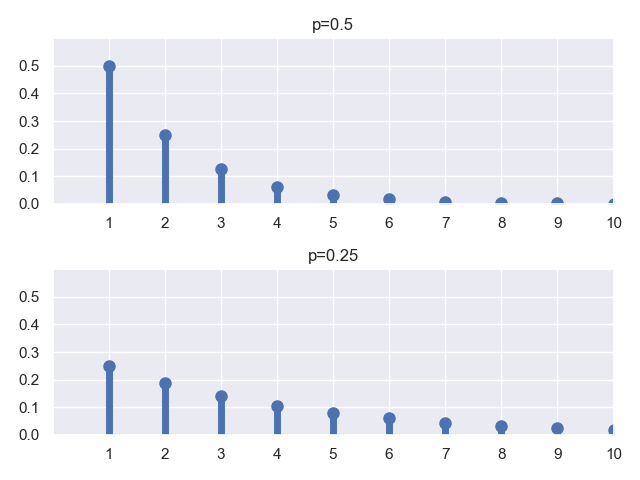
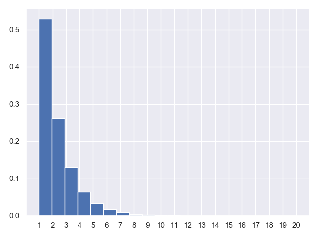

## 6.几何分布与几何随机变量

### 6.1.几何分布的应用场景

我们在二项分布的基础上再来介绍几何分布，在连续抛掷硬币的试验中，每次抛掷出现正面的概率为 $p$，出现反面的概率为 $1-p$，在这种背景下，几何随机变量 $X$ 就用来表示连续抛掷硬币直到第一次出现正面所需要的抛掷次数。

或者我们再举一个庸俗直白点的例子，学校里有 $10$ 个白富美女生（假定她们互相不认识，保证独立性），你依次去找她们表白，只要有一个成功了，你就结束了单身狗的日子。但是表白成功的概率为 $p$，当然，成功的概率肯定不大，但是你秉持着死皮赖脸、死缠烂打，不成功誓不罢休的精神，只要女神拒绝你的表白，就换一个女神继续表白，直到某一个女神答应你为止，那么你一共表白过的总的次数，就是几何型的随机变量。

### 6.2.几何分布的 PMF 图

我们还是先绘制几何分布的 $PMF$ 图，方法和二项分布并无二致：

**代码片段：**

```python
from scipy.stats import geom
import matplotlib.pyplot as plt
import seaborn
seaborn.set()

fig, ax = plt.subplots(2, 1)
params = [0.5, 0.25]
x = range(1, 11)

for i in range(len(params)):
    geom_rv = geom(p=params[i])
    ax[i].set_title('p={}'.format(params[i]))
    ax[i].plot(x, geom_rv.pmf(x), 'bo', ms=8)
    ax[i].vlines(x, 0, geom_rv.pmf(x), colors='b', lw=5)
    ax[i].set_xlim(0, 10)
    ax[i].set_ylim(0, 0.6)
    ax[i].set_xticks(x)
    ax[i].set_yticks([0, 0.1, 0.2, 0.3, 0.4, 0.5])

plt.show()
```

**运行结果：**


### 6.3.采样试验和数字特征

同样的，我们进行 $10$ 万次采样试验，来观察验证一下，同时观察他的统计特征。

**代码片段：**

```python
from scipy.stats import geom
import matplotlib.pyplot as plt
import seaborn
seaborn.set()

x = range(1, 21)
geom_rv = geom(p=0.5)
geom_rvs = geom_rv.rvs(size=100000)
plt.hist(geom_rvs, bins=20, normed=True)
plt.gca().axes.set_xticks(range(1,21))

mean, var, skew, kurt = geom_rv.stats(moments='mvsk')
print('mean={},var={}'.format(mean,var))
plt.show()
```

**运行结果：**

```python
mean=2.0,var=2.0
```



总结一下，几何分布的期望和方差分别为：

$E[X]=\frac{1}{p}$

$V[X]=\frac{1-p}{p^2}$
