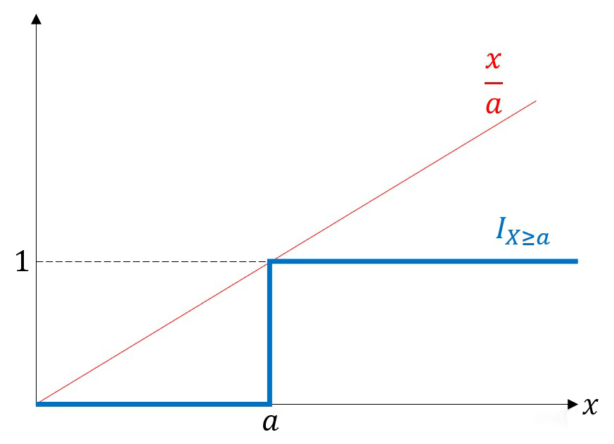
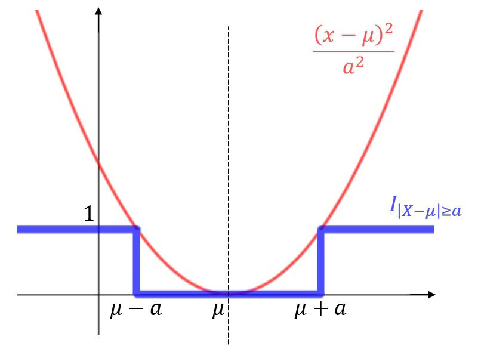
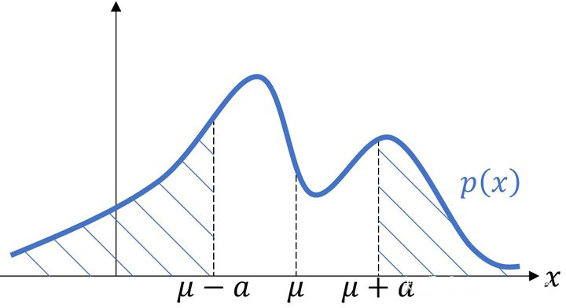

# 切比雪夫不等式

切比雪夫不等式可以对随机变量偏离期望值的概率做出估计，这是[[大数定律]]的推理基础。

以下介绍一个对切比雪夫不等式的直观证明。

## 1.  示性函数
对于随机事件 $A$，我们引入一个示性函数 $I_{A}=\left\{\begin{array}{ll}1, & A \text { 发生 } \\ 0, & A \text { 不发生 }\end{array} \right.$ ，即一次试验中，若 $A$ 发生了，则 $I$ 的值为 1 ，否则为 0。

现在思考一个问题：这个函数的自变量是什么?

我们知道，随机事件在做一次试验后有一个确定的观察结果，称这个观察结果为样本点 $\omega$ ，所有可能的样本点的集合称为样本空间 $\Omega=\{\omega\}$。称 $\Omega$  的一个子集 $A$ 为随机事件。

例如，掷一个六面骰子，记得到数字 $k$ 的样本点为 $\omega_{k}$ ，则 $\Omega=\left\{\omega_{1}, \omega_{2}, \omega_{3}, \omega_{4}, \omega_{5}, \omega_{6}\right\}$ ，随机事件 "得到的数字为偶数" 为 $A=\left\{\omega_{2}, \omega_{4}, \omega_{6}\right\}$ 。

由此可知，示性函数是关于样本点的函数，即：

$$
I_{A}(\omega)=\left\{\begin{array}{ll}
1, & \omega \in A \\
0, & \omega \notin A
\end{array} \quad\right. \text { (试验后) }
$$

在试验之前，我们能获得哪个样本点也末知的，因此样本点也是个随机事件，记为 $\xi$ ，相应地示性函数可以记为：

$$
I_{A}=\left\{\begin{array}{ll}
1, & \xi \in A \\
0, & \xi \notin A
\end{array} \quad\right. \text { (试验前) }
$$

在试验之前，$I$ 值也是末知的，因此 $I$ 是个二值随机变量。这样，我们就建立了随机事件 $A$ 和随机变量 $I$ 之间的一一对应关系。

对 $I$ 求数学期望可得：

 $$\mathbb{E} I_{A}=1 \times P(\xi \in A)+0 \times P(\xi \notin A)=P(\xi \in A)$$

$P(\xi \in A)$  是什么? 是样本点落在 $A$ 里面的概率，也就是 $A$ 事件发生的概率 $P(A)$ ，由此我们就得到了示性函数很重要的性质: 其期望值正是对应的随机事件的概率，即：

$$\mathbb{E} I_{A}=P(A)$$

## 2. 马尔可夫(Markov)不等式

对于非负的随机变量 $X$ 和定值 $a$ ，考虑随机事件 $A=\{X \geq a\}$ ，我们可以画出示性函数 $I_{A}$ 关于观察值 $X$ 的图像，如图 1 所示：

_图一_

容易发现 $I_{X\ge a}(x)\le\frac xa$ 恒成立。把 $x$ 换为随机变量 $X$ ，再对该式取数学期望得：

$$\mathbb EI_{X\ge a}=P(X\ge a)\le\frac{\mathbb EX}a$$

称该不等式为**马尔可夫(Markov)不等式**。

从理解上来说，如果非负随机变量 $X$ 的期望存在，则 $X$ 超过某个定值 $a$ 的概率不超过 $\frac{\mathbb E X}a$ 。

举个简单的例子：如果我们知道所有人收入的平均数 $a$，那么随机抽一个人收入超过 $10a$ 的概率不超过 10%。

根据图 1 中两个函数的差距，我们大致能理解这个不等式对概率的估计是比较粗糙的。

## 3. 切比雪夫(Chebyshev)不等式

对于随机变量 $X$ ，记 $\mu=\mathbb EX$ ，考虑随机事件 $A=\{|X-\mu|\ge a\}$ ，其示性函数的图像如图 2 所示：

_图二_

易知 $I_{|X-\mu|\ge a}\le\frac{(x-\mu)^2}{a^2}$ 恒成立。将该式的 $x$ 换成 $X$ 并取数学期望得：

$$\mathbb EI_{|X-\mu|\ge a}=P(|X-\mu|\ge a)\le\frac{\mathbb DX}{a^2}$$

称上面这个不等式为**切比雪夫(Chebyshev)不等式**。

从理解上来说，如果随机变量 $X$ 的期望和方差存在，则 $X$ 和期望值的距离大于 $a$ 的概率不超过 $\frac{\mathbb DX}{a^2}$ 。给定的范围越大（$a$ 越大），或 $X$ 的方差越小，则偏离的概率越小，这和直觉是相符的。

同样地，切比雪夫不等式对概率的估计也比较粗糙。

以下再给出一个书本上常见的切比雪夫不等式的证明：

记 $p(x)$ 为随机变量 $X$ 的概率密度函数，则

$$P(|X-\mu|\ge a)=\left(\int_{-\infty}^{\mu-a}+\int_{\mu+a}^{+\infty}\right)p(x)dx$$

上式求的是图三中阴影部分的面积。

_图三_

显然，在积分范围内恒有 $\frac{(x-\mu)^2}{a^2}\ge1$ ，故：

$$P(|X-\mu|\ge a)\le\left(\int_{-\infty}^{\mu-a}+\int_{\mu+a}^{+\infty}\right)\frac{(x-\mu)^2}{a^2}p(x)dx$$

被积函数是非负的，x 轴上一部分的积分必然不大于整个 x 轴上的积分，故

$$P(|X-\mu|\ge a)\le \int_{-\infty}^{+\infty}\frac{(x-\mu)^2}{a^2}p(x)dx=\frac1{a^2}\mathbb E(X-\mu)^2=\frac{\mathbb DX}{a^2}$$

证毕。