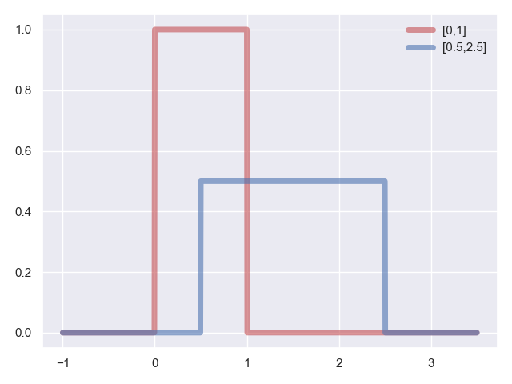
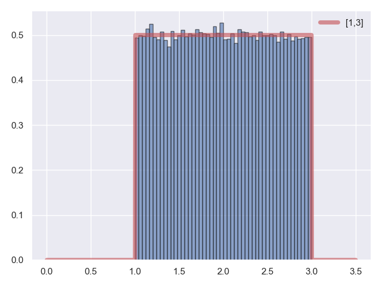

## 6.均匀分布

其实，我们还遗漏了一个很重要的分布，他太简单以至于我们时常将他忘记，但是实际上，他在程序中出现的次数，丝毫不少于正态分布和指数分布，这就是我们接下来要介绍的均匀分布:

**代码片段：**

```python
from scipy.stats import uniform
import matplotlib.pyplot as plt
import numpy as np
import seaborn
seaborn.set()

x = np.linspace(-1, 3.5, 1000)
uniform_rv_0 = uniform()
uniform_rv_1 = uniform(loc=0.5, scale=2)

plt.plot(x, uniform_rv_0.pdf(x), color='r', lw=5, alpha=0.6, label='[0,1]')
plt.plot(x, uniform_rv_1.pdf(x), color='b', lw=5, alpha=0.6, label='[0.5,2.5]')
plt.legend(loc='best', frameon=False)

plt.show()
```

**运行结果：**

 我们这里只说明一点，在构造均匀分布时，我们传入了两个参数，$loc$ 和 $scale$，他指的是随机变量 $X$ 在区间 $[loc,loc+scale]$ 上均匀分布，而区间内概率密度函数的取值，满足处处相等，这是他最重要、也是最显著的特征。

最后我们来实际对均匀分布进行采样，结束我们本节的内容。

**代码片段：**

```python
from scipy.stats import uniform
import matplotlib.pyplot as plt
import numpy as np
import seaborn
seaborn.set()

x = np.linspace(0, 3.5, 1000)
uniform_rv = uniform(1, 2)
uniform_rvs = uniform_rv.rvs(100000)
plt.plot(x, uniform_rv.pdf(x), 'r-', lw=5, alpha=0.6, label='[1,3]')
plt.hist(uniform_rvs, color='b', normed=True, alpha=0.6, bins=50, edgecolor='k')
plt.legend(loc='best', frameon=False)

plt.show()
```

**运行结果：**


