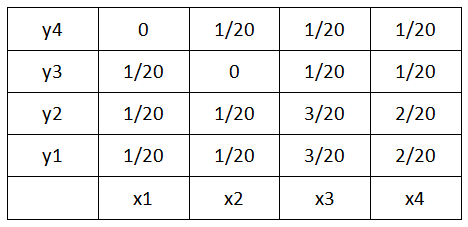
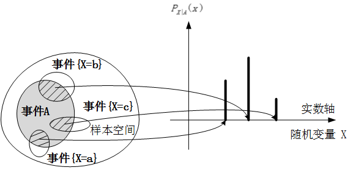
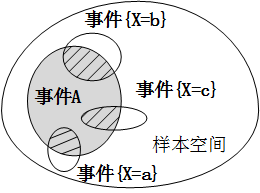
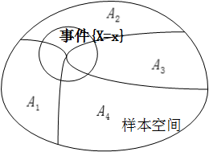
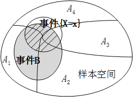

---
tags:
- 数学/概率统计
---

# 多元随机变量

## 1.试验中引入多个随机变量

在现实当中，一个试验常常会涉及到多个随机变量，所谓多个随机变量是指在同一个试验结果之下产生的多个随机变量。这些随机变量的取值是由试验结果确定的，因此它们的取值会存在相互关联，这里我们先以离散型随机变量为例，将[[离散型随机变量]]的分布列和期望推广到多个随机变量的情况，并且进一步在此基础上讨论多元随机变量条件和独立的重要概念。

我们假设试验中不再只有一个随机变量，而是两个随机变量 $X$ 和 $Y$，同时描述他们俩的取值概率，我们用什么方式？

## 2.联合分布列

基于之前讲过的离散型随机变量分布列的概念，这里我们为多元随机变量引入联合分布列，我们用 $p_{X,Y}$ 对其进行表示。我们设 $(x,y)$ 是随机变量 $X$ 和 $Y$ 的一组可能取值，因此对应的 $(x,y)$ 的概率质量就定义为事件 $\{X=x,Y=y\}$ 的概率：

$P_{X,Y}(x,y)=P(\{X=x,Y=y\})$，也就是同时满足事件 $\{X=x\}$ 和 $\{Y=y\}$ 的概率，那么首先，我们来实际看一个联合分布列的表示。很明显，我们可以用一个二维表格来表示随机变量 $X$ 和 $Y$ 的联合分布列：

从这张表出发，我们就可以把联合分布列中所有的知识点都梳理一遍：

第一，我们可以从图中获得随机变量 $X$ 和 $Y$ 的任意一组取值的联合概率，例如：

$$P_{X,Y}(x_3,y_2)=P(X=x_3, Y=y_2)=3/20$$

第二，对于由随机变量 $X$ 和 $Y$ 构成的任意事件集合也是一样的，例如我们定义事件集合 $A=\{(x_1,y_2),(x_3,y_2),(x_4,y_4)\}$，那么很显然，我们直接就能从联合分布列中计算出事件集合的总概率：

$$P((X,Y)\in A)=\sum_{(x,y)\in A}{p_{X,Y}(x,y)}=1/20+3/20+1/20=5/20$$

第三，也是最朴实的一点，我们把二维表中所有的联合概率进行相加，得到的结果必然是 $1$，这也满足概率的归一性。

## 3.边缘分布列

如果我们把事件集合再设置的讲究一些，例如把事件集合 $A$ 设置为表中的第一列，即 $A=\{(x_1,y_1),(x_1,y_2),(x_1,y_3)\}$，此时我们计算出来的事件集合 $A$ 的总概率也就是概率 $p_X(x_1)=P(X=x_1)$，对于这个概率，我们把他称之为边缘概率：

$$P_X(x_1)=1/20+1/20+1/20+0=3/20$$

当然，更进一步，如果我们把随机变量 $X$ 所有取值的边缘概率都计算出来，就能得到随机变量 $X$ 的边缘分布列：

$$p_X(x)=P(X=x)=\sum_{y}{P(X=x,Y=y)}=\sum_{y}{P_{X,Y}(x,y)}$$

看着公式头疼对吧，简单点，我们先求随机变量 $X$ 每一个取值的边缘概率，就是把对应列的联合概率全部相加，然后再把 $X=x_i$ 的所有边缘概率放在一起，就是随机变量 $X$ 的边缘分布列。

| 取值     | $x_1$          | $x_2$          | $x_3$          | $x_4$          |
| -------- | -------------- | -------------- | -------------- | -------------- |
| $P_X(x)$ | $\frac{3}{20}$ | $\frac{3}{20}$ | $\frac{8}{20}$ | $\frac{6}{20}$ |

当然，随机变量 $Y$ 的边缘分布也是同理：

$p_Y(y)=P(Y=y)=\sum_{x}{P(X=x,Y=y)}=\sum_{x}{P_{X,Y}(x,y)}$，这里我们就不再赘述了。

边缘概率和边缘分布列的**边缘**是什么含义？一句话描述就是，随机变量 $X$ 的边缘分布列及其任意一个边缘概率的取值，都是只与自己有关，而与其他的随机变量（这里是随机变量 $Y$）无关了。

而对应的联合分布列和联合概率中的**联合**二字，意思也很明显，这里面的取值需由所有的随机变量，即由随机变量 $X$ 和 $Y$ 共同决定。

## 4.条件分布列

在前面我们学习了，条件可以给某些事件提供补充信息，由于随机变量的取值也是一种事件，因此同样的，条件也可以对随机变量取某些值提供补充信息。因此我们是不是能引入随机变量的条件分布列呢？当然是可以的。

条件可以指某个事件的发生，当然也可以包含其他随机变量的取值。

我们还是来看一个风格上我们非常熟悉的图：

我们可以发现，在某个事件 $A$ 发生的情况下，随机变量 $X$ 发生的条件分布列很容易给出，还记得条件概率的表达式么，把他拿过来直接套用过来就可以了。

$$p_{X|A}(x)=P(X=x|A)=\frac{P(\{X=x\}\cap A)}{P(A)}$$

感觉是不是很熟悉？但是有些关键点我还是要再提一下，首先对于随机变量 $X$ 不同的取值 $x_1,x_2,x_3,…,x_n$，$\{X=x\}\cap A$ 彼此之间互不相容，并且他们的并集是整个事件 $A$，当然上面的示意图里，随机变量 $X$ 的取值没有完全覆盖事件 $A$，因为这只是一个示例而已，没有画完全。

对于这个事件 $A$，我们知道，他既可以对应某个事件的发生，也可以对应另外一个随机变量的具体取值。我们这里重点讨论给定另一个随机变量值的前提下的条件概率。

我们还是回到试验中，试验中有两个随机变量 $X$ 和 $Y$，我们假定的条件就是随机变量 $Y$ 已经取定了一个具体的值 $y$，那么意味着，这个 $y$ 值的选取可能会提供关于随机变量 $X$ 取值的部分信息，反映在我们的条件分布列 $p_{X|Y}$ 中，对应来看条件分布列中的事件 $A$ 就是随机变量的取值 $\{Y=y\}$。

那么好，此时关键部分就来了，我们把上面的条件分布列的定义式 $p_{X|A}(x)=P(X=x|A)=\frac{P(\{X=x\}\cap A)}{P(A)}$ 中的条件事件 $A$，替换成随机变量的取值 $Y=y$，就有了：

$$p_{X|Y}(x|y)=P(X=x|Y=y)=\frac{P(X=x,Y=y)}{P(Y=y)}=\frac{P_{X,Y}(x,y)}{p_Y(y)}$$

通过这个公式，我们可以把 $\{Y=y\}$ 条件下，随机变量 $X$ 所有取值的条件概率都计算出来，就得到了在事件 $\{Y=y\}$ 之下的随机变量 $X$ 的条件分布列。

最关键的其实不是这个式子，大家有没有回想起第一节中我们重点分析过的贝叶斯公式，同样的我们把上面的式子整理一下，有：

$$\begin{aligned}
p_{X,Y}(x,y)=p_Y(y)p_{X|Y}(x|y)\\
p_{X,Y}(x,y)=p_X(x)p_{Y|X}(y|x)
\end{aligned}$$

这组公式非常重要，他把多个随机变量的联合概率、边缘概率和条件概率这三个概念非常完美的结合在了一起，串联了我们这节的核心内容。

我们还是举上面的例子，具体对其进行计算验证：

我们来看看满足 $\{Y=y_2\}$ 的条件下，随机变量 $X$ 的条件分布列：

首先计算边缘概率 $p_Y(y_2)=1/20+1/20+3/20+2/20=7/20$

$$\begin{aligned}
p_{X|Y}(x_1|y_2)=\frac{p_{X,Y}(x_1,y_2)}{p_Y(y_2)}=\frac{1/20}{7/20}=1/7\\
p_{X|Y}(x_2|y_2)=\frac{p_{X,Y}(x_2,y_2)}{p_Y(y_2)}=\frac{1/20}{7/20}=1/7\\
p_{X|Y}(x_3|y_2)=\frac{p_{X,Y}(x_3,y_2)}{p_Y(y_2)}=\frac{3/20}{7/20}=3/7\\
p_{X|Y}(x_4|y_2)=\frac{p_{X,Y}(x_4,y_2)}{p_Y(y_2)}=\frac{2/20}{7/20}=2/7
\end{aligned}$$

结合起来，我们就能观察出他的条件分布列：$P_{X|Y}(x|y_2)$：

| 取值       | $x_1$         | $x_2$         | $x_3$         | $x_4$         |
| ---------- | ------------- | ------------- | ------------- | ------------- |
| $P_{X}(x)$ | $\frac{1}{7}$ | $\frac{1}{7}$ | $\frac{3}{7}$ | $\frac{2}{7}$ |

我们把这个条件分布列的所有项进行相加，得到的结果为 $1$，当然也必须为 $1$ ，满足归一化的条件和要求。

## 5.集中梳理核心的概率理论

### 5.1.从条件概率及归一性起步

实际上，条件分布和无条件分布基本上是一样的，唯一的差别就是条件分布存在一个事件发生的前提，其余的定理都是一样的，我们来一步一步的回顾、演进。

在这幅图当中，我们绘制出了随机变量 $X$ 构成的一个样本空间，其中 $A$ 为其中发生的某事件。从这里，我们就得到了随机变量 $X$ 在给定事件 $A$ 发生的条件下的条件分布列：

$$p_{X|A}(x)=P(X=x|A)$$

由概率的归一性原则，我们就能够得到：$\sum_{x}{p_{X|A}(x)=1}$。

### 5.2.样本划分：条件概率、联合概率推进到边缘概率

我们进一步对样本空间做一个划分，让互不相容的事件 $A_1$，$A_2$，$A_3$, $A_4$ 成为整个样本空间的一个分割

基于上面这幅图，我们有 $p_X(x)=\sum_{i=1}^{n}{P(A_i)p_{X|A_i }(x)}$。

这个式子很简单，就是一个联合概率到边缘概率的一个转换关系，大家如果觉得理解还有些困难，那是因为中间省掉了一步条件概率和联合概率的转换关系，我们把他添加进去就豁然开朗了。

$$p_X(x)=\sum_{i=1}^{n}{P(A_i \cap \{X=x\})}=\sum_{i=1}^{n}{P(A_i)p_{X|A_i }(x)}$$

### 5.3.更进一步：在划分中再引入条件

好的，我们再继续往下走，我们在样本空间中给随机变量 $X$ 的取值增加一个条件事件 $B$，同时为了展示方便，我们要求 $P(B \cap A_i) >0$

这里再把条件事件 $B$ 掺和进去，看上去大家会觉得很复杂，我们先看结论：

$$p_{X|B}(x)=\sum_{i=1}^{n}{P(A_i|B)p_{X|A_i \cap B }(x)}$$

看到规律没，我们在事件 $B$ 的发生条件下讨论事件 $\{X=x\}$ 发生的概率，那么看到没，式子的每一个组成部分都添加上条件 $B$ 即可，等式依然是成立的，就得到了结果表达式。

### 5.4.总结整合

因为这条知识线索实在是太重要了，我们最后不厌其烦，多费口舌，再把条件概率、联合概率、边缘概率反映在一组等式中，一把看个明白：

$$p_{X,Y}(x,y)=p_Y(y)p_{X|Y}(x|y)$$

$$p_{X}(x)=\sum_{y}{p_Y(y)p_{X|Y}(x)}$$

可以这么说，为什么我反反复复提了三遍这组公式，因为我觉得他在简单的形式下，包含的信息量太大了，而且关键是，他的重要性不言而喻，后续在随机过程等主题中，随处可见，不可不察啊。

## 6.条件期望与全期望

### 6.1.条件期望的概念

最后，我们再提一下条件期望和全期望的问题

条件期望和期望本质上没有任何不同，只不过用来表示权重的概率变成了条件概率而已：

$$E[X]=\sum_{x}{xp(x)}$$

$$E[X|A]=\sum_{x}{xp_{X|A}(x)}$$

同样，把条件事件 $A$，替换成随机变量的取值 $\{Y=y\}$，就有：

$$E[X|Y=y]=\sum_{x}{xp_{X|Y}(x|y)}$$

### 6.2.全期望的概念和公式

我们再来看一个全期望的概念，也是基于样本空间中的一组分割 $A_1$，$A_2$，$A_3$，$A_4$，我们基于期望的定义公式，通过全概率公式做一步变换可以得到：

$$
\begin{aligned}
E[X]&=\sum_{x}{xp_X(x)} \\
&=\sum_{x}{x\sum_{i=1}^{n}{P(A_i)p_{X|A_i}(x|A_i)}} \\
&=\sum_{i=1}^{n}{P(A_i)\sum_{x}{xp_{X|A_i}(x|A_i)}} \\
&=\sum_{i=1}^{n}{P(A_i)E[X|A_i]} 
\end{aligned}
$$

去掉中间的推导过程，只看一头一尾就有：

$$E[X]=\sum_{i=1}^{n}{P(A_i)E[X|A_i]}$$

当然，如果我们的事件 $A$ 对应的是随机变量 $Y$ 的取值，简单做一下替换即可：

$$E[X]=\sum_{y}{P_Y(y)E[X|Y=y]}$$

### 6.3.由全期望再回到条件期望

最后，还是那句话，有了分割 $A_1$，$A_2$，$A_3$，$A_4$，是不是觉得不掺和进去个条件事件 $B$ 就颇感遗憾？是的，我们最后看一下基于事件 $B$ 的条件期望：

我们来看看怎么把分割和条件都表达进去，来得出条件期望 $E[X|B]$？很简单，我们从全期望公式出发：

$$E[X]=\sum_{i=1}^{n}{P(A_i)E[X|A_i]}$$

每一部分都加上条件事件 $B$，就 ok 了。

$$E[X|B]=\sum_{i=1}^{n}{P(A_i|B)E[X|A_i \cap B]}$$

## 7.小结

大家仔细揣摩一下，会发现这里面用一根很清晰的线条，把事件、随机变量、条件概率、全概率、边缘概率、条件期望、全期望、贝叶斯全部串联了起来，在这个视图下纵览全局，你会感觉有一种一览众山小的快感。