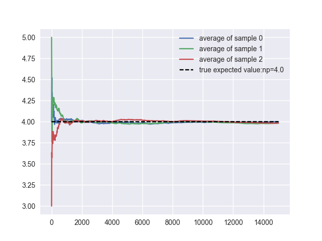
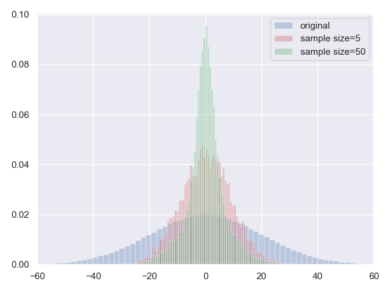

---
aliases:
- 大数定理
---

# 大数定律

## 原理介绍

先抛去繁杂的各种大数定律，讲一下最简单的原理。

假设有随机变量：$X_1,X_2,…,X_n$，他们彼此之间满足[[独立同分布]]，因此他们拥有相同的均值 $\mu$ 和方差 $\sigma^2$。

由于随机变量之和 $\sum_{i=1}^nX_i$ 很有可能发散到无穷大，因此研究随机变量的均值 $M_n=\frac{1}{n}\sum_{i=1}^nX_i$ 和其期望 $E[M_n]$ 之间的距离更为合理。

我们重点来研究这一组随机变量的均值：$M_n=\frac{1}{n}\sum_{i=1}^nX_i$，显然 $M_n$ 也是一个随机变量。那么，$M_n$ 的期望和方差就是我们此时重点关心的问题。

首先，我们从期望的定义入手，来观察一下随机变量 $M_n$ 的期望 $E[M_n]$：

$$
\begin{aligned}

E[M_n]&=E[ \frac{X_1+X_2+…+X_n}{n}] \\

&=\frac{1}{n}(E[X_1]+E[X_2]+…+E[X_n]) \\
&=\frac{1}{n}\cdot n\cdot \mu \\
&=\mu \\
&=E[X_i]
\end{aligned}
$$

不难发现，一组[[独立同分布]]随机变量均值的期望就等于随机变量的期望，这个结论很直观。

下面我们再来看看 $M_n$ 的方差 $var[M_n]$：

$$
\begin{aligned}

var[M_n]&=var[ \frac{X_1+X_2+…+X_n}{n}] \\

&=\frac{1}{n^2}var[X_1+X_2+…+X_n] \\
&=\frac{1}{n^2}(var[X_1]+var[X_2]+…+var[X_n]) \\
&=\frac{1}{n^2}\cdot n\cdot \sigma^2 \\
&=\frac{\sigma^2}{n} \\
\end{aligned}
$$

我们从推导中发现，$n$ 个[[独立同分布]]随机变量的均值的方差，是单一随机变量方差的 $\frac{1}{n}$。没错，均值的方差变小了，并且随机变量 $X$ 的个数 $n$ 越多，方差越小，他们的分布更加紧密的围绕在了期望的周围。

特别的，当 $n \rightarrow \infty$ 时，随机变量均值的方差趋近于 $0$： $var[M_n]=\frac{\sigma^2}{n} \rightarrow 0$。

结合前前后后的一大段推导和论述，我们可以得出这么一个结论：

[[独立同分布]]的随机变量 $X_1,X_2,…,X_n$，他们的均值 $M_n$ 的分布接近于实际分布的均值 $\mu$，随着样本量 $n$ 的增大，他逐渐收敛于 $\mu$，当 $n \rightarrow \infty$ 时，$M_{n}-\mu$ 会以非常大的概率接近 $0$。这就是大数定律的主要思想。

总结一下，在随机事件的大量重复出现中，往往呈现几乎必然的规律，这个规律就是大数定律。通俗地说，这个定理就是，**在试验不变的条件下，重复试验多次，随机事件的频率近似于它的概率**。偶然中包含着某种必然。

## 大数定理的模拟

下面我们来实际模拟一下大数定理。

在第一个模拟的例子中，我们给大家一个感性的认识：我们生成 $3$ 组各 $15000$ 个服从参数为 $(10,0.4)$ 的二项分布随机变量，随机变量的期望为 $n*p=4$，然后观察随着样本数目的增大，样本均值和实际分布期望之间的关系。

**代码片段：**

```python
import numpy as np
from scipy.stats import binom
import matplotlib.pyplot as plt
import seaborn
seaborn.set()

n = 10
p = 0.4
sample_size = 15000
expected_value = n*p
N_samples = range(1, sample_size, 10)

for k in range(3):
    binom_rv = binom(n=n, p=p)
    X = binom_rv.rvs(size=sample_size)
    sample_average = [X[:i].mean() for i in N_samples]
    plt.plot(N_samples, sample_average,
             label='average of sample {}'.format(k))

plt.plot(N_samples, expected_value * np.ones_like(sample_average),
         ls='--', label='true expected value:np={}'.format(n*p), c='k')

plt.legend()
plt.show()
```

**运行结果：**



我们设置了三个相同的试验组，从试验结果中我们可以发现，在每一组试验中，随着样本数量的逐渐增大，样本均值都会越来越收敛于随机变量的期望。

接下来我们再来看看第二个用于模拟大数定理的例子，我们从大数定理的定义出发，我们先生成 $1000000$ 个服从均值为 $0$，标准差为 $20$ 正态分布的样本。依次进行三种不同的处理，并观察对应的三组分布图像：

图像 1：原始正态分布的样本分布图像，颜色为蓝色；

图像 2：从 $1000000$ 个原始正态分布样本中，每次随机选取 $5$ 个数，计算他们的均值，重复操作 $10000$ 次，观察这 $10000$ 个均值的分布，颜色为红色；

图像 3：从 $1000000$ 个原始正态分布样本中，每次随机选取 $50$ 个数，计算他们的均值，重复操作 $10000$ 次，观察这 $10000$ 个均值的分布，颜色为绿色；

**代码片段：**

```python
import numpy as np
import matplotlib.pyplot as plt
from scipy.stats import norm
import seaborn
seaborn.set()

norm_rvs = norm(loc=0, scale=20).rvs(size=1000000)
plt.hist(norm_rvs, normed=True, alpha=0.3, color='b', bins=100, label='original')

mean_array = []
for i in range(10000):
    sample = np.random.choice(norm_rvs, size=5, replace=False)
    mean_array.append(np.mean(sample))
plt.hist(mean_array, normed=True, alpha=0.3, color='r', bins=100, label='sample size=5')

for i in range(10000):
    sample = np.random.choice(norm_rvs, size=50, replace=False)
    mean_array.append(np.mean(sample))
plt.hist(mean_array, normed=True, alpha=0.3, color='g', bins=100, label='sample size=50')

plt.gca().axes.set_xlim(-60, 60)
plt.legend(loc='best')
plt.show()
```

**运行结果：**



从图中我们发现，随着每次选取的样本数量的增多，样本均值分布的图像越来越向期望集中，再一次佐证了大数定理。

## 深挖大数定律

了解了大数定律的思想后，我们来捋一捋不同大数定律的区别与发展。

### 弱大数定律和强大数定律的区别

首先大数定律可以依据收敛性的不同分为弱大数定律和强大数定律：

- 弱大数定律：样本均值[[依概率收敛]]于期望
- 强大数定律：样本均值几乎(a.s.)处处收敛于期望

具体来看，弱大数定律表明对于足够大的值 $n^*$，随机变量 $\frac{X_{1}+X_{2}+\ldots X_{n}}{n}$ 仍停留在 $\mu$ 附近，因此，  $\left|\frac{X_{1}+X_{2}+\ldots X_{n}}{n}-\mu\right|$ 可以无限多次离开 0(尽管出现较大偏的频率不会佷高)。而强大数定律能保证这种情况不会发生，即对任何 $\varepsilon>0$ ，$\left|\sum_{i=1}^{n} \frac{X_{i}}{n}-\mu\right|>\varepsilon$ 只能出现有限次。

### 弱大数定律

#### 伯努利大数定律

伯努利大数定律是人类历史上第一个严格证明的大数定律，它是[[大数定律#辛钦大数定律|辛钦大数定律]]的特殊情况。

伯努利大数定律要求随机变量[[独立同分布]]。

伯努利大数定律从定义概率的角度，揭示了概率与频率的关系，当 $n$ 很大的时候，事件 $A$ 发生的概率等于 $A$ 发生的频率。也就表明了，当试验次数 $n$ 足够大时，**可以用事件发生的频率代替事件的概率**。更重要的是，伯努利提供了一种思想，**经验观测可以反映随机规律**的这样一种思想。

**定义**

设 $f_A$ 是 $n$ 次[[独立重复试验]]中事件 $A$ 发生的次数，$p$ 是事件 $A$ 在每次试验中发生的概率，则对于任意正数 $\epsilon>0$，有

$$\lim\limits_{n\to+\infty}P\bigg\{\bigg|\frac{f_A}{n}-p\bigg|<\epsilon\bigg\}=1.$$

#### 切比雪夫大数定律

切比雪夫大数定律说的是一系列随机变量的均值收敛到一个常数。它是[[大数定律#伯努利大数定律|伯努利大数定律]]一个极大的推广，放宽了对随机变量的分布要求，仅要求独立，不要求同分布。

当然，它也有一个前提，每个变量的**期望和方差均存在且有限**，并且满足**方差的平均值是样本数 $n$ 的高阶无穷小**这一额外条件。

将该切比雪夫大数定律应用于抽样调查，就会有如下结论：随着样本容量 $n$ 的增加，样本平均数将接近于总体平均数。从而为统计推断中依据样本平均数估计总体平均数提供了理论依据。

**定义**

设 $X_1,X_2,X_3,\cdots$ 是两两互不相关的随机变量序列，数学期望 $E(X_i)$ 和方差 $D(X_i)$ 都存在 $(i=1,2,3,\cdots)$，且存在常数 $C ,(0\leq C < +\infty)$，使得 $D(X)\leq C$，则对于任意的 $\epsilon>0$ 有：

$$\lim\limits_{n\to+\infty}P\bigg\{\bigg|\frac{1}{n}\sum\limits_{i=1}^{n}X_i-\frac{1}{n}\sum\limits_{i=1}^{n}E(X_i)\bigg|<\epsilon\bigg\}=1$$
**证明**

首先：

$$\begin{aligned} &E(\frac{1}{n}\sum\limits_{i=1}^{n}X_i)= \frac{1}{n}\sum\limits_{i=1}^{n}E(X_i)\end{aligned}$$

因为 $X_1,X_2,X_3,\cdots$ 相互独立，因此有：

$$\begin{aligned} D(\frac{1}{n}\sum\limits_{i=1}^{n}X_i) = \frac{1}{n^2}\sum\limits_{i=1}^{n}D(X_i)\leq\frac{1}{n^2}nC=\frac{C}{n}\end{aligned}$$

根据[[切比雪夫不等式]]可知：

$$\begin{aligned} P\bigg\{\bigg|\frac{1}{n}\sum\limits_{i=1}^{n}X_i-\frac{1}{n}\sum\limits_{i=1}^{n}E(X_i)\bigg|<\epsilon\bigg\} &\geq 1- \frac{\frac{1}{n^2}\sum\limits_{i=1}^{n}D(X_i)}{\epsilon^2} \geq1- \frac{C}{n\epsilon^2}\\ \quad \end{aligned}$$

当 $n\to+\infty$ 时 $1- \frac{C}{n\epsilon^2} \to1$ ,且根据概率定义，必然有 $P\bigg\{\bigg|\frac{1}{n}\sum\limits_{i=1}^{n}X_i-\frac{1}{n}\sum\limits_{i=1}^{n}E(X_i)\bigg|<\epsilon\bigg\} \leq 1$ 成立

**特殊情况**

设 $X_1,X_2,X_3,\cdots$ 是[[独立同分布]]的随机变量序列，数学期望 $E(X_i)=\mu$ 和方差 $D(X_i)=\sigma^{2}$ 都存在，则对于任意的 $\epsilon>0$ 有：

$$\lim\limits_{n\to+\infty}P\bigg\{\bigg|\frac{1}{n}\sum\limits_{i=1}^{n}X_i-\mu\bigg|<\epsilon\bigg\}=1$$

#### 辛钦大数定律

辛钦大数定律说明在 $n$ 充分大时，算术平均值[[依概率收敛]]于数学期望，从理论上指出用算术平均值来近似实际真值是合理的。

[[大数定律#切比雪夫大数定律|切比雪夫大数定律]]和辛钦大数定律针对的是两种不同的情况。切比雪夫大数定律不要求随机变量有相同分布但是成立的条件更加严格，辛钦大数定律要求[[独立同分布]]不过是在比较弱的条件下就成立。

当 $X_1,X_2,X_3,\cdots$ 为服从 0-1 分布的随机变量时，辛钦大数定律就是伯努利大数定律，故**伯努利大数定律是辛钦大数定律的一个特例**。

**定义**

设 $X_1,X_2,X_3,\cdots$ 是[[独立同分布]]的随机变量序列，且具有数学期望 $E(X_k)=\mu$。作前 $n$ 个变量的算术平均 $\frac{1}{n}\sum\limits_{k=1}^{n}X_k$，则对于任意 $\epsilon>0$，有：

$$\lim\limits_{n\to+\infty}P\bigg\{\bigg|\frac{1}{n}\sum\limits_{k=1}^{n}X_k-\mu\bigg|<\epsilon\bigg\}=1$$

### 强大数定律

#### 波莱尔强大数定律

波莱尔强大数定律比[[大数定律#伯努利大数定律|伯努利大数定律]]有更强的结果，它更为深刻的说明了频率收敛到概率。

波莱尔强大数定律要求随机变量[[独立同分布]]。

**定义**

设 $X_1,X_2,X_3,\cdots$ 是[[独立同分布]]的随机变量序列， $P( X_i = 1) = p$，$P(X_i = 0) = 1-p$ ，令 $S_n = \sum_{i=1}^n X_i$，那么：

$$\lim_{n \to \infty} {S_n \over n} \xrightarrow{a.s.} p$$

#### 柯尔莫哥洛夫强大数律

柯尔莫哥洛夫强大数定律是[[大数定律#辛钦大数定律|辛钦大数定律]]的一个推广，从[[依概率收敛]]加强到几乎必然收敛。

柯尔莫哥洛夫强大数定律要求随机变量 $X_i$ 的期望存在且有限，方差存在且有限，并且方差的增长速度不能过快。

如果上述条件都能够得到满足的话，随机抽样样本的样本均值将在样本容量足够大的情形下强收敛到对应总体分布的期望均值（并不要求期望均值 $\mu$ 为某个特定数值，它可以是一个非随机序列，甚至可以不收敛）。

**定义**

设 $X_1,X_2,X_3,\cdots$ 是[[独立同分布]]的随机变量序列，令 $S_n = \sum_{i=1}^n X_i$，$E(X_i) = \mu$，那么：

$$\lim_{n \to \infty} {S_n \over n} \xrightarrow{a.s.} \mu$$

另一种等价表达为：

$$P\left\{\lim _{n \rightarrow \infty} \frac{X_{1}+X_{2}+\ldots+X_{n}}{n}=\mu\right\}=1$$
