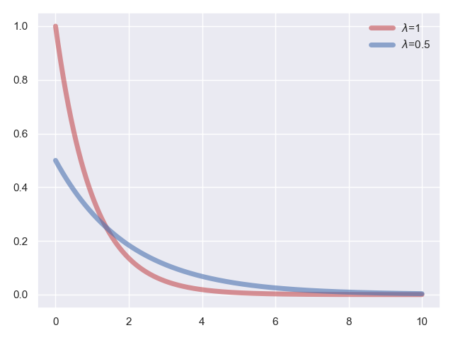
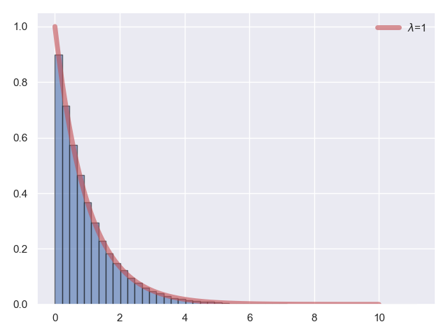

# 指数分布

我们再来看看我们要讲的第二种连续型随机变量，指数随机变量。指数随机变量的用处非常广泛，他一般用来表征直到某件事情发生为止所用的时间。

比如，从现在你观察的时间开始算起，一台仪器设备的使用寿命终止还剩的时间、一个灯泡直到用坏了还剩的时间、陨石掉入地球沙漠还需要的时间，等等。

指数随机变量 $X$ 的概率密度函数为：

$$f_{X}(x)=\left\{\begin{array}{rr}
\lambda e^{-\lambda x} & x \geq 0 \\
 0 & \text { 其他 }
\end{array}\right.$$

其中，指数分布的参数是 $\lambda$，且必须满足 $\lambda > 0$，指数分布的图形特征是当随机变量 $X$ 超过某个值时，概率随着这个值的增加而呈指数递减。讨论指数分布的概率特性时，我们一般着重注意三个方面的内容：

第一个：随机变量 $X$ 超过某个指定值 $a$ 的概率，当然此处需要满足 $a \geq 0$。依照定义，我们有：

$$P(X \geq a)=\int_{a}^{\infty}\lambda e^{-\lambda x}dx=e^{-\lambda a}$$

第二个：随机变量 $X$ 位于区间 $[a,b]$ 内的概率，实际上也很简单：

$$P(a \leq X \leq b)=P(X \geq a)-P(X \geq b)=e^{-\lambda a}-e^{-\lambda b}$$

第三个：也就是整个指数分布的数字特征，同时也包含参数 $\lambda$ 的物理含义。我们在这里可以通过期望和方差的定义，直接用积分求得，这里就不多赘述，直接拿出结论：

$$E[X]=\frac{1}{\lambda}\text{ , }V[X]=\frac{1}{\lambda^2}$$

最后，我们还是来实际看看代码：

**代码片段：**

```python
from scipy.stats import expon
import matplotlib.pyplot as plt
import numpy as np
import seaborn
seaborn.set()

x = np.linspace(0, 10, 1000)
expon_rv_0 = expon()
plt.plot(x, expon_rv_0.pdf(x), color='r', lw=5, alpha=0.6, label='$\\lambda$=1')
expon_rv_1 = expon(scale=2)
plt.plot(x, expon_rv_1.pdf(x), color='b', lw=5, alpha=0.6, label='$\\lambda$=0.5')
plt.legend(loc='best', frameon=False)

plt.show()
```

**运行结果：**


这里，我们来讲解一下代码，代码的第 08 行和第 10 行，我们分别生成了不同参数的两个指数分布。

其中，第 08 行，默认参数为 $scale=1$，而第 10 行里指定 $scale=2$，在这里 $scale$ 参数和指数分布参数 $\lambda$ 的关系为 $scale = \frac{1}{\lambda}$，因此 $expon\_rv\_0$ 是服从参数 $\lambda=1$ 的指数分布，而 $expon\_rv\_1$ 是服从参数 $\lambda=0.5$ 的指数分布。

最后，我们再来对指数型随机变量进行采样生成，我们采样的是服从参数 $\lambda=1$ 的指数分布。

**代码片段：**

```python
from scipy.stats import expon
import matplotlib.pyplot as plt
import numpy as np
import seaborn
seaborn.set()

x = np.linspace(0, 10, 1000)
expon_rv = expon()
expon_rvs = expon_rv.rvs(100000)
plt.plot(x, expon_rv.pdf(x), color='r', lw=5, alpha=0.6, label='$\\lambda$=1')
plt.hist(expon_rvs, color='b', normed=True, alpha=0.6, bins=50, edgecolor='k')
plt.legend(loc='best', frameon=False)

plt.show()
```

**运行结果：**
