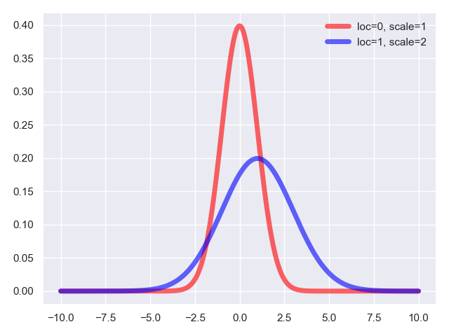
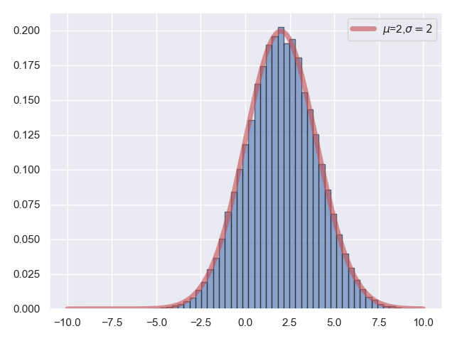

## 4.正态分布及正态随机变量

正态分布是连续型随机变量概率分布中的一种，你几乎能在各行各业中看到他的身影，自然界中某地多年统计的年降雪量、人类社会中比如某地高三男生平均身高、教育领域中的某地区高考成绩、信号系统中的噪音信号等等，大量自然、社会现象均按正态形式分布。

正态分布中有两个参数，一个是随机变量的均值 $\mu$，另一个是随机变量的标准差 $\sigma$，他的概率密度函数 $PDF$ 为：

$$f_X(x)=\frac{1}{\sqrt{2\pi}\sigma}e^{-(x-\mu)^2/(2\sigma^2)}$$

当我们指定不同的均值和标准差参数后，就能得到不同正态分布的概率密度曲线，正态分布的概率密度曲线形状都是类似的，他们都是关于均值 $\mu$ 对称的钟形曲线，概率密度曲线在离开均值区域后，呈现出快速的下降形态。

这里，我们不得不专门提一句，当均值 $\mu=0$，标准差 $\sigma=1$ 时，我们称之为标准正态分布。

还是老规矩，眼见为实，下面我们来观察两组正态分布的概率密度函数取值，一组是均值为 $0$，标准差为 $1$ 的标准正态分布。另一组，我们取均值为 $1$，标准差为 $2$。

**代码片段：**

```python
from scipy.stats import norm
import matplotlib.pyplot as plt
import numpy as np
import seaborn
seaborn.set()

fig, ax = plt.subplots(1, 1)
norm_0 = norm(loc=0, scale=1)
norm_1 = norm(loc=1, scale=2)

x = np.linspace(-10, 10, 1000)
ax.plot(x, norm_0.pdf(x), color='red', lw=5, alpha=0.6, label='loc=0, scale=1')
ax.plot(x, norm_1.pdf(x), color='blue', lw=5, alpha=0.6, label='loc=1, scale=2')
ax.legend(loc='best', frameon=False)

plt.show()
```

**运行结果：**


这里，我多一句嘴，在构造正态分布时，均值用参数 $loc$ 来描述，方差用参数 $scale$ 来描述。

同样的，我们还可以通过基于指定分布的重复采样，来观察和验证模拟试验的情况。

**代码片段：**

```python
from scipy.stats import norm
import matplotlib.pyplot as plt
import numpy as np
import seaborn
seaborn.set()

norm_rv = norm(loc=2, scale=2)
norm_rvs = norm_rv.rvs(size=100000)
x = np.linspace(-10, 10, 1000)
plt.plot(x, norm_rv.pdf(x), 'r', lw=5, alpha=0.6, label="$\\mu$=2,$\\sigma=2$")
plt.hist(norm_rvs, normed=True, bins=50, alpha=0.6, edgecolor='k')
plt.legend()
plt.show()
```

**运行结果：**

