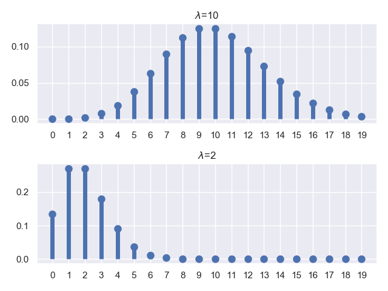
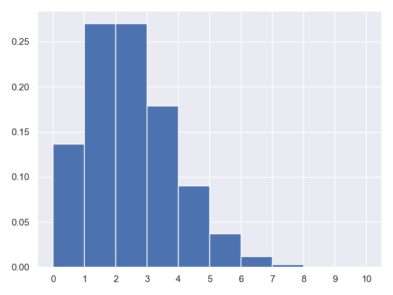

## 7.泊松分布及泊松随机变量

### 7.1.泊松分布的应用场景

我们刚刚讲了，$n$ 次独立的伯努利试验成功的次数是一个服从二项分布的随机变量，其中参数为 $n$ 和 $p$，期望为 $np$。我们这里看一种非常特殊的情况：就是 $n$ 非常大，$p$ 非常小，但是期望 $np$ 结果适中。

现实生活中有没有这类情况？有，比如我们考虑任何一天内发生飞机事故的总数，记作随机变量 $X$，总共飞机飞行的次数 $n$ 非常大，但是单架次飞机出现事故的概率 $p$ 非常小。或者用随机变量 $X$ 表示一本书中字印刷错误的次数，$n$ 表示一本书中的总字数，非常大，而 $p$ 表示每个字印刷出错的概率，非常小。

这种情况下，$n$ 很大 $p$ 很小，二项分布的分布列可以简化为我们这里谈到的泊松分布的分布列：

$$p_X(k)=e^{-\lambda}\frac{\lambda^k}{k!}$$

其中，$\lambda=np$，$k=0,1,2,…$

期望和方差满足：

$E[X]=\lambda$

$V[X]=\lambda$

特别的，当我们的 $n\rightarrow \infty$，且 $p=\lambda / n \rightarrow 0$ 时，对应的二项分布列：

$p_X(k) = P(X=k) = \begin{pmatrix} n\\ k \end{pmatrix}p^k(1-p)^{n-k}$ 就收敛于上面的泊松分布列了。

通俗点说把，就是只要当 $\lambda=np$，且 $n$ 非常大，$p$ 非常小，泊松分布就是二项分布的一个非常好的近似。计算简便就是他的一个很大的优势。

### 7.2.泊松分布的 PMF 图

同样的，我们也用 $python$ 代码来画一下他的 $PMF$ 函数图，对应的观察一下指定参数下泊松分布的分布列。

正如我们所说，泊松分布的参数就是一个 $\lambda$，我们分别绘制一个 $\lambda=10$ 和 $\lambda=2$ 的泊松分布 $PMF$ 图，并获取他们的均值和方差。

**代码片段：**

```python
from scipy.stats import poisson
import matplotlib.pyplot as plt
import seaborn
seaborn.set()

fig, ax = plt.subplots(2, 1)
x = range(0, 20)
params = [10, 2]

for i in range(len(params)):
    poisson_rv = poisson(mu=params[i])
    mean, var, skew, kurt = poisson_rv.stats(moments='mvsk')
    ax[i].plot(x, poisson_rv.pmf(x), 'bo', ms=8)
    ax[i].vlines(x, 0, poisson_rv.pmf(x), colors='b', lw=5)
    ax[i].set_title('$\\lambda$={}'.format(params[i]))
    ax[i].set_xticks(x)
    print('lambda={},E[X]={},V[X]={}'.format(params[i], mean, var))
    
plt.show()
```

**运行结果：**

```python
lambda=10,E[X]=10.0,V[X]=10.0
lambda=2,E[X]=2.0,V[X]=2.0
```



同样的，我们对 $\lambda=2$ 的泊松分布进行采样。

**代码片段：**

```python
import numpy as np
from scipy.stats import poisson
import matplotlib.pyplot as plt
import seaborn
seaborn.set()

lambda_ = 2
data = poisson.rvs(mu=lambda_, size=100000)
plt.figure()
plt.hist(data, normed=True)
plt.gca().axes.set_xticks(range(0, 11))
print('mean=', np.mean(data))
print('var=', np.square(np.std(data)))
plt.show()

```

**运行结果：**

```python
mean= 2.00542
var= 2.0082906236
```



这也是我们通过 $10$ 万次采样试验得出的统计结果，我们通过这个结果集计算了均值和方差，和模型的理论推导值是一致的。