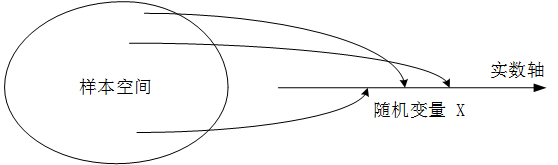

---
tags:
- 数学/概率统计
---

# 离散型随机变量

## 从事件到随机变量

我们可以把某一次具体试验中所有可能出现的结果构成一个样本空间，对于样本空间中的每一个可能的试验结果，我们去将他关联到一个特定的数。这种试验结果与数的对应关系就形成了**随机变量**，我们将试验结果所对应的数称为随机变量的取值。这里就是我们接下来要讨论的重要内容。

请注意这个概念中的一个关键点，随机变量如何取值？他可以直接就是试验的结果取值，比如“抛掷骰子的结果点数为 $5$”。

但是，随机变量更多的是这种情况，比如随机变量可以是“连续抛掷硬币 $10$ 次，其中硬币正面出现的次数”，或者是“转了一道弯”的映射值：我们把骰子连续抛掷两次，随机变量对应连续两次试验中的最大值或者点数之和，这就是映射的情况。但是无论如何，对于随机变量，都必须要明确对应具体的取值。

## 离散型随机变量及其要素

很容易联想到，随机变量作为一种映射后的取值，本质上和函数取值一样，可以有连续型和离散型两种，我们主要讨论离散型的情况和应用场景。

对于连续和离散的概念，大家脑海里的直观印象往往更加简单，但具体怎么用形式化的概念语言来描述他，反而要更繁琐一些，我们还是严格的对离散型随机变量做一个定义，即：随机变量的取值只能是**有限多个**或者是**可数的无限多个值**。

那么对于任意的我们获取的一组随机变量，我们最关注的是哪些要素呢？我来列举一下：

**第一：随机变量的取值。** 显然这个是我们首先需要关注的，由试验结果派生出的这一组随机变量到底能取到哪些值，这是我们首要关注的问题点。

**第二：试验中每个对应取值的概率。** 每个事件的结果肯定不是等概率的，这也恰恰就是我们研究的出发点。

**第三：随机变量的统计特征和度量方法。** 弄清楚随机变量每一个具体的取值，我们把握的是他的个体特征，那么我们如何从整个上来把握这一组随机变量的统计特征呢？这也是非常重要的。

结合三个问题，我们来讨论一下离散型随机变量的分布

## 离散型随机变量的分布列

**分布列**描述的就是离散型随机变量每一种取值及其对应的概率，随机变量一般用大写字母表示，其具体的取值一般用小写字母来表示，例如随机变量 $X$ 的分布列，我们一般用 $p_X$，而用 $x$ 来表示随机变量 $X$ 的某个具体取值，因此把上述信息合起来就有：

随机变量 $X$ 取值为 $x$ 的概率，本质上也是一个事件的概率，这个事件就是 $\{X=x\}$，我们将他记作：$P_X(x)=P(\{X=x\})$。

为了更清楚的解释这个式子，我们还是回到抛硬币这个最简单的情况中来，随机变量 $X$ 表示两次抛掷硬币正面向上的次数，随机变量 $X$ 的分布列如下表所示：

| 取值 | $0$           | $1$           | $2$           | 其他 |
| ---- | ------------- | ------------- | ------------- | ---- |
| $P$  | $\frac{1}{4}$ | $\frac{1}{2}$ | $\frac{1}{4}$ | $0$  |

从上面的随机变量分布列中我们可以清晰的看出随机变量 $X$ 的每一种取值以及所对应的取值概率。例如，正面向上的次数为 $1$ 时，对应的事件概率为 $\frac{1}{2}$。

这个分布列虽然非常简单，但是麻雀虽小五脏俱全，下面我们来重点关注里面最重要的两个要点：

第一，对于随机变量 $X$ 的所有可能取值，其概率之和为 $1$，表示成表达式就是：$\sum_{x}{P_X(x)}=1$

第二，对于随机变量 $X$ 的不同取值 $x$，对应的事件 $\{X=x\}$ 彼此之间是互不相容的。因此多个事件构成的事件集合 $S$ 的发生概率，可以通过对应事件发生的概率直接相加得到。即：$P(X\in S)=\sum_{x\in S}{p_X(x)}$。

举个例子，比如我们想计算一下连续两次抛掷硬币，出现正面向上的概率为多大，这个事件集合实际上包含了两个事件：事件 $1$ 是 $\{X=1\}$，事件 $2$ 是 $\{X=2\}$，二者彼此是互不相容的，我们按照上面的式子可以得出其概率：

$$P(X>0)=\sum_{x=1}^{2}{p_X(x)}=P_X(1)+P_X(2)=\frac{1}{2}+\frac{1}{4}=\frac{3}{4}$$

## 分布列和概率质量函数 PMF

一般情况下，我们最好是结合图形来观察一个随机变量的分布，这样一来，他的特性就能够非常直观的展现出来。

这里，就不得不提一下[[概率质量函数]]（$PMF$），概率质量函数就是将随机变量的每个值映射到其概率上，看上去和分布列就是一回事儿。

以上，我们就讲清楚了离散型随机变量的基本概念，下面我们开始详细介绍几种常见且非常重要的随机变量，并且借助 $Python$ 工具来进行随机变量的生成和概率的展示。

