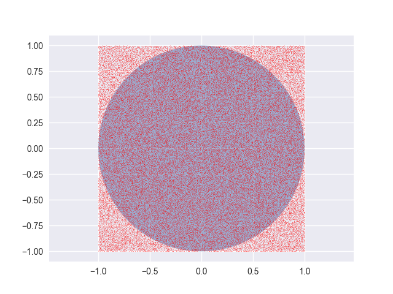

# 蒙特卡罗方法

## 1.机器学习中的应用背景

用大样本数据计算出来的频率去估计概率，这就是大数定理的本质，而大数定理思想的一个非常典型的应用就是蒙特卡罗方法。

蒙特卡罗方法，又叫统计模拟方法，名字很洋气，思想很粗暴，真的很管用。它使用随机数来进行场景的模拟或者过程的仿真，其思想核心就是通过模拟出来的大量样本集或者随机过程去近似我们想要研究的实际问题对象，这是一类非常重要的数值计算方法。

该方法的名字来源于世界著名的赌城蒙特卡罗。赌博和概率，二者相视一笑、不谋而合。这种方法最初应用于 20 世纪 40 年代美国的曼哈顿原子弹计划，如今在数据分析和机器学习领域中到处都有他的身影。

以下是蒙特卡罗方法的几类非常典型的应用：

1. 近似计算不规则面积/体积/积分
2. 模拟随机过程，预测随机过程可能性结果的区间范围
3. 利用马尔科夫链-蒙特卡罗方法（MCMC）进行未知参数的统计推断

要知道，蒙特卡洛方法不仅仅只是一种方法技巧，更是一种思考问题的方式。这一小节，我们先介绍第一个应用点，让大家进一步理解大数定理的原理和蒙特卡罗方法的要点。第二个和第三个应用我们会结合后面相应的章节依次介绍。

## 2.利用蒙特卡罗方法计算不规则面积

蒙特卡罗方法可以近似计算出不规则图形的面积，特别对于那些难以用解析方法计算的图像，非常有效。

这里，我们利用蒙特卡罗方法来近似计算一个圆的面积，然后估计出 $\pi$ 的近似值，选择圆作为例子的原因不是因为圆无法通过解析法进行计算，而是因为大家对他的面积比较熟悉，方便我们进行结果的对比。

**代码片段：**

```python
import numpy as np
import matplotlib.pyplot as plt
from matplotlib.patches import Circle
from scipy.stats import uniform
import seaborn
seaborn.set()

n = 100000
r = 1.0
o_x, o_y = (0., 0.)

uniform_x = uniform(o_x-r,2*r).rvs(n)
uniform_y = uniform(o_y-r,2*r).rvs(n)

d_array = np.sqrt((uniform_x - o_x) ** 2 + (uniform_y - o_y) ** 2)
res = sum(np.where(d_array < r, 1, 0))
pi = (res / n) /(r**2) * (2*r)**2

fig, ax = plt.subplots(1, 1)
ax.plot(uniform_x, uniform_y, 'ro', markersize=0.3)
plt.axis('equal')
circle = Circle(xy=(o_x, o_y), radius=r, alpha=0.5)
ax.add_patch(circle)

print('pi={}'.format(pi))
plt.show()
```

**运行结果：**

```
pi=3.14096
```



我们结合这张图，详细的分析一下这段程序。

我们近似计算的目标就是这个蓝色的半径为 $r=1$ 的单位圆面积，而这个单位圆的外接正方形的边长为 $l=2r=2$，因此外接正方形的面积为 $4$。我们生成 $100000$ 个在外接正方形内均匀分布的点，均匀的撒下去，这里面的核心原理就是：

$$\frac{圆形面积}{正方向面积}\approx \frac{圆内点的个数}{点的总个数}$$

这样就可以估算出单位圆的面积了。

而为了估算 $\pi$，我们回到这个例子中的参数，可以得到这么一个公式：

$$\frac{\pi r^2}{(2r)^2}\approx \frac{圆内点的个数}{点的总个数}\rightarrow \pi \approx 4 * \frac{圆内点的个数}{点的总个数}$$

而且大数定理告诉我们，随着样本数量的增大，我们用这种方式模拟出来的 $\pi$ 值应该是越来越趋近于真实值，样本无穷大的时候收敛于真值。这就证明了应用大数定理的蒙特卡罗方法的合理性和有效性。

至于有同学会问了，是怎么判定一个点是否位于圆当中？这里用的是距离法，也就是计算每个点到原点的距离，如果小于等于半径，就说明这个点在圆内。

这里是不是有一个 bug？就是说这个规则只对圆这种特殊图像有效，如果是一个完全不规则的图像，我们如何来计算这个图像的面积？

我们可以借助计算机图像中的像素来进行。比如把不规则图像内部都涂黑，图像外部都留白，我们还是均匀的撒下大样本量的点，如果某个点位于的坐标，他的像素是黑色的，则证明这个点在图像内部，反之就在图像外部，利用这个方法就能统计出位于图像内部的点的个数。
