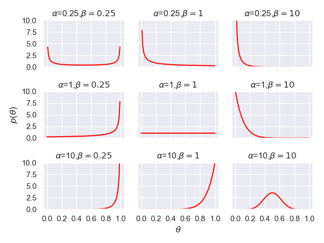
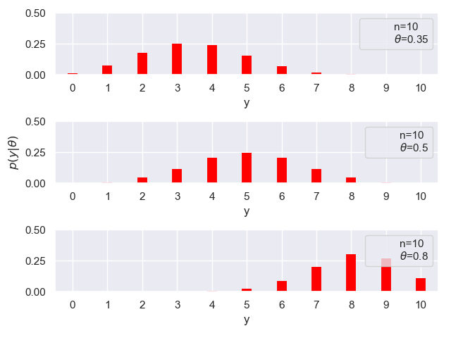
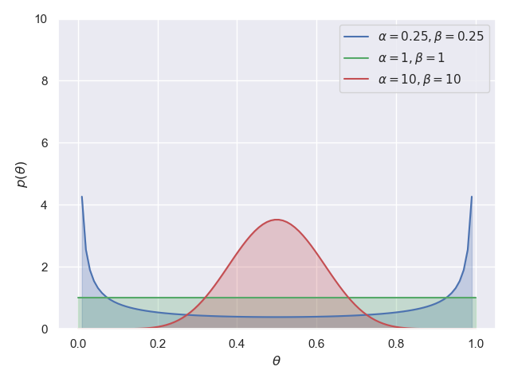
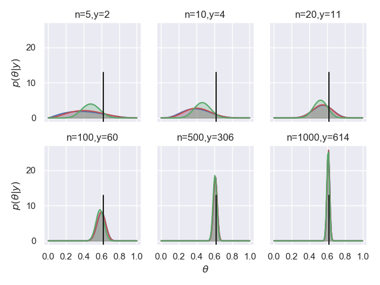

---
tags:
- 数学/概率统计
---

# 11 贝叶斯统计推断：最大后验

这一节，我们来介绍另外一种统计推断方法：贝叶斯统计推断方法。

## 1.回顾贝叶斯定理

首先，我们先来复习一下贝叶斯定理：

$$p(\Theta|X)=\frac{p(X|\Theta)p(\Theta)}{p(X)}$$

在这个简简单单的式子当中，蕴含了我们要掌握的很多重要内容：

贝叶斯定理当中的四个概率表达式，他们都非常重要，在这一节的内容中将反复出现，我们来一一解析一下：

**$p(\Theta)$：先验分布。** 反映的是在观测到数据之前我们对待估计的参数 $\Theta$ 的了解和认识。

**$p(X|\Theta)$：** 在确定了参数的情况下，试验数据的概率分布。实际上这就是对实际观测数据的一种描述。

**$p(\Theta|X)$：后验分布。** 后验分布就是我们通过贝叶斯定理得到的最终的分析结果，反映的是在给定观测数据的基础上，我们对于参数的新的认知。说的更直白一点，就是最开始没有观测数据的时候，我们依据以往的经验赋予了参数一个先验分布，然后来了实际的观测数据之后，我们就对先验进行了更新，得到了这次分析过程的后验分布。

**$p(X)$：边缘概率。** 这是一个与我们待估计的参数 $\Theta$ 无关的一个边缘概率值：$p(X)=\sum_{\theta}p(X,\Theta)=\sum_{\theta}p(X|\Theta)p(\Theta)$，因此我们并不用太关心这个值，仅仅把他当做是后验概率 $p(\Theta|X)$ 计算过程中的归一化系数即可。

因此我们更需要聚焦的就是如下的这个正比关系：

$$p(\Theta|X)\propto p(X|\Theta)p(\Theta)$$

实际上，有一个概念需要大家树立，那就是后验分布也是不断的处在动态更新过程当中的。一次试验得到的后验分布，对于后续进一步收集到的新的观测数据，他又可以看作是后续分析的一个先验。

## 2.贝叶斯推断与后验分布

在贝叶斯推断中，我们将待估计的量记为 $\Theta$，视其为一个随机变量，我们的目标就是基于观测到的样本数据值 $X=(X_1,X_2,…,X_n)$ 来提取 $\Theta$ 的信息，我们称 $X=(X_1,X_2,…,X_n)$ 为观测值，那么我们需要首先知道或者明确以下两方面内容：

第一个是视作随机变量 $\Theta$ 的待估计未知参数的先验分布 $p_{\Theta}$，如果 $\Theta$ 是连续的则相应的记作是 $f_{\Theta}$。

第二个是基于参数 $\Theta$ 的观测数据的分布模型，也就是条件分布 $p_{X|\Theta}$ 或者说是 $f_{X|\Theta}$，当然这取决于 $\Theta$ 是连续型还是离散型随机变量。

一旦确立了 $X$ 的观测值 $x$，贝叶斯推断的完整答案就由随机变量 $\Theta$ 的后验分布 $p_{\Theta|X}(\theta|x)$ 或者 $f_{\Theta|X}(\theta|x)$ 来描述和决定，这个后验分布的计算就是依赖贝叶斯定理来进行的。后验分布的精髓就在于他利用已经得知的观测数据，抓住了关于 $\Theta$ 的一切信息。

## 3.贝叶斯推断求解过程

这里我们总结一下上述的整个过程：

首先，贝叶斯推断的起点是未知随机变量 $\Theta$ 的先验分布 $p_{\Theta}$ 或者 $f_{\Theta}$。

然后，我们需要确定观测数据 $X$ 的分布模型，他是一个基于随机变量 $\Theta$ 的条件概率：$p_{X|\Theta}$ 或者 $f_{X|\Theta}$。

一旦我们观察到了 $X$ 的一个特定值 $x$ 之后，我们就可以开始运用贝叶斯法则去计算 $\Theta$ 的后验分布：

$$p_{\Theta|X}(\theta|x)=\frac{p_{\Theta}(\theta)p_{X|\Theta}(x|\theta)}{p_X(x)}=\frac{p_{\Theta}(\theta)p_{X|\Theta}(x|\theta)}{\sum_{\theta'}p_{\Theta}(\theta')p_{X|\Theta}(x|\theta')}$$

如果是连续型的随机变量，就把上面的概率质量函数替换成概率密度函数就可以了。

## 4.贝叶斯推断实际举例

感觉说来说去，还是比较理论，很多量该怎么确定可能还是不知道如何下手。那么我们通过一个抛掷硬币的例子来把贝叶斯推断的过程演练一遍：

假设我们有一个并不均匀的硬币，投掷出正面和反面的概率并不是相等的 $0.5$，因此我们通过不断的进行硬币抛掷试验来估计正面的概率 $\theta$。

那么我们首先为 $\theta$ 选择一个先验分布，实际上，我们对他一无所知，只知道这个 $\theta$ 应该介于 $[0,1]$ 之间，这个范围很粗犷，因此我们选择 $beta$ 分布作为参数 $\theta$ 的先验分布。

### 4.1.$beta$ 先验分布

$beta$ 分布是一个连续型随机变量的分布，他的概率密度函数为：

$$f(\theta)=\frac{\Gamma(\alpha+\beta)}{\Gamma(\alpha)\Gamma(\beta)}\theta^{\alpha-1}(1-\theta)^{\beta-1}$$

这个先验分布我们之前很少接触，除了未知参数 $\theta$ 以外，他还有两个参数 $\alpha$ 和 $\beta$，用来控制整个 $beta$ 分布的图像，并且分式 $\frac{\Gamma(\alpha+\beta)}{\Gamma(\alpha)\Gamma(\beta)}$ 中间含有复杂的伽马函数。

其实这个分式大家不用特别关心，他可以被理解为一个正则项，保证整个概率密度函数的积分为 $1$ 即可。

那么我们为什么要选择 $beta$ 分布作为未知参数 $\theta$ 的先验分布呢？相信大家都有疑问，那么我们通过下面的内容讲解来慢慢揭示，首先我们来看一下 $beta$ 分布的具体形态。

我们刚刚说过，$beta$ 分布概率密度函数中，参数 $\alpha$ 和参数 $\beta$ 是用来控制分布的形状的，具体指的什么，我们让参数 $\alpha$ 和参数 $\beta$ 分别依次从 $[0.25,1, 10]$ 中取值作为参数，这样就构成了 $9$ 组参数对，我们来依次画出他们的分布形态。

**代码片段：**

```python
import numpy as np
import matplotlib.pyplot as plt
from scipy.stats import beta
import seaborn
seaborn.set()

params = [0.25, 1, 10]
x = np.linspace(0, 1, 100)
f, ax = plt.subplots(len(params), len(params), sharex=True, sharey=True)

for i in range(len(params)):
    for j in range(len(params)):
        a = params[i]
        b = params[j]
        y = beta(a, b).pdf(x)
        ax[i, j].plot(x, y, color='red')
        ax[i, j].set_title('$\\alpha$={},$\\beta={}$'.format(a, b))
        ax[i, j].set_ylim(0, 10)
        
ax[0, 0].set_xticks([0, 0.2, 0.4, 0.6, 0.8, 1])
ax[0, 0].set_yticks([0, 2.5, 5, 7.5,  10])
ax[1, 0].set_ylabel('$p(\\theta)$')
ax[2, 1].set_xlabel('$\\theta$')
plt.show()
```

**运行结果：**

 参数 $\alpha$ 和 $\beta$ 的不同取值组合，我们能够得到类似于 $U$ 型分布，正态分布，均匀分布，指数分布等等许多不同分布的形状，具有很强的通用性和适应性。

其次一点是共轭性，他能够极大的简化后验分布的计算，这一点我们接下来继续展开。

### 4.2.关于观测数据的分布

接下来，我们选择观测数据的分布，在抛掷硬币的过程中，确定了某一次抛掷硬币正面向上的概率 $\theta$ 之后，抛掷 $n$ 次硬币，其中 $y$ 次向上的概率是满足二项分布的，这个我们之前也反复讲过：

$$p(y|\theta)=\frac{n!}{y!(n-y)!}\theta^y(1-\theta)^{n-y}$$

这里我们就抛掷 $10$ 次硬币，其中令正面向上的概率分别是 $0.35,0.5,0.8$，来看看观测数据所服从的分布：

**代码片段：**

```python
from scipy.stats import binom
import matplotlib.pyplot as plt
import numpy as np
import seaborn

seaborn.set()

n = 10
p_params = [0.35, 0.5, 0.8]
x = np.arange(0, n + 1)
f, ax = plt.subplots(len(p_params), 1)

for i in range(len(p_params)):
    p = p_params[i]
    y = binom(n=n, p=p).pmf(x)
    
    ax[i].vlines(x, 0, y, colors='red', lw=10)
    ax[i].set_ylim(0, 0.5)
    ax[i].plot(0, 0, label='n={}\n$\\theta$={}'.format(n, p), alpha=0)
    ax[i].legend()
    ax[i].set_xlabel('y')
    ax[i].set_xticks(x)

ax[1].set_ylabel('$p(y|\\theta)$')
plt.show()
```

**运行结果：**


#### 4.3.后验的计算

我们接下来就来计算后验：

$$f(\theta|y)\propto f(\theta)p(y|\theta)$$

$$f(\theta)=\frac{\Gamma(\alpha+\beta)}{\Gamma(\alpha)\Gamma(\beta)}\theta^{\alpha-1}(1-\theta)^{\beta-1}$$

$$p(y|\theta)=\frac{n!}{y!(n-y)!}\theta^y(1-\theta)^{n-y}$$

因此：

$$f(\theta|y)\propto \frac{\Gamma(\alpha+\beta)}{\Gamma(\alpha)\Gamma(\beta)}\theta^{\alpha-1}(1-\theta)^{\beta-1}\frac{n!}{y!(n-y)!}\theta^y(1-\theta)^{n-y}$$

而针对选定的先验，参数 $\alpha$ 和 $\beta$ 是已知的，针对一组已知的观测数据，抛掷的次数 $n$ 和正面向上的次数 $y$ 也是已知的，因此 $\frac{\Gamma(\alpha+\beta)}{\Gamma(\alpha)\Gamma(\beta)}$ 和 $\frac{n!}{y!(n-y)!}$ 都是与未知参数 $\theta$ 无关的项，他们可以被合并到归一化项当中去，因此我们可以进一步化简：

$$f(\theta|y)\propto \theta^{\alpha-1}(1-\theta)^{\beta-1}\theta^y(1-\theta)^{n-y}=\theta^{\alpha+y-1}(1-\theta)^{\beta+n-y-1}$$

最终实际的后验 $f(\theta|y)$ 就是在 $\theta^{\alpha+y-1}(1-\theta)^{\beta+n-y-1}$ 的基础上加上一个归一化的项，使之在整个 $\theta$ 的取值域上积分为 $1$。

此时你可能会问，后面我们再该怎么处理？我们从后验分布的概率密度函数的正比表达式：$\theta^{\alpha+y-1}(1-\theta)^{\beta+n-y-1}$ 中惊奇的发现，后验分布同样也是一个 $beta$ 分布，只不过这个 $beta$ 分布的参数变了：

$\alpha_{posterior}=\alpha+y$
$\beta_{posterior}=\beta+n-y$

那么我们很容易就能根据先验分布和观测数据得到后验分布了。

## 5.模拟实验验证

首先我们写一段模拟抛硬币的程序，我们手上的这枚硬币，正面向上的实际概率为 $0.62$，我们模拟随机抛掷 $1000$ 次硬币的试验，并且记录抛掷过程中，抛掷次数为 $[5,10,20,100,500,1000]$ 时，正面出现的次数。这个 $0.62$ 就是我们需要根据观测数据来估计的未知参数，并且我们可以用它来和估计值进行对比。

**代码片段：**

```python
import random

def bernoulli_trial(p):
    u = random.uniform(0, 1)
    if u <= p:
        return 1
    else:
        return 0

def coin_experiments(n_array, p):
    y = 0
    n_max = max(n_array)
    results = []
    for n in range(1, n_max+1):
        y = y + bernoulli_trial(p)
        if n in n_array:
            results.append((y, n))
    
    return results

print(coin_experiments([5, 10, 20, 100, 500, 1000], 0.62))
```

**运行结果：**

```
[(2, 5), (4, 10), (11, 20), (60, 100), (306, 500), (614, 1000)]
```

这个结果中，每一个元组表示的含义为(正面的次数，试验的次数)，记录了完成 $1000$ 次试验的过程中，抛掷到 $5$ 次，$10$ 次，$20$ 次，$100$ 次，$500$ 次和 $1000$ 次的时候，相应的正面向上的次数。

例如 $(311,500)$ 表示当试验进行了 $500$ 次时，正面出现的次数为 $311$ 次。

请大家放心的是，这个试验生成的结果完全是按照伯努利试验随机生成的，你可以再重复运行 $5$ 次该实验，一定会得到完全不同的 $5$ 组试验结果：

**代码片段：**

```python
for i in range(5):
    print(coin_experiments([5, 10, 20, 100, 1000, 10000], 0.62))
```

**运行结果：**

```
[(3, 5), (7, 10), (13, 20), (55, 100), (306, 500), (622, 1000)]
[(4, 5), (6, 10), (12, 20), (68, 100), (319, 500), (632, 1000)]
[(2, 5), (6, 10), (12, 20), (57, 100), (319, 500), (645, 1000)]
[(4, 5), (7, 10), (14, 20), (64, 100), (309, 500), (626, 1000)]
[(4, 5), (8, 10), (15, 20), (56, 100), (309, 500), (607, 1000)]
```

最后，我们利用三组 $(\alpha,\beta)$ 分别为 $(0.25,0.25),(1,1),(10,10)$ 的 $beta$ 分布作为先验分布：

**代码片段：**

```python
import numpy as np
import matplotlib.pyplot as plt
from scipy.stats import beta
import seaborn
seaborn.set()

params = [0.25, 1, 10]
x = np.linspace(0, 1, 100)

plt.plot(x, beta(0.25, 0.25).pdf(x), color='b', label='$\\alpha=0.25,\\beta=0.25$')
plt.fill_between(x, 0, beta(0.25, 0.25).pdf(x), color='b', alpha=0.25)

plt.plot(x, beta(1, 1).pdf(x), color='g',label='$\\alpha=1,\\beta=1$')
plt.fill_between(x, 0, beta(1, 1).pdf(x), color='g', alpha=0.25)

plt.plot(x, beta(10, 10).pdf(x), color='r',label='$\\alpha=10,\\beta=10$')
plt.fill_between(x, 0, beta(10, 10).pdf(x), color='r', alpha=0.25)

plt.gca().axes.set_ylim(0,10)
plt.gca().axes.set_xlabel('$\\theta$')
plt.gca().axes.set_ylabel('$p(\\theta)$')
plt.legend()
plt.show()
```

**运行结果：**

 我们选择：

$[(2,5), (4,10), (11,20), (60,100), (306,500), (614,1000)]$ 作为观测数据，利用贝叶斯推断的方法，来得到后验分布

**代码片段：**

```python
from scipy.stats import beta
import matplotlib.pyplot as plt
import numpy as np
import seaborn

seaborn.set()

theta_real = 0.62
n_array = [5, 10, 20, 100, 500, 1000]
y_array = [2, 4, 11, 60, 306, 614]

beta_params = [(0.25, 0.25), (1, 1), (10, 10)]
x = np.linspace(0, 1, 100)

fig, ax = plt.subplots(2, 3, sharex=True, sharey=True)

for i in range(2):
    for j in range(3):
        n = n_array[3 * i + j]
        y = y_array[3 * i + j]
        for (a_prior, b_prior), c in zip(beta_params, ('b', 'r', 'g')):
            a_post = a_prior + y
            b_post = b_prior + n - y
            p_theta_given_y = beta.pdf(x, a_post, b_post)
            ax[i, j].plot(x, p_theta_given_y, c)
            ax[i, j].fill_between(x, 0, p_theta_given_y, color=c, alpha=0.25)
    
        ax[i, j].axvline(theta_real, ymax=0.5, color='k')
        ax[i, j].set_xticks([0, 0.2, 0.4, 0.6, 0.8, 1])
        ax[i, j].set_title('n={},y={}'.format(n, y))

ax[0, 0].set_ylabel('$p(\\theta|y)$')
ax[1, 0].set_ylabel('$p(\\theta|y)$')
ax[1, 1].set_xlabel('$\\theta$')
plt.show()
```

**运行结果：**


## 6.实验结果分析

我们来分析一下试验结果，首先我们设置了三种典型的先验分布，均匀分布、$U$ 型分布和类似正态分布，分别代表了我们对于未知参数 $\theta$ 不同的认识，比如如果我们选择均匀分布，意味着我们认为，$\theta$ 在 $[0,1]$ 范围内的取值是等概率的；$U$ 型分布代表了在靠近 $0$ 和 $1$ 的两头，$\theta$ 的取值概率越高，类正态分布表示我们认为越靠近中心 $0.5$ 的位置，取值概率越高。这三者的认识是截然不同的。

在整个实验的每一个阶段，通过先验分布与观测数据的综合，我们得到了每个阶段的后验结果，我们从图中可以看出，贝叶斯推断得到的是一个后验分布，而不像极大似然估计中得到的是一个具体值。他表示了在给定观测数据的情况下，推断得到的未知参数 $\theta$ 的分布情况。

一般而言我们都会选择后验分布概率密度函数曲线的峰值作为我们最终对于未知参数的估计值。这就是贝叶斯推断中的最大后验概率（$MAP$）准则，即选择在一个给定数据下，具有最大后验概率的值。

从这个结果图中，我们可以看出很多的结论：

首先，随着观测数据的不断增多，后验分布会越来越集中，分布越集中表示对于参数的确定性越高，这很显然，观测数据的增多意味着有更多的数据、更多的信息来更新和支撑我们对于参数的认识。

其次，当观测数据的量足够多的时候，不同的先验分布对应的后验分布都会收敛到一个相同的结果，数据越多，通过最大后验概率准则得到的估计值就会与参数的实际值（黑色竖线）越接近。

## 7.关于共轭先验的问题

那么这里有一个重要的点要强调，当然也是我们当初没有谈到的，先验选择 $beta$ 分布的第三个好处，那就是：

先验分布是 $beta$ 分布，观测数据服从二项分布，得到的后验仍然是 $beta$ 分布，也就是说 $beta$ 分布是二项分布的共轭先验：即将先验 $beta$ 分布与二项分布组合在一起之后，得到的后验分布与先验分布的表达式形式仍然是一样的。除此之外，正态分布也是自身的共轭先验。

这种分布的共轭特性，极大的简化了我们求解后验分布的计算复杂性。但是，共轭分布的情形并不普遍，因此如果不是在共轭先验的条件下去解决贝叶斯推断问题，那么在计算后验分布的过程中将会遇到非常大的困难，后验分布绝大多数情况下就不再是一个标准分布，甚至没有解析解，在这种情况下想了解后验分布的形态将遇到巨大的挑战，基于他去做后续的统计分析将难上加难。

那么怎么办？别急，留给我们后面的近似采样方法来彻底解决吧！