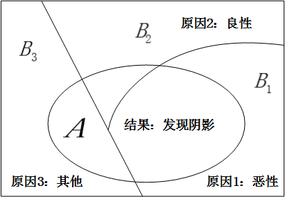

# 贝叶斯公式

## 1.贝叶斯公式概述

了解了[[全概率公式]]之后，我们可以进一步的处理条件概率的表达式，得到下面这个式子：

$$P(B_i|A)=\frac{P(AB_i)}{P(A)}=\frac{P(B_i)P(A|B_i)}{P(A)}=\frac{P(B_i)P(A|B_i)}{P(B_1)P(A|B_1)+P(B_2)P(A|B_2)+…+P(B_n)P(A|B_n)}$$

这就是大名鼎鼎的贝叶斯公式。

这个式子你千万不要觉得他平淡无奇，觉得仅仅只是数学式子的推导和罗列。这一个公式里包含了全概率公式、条件概率、贝叶斯准则，我们来挖掘一下里面所蕴藏的最重要的内涵：

贝叶斯公式将条件概率 $P(A|B)$ 和条件概率 $P(B|A)$ 紧密的联系了起来，其最根本的数学基础就是因为 $P(A|B)P(B)=P(B|A)P(A)$，他们都等于 $P(AB)$。

那这里面具体的深刻内涵是什么呢？我们接着往下看：

## 2.本质内涵：由因到果，由果推因

现实中，我们可以把事件 $A$ 看成是结果，把事件 $B_1,B_2,…,B_n$ 看成是导致这个结果的各种可能的原因。

那么，我们所介绍的全概率公式 $P(A)=P(B_1)P(A|B_1)+P(B_2)P(A|B_2)+…+P(B_n)P(A|B_n)$ 就是由各种原因推理出结果事件发生的概率，是**由因到果**；

但是，更重要、更实际的应用场景是，我们在日常生活中常常是观察到某种现象，然后去反推造成这种现象的各种原因的概率。简单点说，就是**由果推因**。

贝叶斯公式 $P(B_i|A)=\frac{P(AB_i)}{P(A)}=\frac{P(B_i)P(A|B_i)}{\sum_{j}{P(B_j)P(A|B_j)}}$，最终求得的就是条件概率 $P(B_i|A)$，就是在观察到结果事件 $A$ 已经发生的情况下，我们推断结果事件 $A$ 是由原因 $B_i$ 造成的概率的大小，以支撑我们后续的判断。

那么我们可以说，单纯的概率 $P(B_i)$ 我们叫做**先验概率**，指的是在没有别的前提信息情况下的概率值，这个值一般需要借助我们的经验估计得到。

而条件概率 $P(B_i|A)$，我们把他叫做是**后验概率**，他代表了在获得了信息 $A$ 之后 $B_i$ 出现的概率，可以说后验概率是先验概率在获取了新信息之后的一种修正。

## 3.贝叶斯公式的应用举例

比如，贝叶斯公式应用的一个常见例子就是 $X$ 光片的病理推断案例，在某个病人的 $X$ 光片中，医生看到了一个阴影，这就是结果事件 $A$，我们希望对造成这个结果的三种可能原因（即：原因 $1$：恶性肿瘤；原因 $2$：良性肿瘤；原因 $3$：其他原因）进行分析判断，推断分属于各个原因的概率，如图所示：

例如，我们想求出原因是恶性肿瘤的概率，也就是求条件概率：$P(B_1|A)$ 的值。

我们只要知道在这三种原因下出现阴影的概率，也就是 $P(A|B_1)$，$P(A|B_2)$，$P(A|B_3)$，以及三种原因的先验概率：$P(B_1)$，$P(B_2)$，$P(B_3)$，就能通过贝叶斯公式 $P(B_1|A)=\frac{P(B_1)P(A|B_1)}{P(B_1)P(A|B_1)+P(B_2)P(A|B_2)+P(B_3)P(A|B_3)}$ 求得，而上述这些需要我们知道的值，基本上都可以通过历史统计数据得到。
