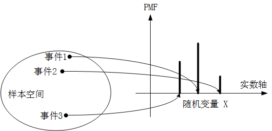
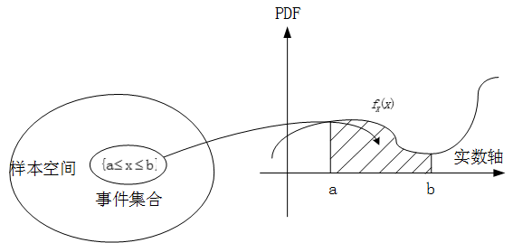

---
tags:
- 数学/概率统计
---

# 连续型随机变量

取值于连续区域的随机变量的应用领域是十分普遍的，比如汽车行驶的速度、设备连续正常运行的时间等等，这些在实际应用中都非常广泛，连续型随机变量能够刻画一些离散型随机变量无法描述的问题。

## 1.概率密度函数

在连续型随机变量的讨论范围中，随机变量由离散的变为了实轴上的连续值，那么与离散型随机变量的分布列以及 $PMF$ 函数相对应，我们就有了连续型随机变量相类似的新概念：概率密度函数 $PDF$，二者在概念上是完全相对应的。

我们回顾一下前面在讲离散型随机变量分布列时所使用的一张图：

通过将三个事件所对应的概率值进行相加，就能得到这个事件集合所对应的总的概率：

$$P(X\in S)=\sum_{x\in S}{p_X(x)}=P_X(1)+P_X(2)+P_X(3)$$

而连续型随机变量和离散型随机变量最明显的不同点是，连续型随机变量的个数是无限的、不可数的，不是像这样直接简单相加，而是在实轴的区间范围内，对概率密度函数进行积分运算。

这里，我们要对概率密度函数的特殊性进行强调：

第一：实数轴上单个点的概率密度函数 $PDF$ 取值 $f_X(x)$ 不是概率，而是概率律，因此他的取值是可以大于 $1$ 的。

第二：连续型随机变量的概率，我们一般讨论的是在一个区域内取值的概率，而不是某个单点的概率值。实际上，在连续区间内讨论单个点是没有意义的。

## 2.连续型随机变量区间概率的计算

连续型随机变量在一个区间内取值的概率，我们可以通过求积分来计算解决，例如上图中，随机变量在 $[a,b]$ 区间内的概率即为：$P(a\leq X \leq b)=\int_{a}^{b} f_X(x)dx$，也就是图中阴影区间内的面积。因此这也进一步印证了上面的第二条结论，也就是说我们关注的不是单个点而是一个取值区间的概率计算。

当 $x=a$ 时，有 $P(a\leq X \leq a)=\int_{a}^{a} f_X(x)dx=0$，因此区间两端是否取等也无关紧要了：

$$P(a\leq X\leq b)=P(a< X\leq b)=P(a\leq X< b)=P(a< X< b)$$

同样的，我们继续进行类比，连续型随机变量概率的非负性和归一性体现在：

非负性：对一切的 $x$ 都有 $f_X(x)\geq 0$；

而归一化体现在 $P(-\infty\leq X \leq \infty)=\int_{-\infty}^{\infty} f_X(x)dx=1$

## 3.连续型随机变量的期望与方差

大家千万不要到了这个连续型的新场景下就慌了手脚，在离散型随机变量中，我们通过分布列，求得加权的均值，即获得了离散型随机变量的期望。

那么在连续型随机变量的场景下，我们死扣定义，期望 $E[X]$ 的核心要义是大量独立重复试验中，随机变量 $X$ 取值的平均数，那么我们此时将分布列替换成概率密度函数 $PDF$，求和替换成求积分就可以了，即：

$$E[X]=\int_{-\infty}^{\infty} xf_X(x)dx$$

方差也是一样，扣定义：方差是随机变量到期望的距离平方的期望：

$$V[X]=E[(X-E[X])^2]=\int_{-\infty}^{\infty} (x-E[X])^2f_X(x)dx$$
