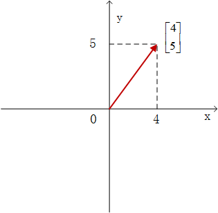
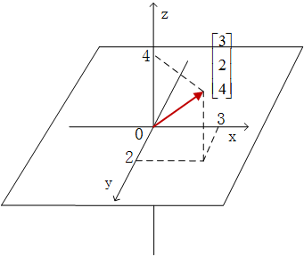
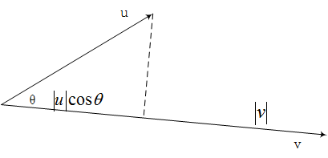
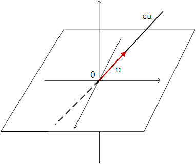
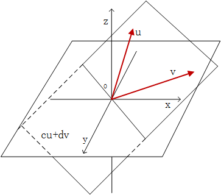
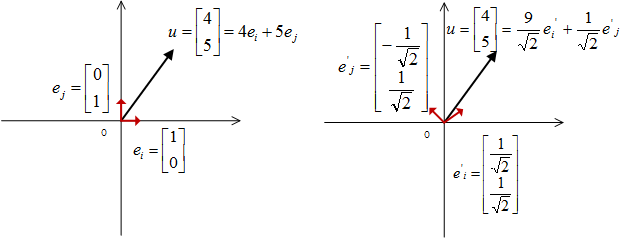
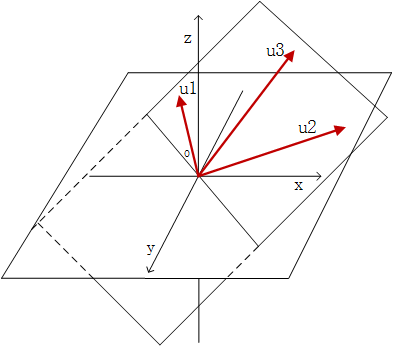

---
tags:
- 数学/线性代数
---

# 01 构建空间：从向量和基底出发

## 1.向量基础概念回顾

### 1.1.向量的几何含义

向量对于大家而言一定不陌生，他的概念很简单，把数字排成一行或一列就是向量。他是描述空间的有力工具。

比如二维向量：$\begin{bmatrix} 4\\5 \end{bmatrix}$，他有两个成分：第一个成分是 $4$，第二个成分是 $5$。一方面，我们可以把他理解成二维平面中 $x$ 坐标为 $4$，$y$ 坐标为 $5$ 的一个点，也可以理解为以平面原点 $(0,0)$ 为起点，到目标终点 $(4,5)$ 的有向线段，如图 1 所示：



由此可见，向量中成分的个数就是向量的维数。因此，我们进一步推广下去，还会有三维向量，如：$\begin{bmatrix} 3\\2\\4 \end{bmatrix}$ ，他用来表示三维空间中的一个点，或者在三维空间中以原点 $(0,0,0)$ 为起点，到目标终点 $(3,2,4)$ 的有向线段，如图 2 所示。当然，以此类推还有更高维的向量。



### 1.2.充当数据的载体

当然，向量不仅仅局限于描述空间中的点坐标和有向线段，他也可以作为描述事物属性的数据载体。比如一次考试中你的成绩为：语文 $85$ 分，数学 $92$ 分，外语 $89$ 分。由于这三门课分属于你的不同科目属性，因此我们可以使用一个三维向量对其进行表示：$score= \begin{bmatrix} 85\\92\\89 \end{bmatrix}$ 。

又如，在自然语言处理中，程序在进行文本阅读时，首先就会进行文本分词，然后使用向量进行表示。这是因为向量很适合在高维空间中进行表达和处理。在本书后续章节中将接触到的投影、降维等概念，都是在向量的基础上实现的。

### 1.3.注意：我们一般使用列向量

根据刚才我们所讲的，把数字排成一行或一列就是向量。因此向量拥有两种表达方式：像 $\begin{bmatrix} 4\\5 \end{bmatrix}$，$\begin{bmatrix} -4\\15\\6.7 \end{bmatrix}$ 这种元素竖排的，称为列向量，对应的元素横排的称为行向量，比如：$\begin{bmatrix} 4&5&7 \end{bmatrix}$。

我们在实际使用向量工具进行描述和计算的时候，具体使用哪一种方式呢？在没有特殊说明的情况下，我们提到向量，都是默认为列向量。在文字排版的时候，由于列向量比较占空间，也可以将其写成行向量的转置：$\begin{bmatrix} -4&15&6.7 \end{bmatrix}^{T}$ 。

如果我们从直觉上来看，似乎行向量更为直观，这里为什么如此偏爱列向量呢？这么做主要是为了方便后续的向量坐标变换、映射等计算。这里只简单提一句，大家有个直观印象就好：将一个矩阵 $A$ 所表示的线性映射作用于某向量 $x$ 时，我们习惯于将其写成矩阵乘以向量的形式：$Ax$ ，而这种写法的运算基础便是：$x$ 是一个列向量。这里一下子堆上来好几个概念，比如转置、矩阵、线性变换等等，都先不急着展开，后面会一一详细描述。这里就请先记住：一般我们都用列的形式来表示向量。

## 2.向量的 $python$ 表示

### 2.1.表示成行向量

对应的，我们如何用 $python$ 来表示行向量和列向量呢？这里我们需要使用 $Numpy$ 工具包。

**代码片段:**

```python
import numpy as np

A = np.array([1,2,3,4])
print(A)
```

**运算结果：**

```
[1 2 3 4]
```

$python$ 中用 $Numpy$ 库来生成一个向量，默认生成的是行向量，但正如我们上面所说的，一般情况下我们通常使用的是列向量，因此还需要对其做一些处理。

你的第一感觉可能会想，用一用转置这个概念（后面会详细讲解）是不是就可以了，也就是把向量的行索引和列索引交换位置，但是 $Numpy$ 中的转置方法在一维向量里是无效的。

**代码片段:**

```python
import numpy as np

A = np.array([1,2,3,4])
print(A.transpose())
```

**运行结果：**

```
[1 2 3 4]
```

我们发现，确实没有起到效果。

### 2.2.如何表示列向量

那我们应该如何来表示一个列向量呢？

这里我们要事先用一点后面的知识，我们把向量看作是一维的数组，但是也可以看做是行为 $1$ 或者列为 $1$ 的二维数组，用后面的内容来描述，即向量可以看作是特殊的矩阵。行向量是 $1\times m$ 的矩阵，列向量是 $n\times 1$ 的矩阵，我们用这个视角重新生成一个新的行向量和列向量。

**代码片段：**

```python
import numpy as np

A = np.array([[1, 2, 3]])
print(A)
print(A.T)
```

**运行结果：**

```
[[1 2 3]]

[[1]
 [2]
 [3]]
```

在这段代码里，我们要注意：行向量初始化时，我们使用了 Numpy 库中的二维向量初始化方法，因此多嵌套了一层中括号，在这种情况下，我们就可以直接通过行向量转置的方法，来生成对应的列向量了。

## 3.运用向量进行运算

明确了向量的表示方法，那么接下来我们来梳理一下向量的基本运算，我们逐一介绍向量的加法、向量的数量积和向量间的乘法。

### 3.1.向量的加法

两个维数相同的向量才能进行加法运算，将相同位置上的元素相加即可，结果向量的维数保持不变：

$\begin{bmatrix} u_1&u_2&u_3 \end{bmatrix} ^{T}$ + $\begin{bmatrix} v_1&v_2&v_3 \end{bmatrix} ^{T}$ $=\begin{bmatrix} u_1+v_1&u_2+v_2&u_3+v_3 \end{bmatrix} ^{T}$

向量的加法运算很简单，我们具体来举个例子：

**代码片段：**

```python
import numpy as np

u = np.array([[1,2,3]]).T
v = np.array([[5,6,7]]).T
print(u + v)
```

**运行结果：**

```
[[ 6]
 [ 8]
 [10]]
```

### 3.2.向量的数量乘法

向量的数量乘法就是将参与乘法运算的数和向量的每个元素分别相乘，结果向量保持维数不变，数量乘法就是将向量沿着所在直线的方向拉长到相应的倍数，方向和参与运算的数字的正负号相关：

$c\begin{bmatrix} u_1&u_2&u_3 \end{bmatrix} ^{T}$ $=\begin{bmatrix} cu_1&cu_2&cu_3 \end{bmatrix} ^{T}$

**代码片段：**

```python
import numpy as np

u = np.array([[1, 2, 3]]).T
print(3*u)
```

**运行结果：**

```
[[3]
 [6]
 [9]]
```

### 3.3.向量的内积

介绍完向量的加法和数量乘法，这里大家一定会问了，那向量和向量相乘呢？向量与向量的乘法分为所谓的 **点乘（内积）** 和 **叉乘（外积）**，我们先说内积。

向量 $u$ 和向量 $v$ 的内积定义如下：

$u\cdot v= \begin{bmatrix} u_1&u_2&u_3 \end{bmatrix} ^{T}\cdot \begin{bmatrix} v_1&v_2&v_3 \end{bmatrix} ^{T} = u_1v_1+u_2v_2+u_3v_3$

这个定义看上去很简单，好像没什么特殊含义。但是，他的另一种表示方法所含的物理意义就十分清晰：$u\cdot v=\left| u \right|\left| v \right|cos\theta$，如图 3 所示：



即：向量 $u$ 在向量 $v$ 方向上的投影长度乘上向量 $v$ 的模长，换句话说，如果 $v$ 是单位向量的话，就可以直接描述为 $u$ 在 $v$ 方向上的投影长度。

需要注意的是，我们在实际计算向量内积时，无论是行向量间的内积还是列向量间的内积，其运算结果都是一样的。

$python$ 中计算向量的内积非常方便。但是需要注意，如果我们直接使用 $numpy$ 函数库中的内积方法 $dot$，那么 $python$ 内积运算函数 $dot$ 中的参数要求必须是一维行向量：

**代码片段：**

```python
import numpy as np

u = np.array([3, 5, 2])
v = np.array([1, 4, 7])
print(np.dot(u, v))
```

**运行结果：**

```
37
```

那么有人可能会问了，在上文中我们学习了表示行列向量的通用方法（即用行或列为 $1$ 的二维数组表示向量），用在这里行不行？我们可以看看：

**代码片段：**

```python
import numpy as np

u = np.array([[3, 5, 2]])
v = np.array([[1, 4, 7]])
print(np.dot(u,v))
```

**运行结果：**

```python
Traceback (most recent call last):
  File "D:/code/test/test.py", line 5, in <module>
    print(np.dot(u, v))
ValueError: shapes (1,3) and (1,3) not aligned: 3 (dim 1) != 1 (dim 0)
```

**代码片段：**

```python
import numpy as np

u = np.array([[3, 5, 2]]).T
v = np.array([[1, 4, 7]]).T
print(np.dot(u,v))
```

**运行结果：**

```python
Traceback (most recent call last):
  File "D:/code/test/test.py", line 5, in <module>
    print(np.dot(u,v))
ValueError: shapes (3,1) and (3,1) not aligned: 1 (dim 1) != 3 (dim 0)
```

看上去似乎有些问题，学完后面几节内容大家就会知道，这种向量的表示方法本质上其实是矩阵，只不过是行数或者列数为 $1$ 的特殊矩阵，将这种方法表示下的向量作为 $dot$ 函数的参数，就需要依据矩阵的乘法法则来计算，依据矩阵乘法法则判定就会报错，至于为什么会出错，后面的小节会重点讲述，那么怎么样才能得到正确的结果呢，这里先提前预告一下：

**代码片段：**

```python
import numpy as np

u = np.array([[3, 5, 2]])
v = np.array([[1, 4, 7]]).T
print(np.dot(u,v))
```

**运行结果：**

```
[[37]]
```

看上去得到了一个正确的数值结果，至于为什么外面围着两层中括号，同样的，看完后面的内容就会明白。

### 3.4.向量的外积

我们只讨论二维平面和三维空间中的向量外积：

在二维平面中：$u\times v= \begin{bmatrix} u_1&u_2 \end{bmatrix} ^{T}\times \begin{bmatrix} v_1&v_2 \end{bmatrix} ^{T} = u_1v_2-u_2v_1$

同样的，还有另一种表达式，看起来物理意义会更直观一些：$u\cdot v=\left| u \right|\left| v \right|sin\theta$ ，如图 4 所示。这表示两个向量张成的平行四边形的面积，当然，这里的面积要打引号，因为如果两个向量的夹角大于 180°，则结果为负。


**代码片段：**

```python
import numpy as np
u = np.array([3, 5])
v = np.array([1, 4])
print(np.cross(u, v))  
```

**运行结果：**

```
7
```

而在三维空间中，外积的计算要相对复杂一些，其计算的结果是一个向量而不是一个数值。

$u\times v= \begin{bmatrix} u_1&u_2&u_3 \end{bmatrix} ^{T}\times \begin{bmatrix} v_1&v_2&v_3 \end{bmatrix} ^{T} = \begin{bmatrix} u_2v_3-u_3v_2&u_3v_1-u_1v_3&u_1v_2-u_2v_1 \end{bmatrix} ^{T}$

这个向量也是有物理含义的，即两个向量所表示平面的法向量。

**代码片段：**

```python
import numpy as np

x = np.array([3, 3, 9])
y = np.array([1, 4, 12])
print(np.cross(x, y))
```

**运行结果：**

```
[  0 -27 9]
```

## 4.向量的线性组合

在向量加法和数量乘法的基础上，我们将其组合应用，就过渡到向量的线性组合相关内容。针对向量 $u$ 和 $v$，我们先求数字 $c$ 和向量 $u$ 的数量积，再求数字 $d$ 和向量 $v$ 的数量积，最后将二者叠加，就得到了 $u$ 和 $v$ 的线性组合 $cu+dv$，这里 $c$ 和 $d$ 可以取任意值（包括 $0$）。

我们再举一个三个三维向量线性组合的例子：

$u=\begin{bmatrix} u_1\\u_2\\u_3 \end{bmatrix}$，$v=\begin{bmatrix} v_1\\v_2\\v_3 \end{bmatrix}$，$w=\begin{bmatrix} w_1\\w_2\\w_3 \end{bmatrix}$：

$cu+dv+ew = c\begin{bmatrix} u_1\\u_2\\u_3 \end{bmatrix} +d\begin{bmatrix} v_1\\v_2\\v_3 \end{bmatrix} +e\begin{bmatrix} w_1\\w_2\\w_3 \end{bmatrix}=\begin{bmatrix} cu_1+dv_1+ew_1\\cu_2+dv_2+ew_2\\cu_3+dv_3+ew_3 \end{bmatrix}$

其中，$c$,$d$,$e$ 可以取包含 $0$ 在内的任意值。

在这里，我们也举个例子来对几个已知的向量进行线性组合：

**代码片段：**

```python
import numpy as np

u = np.array([[1, 2, 3]]).T
v = np.array([[4, 5, 6]]).T
w = np.array([[7, 8, 9]]).T

print(3*u+4*v+5*w)
```

**运行结果：**

```
[[54]
 [66]
 [78]]
```

那么进一步，我们思考一下下面几个线性组合的图像。

我们知道，两个向量相加，在几何上就是将两个向量首尾依次连接，结果向量就是最初的起点和最终的终点的有向连线。我们假定有三个非零的三维向量：$u=\begin{bmatrix} u_1\\u_2\\u_3 \end{bmatrix}$，$v=\begin{bmatrix} v_1\\v_2\\v_3 \end{bmatrix}$，$w=\begin{bmatrix} w_1\\w_2\\w_3 \end{bmatrix}$，我们讨论他们的线性组合：

**情况一，$cu$ 的所有线性组合的图像：**

由于 $c$ 可以取 $0$，因此 $cu$ 的所有线性组合可以表示为三维空间中一条穿过原点 $(0,0,0)$ 的直线，如图 5 所示：



**情况二，$cu+dv$ 的所有线性组合的图像：**

当向量 $u$ 和 $v$ 不在一条直线上时，$cu+dv$ 表示三维空间中的一个通过原点 $(0,0,0)$ 的二维平面，如图 6 所示：



当向量 $u$ 和 $v$ 处在一条直线上时，$cu+dv$ 的图像退化成第一种情况；

**情况三，$cu+dv+ew$ 的所有线性组合的图像：**

当向量 $u$,$v$,$w$ 不在一个平面上时，$cu+dv+ew$ 可以表示整个三维空间；

当向量 $u$,$v$,$w$ 处在一个平面上时，$cu+dv+ew$ 的图像退化成第二种情况；

当向量 $u$,$v$,$w$ 处在一条直线上时，$cu+dv+ew$ 的图像退化成第一种情况；

不难发现，我们在讨论上述多种情况时，反复提到了共线、共面的概念，这些性质会对一组向量线性组合的结果向量的空间位置分布产生较大影响，是线性代数中非常关键的概念，在后续的内容中，我们会围绕他开展深入的讨论，不过我们会使用更加专业的词汇来进行描述和介绍，即：线性相关和线性无关。

## 5.关于向量坐标的讨论

### 5.1.向量的坐标取决于基底

对于向量 $u=\begin{bmatrix}4&5\end{bmatrix} ^{T}$ 而言，我们一直以来都很理所应当的认为：他表示一条在 $x$ 轴上投影为 $4$，$y$ 轴上投影为 $5$ 的有向线段，他的坐标是 $(4,5)$。这其实是基于了一个我们没有刻意强调的前提：我们是利用了方向为 $x$ 轴、$y$ 轴正方向并且长度为 $1$ 的两个向量 $e_{x}=\begin{bmatrix}1&0\end{bmatrix} ^{T}$, $e_{y}=\begin{bmatrix}0&1\end{bmatrix} ^{T}$ 作为讨论的基准。因此，对向量 $u$ 的完整写法就是：$u=4e_{x}+5e_{y}$，$u=4\begin{bmatrix}1&0\end{bmatrix} ^{T}+5\begin{bmatrix}0&1\end{bmatrix} ^{T}$。

这里被选中作为向量 $u$ 基准的一组向量是 $e_{x}$,$e_{y}$，他们被称作是基底，基底的每一个成员称作是基向量。而坐标，就对应的是各基向量前的系数。一般情况下，如果不作特殊说明，基向量都是选取沿着坐标轴正方向且长度为 $1$ 的向量。

因此关于向量 $u$ 的完整准确的说法是：在基底 $(e_{x}$,$e_{y})$ 下，其坐标是 $\begin{bmatrix}4&5\end{bmatrix} ^{T}$。也就是说，坐标必须依托于指定的基底才有意义。因此，要想准确的描述向量，首先要确定一组基，然后通过求出向量在各个基向量上的投影值，最终才能确定在这个基上的坐标值。

### 5.2.同一向量在不同基底上表示为不同坐标

一个指定的向量可以在多组不同的基底上进行坐标表示，在不同的基底表示下，坐标自然也是不同的。根据一组基底对应的坐标去求另一组基底对应的坐标，这就是我们后面会反复用到的坐标变换。

例如，我们可以选择不使用默认的基底：$\begin{bmatrix}1&0\end{bmatrix} ^{T}$ 和 $\begin{bmatrix}0&1\end{bmatrix} ^{T}$，而选择这两个看似普通的向量：$\begin{bmatrix}1&1\end{bmatrix} ^{T}$ 和 $\begin{bmatrix}-1&1\end{bmatrix} ^{T}$ 作为新的基。

根据向量内积的介绍，我们最好是把基向量的模长转化为 $1$，因为如果模是 $1$，那么就可以用目标向量点乘基向量，从而直接获得其在这个基向量上的对应坐标。实际上对应任何一个向量，找到其同方向上模为 $1$ 的向量并不难，只要让向量的各成分分别除以向量模长就好了。

例如，上面的基可以变为 $e_{i}^{'}=\begin{bmatrix}\frac{1}{\sqrt{2}}&\frac{1}{\sqrt{2}}\end{bmatrix} ^{T}$ 和 $e_{j}^{'}=\begin{bmatrix}-\frac{1}{\sqrt{2}}&\frac{1}{\sqrt{2}}\end{bmatrix} ^{T}$。

现在，我们来用上面的方法求取向量 $u=\begin{bmatrix}4&5\end{bmatrix} ^{T}$ 在这组新基上的新坐标。那么根据向量内积的几何意义，我们只要分别计算 $u=\begin{bmatrix}4&5\end{bmatrix} ^{T}$ 和这两个基向量 $e_{i}^{'}=\begin{bmatrix}\frac{1}{\sqrt{2}}&\frac{1}{\sqrt{2}}\end{bmatrix} ^{T}$ 和 $e_{j}^{'}=\begin{bmatrix}-\frac{1}{\sqrt{2}}&\frac{1}{\sqrt{2}}\end{bmatrix} ^{T}$ 的内积即可，不难得到：$u\cdot e_i^{'}=\frac{9}{\sqrt{2}}$，$u\cdot e_j^{'}=\frac{1}{\sqrt{2}}$。

向量的坐标是指定基的对应系数，因此向量 $u$ 的表达式可以写作： $\frac{9}{\sqrt{2}}e_{i}^{'}+\frac{1}{\sqrt{2}}e_{j}^{'}$。在该基底下，坐标表示为 $\begin{bmatrix}\frac{9}{\sqrt{2}}&\frac{1}{\sqrt{2}}\end{bmatrix} ^{T}$。图 7 描述了利用上述两组不同的基底，对同一向量进行坐标表示的情况。



## 6.基底的特殊性

### 6.1.不是任何向量都能选作基底

在二维平面里，任意取两个向量是否都能作为基底去表示目标向量呢？我们看一个实际例子。

例如：我们尝试选取向量 $\begin{bmatrix}1&1\end{bmatrix} ^{T}$ 和 $\begin{bmatrix}-1&-1\end{bmatrix} ^{T}$ 来作为空间的基底，但是我们发现，无论如何都找不出两个系数，将目标向量 $u$ 表示为这两个向量的线性组合形式，即：满足等式 $\begin{bmatrix}4&5\end{bmatrix} ^{T}=c\begin{bmatrix}1&1\end{bmatrix} ^{T}+d\begin{bmatrix}-1&-1\end{bmatrix} ^{T}$ 成立的 $c$ 和 $d$ 是不存在的，因此他们不能作为基底。

看来，在一个 $n$ 维空间里，不是随随便便选取 $n$ 个向量都能作为一组基底的，$n$ 维空间中的基底必须满足这样的要求：$n$ 维空间中任意一个向量都可以表示为基向量的线性组合，并且这种线性组合的表示方式必须是唯一的。那么，选择基底的正确姿势是什么？我们下面来仔细分析：

### 6.2.基底中的向量数量要足够

这句话听上去比较抽象，为了直观的进行讨论，我们先用三维空间进行举例，三维空间中的一组基，首先每一个基向量的维数必然为 $3$，而基向量的个数也必须为 $3$ 个，如果数量不足，例如只有 $2$ 个三维向量 $e_1,e_2$（假设他们不共线），那么无论对这 $2$ 个向量如何进行线性组合，他们都只能表示二者所在平面上的向量，三维空间中该平面外的向量他们是无法表示的。

### 6.3.基向量满足线性无关

如何确保能够满足表示方法的唯一性呢？这里我们就引入向量线性无关的概念，一组向量需要满足线性无关的条件，即：其中任何一个向量都不能通过其余向量的线性组合的形式进行表示。

换句话说，当且仅当 $x_1=x_2=…=x_n=0$ 时，线性组合 $x_1u_1+x_2u_2+x_3u_3+…+x_nu_n$ 才能生成 $0$ 向量，如果 $x_i$ 中有非 $0$ 值存在，那么这一组向量就是线性相关的了。

为什么一组向量满足了线性无关性的条件就等效于满足了线性组合表示方法的唯一性呢？我们可以简单的做一个说明：对于一组线性无关的向量：$u_1,u_2,…,u_n$，对于空间中的向量 $p$，假设有两种不同的表示方法，即:

$$p=c_1u_1+c_2u_2+…+c_nu_n=d_1u_1+d_2u_2+…+d_nu_n$$

整理一下有：

$$(c_1-d_1)u_1+(c_2-d_2)u_2+…+(c_n-d_n)u_n=0$$

由于 $u_1,u_2,…,u_n$ 是线性无关的向量，那么则必须满足： $c_1-d_1=0，c_2-d_2=0,…,c_n-d_n=0$，即 $c_i=d_i$，因此就不可能有两种线性组合的表达方式，从而产生了矛盾。通过反证法就证明了线性无关性和唯一性是等价的。

在这个三维空间中，我们就要求所选取的三个基向量线性无关，如果他们线性相关，那么 $u_3$ 就可以表示为 $u_1$ 和 $u_2$ 的线性组合，换句话说，候选的三个向量就处在一个平面上了，自然无法通过线性组合的方式表示三维空间中的所有向量，如图 8 所示：



这里我想补充说明一下，类似于图 8 中所展现的，$3$ 个三维向量由于其线性相关，无法张成整个三维空间，只能张成三维空间中的二维平面甚至退化成一条直线，这种现象会经常遇到、用到，希望大家能够重视。

那么，如果三维空间中基向量的个数超过 $3$ 了呢？当然也不行，假设有 $4$ 个向量试图成为该空间中的一组基，我们任选出其中 $3$ 个向量，按照前提，他们满足线性无关性，那么对于第 $4$ 个向量，由于他处在三维空间中，他一定能够被前 $3$ 个向量的线性组合所表示，那么三维空间中的这 $4$ 个向量显然是线性相关的，无法满足向量构成基底的唯一性条件。因此，在三维空间中，$3$ 个线性无关的向量就可以构成空间中的一组基底。

### 6.4.$n$ 维空间不等价于 $R^n$ 空间

这两个概念的比较其实很重要，在后面介绍空间的时候还会专门定义，我这里先简单说说。我就举 $2$ 维空间的例子，$2$ 维空间不仅仅只有 $xoy$ 二维平面这一种情况，一个倾斜在 $3$ 维空间中的过原点的平面依然能被称为 $2$ 维空间。更高维的空间中同样也会包含 $2$ 维空间。

我说这段话是什么意思呢？就是提醒读者，谈及 $2$ 维空间的一组基，不要仅仅就觉得是两个线性无关的二维向量：$\begin{bmatrix}x_1\\y_1\end{bmatrix}$ 和 $\begin{bmatrix}x_2\\y_2\end{bmatrix}$。两个线性无关的三维向量 $\begin{bmatrix}x_1\\y_1\\z_1\end{bmatrix}$ 和 $\begin{bmatrix}x_2\\y_2\\z_2\end{bmatrix}$，甚至一般化为两个线性无关的 $n$ 维向量都可以构成 $2$ 维空间的一组基，只是各个 $2$ 维空间的形态不同罢了。

### 6.5.结论

最后，我们在 $n$ 维空间中再次回顾一般性的情况：一组向量 $e_1,e_2,e_3,…,e_n$ 能够构成 $n$ 维空间的一组基底，就必须满足 $n$ 维空间中的任何向量 $v$，都能表示成 $v=x_{1}e_{1}+x_{2}e_{2}+…+x_{n}e_{n}$，且这种表示方法是唯一的。

再换句话说，$n$ 维空间中的基底由 $n$ 个向量 $(e_{1},e_{2},…,e_{n})$ 构成，他们需要满足线性无关的条件。

## 7.张成空间

最后，我们来说一说张成 $(span)$ 空间的概念，对于一组向量，他的所有线性组合所构成的空间就称之为这一组向量的张成空间。

简简单单的语言，但是内涵非常丰富，我们举几个实例来说明一下不同的几种情况：

第一种情况：$u_1=\begin{bmatrix}1\\1\end{bmatrix}$，$u_2=\begin{bmatrix}0\\1\end{bmatrix}$

显然，向量 $u_1$ 和 $u_2$ 是两个线性无关的二维向量，他构成了二维空间 $R^2$ 的一组基，因此他的张成空间就是整个二维空间 $R^2$。

第二种情况：$u_1=\begin{bmatrix}1\\1\end{bmatrix}$，$u_2=\begin{bmatrix}-1\\-1\end{bmatrix}$

$u_1=-u_2$，因此 $u_1$ 和 $u_2$ 是线性相关的共线向量，他们张成的空间是一条穿过原点的一维直线。

第三种情况：$u_1=\begin{bmatrix}1\\1\\1\end{bmatrix}$，$u_2=\begin{bmatrix}1\\-1\\1\end{bmatrix}$

$u_1$ 和 $u_2$ 两个三维向量线性无关，但是由于向量的个数只有两个，因此他们的张成空间是三维空间中的一个穿过原点的平面。

第四种情况：$u_1=\begin{bmatrix}1\\1\\1\end{bmatrix}$，$u_2=\begin{bmatrix}1\\-1\\1\end{bmatrix}$，$u_3=\begin{bmatrix}3\\-1\\3\end{bmatrix}$

虽然向量的个数是 $3$，但是 $u_3=u_1+2u_2$，因此他们是三个线性相关的共面向量，张成的空间仍然直是三维空间中的一个穿过原点的平面。

第五种情况：$u_1=\begin{bmatrix}1\\1\\1\end{bmatrix}$，$u_2=\begin{bmatrix}1\\-1\\1\end{bmatrix}$，$u_3=\begin{bmatrix}3\\-1\\5\end{bmatrix}$

$u_1$，$u_2$，$u_3$ 三个向量线性无关，构成三维空间 $R^3$ 中的一组基，因此他们的张成空间是整个三维空间 $R^3$。

这五种情况其实很有意思，我们会发现：向量的个数和维数都不是其张成空间的决定因素，而是需要结合向量的线性无关性进行考量，这就会涉及到秩的相关概念，这一节我们不再展开，后面的章节慢慢再谈。