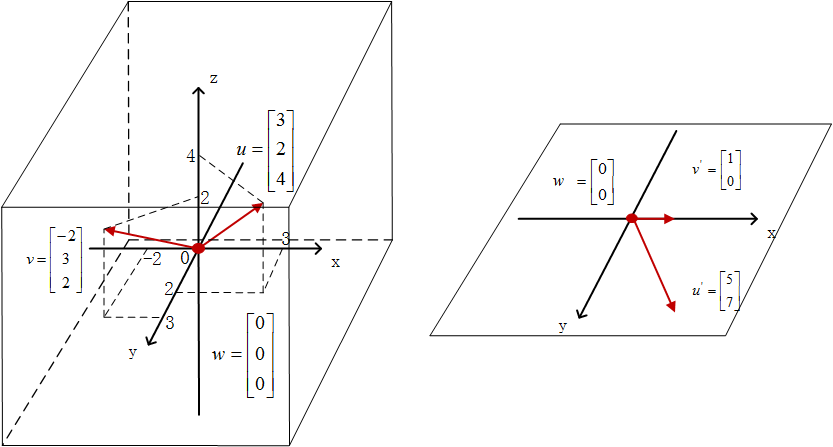
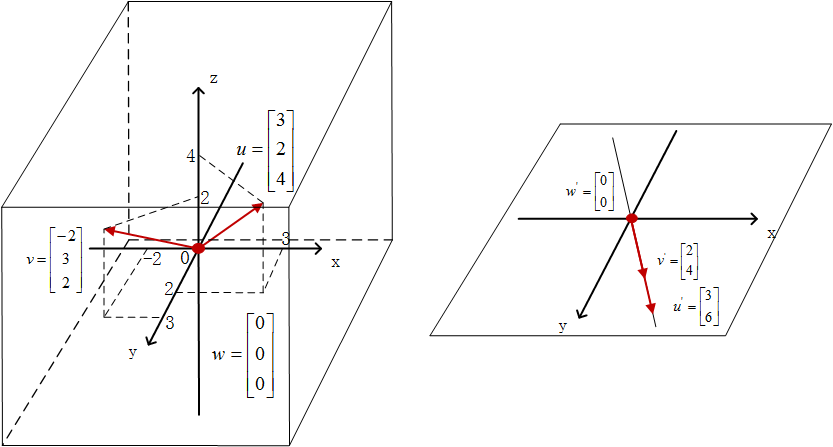
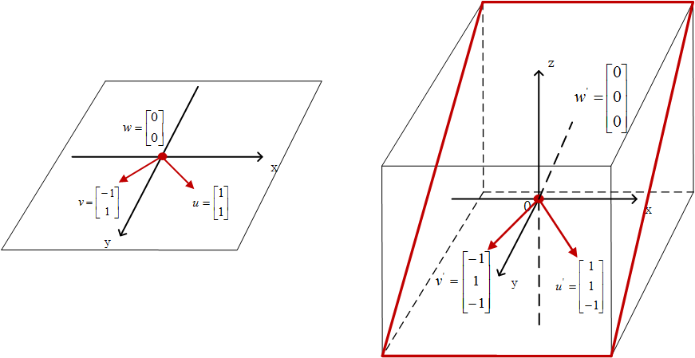
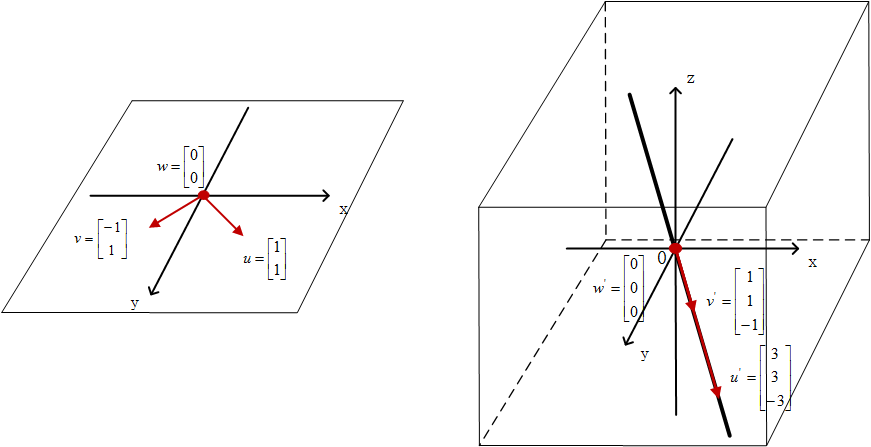
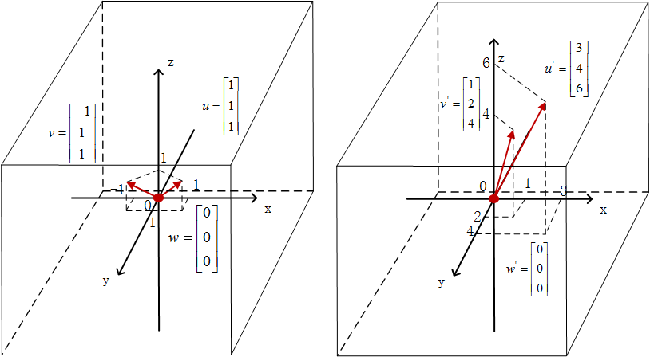

---
tags:
- 数学/线性代数
---

# 03 再论矩阵：空间映射关系的描述

## 1.利用矩阵表示空间映射

回顾上一讲中所讲的内容，在默认基底 $(e_1,e_2,…,e_n)$ 构成的 $R^n$ 空间中，矩阵 $A$ 与列向量 $x$ 的乘法 $Ax$ 的本质就是变换向量的基底。将默认基底中的各基向量 $(e_1,e_2,…,e_n)$ 分别对应的变换为矩阵 $A$ 的各列，由矩阵 $A$ 的各列充当新的“基向量” ，再结合原向量的坐标，得到目标向量在目标空间中的新位置。

总结概况一下：由于矩阵乘法的作用，原始向量的空间位置甚至其所在空间的维度和形态都发生了改变，这便是 **矩阵乘法的空间映射作用**。

我们要着重强调一下：在第一段中，我们将基向量打了引号，原因是这种说法并不完全准确。因为我们在上一讲的结尾曾经提到：矩阵 $A$ 的各列向量作为向量 $x$ 默认基底经过转换后的目标向量，由于其在维度和线性相关性方面存在各种不同的情况，因此这组目标向量的张成空间和原始向量所在的空间之间，就会存在多种不同的对应关系。

那么，这一讲里，我们就围绕下面的乘法式子，来重点讨论这个问题：

$$Ax = \begin{bmatrix} a_{11}&a_{12}&...&a_{1n} \\ a_{21}&a_{22}&...&a_{2n}\\ ...&&...\\ a_{m1}&a_{m2}&...&a_{mn} \end{bmatrix}\begin{bmatrix} x_1 \\ x_2\\ ...\\ x_n \end{bmatrix}=x_1 \begin{bmatrix} a_{11} \\ a_{21}\\ ...\\ a_{m1} \end{bmatrix}+x_2 \begin{bmatrix} a_{12} \\ a_{22}\\ ...\\ a_{m2} \end{bmatrix}+...+x_n \begin{bmatrix} a_{1n} \\ a_{2n}\\ ...\\ a_{mn} \end{bmatrix}$$

## 2.矮胖矩阵对空间的降维压缩

### 2.1.空间降维的原理

当 $m<n$ 的时候，矩阵是一个外表“矮胖“的矩阵，向量 $x$ 是 $R^n$ 空间中的一个 $n$ 维向量，$x$ 的 $n$ 个基向量 $e_i$ 分别被矩阵 $A$ 映射成了 $n$ 个 $m$ 维向量，由于 $m<n$，这一组目标向量所能张成的空间维数最大就是 $m$。这样一来，在矩阵 $A$ 的作用下，位于 $R^n$ 空间中的任意向量 $x$，经过映射作用，都转换到了一个维数更低的新空间中的新位置。由此我们看出，“矮胖”矩阵 $A$ 压缩了原始空间 $R^n$。

### 2.2.实际举例

说了这么多，可能不够直观。我们用一个 $2 × 3$ 的矩阵 $A$ 来举例：

$$A= \begin{bmatrix} a_{11}& a_{12}& a_{13} \\ a_{21} &a_{22}&a_{23} \end{bmatrix}$$

映射前的原始向量是 $x= \begin{bmatrix} x_1\\x_2\\x_3 \end{bmatrix}$。原始向量 $x$ 是 $R^3$ 空间中的一个三维向量，他采用的是默认的基底：

$$\begin{bmatrix} 1\\0\\0 \end{bmatrix} ,\begin{bmatrix} 0\\1\\0 \end{bmatrix} ,\begin{bmatrix} 0\\0\\1 \end{bmatrix}$$

向量 $x$ 就是基底的任意线性组合中的具体一种。

依照我们介绍的基变换思想，经过矩阵 $A$ 的基变换后，这组默认的基底被映射为了三个目标向量：

$$\begin{bmatrix}a_{11}\\a_{21} \end{bmatrix} ,\begin{bmatrix} a_{12}\\a_{22}\end{bmatrix} ,\begin{bmatrix} a_{13}\\a_{23} \end{bmatrix}$$

映射后的目标向量就相应的变成了：

$$x_1\begin{bmatrix}a_{11}\\a_{21} \end{bmatrix} +x_2\begin{bmatrix} a_{12}\\a_{22}\end{bmatrix}+x_3\begin{bmatrix} a_{13}\\a_{23} \end{bmatrix}$$

映射前的向量 $x$，他的三个成分 $(x_1,x_2,x_3)$ 可以取任意值，因此向量 $x$ 的分布为整个 $R^3$ 空间。那么我们关心的就是映射后的目标向量 $x_1\begin{bmatrix}a_{11}\\a_{21} \end{bmatrix} +x_2\begin{bmatrix} a_{12}\\a_{22}\end{bmatrix} +x_3\begin{bmatrix} a_{13}\\a_{23} \end{bmatrix}$ 的整体分布情况，换句话说就是映射后的空间。

这就回到了张成空间的问题，$3$ 个二维向量必然是线性相关的，但是仍然分两种情况：

**第一种情况是：** 如果这 $3$ 个二维目标向量共面但不共线，那么其所有的线性组合结果就构成二维平面 $R^2$，经过矩阵 $A$ 的映射，整个向量空间就被压缩成了二维，如图 1 所示：



我们按照共面不共线的要求设定一个映射矩阵：

$$A= \begin{bmatrix} 1& 1& 0 \\1 &0&1 \end{bmatrix}$$

并在左侧的 $R^3$ 空间中任取三个向量，$u= \begin{bmatrix} 3 \\2\\4 \end{bmatrix}，v= \begin{bmatrix} -2 \\3\\2 \end{bmatrix}，w= \begin{bmatrix} 0 \\0\\0 \end{bmatrix}$。

在矩阵 $A$ 的作用下，向量 $u$ 映射的结果是：

$$Au= \begin{bmatrix} 1& 1& 0 \\1 &0&1 \end{bmatrix} \begin{bmatrix} 3 \\2\\4 \end{bmatrix} =\begin{bmatrix} 5\\7 \end{bmatrix}$$

向量 $v$ 的映射结果是：

$$Av= \begin{bmatrix} 1& 1& 0 \\1 &0&1 \end{bmatrix} \begin{bmatrix} -2 \\3\\2 \end{bmatrix} =\begin{bmatrix} 1\\0 \end{bmatrix}$$

向量 $w$ 的映射结果最简单，是二维零向量 $\begin{bmatrix} 0\\0 \end{bmatrix}$，我们在图 1 中直观的将其标出，让这个三维空间到二维空间的压缩映射看上去更直观。

**第二种情况：** 如果这 $3$ 个二维向量共线，那么其线性组合就只能分布在二维平面 $R^2$ 中的一条过原点 $(0,0)$ 的直线上，经过矩阵的映射，整个向量空间被压缩成了一维，如图 2 所示：



同样，为了直观演示这个降维压缩的过程，我们选取一个列向量共线的矩阵 $A$：

$$A= \begin{bmatrix} 1& 2& -1 \\2 &4&-2 \end{bmatrix}$$

仍然取上个例子中的三个三维向量：$u= \begin{bmatrix} 3 \\2\\4 \end{bmatrix}，v= \begin{bmatrix} -2 \\3\\2 \end{bmatrix}，w= \begin{bmatrix} 0 \\0\\0 \end{bmatrix}$

向量 $u$ 映射的结果是：

$$Au= \begin{bmatrix} 1& 2& -1 \\2 &4&-2 \end{bmatrix} \begin{bmatrix} 3 \\2\\4 \end{bmatrix} =\begin{bmatrix} 3\\6 \end{bmatrix}$$

向量 $v$ 的映射结果是：

$$Av= \begin{bmatrix} 1& 2& -1 \\2 &4&-2 \end{bmatrix} \begin{bmatrix} -2 \\3\\2 \end{bmatrix} =\begin{bmatrix} 2\\4 \end{bmatrix}$$

向量 $w$ 的映射结果仍然是二维的零向量 $\begin{bmatrix} 0\\0 \end{bmatrix}$ ，我们将其标注在图 2 中，就很清楚的展现出了这种空间压缩的情况。

## 3.高瘦矩阵无法覆盖目标空间

### 3.1.原理：向量信息不增加

现在我们来看看另一种形态的矩阵，即 $m×n$ 矩阵中的 $m>n$ 这种情况，我们称之为“高瘦”矩阵。

$x$ 的 $n$ 个基向量 $e_i$ 分别被矩阵 $A$ 映射成了 $n$ 个 $m$ 维向量，由于 $m>n$，看上去 $x$ 映射后的目标向量的维数提高了，变成了 $m$ 维。那我们能不能说：经过矩阵 $A$ 的映射，原始向量 $x$ 构成的空间 $R^n$ 变成了维数更高的空间 $R^m$ 呢？答案是否定的，哲学点说，一个事物无中生有，那是不可能的，平白无故的一个向量携带的信息怎么能增加呢？

### 3.2.实际举例

当然，这说的有点玄，我们用一个实际的 $3 × 2$ 矩阵来举例：

$$A= \begin{bmatrix} a_{11}& a_{12} \\ a_{21} &a_{22}\\a_{31} & a_{32} \end{bmatrix}$$

映射前的原始向量是二维空间中的 $x= \begin{bmatrix} x_1\\x_2 \end{bmatrix}$。映射的过程是：

$$Ax= \begin{bmatrix} a_{11}& a_{12} \\ a_{21} &a_{22}\\a_{31} & a_{32} \end{bmatrix} \begin{bmatrix} x_1\\x_2 \end{bmatrix}=x_1\begin{bmatrix} a_{11} \\ a_{21} \\a_{31} \end{bmatrix} +x_2\begin{bmatrix} a_{12} \\ a_{22} \\a_{32} \end{bmatrix}$$

由于映射前的向量 $x$ 是二维空间 $R^2$ 中的任意向量，类比一下，$x_1$ 和 $x_2$ 取任意数，因此在矩阵 $A$ 的作用下，整个二维空间的映射结果就是 $\begin{bmatrix} a_{11} \\ a_{21} \\a_{31} \end{bmatrix}$ 和 $\begin{bmatrix} a_{12} \\ a_{22} \\a_{32} \end{bmatrix}$ 这两个向量的张成空间。

是不是同样熟悉？又回到老问题上来了，我们对于 $\begin{bmatrix} a_{11} \\ a_{21} \\a_{31} \end{bmatrix}$ 和 $\begin{bmatrix} a_{12} \\ a_{22} \\a_{32} \end{bmatrix}$ 这两个三维向量，同样是分两种情况：

**第一种情况是：** 两个向量线性无关，那么张成空间就是一个二维平面，这里需要注意一下，这个二维平面不是一个前面见过的由 $x$ 轴和 $y$ 轴构成的 $R^2$ 平面，而是一个“斜搭”在三维空间中的二维平面，构成平面的每一个点都是三维的，而这个二维平面的具体形态，则和这两个三维向量的具体值选取密切相关。

我们仍然举一个实际的例子，

$$A= \begin{bmatrix}1& 0 \\0 &1\\0 & -1 \end{bmatrix}$$

我们还是在原空间 $R^2$ 内选取三个向量进行映射： $u=\begin{bmatrix} 1\\1 \end{bmatrix}，v=\begin{bmatrix} -1\\1 \end{bmatrix}，w=\begin{bmatrix} 0\\0 \end{bmatrix}$

映射后的结果分别是：

$$Au= \begin{bmatrix}1& 0 \\0 &1\\0 & -1 \end{bmatrix}\begin{bmatrix} 1\\1 \end{bmatrix}=\begin{bmatrix} 1\\1\\-1 \end{bmatrix}，Av= \begin{bmatrix}1& 0 \\0 &1\\0 & -1 \end{bmatrix}\begin{bmatrix} -1\\1 \end{bmatrix}=\begin{bmatrix} -1\\1\\-1 \end{bmatrix}$$

而向量 $w$ 经过矩阵映射后，仍是三维空间中的 $0$ 向量，如图 3 所示：



**我们再讨论第二种情况**：如果两个向量线性相关，那么张成空间就是一条直线，那么同样的，这个直线是经过零点，并“斜穿”过三维空间 $R^3$ 的一条直线。

我们举一个实例：

$$A= \begin{bmatrix}1& 2 \\1 &2\\-1 &-2 \end{bmatrix}$$

我们仍然选取上文中的三个向量进行映射： $u=\begin{bmatrix} 1\\1 \end{bmatrix}，v=\begin{bmatrix} -1\\1 \end{bmatrix}，w=\begin{bmatrix} 0\\0 \end{bmatrix}$

映射后的结果分别是：

$$Au= \begin{bmatrix}1& 2 \\1 &2\\-1 & -2 \end{bmatrix}\begin{bmatrix} 1\\1 \end{bmatrix}=\begin{bmatrix} 3\\3\\-3 \end{bmatrix}，Av= \begin{bmatrix}1& 2\\1 &2\\-1 & -2 \end{bmatrix}\begin{bmatrix} -1\\1 \end{bmatrix}=\begin{bmatrix} 1\\1\\-1 \end{bmatrix}$$

而向量 $w$ 经过矩阵映射后，仍是三维空间中的 $0$ 向量，如图 4 所示：



## 4.分多种情况的方阵映射

至于说如果矩阵 $A$ 是一个 $n$ 阶方阵，分析方法也是一样的，核心问题仍然是分析 $A$ 的各列向量的线性相关性，我们很容易发现，$R^n$ 空间中的向量经过矩阵 $A$ 的映射，其目标空间的维度就是这 $n$ 个 $n$ 维列向量的张成空间的维度，其映射空间的维度必然小于等于 $n$。

我们简单的举 $3$ 阶方阵 $A$ 来举例：

$$Ax= \begin{bmatrix} a_{11}& a_{12}&a_{13} \\ a_{21} &a_{22}&a_{23}\\a_{31} & a_{32} &a_{33}\end{bmatrix} \begin{bmatrix} x_1\\x_2\\x_3 \end{bmatrix}=x_1\begin{bmatrix} a_{11} \\ a_{21} \\a_{31} \end{bmatrix} +x_2\begin{bmatrix} a_{12} \\ a_{22} \\a_{32} \end{bmatrix} +x_3\begin{bmatrix} a_{13} \\ a_{23} \\a_{33} \end{bmatrix}$$

当矩阵 $A$ 的三个列向量线性无关的时候，意味着原始向量 $x$ 的基经过映射后的目标向量仍然可以构成三维空间 $R^3$ 的一组基。这是非常好的一种情况，意味着原始空间 $R^3$ 经过矩阵 $A$ 的映射，其映射后得到的空间仍然是等维的 $R^3$ 空间。 原始向量空间在这个过程中没有被压缩，并且映射后空间内的每一个向量也都能找到对应的原始向量。这种一一映射的关系我们在后面讲逆映射、逆矩阵的时候还会反复讨论，这里先有一个整体印象就好。

我们举实际的例子：

$$A= \begin{bmatrix} 1& 1&1 \\ 1 &1&2\\1 & 2 &3\end{bmatrix}$$

原始向量：

$$u= \begin{bmatrix} 1 \\ 1 \\1 \end{bmatrix}，v= \begin{bmatrix} -1 \\ 1 \\1 \end{bmatrix}，w= \begin{bmatrix} 0 \\ 0 \\0 \end{bmatrix}$$

映射后的结果：

$$Au= \begin{bmatrix} 1& 1&1 \\ 1 &1&2\\1 & 2 &3\end{bmatrix} \begin{bmatrix} 1 \\ 1 \\1 \end{bmatrix}= \begin{bmatrix} 3 \\ 4 \\6 \end{bmatrix}，Av= \begin{bmatrix} 1& 1&1 \\ 1 &1&2\\1 & 2 &3\end{bmatrix} \begin{bmatrix} -1 \\ 1 \\1 \end{bmatrix} \begin{bmatrix} 1 \\ 2 \\4 \end{bmatrix}$$

零向量 $w$ 映射后的结果仍然是零向量，如图 5 所示。



而当 $A$ 的三个列向量线性相关的时候，其实就退化成“高瘦”矩阵里所讨论的情况了，由于之前详细用图分析过具体情形，我们这里就只需要简单的说明结论，相信大家很容易理解。

**情况一：** 当这三个列向量共面但不共线的时候，$R^3$ 空间中的向量经过映射，最后分布在“搭”在三维空间 $R^3$ 中的一个平面上。

**情况二：** 当这三个列向量共线的时候，$R^3$ 空间中的向量经过映射，最后分布在“穿”过三维空间 $R^3$ 中的一条直线上。

这些都是非常熟悉的场景了吧。

## 5.空间映射形态的决定因素

### 5.1.矩阵的秩

这一节里，我们举了这么多例子，画了这么多的图，是时候来提炼一些东西了，我们把一个空间经过矩阵映射后得到的新空间称之为他的**像空间**。我们发现，一个原始空间，经过几个形状相同的矩阵进行映射，像空间的维数可能不同；经过几个不同形状的矩阵进行映射，又有可能得到维数相同的像空间。那么决定因素是什么？

决定因素就是空间映射矩阵的列向量，列向量张成空间的维数就是原始空间映射后的像空间维数。我们给矩阵列向量的张成空间维数取了一个名字，就叫作：**矩阵的秩**。从另一方面看，秩也可以说是该矩阵线性无关的列的个数。

### 5.2.用 Python 求解矩阵的秩

道理懂了这么多，在这一讲的最后我们动手解决一下实际的问题，如何用 Python 求解矩阵的秩？

我们一边回顾这一节出现的 $5$ 个典型矩阵，一边来求他们的秩：

$A_{1}= \begin{bmatrix} 1& 1& 0 \\1 &0&1 \end{bmatrix}$，矩阵 $A_1$ 的列的张成空间维数是 $2$，因此矩阵 $A_1$ 的秩是 $2$。

$A_2= \begin{bmatrix} 1& 2& -1 \\2 &4&-2 \end{bmatrix}$，矩阵 $A_2$ 的列的张成空间维数是 $1$，因此矩阵 $A_2$ 的秩是 $1$。

$A_3= \begin{bmatrix}1& 0 \\0 &1\\0 & -1 \end{bmatrix}$，矩阵 $A_3$ 的列的张成空间维数是 $2$，因此矩阵 $A_3$ 的秩是 $2$。

$A_4= \begin{bmatrix}1& 2 \\1 &2\\-1 &-2 \end{bmatrix}$，矩阵 $A_4$ 的列的张成空间维数是 $1$，因此矩阵 $A_4$ 的秩是 $1$。

$A_5= \begin{bmatrix} 1& 1&1 \\ 1 &1&2\\1 & 2 &3\end{bmatrix}$，矩阵 $A_5$ 的列的张成空间维数是 $3$，因此矩阵 $A_4$ 的秩是 $3$。

我们用代码验证一下：

**代码片段：**

```python
import numpy as np

A_1 = np.array([[1, 1, 0],
              [1, 0, 1]])

A_2 = np.array([[1, 2, -1],
              [2, 4, -2]])

A_3 = np.array([[1, 0],
              [0, 1],
              [0, -1]])

A_4 = np.array([[1, 2],
              [1, 2],
              [-1, -2]])

A_5 = np.array([[1, 1, 1],
              [1, 1, 2],
              [1, 2, 3]])

print(np.linalg.matrix_rank(A_1))
print(np.linalg.matrix_rank(A_2))
print(np.linalg.matrix_rank(A_3))
print(np.linalg.matrix_rank(A_4))
print(np.linalg.matrix_rank(A_5))
```

**运行结果：**

```
2
1
2
1
3
```

经过验证，程序结果和我们的分析一致。在这一讲里，我们通过大量细致的举例，展现了空间在不同秩的矩阵映射下得到的不同形态，并分析了其决定因素。这部分的基础非常重要，建立好了这个概念将非常有助于我们加深对逆矩阵、线性方程组和投影相关内容的本质理解。