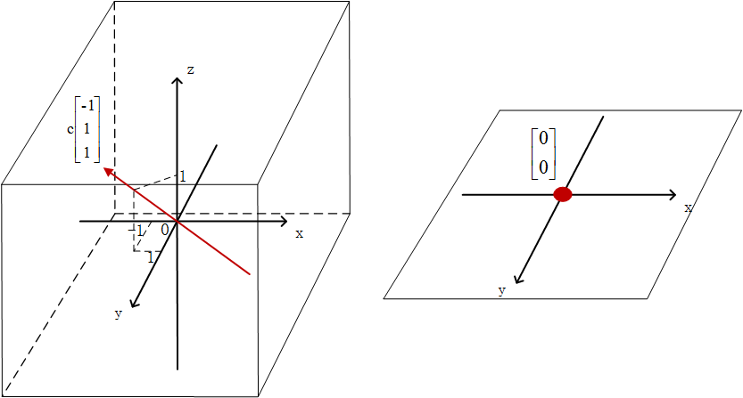
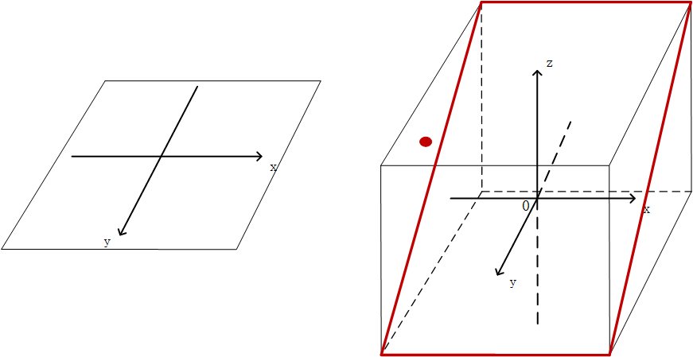
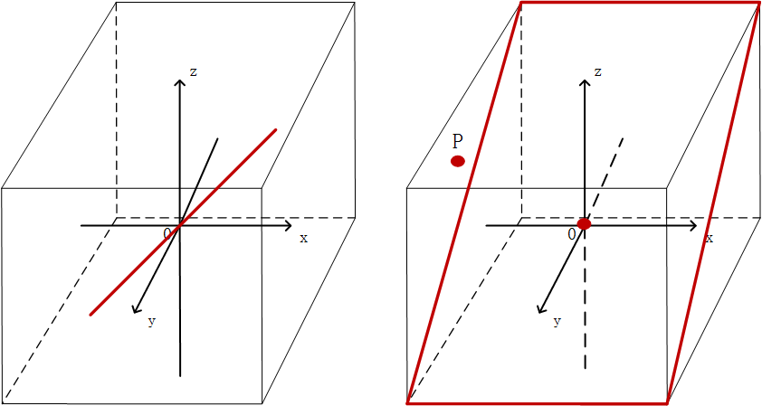

---
tags:
- 数学/线性代数
---

# 04 由果寻因：谈谈逆映射与逆矩阵

## 1.分析映射的逆过程

### 1.1.说说逆矩阵

在前面的内容中，我们反复讲矩阵的本质是映射。对于一个 $m × n$ 的矩阵，乘法 $y=Ax$ 的作用就是将向量从 $n$ 维原空间中的 $x$ 坐标位置，映射到 $m$ 维目标空间的 $y$ 坐标位置，这是正向映射的过程。那么，如果已知结果向量的坐标 $y$ 去反推原向量的坐标 $x$，这个过程就称之为**逆映射**，因为逆映射也是一种映射过程，因此表征逆映射的矩阵，我们称之为：$A^{-1}$。

### 1.2.和反函数进行类比

为了更直观的说明问题，我们在深入讨论逆映射、逆矩阵之前，先来说说函数映射的逆过程：反函数的相关问题。

我们来看最简单的一次函数：$y=f(x)=ax+b$，$x$ 的取值范围为整个实数域，指定某个具体的 $x$，我们就能得到对应的 $y$，$y$ 的取值范围也是整个实数域。那么反过来，我们看看其反函数的形式：$x=f^{-1}(y)=\frac{y-b}{a}$，试图通过结果 $y$，来找到对应的 $x$。但是，我们知道这有一个重要的前提条件，就是 $a \ne 0$。

也就是说，我们通过 $y=ax+b$ ，实现了从 $x$ 到 $y$ 的映射，但是必须基于 $a \ne 0$ 的前提条件下，我们才能通过 $x=\frac{y-b}{a}$，将 $y$ 重新映射回 $x$。因为当 $a=0$ 时，$y=0x+b$，此时正方向上的映射 $x\Rightarrow y$ 仍然存在，无论 $x$ 取任何数，最终的映射结果都是 $y=b$，但是反方向 $y\Rightarrow x$ 的映射就不存在了，一方面当 $y=b$ 的时候，有无穷多种 $x$ 的取值可能，显然无法完成映射。另一方面，当 $y\ne b$ 的时候，找不到满足等式条件的 $x$ 值，因此映射也是不存在的。

### 1.3.引申到矩阵映射

上面的这个例子很简单，相信大家都是再明白不过了，函数存在反函数的条件就是满足一一映射，我举这个例子的原因就是想将其引申到矩阵对向量所在空间映射的问题上，对比讨论矩阵映射的逆问题。

我们潜意识里一定会想，肯定不是每个矩阵表示的映射都有逆映射，不是每一个矩阵都存在逆矩阵。

## 2.矮胖矩阵（列>行）的映射不可逆

### 2.1.映射压缩了空间

第一种情况是矩阵 $A$ 将向量 $x=\begin{bmatrix} x_{1},x_{2},…,x_{n}\end{bmatrix} ^{T}$ 映射到 $y=\begin{bmatrix}y_{1},y_{2},…,y_{m}\end{bmatrix} ^{T}$ ，其中 $n>m$，即映射的矩阵 $A_{m\times n}$ 是一个列数大于行数的矮胖矩阵。

我们举个实际的例子，即 $A$ 是一个 $3×2$ 的矩阵，我们上一节讨论过，如果矩阵 $A$ 的三个列向量共面不共线，则该矩阵将一个 $R^3$ 空间压缩成一个二维平面，如果三个列向量共线，则经过映射最终将其压缩成一条直线。

这种映射的本质是将 $x$ 所在的三维空间，映射到 $y$ 所在的二维空间（或者是一维空间），对应了压缩扁平化的操作，你仔细想想什么是**压扁了**这个概念，即有多个 $x$ 会被转移到同一个 $y$ 上。

我们用一个例子来描述一下压缩这个过程，我们还是用上一讲中的矩阵：$A=\begin{bmatrix} 1& 1&0 \\ 1 &0&1 \end{bmatrix}$，我们聚焦映射后目标空间中的零向量：$y=\begin{bmatrix}0 \\ 0 \end{bmatrix}$，看看原空间中有多少向量会被映射到那。

即：

$$Ax=\begin{bmatrix} 1& 1&0 \\ 1 &0&1 \end{bmatrix} \begin{bmatrix}x_1 \\ x_2\\x_3 \end{bmatrix} = \begin{bmatrix}0 \\ 0 \end{bmatrix}$$

展开得到：

$x_1+x_2=0$
$x_1+x_3=0$

处理一下，即在原始空间 $R^3$ 中，各成分满足 $x_2=x_3=-x_1$ 的向量（我们记作：$c\begin{bmatrix}-1 \\ 1\\1 \end{bmatrix}$），经过矩阵 $A$ 的映射，都能映射到目标空间的原点上。显而易见，原始空间里满足这个条件的向量有无穷多个，如图 1 所示，他们分布在一条直线上。



这个图里揭示了一个显而易见的现象：已知映射后在二维目标空间中的点 $y$，想寻找原空间中的出发点 $x$ 在哪里？你是无法判断出的。在上图中我们可以看出，目标空间中的原点，其对应的原空间里的出发点 $x$ 可以是直线上的任意一点，但是具体是哪一个？对不起，不知道。因为，在映射过程中空间被矩阵 $A$ 给压缩了，换句话说，一些信息在这个压缩映射的过程中丢失了，因此再也回不去了，所以这种形态的矩阵 $A$ 所表示的映射是不存在逆映射的，矩阵 $A$ 也没有逆矩阵。

### 2.2.零空间的概念

我们由此引出一个概念，对于给定的矩阵 $A$，在映射的作用下满足 $Ax=0$ 的 $x$ 的集合称为 $A$ 零空间，记作：$N(A)$。在上面的那个例子中，满足 $Ax=0$ 的 $x$ 分布在一条直线上，因此 $N(A)$ 的维度是 $1$ 维的。

而对比着看，如果一个矩阵 $A$ 存在着逆映射，则意味着其映射后的点是要能被唯一还原的，因此显然零空间 $N(A)$ 对应的不能是一维直线、二维平面，而只能是一个点，也就是原始空间中的 $0$ 向量，即如果一个矩阵可逆，他的 $N(A)$ 必须是 $0$ 维的。

## 3.“高瘦”矩阵（行>列）的映射不可逆

### 3.1.目标空间无法被完全覆盖

“矮胖”矩阵在映射过程中，压缩了空间，丢失了信息，因此这个映射可谓是再也回不去了。那我们再看，如果映射的结果向量 $y$ 的维度大于原空间向量 $x$ 的维度，例如在矩阵 $\begin{bmatrix} 1 & 0\\ 0 &1\\0&-1\end{bmatrix}$ 的作用下，将一个二维向量映射成一个三维向量，又是一个什么情况呢？

表面上看，我们似乎没有压缩空间，反而是把一个二维向量扩充成了三维向量，信息量应该更大了。直观上看，目标空间的点肯定能逆映射回原空间找到出发点。实际上一定能做到么？并不能，因为我们是把二维空间映射到一个三维空间，而仅凭二维空间的信息量就想把三维空间全部覆盖，根本不可能，最终的映射效果如图 2 所示，我们之前也都分析过。



从表面数字上看，之前的一个二维空间被映射到了三维空间里，但实际上我们发现，映射的结果实质上是一个“倾斜”的搭在三维空间中的一个面，他是二维的。那么这个二维平面外的任意一点，都无法找到原空间中对应的出发点，因此高瘦矩阵的逆映射自然也是不存在的。

### 3.2.列空间的概念

从这个例子中，我们又引出一个空间的概念，叫列空间。一个原始空间经过矩阵映射得到的对应空间，本质上就是该矩阵各列所有线性组合的结果，我们称之为列空间 $C(A)$。在这个 $3×2$ 的矩阵 $A= \begin{bmatrix} 1 & 0\\ 0 &1\\0&-1\end{bmatrix}$ 的例子中，映射的目标空间是三维的 $R^3$ 空间，而列空间是 $R^3$ 中的一个二维平面。

## 4.方阵逆映射的讨论

### 4.1.逆映射存在的前提是方阵

从上面两部分里我们可以得出结论，“矮胖”矩阵和“高瘦”矩阵所表示的映射，肯定是不存在逆映射的。逆映射存在的前提条件是矩阵必须是方阵。

### 4.2.并非每个方阵都存在逆映射

说到这里，其实大家都已经心理有一种感觉了，那就是从方阵列向量的线性相关性入手进行分析，是不是感觉已经是老生常谈了。

我们假设有一个三阶方阵 $A$，当方阵的三个列向量线性相关时，矩阵映射 $Ax = y$，映射后向量 $y$ 的分布就是矩阵 $A$ 的列空间：斜搭在 $R^3$ 空间中的一个平面或者是斜穿过 $R^3$ 空间中的一条直线。从逆矩阵的角度而言，这种情形其实是很糟糕的，因为他结合了“矮胖”矩阵和“高瘦”矩阵的缺点，我们重点分析一下列空间是二维平面的情况：

当三阶方阵 $A$ 的三个列向量共面而不共线时，他的秩为 $2$。$A$ 的列空间是一个斜搭在目标空间 $R^3$ 中的二维平面，如图 3 所示，此时位于列空间—这个二维平面上的向量，对应于原空间中的向量有无数多个。我们还是聚焦目标空间中的 $0$ 向量，原空间中满足 $Ax=0$ 映射关系的所有 $x$ 向量分布在一条一维直线上，从这个角度来说，逆映射就不存在。

当然，这还没有结束。因为 $A$ 是一个三阶方阵，他的目标空间是一个三维的 $R^3$ 空间，但是列空间只是其中的一个二维平面，那么位于目标空间中、列空间外的点（例如点 $P$），我们就无法在原空间中找到一个可以映射过来的对应点。从这个角度来说，逆映射同样不存在。



如果 $A$ 的列空间是一条直线，道理也是类似，就不具体展开了。

## 5.终极：逆矩阵存在的条件

上面所有的这些例子都在反复告诉我们：逆矩阵存在的条件首先得是方阵，其次又举例说明了，不一定所有的方阵都存在逆矩阵。那么终极问题就是：什么样的方阵才有逆矩阵和逆映射呢？

那么，我们来探索一下逆矩阵存在的条件。

### 5.1.空间压缩映射：列向量线性相关

回顾刚才我们举的那个例子，在一个三阶方阵 $A$ 的映射作用下，一个三维 $R^3$ 空间被压缩扁平化成了一个平面。物理意义便是：把原空间中不同的向量 $x$ 和 $x^{'}$ 通过矩阵 $A$ 映射到目标空间中相同的目标向量 $y$。

我们拓展到一般化的情境下，用数学语言来描述这个过程就是：

$$x=\begin{bmatrix} x_{1},x_{2},…,x_{n}\end{bmatrix} ^{T}，x^{'}=\begin{bmatrix} x_{1}^{'},x_{2}^{'},…,x_{n}^{'}\end{bmatrix} ^{T}，A=\begin{bmatrix} a_{1},a_{2},…,a_{n}\end{bmatrix}$$

其中 $a_{i}$ 是列向量。

那么就有：$Ax=Ax^{'}$，展开来看就是：

$$\begin{bmatrix} a_{1},a_{2},…,a_{n} \end{bmatrix} \begin{bmatrix}x_{1} \\ x_{2} \\ .\\.\\ .\\x_{3} \end{bmatrix} = \begin{bmatrix} a_{1},a_{2},…,a_{n} \end{bmatrix} \begin{bmatrix}x_{1} ^{'}\\ x_{2} ^{'}\\ .\\.\\ .\\x_{3} ^{'} \end{bmatrix}$$

我们利用矩阵乘法的法则进一步进行展开，发现：

$$x_{1}a_{1}+x_{2}a_{2}+…+x_{n}a_{n}=x_{1}^{'}a_{1}+x_{2}^{'}a_{2}+…+x_{n}^{'}a_{n}$$ $$\Downarrow$$
$$(x_{1}-x_{1}^{'})a_{1}+(x_{2}-x_{2}^{'})a_{2}+…+(x_{n}-x_{n}^{'})a_{n}=o$$
$$\Downarrow$$
$$u_{1}a_{1}+u_{2}a_{2}+…+u_{n}a_{n}=o$$

我们发现，我们之前定义了 $x$ 和 $x^{'}$ 是不同的向量，即 $x$ 和 $x^{'}$ 的各坐标不全相等，换句话说就是 $\begin{bmatrix} u_{1},u_{2},…,u_{n} \end{bmatrix} \ne o$ ， 此时仍然可以使得等式成立。于是很简单的有了下面的式子：

$$u_{1}a_{1}=-u_{2}a_{2}-…-u_{n}a_{n}$$

$$a_{1}=r_{2}a_{2}+…+r_{n}a_{n}$$

我们似乎越来越清晰了，这时矩阵 $A$ 的列向量 $a_{1}$ 是可以用 $a_{2}…a_{n}$ 的线性组合来表示的，换句话说 $a_{1}$ 存在于 $a_{2}…a_{n}$ 这一组向量所张成的 $n-1$ 维空间里。

### 5.2.本质原因：原基底映射后，张成空间降维了

进一步回忆我们之前所讲的，矩阵与向量的乘法本质上是一种映射，矩阵 $A$ 的各列向量 $\begin{bmatrix} a_{1},a_{2},…,a_{n} \end{bmatrix}$ 就是原向量 $x$ 的 $n$ 个基向量 $e_{1}=\begin{bmatrix} 1,0,…,0 \end{bmatrix} ^{T} , e_{2}=\begin{bmatrix} 0,1,…,0 \end{bmatrix} ^{T} ,…, e_{n}=\begin{bmatrix} 0,0,…,n \end{bmatrix} ^{T}$ 的最终映射目标。

你想想，原来的 $n$ 个基向量经过映射后形成的 $n$ 个目标向量里，某一个组成向量可以用其他 $n-1$ 个线性无关的向量进行组合和表示，那么这 $n$ 个目标向量本质上只能表示 $n-1$ 维的空间了（这 $n$ 个目标向量已经不具备构成基底的条件了），这不正对应着一句话：经过矩阵 $A$ 的映射，构成 $n$ 维空间的基底被映射成了仅能张成 $n-1$ 维空间的目标向量，所能表示的空间不就因此被压缩扁平化了吗？

我们总结一下：在映射方阵 $A$ 中，如果某个列向量 $a_{i}$ 可以写成其他列向量的线性组合，即 $a_{i}=r_{1}a_{1}+…+r_{n}a_{n}$，那么对应的矩阵映射一定是空间压缩的映射，一定不存在逆矩阵。

### 5.3.引出终极结论

综上，方阵 $A$ 的列向量线性相关，对应映射时的空间压缩。反过来 $A$ 的各个列向量线性无关时，映射时空间不会压缩，有逆矩阵存在。

最后我们一览众山小的总结一下逆矩阵存在的条件：

**首先很简单，必须先得是一个方阵**，否则目标空间中的向量要么对应多个原空间中的向量，要么找不到原空间中的向量，换句话说 $y=Ax$ 中对应原空间的点 $x$ 的存在性和唯一性至少有一个被破坏了。在矩阵 $A$ 是 $n$ 阶方阵的前提下，以下条件都与可逆性等价：

1. 矩阵 $A$ 的零空间的维数为 $0$，或列空间的维数为 $n$
2. 列向量 $a_{1},a_{2},a_{3}, … ,a_{n}$ 线性无关

## 6.用 Python 求解逆矩阵

那到底逆矩阵该怎么求呢？用 Python 来求逆矩阵依旧是非常简单的一件事儿。

### 6.1.逆矩阵存在的情况

我们先看一个逆矩阵存在的情况，我们来求逆矩阵，求出后再进行验证，将原矩阵和逆矩阵相乘，可以得到单位矩阵。

**代码片段：**

```python
import numpy as np
from scipy import linalg

A = np.array([[1, 35, 0],
              [0, 2, 3],
              [0, 0, 4]])

A_n = linalg.inv(A)
print(A_n)
print(np.dot(A, A_n))
```

**运行结果：**

```
[[  1.    -17.5    13.125]
 [  0.      0.5    -0.375]
 [  0.      0.      0.25 ]]

[[ 1.  0.  0.]
 [ 0.  1.  0.]
 [ 0.  0.  1.]]
```

### 6.2.矩阵不可逆的情况

我们再换一个不可逆的矩阵试一试，下面的矩阵中 $B=\begin{bmatrix} 1 & 0 &2\\ 0 &1&3\\1&1&5 \end{bmatrix}$，列向量线性相关：$b_{3}=2b_{1}+3b_{2}$。

**代码片段：**

```python
import numpy as np
from scipy import linalg

B = np.array([[1, 0, 2],
              [0, 1, 3],
              [1, 1, 5]])

B_n = linalg.inv(B)
print(B_n)
```

**运行结果：**

```python
Traceback (most recent call last):
  File "E:/test/test.py", line 17, in <module>
    B_n = linalg.inv(B)
  File "C:\Python34\lib\site-packages\scipy\linalg\basic.py", line 976, in inv
    raise LinAlgError("singular matrix")
numpy.linalg.linalg.LinAlgError: singular matrix
```

可以看出程序报错了，信息显示这是一个奇异矩阵（不可逆矩阵也称奇异矩阵），他是不可逆的。

因此我们可以用这个方法去判断一个矩阵是否可逆，并在可逆的前提下可以求取他的逆矩阵。