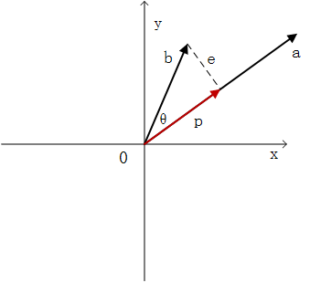
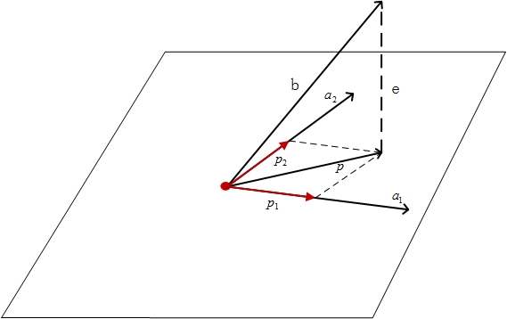

---
tags:
- 数学/线性代数
---

# 07 寻找最近：空间中的向量投影

## 1.从两个实际问题谈起

在近似拟合这一部分内容正式开始之前，我们先抛出两个问题。

### 1.1.如果线性方程组无解怎么办

第一个问题还是关于线性方程组解的问题。

在上一讲里，我们从空间映射的角度分析了线性方程组的解，阐述了在何种情况下有解，并且如何来描述整个解的空间。那么接下来，我们看看下面这个方程组：

$$\begin{aligned}
2x+y=4\\
x+2y=3\\
x+4y=9\\
\end{aligned}$$

很明显，这个方程组没有解。但是我们不能仅仅停留在这里，因为实际工程领域如果出现这种情况，该如何去解决？换句话说，我们如何尽可能的找到一组解 $\begin{bmatrix}x\\y\end{bmatrix}$，使得利用他让方程组左侧得到的结果离右侧 $\begin{bmatrix}4\\3\\9\end{bmatrix}$ 的距离最近？

### 1.2.如果直线无法穿过所有点怎么处理

第二个问题是关于直线拟合的问题。

我们知道在平面上任取两个点，一定能找到一条通过他们的直线。但是如果有三个点、四个点甚至更多呢？比如下面这种情况：

我们在平面上取三个点：$(0,1)$，$(1,4)$，$(2,3)$ ，能找到一条直线同时通过这三个点么？答案是不行。那么该如何解决？我们退一步，能否找到一条直线，距离这三个点的距离最近？

## 2.从投影的角度来定义最近

上面所提到的两个例子，我们的确都没办法获取准确的解。于是我们退而求其次，希望能找到距离结果要求最近的近似解来解决问题。那么，我们该如何定义和描述这个“距离最近”呢？

我们先来看下面这个问题：

在空间中有一个穿过原点的直线，并且沿着向量 $a$ 的方向，在空间中有一个点 $b$，他不在直线上，如何在这条直线找到一个点，使之距离点 $b$ 最近？

这个问题大家会觉得很简单，当然是通过 $b$ 点，向直线做一条垂线就能获得最短距离，其中我们要寻找的点就是垂线与直线的交点。如图 1 所示：

在图中，我们发现向量 $b$ 和向量 $a$ 的夹角是 $\theta$，因此通过 $b$ 点到直线的最近距离是 $|b|sin\theta$。还需要注意到向量 $p$，从原点出发到垂直交点的向量，他是向量 $b$ 在向量 $a$ 上的投影。而向量 $e=b-p$ 我们称之为误差向量，他的长度就是我们要寻找的最近距离。

当然我们也可以用向量点积的方式得到投影向量 $p$ 的长度，然后再进一步通过代数运算得到 $p$ 的坐标表示。这当然没有问题，但是不知道大家想过没有，这是直线的情况，一维空间的计算是非常简单的，如果我们进一步去拓展问题，去讨论向量在二维平面、三维空间甚至是更高维空间中的投影，依靠这种方法就不太合适。所以我们这里借助矩阵工具来描述这个投影的过程。

## 3.利用矩阵工具来描述投影

### 3.1.向一维直线投影

我们接着说，首先来分析如何用矩阵描述向量 $b$ 向一条直线上投影的过程。我们将向量 $a$ 作为这个直线的基向量，向量 $p$ 就可以用 $a$ 来表示，记作：$p=\hat x a$（$\hat x$ 是一个标量），我们的目标就是求取 $\hat x$，投影向量 $p$ 和投影矩阵 $P$。

我们仍然把握一个核心，就是误差向量 $e$ 和基向量 $a$ 的垂直关系，因此有 $a \cdot e=0$，我们进一步展开：

$$a\cdot e = 0 \Rightarrow a\cdot (b-p) = 0 \Rightarrow a \cdot (b-\hat xa)=0$$

此时，我们做一点简单的运算：

$$a \cdot b - \hat x a\cdot a=0 \Rightarrow \hat x = \frac{a \cdot b}{a\cdot a}$$

我们知道：$a \cdot b = a^Tb$，因此最终有：

$$\hat x= \frac{a^Tb}{a^Ta}$$

投影向量也顺势得出：

$$p=\hat xa = \frac{a^Tb}{a^Ta}a$$

最后我们来探索将向量 $b$ 变换到其投影 $p$ 的投影变换矩阵，有一个小技巧：由于 $p=\hat x a$ 是标量与向量的乘法，因此交换一下位置：$p=a\hat x$ 同样成立，于是有

$$p=a\hat x=a\frac{a^Tb}{a^Ta}=\frac{aa^T}{a^Ta}b$$

由此得到投影矩阵

$$P=\frac{aa^T}{a^Ta}$$

### 3.2.一维直线投影举例

我们举一个简单的例子，向量 $a=\begin{bmatrix}1\\2\\3\end{bmatrix}$，我们来寻找向量 $b=\begin{bmatrix}1\\1\\1\end{bmatrix}$ 在该向量上的投影向量 $p$ 以及任意向量向 $a$ 上的投影矩阵 $P$。

我们先来求一下投影向量 $p$，按照公式计算非常容易：

$$\hat x= \frac{a^Tb}{a^Ta}= \frac{\begin{bmatrix}1&2&3\end{bmatrix}\begin{bmatrix}1\\1\\1\end{bmatrix}}{\begin{bmatrix}1&2&3\end{bmatrix}\begin{bmatrix}1\\2\\3\end{bmatrix}}= \frac{3}{7}$$

因此有

$$p=\hat xa= \frac{3}{7}\begin{bmatrix}1\\2\\3\end{bmatrix}$$

接下来我们再求向 $a$ 投影的矩阵 $P$：

直接代入公式：

$$P=\frac{aa^T}{a^Ta}=\frac{\begin{bmatrix}1\\2\\3\end{bmatrix}\begin{bmatrix}1&2&3\end{bmatrix}}{\begin{bmatrix}1&2&3\end{bmatrix}\begin{bmatrix}1\\2\\3\end{bmatrix}}=\frac{1}{14}\begin{bmatrix}1&2&3\\2&4&6\\3&6&9\end{bmatrix}$$

最后，我们来对前后两次运算的结果进行一下检验：

$$p=Pb=\frac{1}{14}\begin{bmatrix}1&2&3\\2&4&6\\3&6&9\end{bmatrix}\begin{bmatrix}1\\1\\1\end{bmatrix}=\frac{1}{14}\begin{bmatrix}6\\12\\18\end{bmatrix}=\frac{3}{7}\begin{bmatrix}1\\2\\3\end{bmatrix}$$

结果一致。

### 3.3.向二维平面投影

接下来，我们将问题拓展到二维平面，这个二维平面不仅仅局限于 $R^2$ 平面，而是空间中任意过原点的二维平面，我们假设这个二维平面是 $R^m$ 的子空间，如果空间中同样有一个向量 $b$，我们想在这个二维平面上寻找一个与之距离最近的向量，那么同理也是去寻找向量 $b$ 在平面上的投影向量 $p$。如图 2 所示：

我们如何去寻找二维平面上的投影向量 $p$ 以及投影矩阵 $P$？

同样，我们去做向量 $b$ 到二维平面的垂线。几何的常识告诉我们，一条直线如果与一条平面垂直，则他与该平面上的所有向量垂直，我们牢牢抓住这一点，选取二维平面上线性无关的两个向量 $a_1$，$a_2$ 作为这个平面的一组基（因为我们假设这个二维平面是 $R^m$ 的子空间，因此，$a_1$ 和 $a_2$ 是 $m$ 维的列向量），由于平面上所有的向量都可以写成这组基 $a_1$ 和 $a_2$ 的线性组合的形式，那么只要保证误差向量 $e$ 与 $a_1$，$a_2$ 分别垂直，就能保证向量 $e$ 与整个平面垂直，向量 $p$ 就是向量 $b$ 在平面上的投影向量。

从直线上的一个向量垂直的表达式拓展到平面上的两个垂直的表达式，我们从下面两个式子入手：$a_1\cdot e=0$ 和 $a_2\cdot e=0$ ，其中，$e=b-p$。

这里的投影向量 $p$ 该如何表示呢？投影向量 $p$ 也在这个平面上，自然也是基向量 $a_1$ 和 $a_2$ 的线性组合，我们记作：$p=p_1+p_2=\hat x_1a_1+\hat x_2a_2$，实质上如果用矩阵来进一步概括的话，我们可以把 $a_1$ 和 $a_2$ 作为矩阵 $A$ 的列向量，即，记作：$A=\begin{bmatrix}a_1&a_2\end{bmatrix}，\hat x=\begin{bmatrix}\hat x_1\\\hat x_2\end{bmatrix}$，因此投影向量可以被概括为：$p=A\hat x$ ，看上去简单清爽。

那么我们结合上面两个向量垂直的等式进一步代入：

$$a_1\cdot e=0 \Rightarrow a_1\cdot (b-p) \Rightarrow a_1^T(b-A\hat x) =0$$

同理也有 $a_2^T(b-A\hat x)=0$ 。

我们把这两个等式结合在一个矩阵乘法里，就有：

$$\begin{bmatrix}a_1^T\\a_2^T\end{bmatrix}(b-A\hat x)=0$$

希望就在眼前了，我们之前曾经让 $A=\begin{bmatrix}a_1&a_2\end{bmatrix}$，那么就有 $A^T=\begin{bmatrix}a_1^T\\a_2^T\end{bmatrix}$。

我们就得到这个关键的等式：

$$A^T(b-A\hat x)=0 \Rightarrow A^TA\hat x=A^Tb$$

此时问题来了，进一步该如何处理呢？

假设这个二维平面是 $R^m$ 空间中的一个子空间，那么 $a_1$ 和 $a_2$ 都是 $m$ 维列向量（显然 $m\geq 2$），因此矩阵 $A$ 就是一个 $m×2$ 且两列线性无关的矩阵。因此 $A^TA$ 的结果是一个二阶可逆方阵，二阶方阵肯定是毫无疑问的，至于说为什么可逆，我们文末补充证明给大家看，这里我们先用这个结论。

因此最终有：$\hat x=(A^TA)^{-1}A^Tb$，这里我们要着重强调一下，单独的矩阵 $A$ 和 $A^T$ 首先连方阵都不一定能保证，因此不能对他们单独讨论可逆性。一定要将可逆操作施加在 $(A^TA)$ 这个整体上。

后面是顺水推舟的过程，投影向量 $p$ 的表示方法是：

$$p=A\hat x=A(A^TA)^{-1}A^Tb$$

从投影矩阵 $P$ 的角度来看，有 $p=Pb$，因此，$P=A\hat x=A(A^TA)^{-1}A^T$，从维度来判断，他是一个 $m$ 阶的方阵。

### 3.4.二维平面投影举例

我们也举一个简单的例子：

空间中有个一个向量 $b=\begin{bmatrix}3\\0\\0\end{bmatrix}$ ，投影平面的基是：$\begin{bmatrix}1\\2\\3\end{bmatrix}$ 和 $\begin{bmatrix}0\\1\\1\end{bmatrix}$。我们求一下投影向量 $p$ 和投影矩阵 $P$。

我们这里就直接运用公式即可：

我们将两个基向量成作为矩阵 $A$ 的列向量：

$$A=\begin{bmatrix}1&0\\2&1\\3&1\end{bmatrix}$$

其中

$$A^TA=\begin{bmatrix}1&2&3\\0&1&1\end{bmatrix}\begin{bmatrix}1&0\\2&1\\3&1\end{bmatrix}=\begin{bmatrix}14&5\\5&2\end{bmatrix}$$

$$(A^TA)^{-1}=\begin{bmatrix}14&5\\5&2\end{bmatrix}^{-1}=\frac{1}{3}\begin{bmatrix}2&-5\\-5&14\end{bmatrix}$$

$$P=A\hat x=A(A^TA)^{-1}A^T=\frac{1}{3}\begin{bmatrix}1&0\\2&1\\3&1\end{bmatrix}\begin{bmatrix}2&-5\\-5&14\end{bmatrix}\begin{bmatrix}1&2&3\\0&1&1\end{bmatrix}=\frac{1}{3}\begin{bmatrix}2&-1&1\\-1&2&1\\1&1&2\end{bmatrix}$$

得到了投影矩阵，那投影向量也是顺手拈来：

$$p=Pb=\frac{1}{3}\begin{bmatrix}2&-1&1\\-1&2&1\\1&1&2\end{bmatrix}\begin{bmatrix}3\\0\\0\end{bmatrix}=\begin{bmatrix}2\\-1\\1\end{bmatrix}$$

### 3.5.向 $n$ 维子空间投影的一般情况

有了向 $2$ 维平面投影的推导过程，其实向 $R^m$ 空间中的 $n$ 维子空间投影这个一般化的问题，就非常简单了。其核心仍然是原始向量 $b$ 与投影向量 $p$ 的向量之差：即误差向量 $e=b-p$ 与这个 $n$ 维子空间垂直。

然后问题转化为在这个 $n$ 维子空间中寻找 $n$ 个线性无关的向量 $a_1,a_2,a_3,…,a_n$ 作为这个子空间的一组基，然后使得向量 $e$ 与这一组基向量分别垂直。这和二维的情况可以说是一模一样，只不过基向量的个数增加了：

首先满足：

$$a_1\cdot e=0,a_2\cdot e=0,…,a_n\cdot e=0$$

然后投影向量依旧表示为这组基的线性组合：

$$p=\hat x_1 a_1+\hat x_2 a_2+\hat x_3 a_3+…\hat x_n a_n$$

我们依旧分别用矩阵来表示：$A=\begin{bmatrix}a_1&a_2&…&a_n\end{bmatrix}$，$\hat x=\begin{bmatrix}\hat x_1\\\hat x_2\\…\\\hat x _n\end{bmatrix}$，投影向量 $p$ 也依旧写成 $p=A\hat x$，依然是：$e=b-A\hat x$。

最终我们把 $n$ 个 $a_k\cdot e=0\Rightarrow a_k^T(b-A\hat x)$ 的式子统一起来：

$$\begin{bmatrix}a_1^T\\a_2^T\\…\\a_n^T\end{bmatrix}(b-A\hat x)=0$$

之后的过程也都是一模一样：$A^T(b-A\hat x)=0 \Rightarrow A^TA\hat x=A^Tb$，此时 $A$ 是一个 $m×n$ 的矩阵，由于这是一个 $R^m$ 中的 $n$ 维子空间，因此必然有 $m \geq n$，所以同样有结论：$A^TA$ 是 $n$ 阶可逆方阵。

最终的计算结果和二维平面投影是一模一样的（其实二维平面就是 $n$ 维子空间的一种情况罢了），我们直接照抄二维空间情况下得到的结果。

$$\begin{aligned}
\hat x=(A^TA)^{-1}A^Tb\\
p=Pb=A\hat x=A(A^TA)^{-1}A^Tb\\
P=A(A^TA)^{-1}A^T\\
\end{aligned}$$

## 4.补充讨论：$A^TA$ 的可逆性问题

最后我们简单的证明一下 $A^TA$ 是可逆方阵，由于矩阵 $A$ 的各列线性无关，因此 $A$ 是列满秩矩阵，其零空间 $N(A)$ 就是一个 $0$ 向量，如果我们能证明 $A^TA$ 的零空间和矩阵 $A$ 的零空间一致，那么就能知道 $A^TA$ 也是满秩方阵，即可逆。

我们先看 $A \Rightarrow A^TA$ 这个方向，如果 $Ax=0$，那么 $A^T(Ax)=0$ 必然成立，于是就有 $(A^TA)x=0$。

再看 $A^TA \Rightarrow A$ 这个方向，如果 $(A^TA)x=0$，那么 $x^TA^TAx=0$，稍微处理一下：$(Ax)^TAx=0$，即得出了 $Ax=0$。

因此得到了上述结论。其实我还要预告一下，$A^TA$ 这个运算形式非常重要，他的一些性质将在后面的内容中再次出现。

## 5.回顾前面提出的问题

在这一讲当中，我们针对开篇提到的两个无解的问题，定义了“最近”的概念，并且讨论了如何通过子空间的投影去寻找“最近”的向量。当然看到这里，还不能完全解决这两个问题，我们在下一讲继续来解决这个问题。