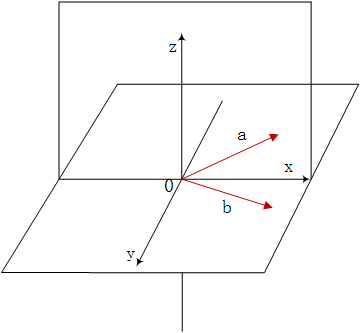
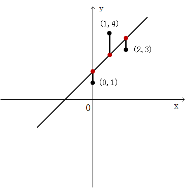
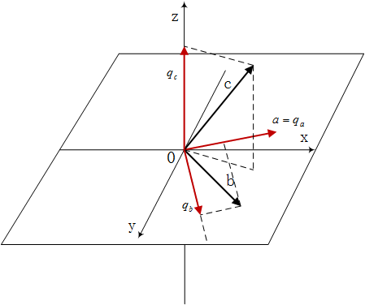

---
tags:
- 数学/线性代数
---

# 08 最小二乘：投影的本质与方法技巧

在上一讲，我们学习了如何将一个向量向空间中任意一个子空间进行投影，那么这一讲我们重点关注向哪投影，即如何选择投影子空间的问题，并介绍运用这一思想的最小二乘近似法。

## 1.互补的子空间

我们知道，在一个 $R^m$ 空间中有一个向量 $b$，我们可以选取 $m$ 个线性无关的向量 $a_1$，$a_2$，…，$a_m$，我们将向量 $b$ 向每个基向量上进行投影，我们得到了 $m$ 个投影向量 $p_1$，$p_2$，…，$p_m$，并且显而易见的是，他们满足：$b=p_1+p_2+…+p_m$ ，即空间中所有的投影轴上的投影向量能重构出向量 $b$ 的完整信息。

从这个浅显的结论中我们能得到什么呢？我们举一个 $R^3$ 空间来仔细看看，我们选取其中三个线性无关的向量 $a_1$，$a_2$，$a_3$ 构成一组基，向量 $b$ 在各基向量上的投影分别为 $p_1$，$p_2$，$p_3$，这个不用多说。如果此时我们把 $a_1$ 和 $a_2$ 看做是一个二维子空间的基，$b$ 向这个平面上的投影就是其向 $a_1$ 和 $a_2$ 的投影向量之和：$p_1+p_2$，此时 $a_1$ 和 $a_2$ 所张成平面上的投影以及 $a_3$ 上的投影一道，同样能构建出整个 $b$ 向量。

因此，在 $R^3$ 空间中，基向量 $a_1$ 和 $a_2$ 张成的二维子空间和 $a_3$ 构成的一维子空间之间是互补的关系。概况的说，互补的子空间一方面由不同的基向量所张成，另一方面他们的维数之和为整个 $R^m$ 空间的维数。空间中的任意一个向量 $b$ 在互补的子空间上的投影向量之和，就是向量自身。

## 2.正交的子空间

对于正交的子空间，我们这里直接拿出定义：子空间 $V$ 和子空间 $W$ 正交成立的条件是，子空间 $V$ 中任意一个向量 $v$ 和子空间 $W$ 中任意一个向量 $w$ 都垂直。

为了更明确的说清这个概念，这里我们看看图 1：



其实从直觉上我们会觉得，$xoz$ 和 $xoy$ 这两个子空间是垂直的，但是实际上并不是，我们对照一下定义，这两个子空间中的任意向量两两并不一定垂直，例如向量 $a$ 和向量 $b$。其实最明显的一个矛盾之处在于：位于 $x$ 轴正方向上的向量同时存在于这两个子空间中，那么依据定义他应该与自己垂直，但是这显然是不可能的。因此，我们从这个例子中可以得到，同时位于相互正交的两个子空间上的向量只能是 $0$ 向量，只有 $0$ 向量才和自身垂直。

那么在上面的图 1 中，和子空间 $xoz$ 正交的子空间只能是 $z$ 轴这个一维子空间了。

## 3.相互正交补的子空间

$R^m$ 中的两个互补的子空间，如果满足相互正交的关系，则他们满足正交补的关系。他们的空间维数之和应该为 $m$ 。在上面的图 1 中，$z$ 轴和 $xoy$ 就是满足正交补关系的两个子空间，但是像 $x$ 轴和 $z$ 轴他们仅仅是正交，但并不互补。

你可能在想，说了这么多概念，我们到底想要干什么呢？回顾一下，上一节中，我们在一个子空间中寻找与目标向量 $b$ 最近的投影向量 $p$，前提就是误差向量 $e=b-p$ 与投影向量 $p$ 相互垂直。由于 $b=e+p$ 且 $e\cdot p=0$，则 $p$ 所在的子空间和 $e$ 所在的子空间在 $R^m$ 中就构成了正交补的关系。

那么去哪里去寻找这样的正交补子空间呢？我们从矩阵的四个子空间入手，$m×n$ 的矩阵 $A$，首先所有满足 $Ax=0$ 的向量 $x$ 构成了 $A$ 的零空间 $N(A)$，这个式子，我们展开来看就是：

$Ax=\begin{bmatrix}row_1\\row_2\\…\\row_m\end{bmatrix}x=\begin{bmatrix}0\\0\\…\\0\end{bmatrix}$，即：$row_k \cdot x=0$

表明任意一个行向量与任意一个零向量垂直，因此行空间和零空间是正交子空间，同时我们在前面讲过，这两个子空间的维数之和为 $n$，因此矩阵 $A$ 的行空间和零空间在 $R^n$ 空间中满足正交补的关系。

我们直接利用上面的结论可以知道：$A^T$ 的行空间和零空间当然也是相互正交的，因此 $A$ 的列空间和[[../线性代数/05 封闭小世界：向量空间及其子空间#2 4 左零空间|左零空间]]在 $R^m$ 中满足正交补的关系。

我们找到了这两组满足正交补关系的子空间，那我们是不是就知道了我们该向哪投影了？没错。

## 4.处理无解方程组的近似解

我们沿着上文讨论的思路，首先处理无解方程组的近似解问题。我们回顾一下本章最开始的这个方程组：

$$\begin{aligned}
2x+y=4\\

x+2y=3\\

x+4y=9\\

\end{aligned}$$

写成矩阵相乘的形式：

$$\begin{bmatrix}2&1\\1&2\\1&4\end{bmatrix}\begin{bmatrix}x\\y\end{bmatrix}=\begin{bmatrix}4\\3\\9\end{bmatrix}$$

其中，我们令矩阵

$$A=\begin{bmatrix}2&1\\1&2\\1&4\end{bmatrix}，b=\begin{bmatrix}4\\3\\9\end{bmatrix}$$

我们知道矩阵 $A$ 的列向量的线性组合构成了他的列空间，如果要求方程组有解，则必须满足向量 $b$ 在矩阵 $A$ 的列空间上。很遗憾，此时向量 $b$ 并不在矩阵 $A$ 的列空间上，因而方程无解。

那么我们就在列空间上寻找一个距离向量 $b$ 最近的向量，用它来求方程组的近似解。因此，问题就转化为熟悉的向量向二维子空间投影的问题：

我们将向量 $b$ 向列空间进行投影，获得投影向量 $p$。误差向量 $e$ 正是向量 $b$ 向列空间的正交补子空间：左零空间的投影。而 $\hat x$ 向量则是我们要求的近似解向量：$\begin{bmatrix}x\\y\end{bmatrix}$。

因此我们直接套用公式：

$$\hat x=(A^TA)^{-1}A^Tb$$

代入具体数值，得到

$$\hat x=\begin{bmatrix}x\\y\end{bmatrix}=\begin{bmatrix}0.84\\1.87\end{bmatrix}$$

即这个方程组的近似解是：$x=0.84$，$y=1.87$

我们从最终结果出发再讨论一下近似的概念，我们把近似解带回到原方程中，就得到了：

$$A\hat x=\begin{bmatrix}2&1\\1&2\\1&4\end{bmatrix}\begin{bmatrix}0.84\\1.87\end{bmatrix}=\begin{bmatrix}3.55\\4.58\\8.32\end{bmatrix}$$

我们称 $x=0.84$，$y=1.87$ 为方程的近似解，正是因为由此得到的 $\begin{bmatrix}3.55\\4.58\\8.32\end{bmatrix}$ 是列空间中距离原向量 $b=\begin{bmatrix}4\\3\\9\end{bmatrix}$ 距离最近的一个向量。

我们这里用 python 来检验一下我们的计算结果：

**代码片段：**

```python
import numpy as np
from scipy import linalg

A = np.array([[2, 1],
              [1, 2],
              [1, 4]])

b = np.array([[4],
              [3],
              [9]])

A_T_A = np.dot(A.T,A)
x = np.dot(np.dot(linalg.inv(A_T_A),A.T),b)

print(x)
```

**运行结果：**

```
[[ 0.83870968]
 [ 1.87096774]]
```

运行结果一致，这里涉及到矩阵转置、矩阵乘法、矩阵求逆等基本运算，在之前的各节里都讲解过，在这里我们进行的是一个综合应用。

注意，$n$ 维空间中向量 $x$ 和向量 $y$ 的距离，我们定义为：

$$\left| x-y \right|=\sqrt{(x_1-y_1)^2+(x_2-y_2)^2+…+(x_n-y_n)^2}$$

## 5.最小二乘线性拟合：思路与方法

上面用来求取无解线性方程组近似解的方法就是最小二乘法，这个名字既熟悉又有些拗口，最小二乘这几个字到底是什么意思？我们再用这个方法解决第二个问题，就会更清楚了。

我们在平面上取三个点：$(0,1)$，$(1,4)$，$(2,3)$，找一条最接近这三个点的直线。我们设直线的方程是：$y=cx+d$，代入这三个点：

$$\begin{aligned}
1=0c+d\\
4=1c+d\\
3=2c+d
\end{aligned}$$

显然，$a$，$b$ 是无解的，还是老套路：

$$A=\begin{bmatrix}0&1\\1&1\\2&1\end{bmatrix}，b=\begin{bmatrix}1\\4\\3\end{bmatrix}$$

方程组转化为：

$$A\begin{bmatrix}c\\d\end{bmatrix}=b$$

我们直接套公式去求取结果：

$$\begin{bmatrix}c\\d\end{bmatrix}=(A^TA)^{-1}A^Tb=\begin{bmatrix}1\\ \frac{5}{3}\end{bmatrix}$$

我们得到了最接近这三个点（也就是拟合了这三个点）的直线的解析式：$y=x+\frac{5}{3}$，我们看看拟合后的直线，如图 2 所示：



从图中，我们用一条直线拟合了这三个不在一条直线上的点。到这里其实并没有结束，还有一个重要的地方相信大家也都发现了，图中，每一个点都向直线引了一条竖直的直线，这是干什么的？

还是回到“最近”的定义讨论，最近指的是投影向量 $p$ 与 $b$ 向量的距离最近，这里的 $p$ 代表什么？

依照定义：

$$p=A\hat x=\begin{bmatrix}0&1\\1&1\\2&1\end{bmatrix}\begin{bmatrix}c\\d\end{bmatrix}=\begin{bmatrix}0c+d\\1c+d\\2c+d\end{bmatrix}=\begin{bmatrix}\frac{5}{3}\\\frac{8}{3}\\\frac{11}{3}\end{bmatrix}$$

这是什么？向量 $p$ 的三个成分实质上就是对应横坐标分别为 $0$,$1$,$2$ 时，位于直线上的三个点的纵坐标，而向量 $b=\begin{bmatrix}1\\4\\3\end{bmatrix}$，他的三个成分则分别就是三个待拟合的原始点的纵坐标。

此时，最小二乘法的目标就是使得误差向量 $e$ 的模长最小，这个目标表示为：$\left| e \right|=\left| b-p \right|=\sqrt{(b_1-p_1)^2+(b_2-p_2)^2+(b_3-p_3)^2}$，在图上几何意义就是三段竖直线长度的平方和的值开根号最小。

我们回顾这其中的两个要点：

1. 绘制一条距离三个点最近的直线，判定的指标是三个点到直线的竖直线，而不是直观上最容易想到的垂直线。
2. 为什么叫最小二乘？最小二乘就是最小平方的意思，我们的优化目标求解就是三条竖直线长度的平方和开根号的最小值。

最后我们来谈谈如何简化投影的计算。

## 6.简化投影计算的方法

### 6.1.入手：从 $A^TA$ 表达式切入

此时，我们已经可以利用公式 $p=A\hat x=A(A^TA)^{-1}A^Tb$ 将空间中的任意一个向量向任意一个子空间进行投影，得到他的投影向量。其中，矩阵 $A$ 的各列就对应着子空间的一组基向量。

但是我们在进行计算的时候，尤其是如果不借助程序运算，会觉得这个过程非常冗长、复杂，尤其是计算 $(A^TA)^{-1}$ 这个表达式的结果，涉及到取逆的操作。那我们从哪里入手去简化这个计算过程呢？

第一直觉就是如果 $A^TA$ 的结果是一个单位矩阵 $I$ 那就太痛快了，由于 $I^{-1}=I$，那么投影向量 $p$ 的表达式就变得特别简单：$p=AI^{-1}A^Tb=AA^Tb$，是不是感觉到特别清爽。

### 6.2.利用标准正交向量

这里我们看看怎么样才能达到这一效果，我们令 $A=\begin{bmatrix}q_1&q_2&…&q_n\end{bmatrix}$ ，其中列向量 $q_1,q_2,…,q_n$ 彼此线性无关，构成子空间的一组基。

$A^TA=\begin{bmatrix}q_1^T\\q_2^T\\…\\q_n^T\end{bmatrix}\begin{bmatrix}q_1&q_2&…&q_n\end{bmatrix}=\begin{bmatrix}q_1^Tq_1&q_1^Tq_2&…&q_1^Tq_n\\q_2^Tq_1&q_2^Tq_2&…&q_2^Tq_n\\…&&…\\q_n^Tq_1&q_n^Tq_2&…&q_n^Tq_n\end{bmatrix}$

从结果中我们不难发现，如果想要得到 $A^TA=I$，列向量 $q_1,q_2,…,q_n$ 必须满足以下两个条件：

1. 在矩阵对角线上的结果为 $1$，即当 $i=j$ 时，$q_i^Tq_j=1$
2. 在矩阵非对角线上的结果为 $0$，即当 $i \neq j$ 时，$q_i^Tq_j=0$

说的更直白一些，就是这一组向量彼此之间的点积为 $0$，意味着向量之间彼此正交，而向量与自己的点积为 $1$，意味着每一个向量的模长都为 $1$，均为单位向量。

其实有一个专门的词汇来描述这一组向量：我们称这一组向量 $q_1,q_2,q_3,…,q_n$ 是**标准正交**的。

那么由一组标准正交向量 $q_1,q_2,q_3,…q_n$ 构成各列的矩阵，我们一般用一个专门的字母 $Q$ 来表示，此时就满足 $Q^TQ=I$，满足这个等式成立的矩阵 $Q$ 不要求是方阵。

不过如果当 $Q$ 是一个方阵的时候，我们称之为正交矩阵，方阵 $Q$ 是可逆的。此时有一个有趣的性质：

$$Q^TQ=I \Rightarrow Q^T=Q^{-1}$$

即正交矩阵的逆矩阵等于转置矩阵，当然千万不要忘了方阵这个大前提，这个等式在后面的章节将会派上大用场。

### 6.3.优先考虑向标准正交向量上投影

有了上面的推导介绍，显然我们在进行向量投影的时候，就首先考虑用标准正交向量去表示投影的子空间。在这种情况下，我们用 $Q$ 来代替 $A$，同时由于 $Q^TQ=I$ 的原因，整个式子得以简化。

$$\hat x= (Q^TQ)^{-1}Q^Tb=Q^Tb$$
$$p=Q\hat x=Q(Q^TQ)^{-1}Q^Tb=QQ^Tb$$
$$P=QQ^T$$

正是由于我们采用了标准正交向量来描述投影子空间，因此得到了如此清爽的结果。那么很自然的问题来了，怎么找到指定子空间上的这一组标准正交向量呢？

## 7.实施方法：施密特正交化

### 7.1.基于投影理论进行求取

施密特正交化的方法就是解决我们上面提到的问题：如何将 $n$ 维子空间中的任意一组基向量变换成标准正交向量。我们在三维空间中举例说明，我们任取三个线性无关的向量：$a$，$b$，$c$，探索如何最终获得一组标准正交向量 $q_1$，$q_2$，$q_3$。

我们的思路是：从 $a$，$b$，$c$ 三个向量中得出三个正交的向量 $q_a$，$q_b$，$q_c$，然后再分别将其转化成单位向量，即得到最终的结果。

我首先从向量 $a$ 入手，向量 $q_a$ 就设置为 $a$，即 $q_a=a$ 。因此有：$q_1=\frac{q_a}{|q_a|}$。

再看 $q_b$ 向量，$q_b$ 向量要求与 $q_a$ 正交，那么好办，我们就处理 $b$ 向量，向量 $b$ 与其在向量 $q_a$ 上的投影之差，就正交于向量 $q_a$，很熟悉，我们直接套用公式：

$$q_b=b-\frac{q_a^Tb}{q_a^Tq_a}q_a$$
然后有

$$q_2=\frac{q_b}{|q_b|}$$

最后看 $q_c$ 向量，$q_c$ 向量要求同时与 $q_a$ 和 $q_b$ 正交，那就利用向量 $c$，向量 $c$ 减去其在 $q_a$ 和 $q_b$ 张成空间上的投影，就同时正交于 $q_a$ 和 $q_b$。之前我们推演过，任意向量在指定子空间上的投影向量等于其在该子空间所有基向量上的投影之和。因此换一种表达方式就是向量 $c$ 减去其在 $q_a$ 和 $q_b$ 上的投影之和，就是 $q_c$ 向量：

$$q_c=c-\frac{q_a^Tc}{q_a^Tq_a}q_a-\frac{q_b^Tc}{q_b^Tq_b}q_b$$

同时

$$q_3=\frac{q_c}{|q_c|}$$

由三个线性无关的向量求解出三个彼此正交的向量的过程，如图 3 所示：



如果将其扩展到求解任意个标准正交向量的计算问题，就是一个不断迭代的过程，每一个向量减去其在已经求解出的所有正交向量上的投影，就得到了新的正交向量，最终将每个正交向量除以自己的模长，就得到了一组标准正交向量。

### 7.2.举例说明

我们举个例子，$R^3$ 空间中有三个向量：$a=\begin{bmatrix}1\\-1\\0\end{bmatrix}，b=\begin{bmatrix}1\\0\\-1\end{bmatrix}，c=\begin{bmatrix}1\\-1\\1\end{bmatrix}$，来求解一组标准正交向量，我们直接按照上面的方法，先依次求解出一组正交向量。

$$q_a=a=\begin{bmatrix}1\\-1\\0\end{bmatrix}$$

$$q_b=b-\frac{q_a^Tb}{q_a^Tq_a}q_a=\begin{bmatrix}1\\0\\-1\end{bmatrix}-\frac{1}{2}\begin{bmatrix}1\\-1\\0\end{bmatrix}=\frac{1}{2}\begin{bmatrix}1\\1\\-2\end{bmatrix}$$

$$q_c=c-\frac{q_a^Tc}{q_a^Tq_a}q_a-\frac{q_b^Tc}{q_b^Tq_b}q_b=\frac{1}{3}\begin{bmatrix}1\\1\\1\end{bmatrix}$$

最后，我们将 $q_a$，$q_b$，$q_c$ 三个向量标准化得到：

$$q_1=\frac{1}{\sqrt{2}}\begin{bmatrix}1\\-1\\0\end{bmatrix}，q_2=\frac{1}{\sqrt{6}}\begin{bmatrix}1\\1\\-2\end{bmatrix}，q_3=\frac{1}{\sqrt{3}}\begin{bmatrix}1\\1\\1\end{bmatrix}$$

最终就得到了一组标准正交向量。