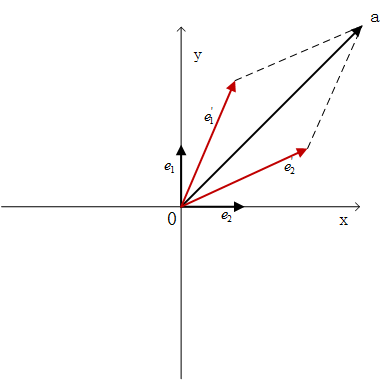
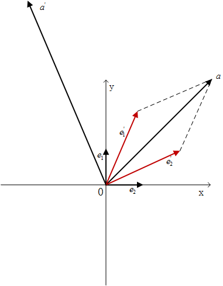
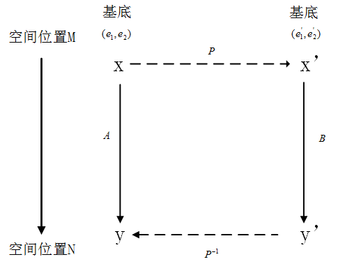

---
tags:
- 数学/线性代数
---

# 09 相似变换：不同视角下的相同变换

## 1.知识回顾：坐标值取决于基底

### 1.1.基底不同，向量的坐标值就不同

在这一讲的开始，我们再次提及一个反复强调的核心概念：向量在空间中的位置是绝对的，而其坐标值却是相对的，坐标的取值依托于其所选取的基底。更直白的说就是，对于同一个向量，选取的基底不同，其所对应的坐标值就不同。

我们用图 1 来再次回顾一下：

我们看到，图中的向量 $a$，他在空间中的位置是固定的，如果我们使用第一组基底 $(e_{1},e_{2})$， 即 $\begin{bmatrix} 1 \\ 0 \\ \end{bmatrix} ,\begin{bmatrix}0 \\ 1 \\ \end{bmatrix}$，向量 $a$ 表示为 $3\begin{bmatrix} 1 \\ 0 \\ \end{bmatrix} +3\begin{bmatrix}0 \\ 1 \\ \end{bmatrix}$ ，那么在此基底下，向量 $a$ 的坐标为 $\begin{bmatrix} 3 \\ 3 \\ \end{bmatrix}$ 。

但是如果换一组基底呢，我们使用绿色的两个向量 $(e^{'}_{1},e^{'}_{2})$ 作为基底，这两个基向量在 $(e_{1},e_{2})$ 为基底的情况下其坐标分别为 $\begin{bmatrix} 2 \\ 1 \\ \end{bmatrix}$ 和 $\begin{bmatrix}1 \\ 2 \\ \end{bmatrix}$，那么向量 $a$ 在以 $(e^{'}_{1},e^{'}_{2})$ 为基底的情况下，则表示为 $1\begin{bmatrix} 2 \\ 1 \\ \end{bmatrix} +1\begin{bmatrix}1 \\ 2 \\ \end{bmatrix}$，其坐标即为 $\begin{bmatrix} 1 \\ 1 \\ \end{bmatrix}$。我们从图中也可以很清晰的看出里面的直观数量关系。

### 1.2.类比一个生活中的例子

我们用生活中的例子总结一下：

东西还是那个东西没有变（类比向量在空间中的绝对位置），我们看待他的角度变了（类比所选取的基底），那么看上去的效果就变了（类比坐标值），就好比有一个圆柱体，站的远则看得小，站的近则看得大，斜向下 $45°$ 看上去还是一个立体，正上方往下看感觉就是一个圆形。

## 2.描述线性变换的矩阵也取决于基底

### 2.1.基底不同，描述向量线性变换的矩阵也不同

静态的向量，我们选取的基底不同，用于表示静态向量的坐标值就不同。那对于动态的向量变换呢？如向量从某个空间中的位置 $P$ 移动到位置 $Q$，我们知道可以用矩阵来表示向量空间位置的改变，如果我们选取的基底不同，同一个运动在不同基底下，显然对应的矩阵表示也是不同的。

我们还是用上面的向量举例，如图 2 所示：

在这个二维空间 $R^{2}$ 中，向量从 $a$ 变换到 $a'$。在基底 $\begin{bmatrix} 1 \\ 0 \\ \end{bmatrix} ,\begin{bmatrix}0 \\ 1 \\ \end{bmatrix}$ 的描述下，其坐标从 $\begin{bmatrix} 3 \\ 3 \\ \end{bmatrix}$ 变换到 $\begin{bmatrix} -3 \\ 6 \\ \end{bmatrix}$，对应于这个线性变换的矩阵为 $\begin{bmatrix} 1 &-2 \\1 &1 \end{bmatrix}$。但是如果是在基底 $\begin{bmatrix} 2 \\ 1 \\ \end{bmatrix} ,\begin{bmatrix}1 \\ 2 \\ \end{bmatrix}$ 的描述下，其坐标的转换变成了 $\begin{bmatrix} 1 \\ 1 \\ \end{bmatrix} \Rightarrow\begin{bmatrix}-4 \\ 5 \\ \end{bmatrix}$（计算过程可以参考上一段），显然前一个基底下的变换矩阵 $\begin{bmatrix} 1 &-2 \\1 &1 \end{bmatrix}$ 就无法表示这个基底下的变换了，因为我们计算发现 $\begin{bmatrix} 1 &-2 \\1 &1 \end{bmatrix} \begin{bmatrix} 1 \\1 \end{bmatrix} \ne \begin{bmatrix} -4\\5 \end{bmatrix}$ 。

### 2.2.类比一个生活中的小例子

我们通过这个实例就发现了，对于同一个向量的空间位置改变，由于我们所选取的基底不同，因此表征其线性变换的矩阵就不同。

我们再举一个生活中的例子，一辆车从 $A$ 点向 $B$ 点行驶，我面向车尾站立，在我看来，车是离我远去的，越来越远，而如果你面向车头站立，在你看来，车是越来越近的。车还是那辆车，还是那么开，只是你我站的位置不同，视角不同，感受到的运动状态就是不同的。

### 2.3.相似矩阵与相似变换

针对指定向量的同一个空间变换，用来在不同基底下进行描述的不同矩阵，彼此之间称之为相似矩阵。相似矩阵所表示的线性变换，彼此之间称之为相似变换。

## 3.相似矩阵间的转换

这里我们来详细的推导一下上面的过程。

### 3.1.利用基底变换推导相似矩阵间的关系式

在基底 $(e_{1},e_{2})$ 下，坐标为 $x$ 的向量通过矩阵 $A$ 完成了线性变换，线性变换后的坐标为 $x^{'}$，我们也可以通过矩阵 $P$，将向量变换到基底 $(e^{'}_{1},e^{'}_{2})$ 下的坐标表示，即用新的基底下的坐标来表示向量，记作 $Px$。这时在新的基底下，用来表示我们上面同一个空间变换的是另一个矩阵 $B$，即基底 $(e^{'}_{1},e^{'}_{2})$ 下变换后的目标坐标为 $BPx$，最终我们还是需要在原基底坐标系下讨论和比较问题，因此我们再次把坐标从基底 $(e^{'}_{1},e^{'}_{2})$ 变回到 $(e_{1},e_{2})$ 下，这显然是一个逆变换，即左乘一个逆矩阵 $P^{-1}$，因此和最初直接用矩阵 $A$ 变换殊途同归。

即，矩阵变换 $A=P^{-1}BP$，其中矩阵 $A$ 和 $B$ 就是相似矩阵，表示了向量在两个基底 $(e_{1},e_{2})$ 和 $(e^{'}_{1},e^{'}_{2})$ 下的相似变换。

### 3.2.相似矩阵的转换关系与各自基底的转换关系相对应

那具体这个矩阵 $P$ 该如何表示呢，或是说他是如何得到的？我们来分析一下这个过程，即：向量在空间中发生一次线性变换，由空间位置 $M$ 变到空间位置 $N$。本质上非常简单，如图 3 所示：

我们假设讨论的前提是：在基底 $(e_{1},e_{2})$ 下，向量在矩阵 $A$ 的作用下由坐标 $x$ 变成坐标 $y$，在基底 $(e^{'}_{1},e^{'}_{2})$ 下，向量在矩阵 $B$ 的作用下由坐标 $x^{'}$ 变成坐标 $y^{'}$，同时 $x'=Px$。

在基底 $(e_{1},e_{2})$ 下，向量表示为 $ae_{i}+be_{j}$，其坐标为 $x=\begin{bmatrix} a \\ b \\ \end{bmatrix}$ ，如果在基底 $(e^{'}_{1},e^{'}_{2})$ 下坐标该如何表示？我们假设两组基底的线性关系如下：$e_{i}=ce'_{i}+de'_{j}$，$e_{j}=fe'_{i}+ge'_{j}$，明确了这层关系，我们就可以很容易的做一个基底变换：

在基底 $(e'_{1},e'_{2})$ 下，向量表示为：

$$ae_{i}+be_{j}=a(ce'_{i}+de'_{j})+b(fe'_{i}+ge'_{j})=(ac+bf)e'_{i}+(ad+bg)e'_{j}$$

其坐标为：

$$x'=\begin{bmatrix} ac+bf \\ ad+bg \\ \end{bmatrix}$$

坐标可以分解成：

$$x'=\begin{bmatrix} c &f\\d &g \end{bmatrix} \begin{bmatrix} a \\b \end{bmatrix}$$

即

$$x'=\begin{bmatrix} c &f\\d &g \end{bmatrix} x$$

那么 $P$ 就得出来了，$P=\begin{bmatrix} c &f\\d &g \end{bmatrix}$，与两组基底之间的线性关系是完全对应的。

我们不怕啰嗦，再次总结一下这个过程，一个向量在空间位置里，选取不同的基底，其坐标值是不同的。对于空间中同一个位置变换，在不同的基底下，用于描述的矩阵也是不同的，而这些不同矩阵所描述的线性变换是相似的，他们也称之为相似矩阵，这些矩阵之间的代数关系和其对应基底之间的数量转换关系是完全对应的。

## 4.相似矩阵的用途：矩阵的对角化

### 4.1.寻找相似矩阵中的最佳矩阵

这样一来，我们可以用 $A=P^{-1}BP$ 来建立起任意两个相似矩阵之间的代数关系，那么明确了这其中的概念之后，我们就会想这里面的用处在哪呢？

大家都读过一句诗，横看成岭侧成峰，远近高低各不同，站在不同的角度看庐山，看到的样子是不同的，但是肯定会有一个最好的位置，从最好的视角看庐山，从而收获最好的感官效果。那对于一个描述向量空间变换的矩阵而言，我们是否应该选择一个最佳基底，使得我们可以用一个最佳矩阵来描述某一个向量空间变换？

思路是对的，问题是：什么矩阵可以称得上是最佳矩阵？

### 4.2.对角矩阵的两大优势

我们回顾一下之前介绍过的对角矩阵：

$$A=\begin{bmatrix} a_{1} & & \\ &a_{2} & \\ & &a_{3}\end{bmatrix}$$

对角矩阵有以下两大优势：

一方面是：一个 $n$ 维列向量在 $n$ 阶对角矩阵的作用下，其线性变换的方式仅仅反映在各个维度轴向上的拉伸，而不对应平移或者旋转，即：

$$Ax=\begin{bmatrix} a_{1} & & \\ &a_{2} & \\ & &a_{3}\end{bmatrix} \begin{bmatrix} x_{1} \\ x_{2} \\ x_{3}\end{bmatrix} =\begin{bmatrix} a_{1}x_{1} \\a_{2} x_{2} \\ a_{3} x_{3}\end{bmatrix}$$

这种线性变换所对应的操作简单、清晰。

另一方面是：体现在连续的线性变换上，我们可以看出：

$$A\cdot A=\begin{bmatrix} a_{1} & & \\ &a_{2} & \\ & &a_{3}\end{bmatrix} \begin{bmatrix} a_{1} & & \\ &a_{2} & \\ & &a_{3}\end{bmatrix} =\begin{bmatrix} a_{1}^{2}& & \\ & a_{2}^{2}& \\ & & a_{3}^{2}\end{bmatrix}$$

因此推而广之有：

$$A^{n}=\begin{bmatrix} a_{1} & & \\ &a_{2} & \\ & &a_{3}\end{bmatrix}^{n} =\begin{bmatrix} a_{1}^{n}& & \\ & a_{2}^{n}& \\ & & a_{3}^{n}\end{bmatrix}$$

由此我们看出，对角矩阵拥有如此优越的性质，反映的是一种非常简便的线性变换，试想如果我们所面对的线性变换都是这样的，那该多好！

因此我们在实际使用中，可以尝试把普通的非对角矩阵转换为与其相似的对角矩阵来进行计算处理，简化我们的过程，或者用于提取主要的特征成分等。

### 4.3.对角矩阵的构造方法

对于一个一般的方阵，我们应该尝试利用本节所讲的，找到一个可逆矩阵 $P$，使得 $P^{-1}AP=\Lambda$， 满足 $\Lambda=diag(\lambda_{1},\lambda_{2},…,\lambda_{n})$，就完成了我们的对角化方法，寻得了我们的最佳矩阵。不过该如何构造矩阵 $P$，如何找到我们矩阵 $A$ 所对应的对角矩阵 $\Lambda$，这是一个大问题。我们下一讲专门花一节的功夫来慢慢讲解其方法细节。

相似矩阵和相似变换的理解基础是空间里基底的相关概念，同时是后续对角化、特征分解的核心，需要牢固掌握概念，并仔细琢磨。